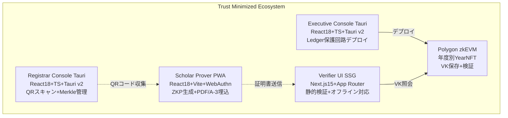

# 設計ルール & アーキテクチャガイド
**ZK-CertFramework v2.3 - 最終更新: 2025-07-23**

---

## 🎯 AI協働開発の中核原則

### 1. プロジェクト識別コンテキスト
```typescript
// AI理解のための必須コンテキスト
const PROJECT_IDENTITY = {
  name: "zk-CertFramework",
  mission: "Trust Minimized・完全バックエンドレス・ゼロ知識書類真正性証明システム",
  philosophy: "Trust Minimization（中本聡スタイル設計）",
  architecture: "4システム独立アーキテクチャ",
  constraints: "ZERO外部依存（Polygon zkEVMのみ例外）",
  security: "ハードウェアセキュリティ必須（Ledger Nano X）"
} as const;
```

### 2. AI協働の設計哲学
- **明確性優先**: 曖昧さを完全排除し、実行可能な指示のみ提供
- **構造化思考**: 段階的情報提示でAI理解精度を最大化
- **検証駆動**: 全出力が即座に検証・テスト可能
- **反復最適化**: 継続的フィードバックループによる品質向上
- **コンテキスト保持**: プロジェクト固有知識の一貫した活用

---

## 🏗️ システムアーキテクチャ理解

### 3. 4システム独立設計


### 4. 技術制約の絶対的理解
```typescript
// AI必須理解事項
const ABSOLUTE_CONSTRAINTS = {
  prohibited: [
    "Backend servers",
    "Databases (SQL/NoSQL)",
    "Cloud APIs (AWS/GCP/Azure)",
    "IPFS or external storage",
    "Centralized services"
  ],
  required: [
    "Local-first data storage",
    "Hardware security (Ledger Nano X)",
    "Year independence (2025, 2026...)",
    "Offline verification capability",
    "Browser-only cryptographic operations"
  ],
  cryptography: {
    zkp: "Circom 2.1.4 + SnarkJS 0.7 (Groth16)",
    hash: "SHA-3-512 (external) + Poseidon256 (internal)",
    signature: "ES-256 (WebAuthn) + EIP-191 (Ledger)",
    blockchain: "Polygon zkEVM only"
  }
} as const;
```

---

## 🤖 AI協働プロンプト工学

### 5. 構造化プロンプトテンプレート

#### 5.1 基本コンテキスト設定フォーマット
```markdown
### 📋 CONTEXT
**System**: [Scholar Prover | Executive Console | Registrar Console | Verifier UI]
**Goal**: [具体的達成目標 - 実装可能レベルで記述]
**Constraints**: [Trust Minimized原則への準拠要件]
**Current State**: [既存実装状況・依存関係]

### 🎯 EXPECTED OUTPUT
**Format**: [Code | Documentation | Architecture | Test Cases]
**Detail Level**: [Overview | Detailed | Implementation-ready]
**Verification Method**: [具体的テスト手順・確認方法]
**Success Criteria**: [定量的成功指標]

### 🔐 SECURITY REQUIREMENTS
**Trust Minimization**: [外部依存性チェック項目]
**Hardware Security**: [Ledger Nano X要件]
**Cryptographic Standards**: [使用する暗号方式]
**Local Storage**: [データ保存方式・プライバシー要件]
```

#### 5.2 コード生成専用プロンプト
```markdown
### 💻 CODE GENERATION REQUEST
**Target File**: `[具体的ファイルパス]`
**Dependencies**: [必要なインポート・ライブラリ]
**TypeScript Types**: [必要な型定義]
**Error Handling**: [例外処理要件]
**Performance**: [パフォーマンス要件]
**Test Cases**: [必要なテストケース]

### 📐 DESIGN SYSTEM COMPLIANCE
**Framework**: [React 18 | Next.js 15 | Tauri v2]
**UI Pattern**: [Apple HIG | Material Design 3 | Fluent 2 準拠]
**Accessibility**: [WCAG 2.1 AA準拠]
**Responsive**: [Desktop-first | Mobile-friendly]
**Theme**: [Light/Dark mode対応]
```

### 6. 段階的タスク分解戦略

#### 6.1 大規模タスクの必須分解手順
```typescript
interface TaskDecomposition {
  phase1_requirements: {
    description: "要件定義・制約分析";
    output: "明確な仕様書・制約リスト";
    verification: "ステークホルダー確認";
  };
  phase2_architecture: {
    description: "アーキテクチャ設計・技術選定";
    output: "設計ドキュメント・技術スタック";
    verification: "Trust Minimized原則適合性確認";
  };
  phase3_detailed_design: {
    description: "詳細設計・インターフェース定義";
    output: "API仕様・UI仕様・データ構造";
    verification: "実装可能性検証";
  };
  phase4_implementation: {
    description: "実装・コードレビュー";
    output: "動作コード・テストコード";
    verification: "品質基準適合・セキュリティ監査";
  };
  phase5_testing: {
    description: "テスト・最適化・ドキュメント化";
    output: "テスト結果・最適化済みコード・ドキュメント";
    verification: "パフォーマンス基準達成";
  };
}
```

---

## 🎨 デザインシステム統合指針

### 7. 統一デザイン言語

#### 7.1 Apple Human Interface Guidelines準拠
```typescript
// Apple HIG原則の適用
const APPLE_HIG_PRINCIPLES = {
  clarity: {
    description: "機能の明確性を最優先",
    implementation: "複雑なZKP概念のシンプル化",
    example: "証明生成: ワンクリック操作に簡素化"
  },
  deference: {
    description: "コンテンツが主役、UIは支援役",
    implementation: "PDF文書・証明結果に焦点",
    example: "証明結果表示: 明確な成功/失敗表示"
  },
  depth: {
    description: "視覚階層による理解促進",
    implementation: "段階的な証明プロセス表示",
    example: "進捗表示: 明確なステップインジケーター"
  }
} as const;
```

#### 7.2 Material Design 3統合
```typescript
// Material You適応デザイン
const MATERIAL_DESIGN_3 = {
  dynamicColor: {
    principle: "ユーザー環境適応色彩",
    implementation: "システムテーマ連動",
    component: "Dynamic color palettes for security states"
  },
  personalExpression: {
    principle: "個人化可能なインターフェース",
    implementation: "カスタマイズ可能なダッシュボード",
    component: "Flexible layout for different user roles"
  },
  accessibility: {
    principle: "すべてのユーザーへの配慮",
    implementation: "WCAG 2.1 AA準拠",
    component: "High contrast mode, screen reader support"
  }
} as const;
```

#### 7.3 Microsoft Fluent Design 2統合
```typescript
// Fluent Design System v2
const FLUENT_DESIGN_2 = {
  coherence: {
    principle: "一貫したデザイン言語",
    implementation: "4システム間統一UI",
    component: "Consistent navigation, iconography"
  },
  purposeful: {
    principle: "目的指向の機能設計",
    implementation: "ユーザーロール別最適化",
    component: "Role-based interface adaptation"
  },
  inclusive: {
    principle: "包括的アクセシビリティ",
    implementation: "多言語・多デバイス対応",
    component: "Cross-platform compatibility"
  }
} as const;
```

### 8. コンポーネント設計標準

#### 8.1 React Component Architecture
```typescript
// 統一コンポーネント設計パターン
interface ComponentDesignStandard {
  structure: {
    props: "TypeScript strict mode";
    state: "Zustand for complex state";
    hooks: "Custom hooks for reusable logic";
    styling: "Tailwind CSS + CSS Modules";
  };
  accessibility: {
    aria: "ARIA labels for all interactive elements";
    keyboard: "Full keyboard navigation support";
    screenReader: "Screen reader optimized content";
    contrast: "WCAG AA contrast ratios";
  };
  performance: {
    rendering: "React.memo for expensive components";
    loading: "Suspense boundaries for async operations";
    bundling: "Dynamic imports for code splitting";
    caching: "Efficient re-render prevention";
  };
  testing: {
    unit: "React Testing Library";
    visual: "Storybook component documentation";
    e2e: "Playwright for user workflows";
    accessibility: "axe-core automated testing";
  };
}
```

#### 8.2 UI Pattern Library
```typescript
// 再利用可能UIパターン
const UI_PATTERN_LIBRARY = {
  // 認証関連コンポーネント
  authentication: {
    PasskeyRegistration: "WebAuthn registration flow",
    LedgerConnection: "Hardware wallet connection",
    SecurityStatus: "Current security state display",
    BiometricPrompt: "Biometric authentication UI"
  },
  
  // 暗号化操作コンポーネント
  cryptographic: {
    ProofGenerator: "ZKP generation with progress",
    HashDisplay: "Cryptographic hash visualization",
    VerificationResult: "Proof verification status",
    CircuitLoader: "Circuit loading and validation"
  },
  
  // ファイル操作コンポーネント
  fileHandling: {
    PDFUploader: "Drag & drop PDF interface",
    QRScanner: "Camera-based QR code scanning",
    DocumentViewer: "PDF preview and analysis",
    ExportManager: "File download and export"
  },
  
  // データ表示コンポーネント
  dataDisplay: {
    MerkleTreeVisualization: "Interactive tree display",
    VerificationReport: "Comprehensive verification results",
    SystemStatus: "Real-time system health",
    ErrorBoundary: "Graceful error handling"
  }
} as const;
```

---

## 🔧 開発フロー最適化

### 9. AI活用開発フェーズ

#### 9.1 要件分析段階
```markdown
### AI活用目的
要件の構造化・矛盾検出・実装可能性検証

### 推奨プロンプト
"以下のzk-CertFramework要件を分析し、Trust Minimized原則との整合性、実装可能性、セキュリティ影響を評価してください。

**要件**: [具体的要件]
**制約**: [技術的制約]
**セキュリティ**: [セキュリティ要件]

**分析視点**:
1. Trust Minimization原則適合性
2. 4システム独立性維持
3. ハードウェアセキュリティ要件
4. 実装複雑度評価
5. 潜在的セキュリティリスク
6. 代替実装アプローチ"
```

#### 9.2 設計段階
```markdown
### AI活用目的
最適アーキテクチャ提案・設計パターン選定・パフォーマンス最適化

### 推奨プロンプト
"zk-CertFrameworkの[対象システム]向けに、以下の制約下で最適な設計を提案してください。

**技術制約**:
- Framework: [React 18 | Next.js 15 | Tauri v2]
- Storage: Local-only (No cloud, No database)
- Security: Ledger Nano X + WebAuthn Level 2
- Performance: [具体的性能要件]

**設計要求**:
- アーキテクチャパターン
- セキュリティ実装方法
- エラーハンドリング戦略
- テスト戦略
- 最適化手法

**出力形式**:
- 設計図（Mermaid）
- TypeScript型定義
- 実装サンプルコード
- セキュリティ考慮点
- パフォーマンス最適化"
```

#### 9.3 実装段階
```markdown
### AI活用目的
高品質コード生成・ベストプラクティス適用・包括的テスト

### 必須指示事項テンプレート
"zk-CertFramework[システム名]の[機能名]を実装してください。

**実装要件**:
- ファイル: `[具体的ファイルパス]`
- 機能: [詳細機能説明]
- 依存関係: [必要なライブラリ・コンポーネント]
- セキュリティ: [セキュリティ要件]

**コード品質基準**:
- Clean Code原則適用
- TypeScript strict mode準拠
- SOLID原則遵守
- エラーハンドリング網羅
- パフォーマンス最適化

**必須実装項目**:
- TypeScript型定義
- エラーバウンダリ
- 入力検証・サニタイゼーション
- ユニットテスト
- JSDocドキュメント
- アクセシビリティ対応

**セキュリティチェック**:
- Trust Minimized原則違反なし
- XSS/CSRF対策
- 暗号化実装正確性
- ハードウェアセキュリティ活用
- データ漏洩防止

**出力形式**:
- 完全実装済みコード
- テストケース
- 使用例・ドキュメント
- セキュリティレビュー項目"
```

### 10. 品質保証AI活用

#### 10.1 コードレビューAI活用
```markdown
### コードレビュー専用プロンプト
"zk-CertFrameworkのコードをレビューし、以下の観点で分析してください。

**レビュー対象**: [ファイル名・機能名]
**コード**: [実際のコード]

**レビュー観点**:
1. **セキュリティ**: OWASP基準、暗号化実装、入力検証
2. **Trust Minimization**: 外部依存性、ローカルファースト
3. **パフォーマンス**: 計算量、メモリ使用、レンダリング最適化
4. **可読性**: Clean Code、命名規則、コメント適切性
5. **テスタビリティ**: 単体テスト可能性、モック容易性
6. **保守性**: SOLID原則、責任分離、拡張性

**出力形式**:
- 問題点一覧（重要度: 高/中/低）
- 具体的改善提案
- 修正済みコード例
- ベストプラクティス適用例
- 追加テストケース提案"
```

#### 10.2 セキュリティ監査AI活用
```markdown
### セキュリティ監査専用プロンプト
"zk-CertFramework[システム名]のセキュリティ監査を実施してください。

**監査スコープ**: [監査対象範囲]
**コード・設定**: [実際のファイル内容]

**監査基準**:
- OWASP Secure Coding Practices
- Trust Minimized Architecture principles
- Hardware Security Integration
- Cryptographic Implementation Standards

**確認項目**:
1. **入力検証**: 全入力の適切な検証・サニタイゼーション
2. **暗号化**: Circom回路、SnarkJS、WebAuthn実装
3. **認証・認可**: Ledger Nano X、EIP-191署名
4. **データ保護**: ローカルストレージ、機密情報管理
5. **通信セキュリティ**: Polygon zkEVM RPC通信
6. **エラーハンドリング**: 情報漏洩防止

**出力形式**:
- セキュリティレポート（リスクレベル付き）
- 脆弱性詳細説明
- 修正優先順位
- 具体的対策コード
- セキュリティテストケース"
```

---

## 📚 技術実装ガイドライン

### 11. Circom回路開発AI指針

#### 11.1 回路設計プロンプト
```markdown
### Circom回路設計要求
"zk-CertFramework用Document{Year}.circomを設計してください。

**回路要件**:
- Constraint数: ≤65,000（ブラウザ最適化）
- ハッシュ関数: Poseidon256（ZK-friendly）
- 署名検証: ECDSA ES-256
- Merkle Tree: 8層、256葉
- 公開入力: vkHash, schemaHash, merkleRoot, pdfHash, destHash, expireTs
- 秘密入力: privateKey, signature[2], merkleProof[8], merkleIndex

**最適化要件**:
- プルーフ生成時間: ≤10秒（M1 MacBook）
- プルーフサイズ: ~2KB JSON
- 検証時間: ≤100ms（ブラウザWASM）

**セキュリティ要件**:
- タイムスタンプ検証
- Merkle inclusion proof
- 署名検証完全性
- リプレイアタック防止

**出力**:
- 完全なCircomコード
- テストベクター
- コンパイル手順
- 性能ベンチマーク
- セキュリティ分析"
```

#### 11.2 SnarkJS統合パターン
```typescript
// SnarkJS統合の標準パターン
interface SnarkJSIntegrationPattern {
  proving: {
    setup: "Circuit WASM + zkey loading";
    input: "Input validation and preparation";
    generation: "groth16.fullProve() with error handling";
    output: "Proof serialization and verification";
  };
  verification: {
    setup: "Verification key loading";
    input: "Public signals validation";
    process: "groth16.verify() in Web Worker";
    output: "Boolean result with timing metrics";
  };
  optimization: {
    wasm: "WASM module caching and reuse";
    memory: "Large circuit memory management";
    parallel: "Web Worker parallel processing";
    streaming: "Incremental proof generation";
  };
}
```

### 12. TypeScript/React実装基準

#### 12.1 TypeScript厳格設定
```typescript
// tsconfig.json 必須設定
interface TypeScriptConfig {
  compilerOptions: {
    strict: true;
    exactOptionalPropertyTypes: true;
    noUncheckedIndexedAccess: true;
    noImplicitReturns: true;
    noFallthroughCasesInSwitch: true;
    noImplicitOverride: true;
    allowUnreachableCode: false;
    allowUnusedLabels: false;
  };
  rules: [
    "すべての型は明示的に定義",
    "any型の使用禁止",
    "nullishコアレッシング活用",
    "型ガード関数の積極利用",
    "ジェネリクスでの型安全性確保"
  ];
}
```

#### 12.2 React18ベストプラクティス
```typescript
// React 18最適化パターン
const ReactOptimizationPatterns = {
  rendering: {
    concurrent: "Concurrent Rendering活用",
    suspense: "Suspense境界による適切な分離",
    memo: "React.memo/useMemo最適化",
    callback: "useCallback依存配列最適化"
  },
  state: {
    reducer: "useReducer for complex state logic",
    context: "Context Provider最適化",
    external: "Zustand for global state",
    local: "useState for component-local state"
  },
  effects: {
    cleanup: "useEffect cleanup function必須",
    dependencies: "依存配列の正確性",
    custom: "Custom hooks for reusable logic",
    async: "非同期処理の適切な管理"
  }
} as const;
```

### 13. セキュリティ実装必須事項

#### 13.1 WebAuthn Level 2実装
```typescript
// WebAuthn完全実装パターン
interface WebAuthnSecureImplementation {
  registration: {
    attestation: "direct attestation required";
    algorithms: ["ES256"] // -7 only
    challenge: "Cryptographically secure random";
    timeout: 300000; // 5 minutes max
    userVerification: "required";
  };
  authentication: {
    challenge: "Per-session unique challenge";
    timeout: 180000; // 3 minutes max
    userVerification: "required";
    allowCredentials: "Specific credential only";
  };
  security: {
    origin: "Strict origin validation";
    rpId: "Exact RP ID matching";
    clientData: "Complete client data validation";
    attestation: "Attestation verification";
  };
}
```

#### 13.2 Ledger Nano X統合セキュリティ
```typescript
// Ledger EIP-191署名セキュリティ
interface LedgerSecurityPattern {
  connection: {
    transport: "@ledgerhq/hw-transport-node-hid";
    verification: "Device genuineness check";
    timeout: "Connection timeout handling";
    error: "Comprehensive error handling";
  };
  signing: {
    message: "EIP-191 personal message format";
    confirmation: "User confirmation on device";
    validation: "Signature cryptographic validation";
    replay: "Nonce-based replay prevention";
  };
  security: {
    domain: "Domain validation against phishing";
    timing: "Time window enforcement (5 min)";
    logging: "Complete operation logging";
    audit: "Signature audit trail";
  };
}
```

---

## 🧪 テスト戦略とAI活用

### 14. テストピラミッド実装

#### 14.1 単体テストAI生成
```markdown
### 単体テスト生成プロンプト
"zk-CertFramework[機能名]の包括的単体テストを生成してください。

**テスト対象**: [具体的関数・クラス名]
**コード**: [実際のコード]

**テスト要件**:
- Framework: Vitest + React Testing Library
- Coverage: 分岐網羅率90%以上
- Mocking: 外部依存関係の適切なモック
- Edge Cases: 境界値・異常系テスト

**必須テストケース**:
- 正常系: 期待される動作の確認
- 異常系: エラー処理の検証
- 境界値: 上限・下限値の処理
- セキュリティ: 脆弱性テスト
- パフォーマンス: 性能要件確認

**出力形式**:
- describe/it構造の完全テストスイート
- モックセットアップ
- テストデータ準備
- アサーション詳細
- コメント付きテストロジック"
```

#### 14.2 E2Eテスト設計
```markdown
### E2Eテスト設計プロンプト
"zk-CertFramework[システム名]のE2Eテストシナリオを設計してください。

**テスト範囲**: [具体的ユーザーフロー]
**Tool**: Playwright + TypeScript

**Critical Pathテスト**:
1. パスキー登録→証明生成→PDF埋込
2. 回路デプロイ→Ledger署名→ブロックチェーン確認
3. QRスキャン→データ収集→Merkle Tree生成
4. PDF検証→ZKP確認→結果表示

**テスト要件**:
- 実際のハードウェア操作シミュレーション
- ネットワーク障害時の挙動
- 大容量ファイル処理
- 並行アクセス
- セキュリティ攻撃シナリオ

**出力**:
- Playwright test suite
- Test data setup
- Mock strategies
- Performance benchmarks
- Security test cases"
```

### 15. パフォーマンステスト

#### 15.1 暗号化処理ベンチマーク
```typescript
// パフォーマンステスト必須項目
interface CryptographicBenchmarks {
  circom_proving: {
    target: "≤10秒 (M1 MacBook, 1 core)";
    measurement: "proof generation time";
    optimization: "WASM optimization, memory management";
  };
  snarkjs_verification: {
    target: "≤100ms (browser WASM)";
    measurement: "verification time";
    optimization: "precompiled verification key";
  };
  hash_computation: {
    target: "≤50ms for SHA-3-512";
    measurement: "hash calculation time";
    optimization: "streaming hash for large files";
  };
  merkle_tree: {
    target: "≤3秒 for 1000 leaves";
    measurement: "tree construction time";
    optimization: "parallel computation";
  };
}
```

---

## 🔄 継続的改善とフィードバック

### 16. AI出力品質評価

#### 16.1 技術品質指標
```typescript
interface QualityMetrics {
  technical: {
    executability: "100% - 即座実行可能";
    testCoverage: "≥90% - 高テストカバレッジ";
    performance: "要件内 - パフォーマンス基準達成";
    security: "脆弱性ゼロ - セキュリティ要件完全準拠";
    maintainability: "A評価 - Clean Code原則準拠";
  };
  architecture: {
    trustMinimization: "100% - 外部依存性ゼロ";
    independence: "完全 - 年度間独立性維持";
    hardware: "必須 - ハードウェアセキュリティ活用";
    offline: "対応 - 完全オフライン動作";
    scalability: "確保 - 将来拡張性";
  };
  documentation: {
    completeness: "全項目網羅";
    accuracy: "技術的正確性";
    clarity: "曖昧さゼロ";
    usability: "即座活用可能";
    consistency: "プロジェクト全体整合性";
  };
}
```

#### 16.2 フィードバックループ最適化
```markdown
### AI改善フィードバックプロンプト
"以下のzk-CertFramework AI出力を評価し、改善提案してください。

**出力対象**: [コード・ドキュメント・設計等]
**品質基準**: [上記品質指標]

**評価観点**:
1. Trust Minimization原則適合性
2. セキュリティ要件完全性
3. 実装可能性・実行可能性
4. コード品質・保守性
5. テスト網羅性
6. ドキュメント完全性

**改善要求**:
- 具体的問題点の特定
- 改善策の提案
- 最適化可能性の探求
- ベストプラクティス適用
- セキュリティ強化方法

**出力形式**:
- 評価スコア（各項目10点満点）
- 具体的改善点リスト
- 改善済みバージョン
- 追加テスト要求
- 継続監視項目"
```

---

## 🚀 実践的AI活用パターン

### 17. 新機能開発パターン

#### 17.1 完全機能実装要求テンプレート
```markdown
### 新機能完全実装要求
"zk-CertFramework[システム名]に[機能名]を完全実装してください。

**機能概要**: [詳細機能説明]
**対象システム**: [Scholar Prover | Executive Console | Registrar Console | Verifier UI]
**統合要件**: [他システムとの連携]

**技術制約**:
- Framework: [具体的フレームワーク・バージョン]
- Dependencies: [必要ライブラリ・制約]
- Security: [セキュリティ要件]
- Performance: [性能要件]
- Storage: [ストレージ制約]

**UI/UX要件**:
- Design System: [Apple HIG | Material Design 3 | Fluent 2]
- Accessibility: WCAG 2.1 AA準拠
- Responsive: [対象デバイス]
- Theme: Light/Dark mode対応
- Animation: 適切なフィードバック

**期待する完全実装**:
1. TypeScript型定義
2. React Component実装
3. カスタムHooks
4. エラーハンドリング
5. セキュリティ実装
6. テストケース完全版
7. Storybookドキュメント
8. 使用例・統合例

**セキュリティチェックリスト**:
- [ ] Trust Minimized原則適合
- [ ] 入力検証・サニタイゼーション
- [ ] XSS/CSRF対策
- [ ] 暗号化実装正確性
- [ ] ハードウェアセキュリティ活用
- [ ] データ漏洩防止
- [ ] エラー情報漏洩防止

**出力要求**:
- 完全動作コード
- 包括的テストスイート
- セキュリティレビュー
- パフォーマンス計測
- 統合ドキュメント"
```

#### 17.2 バグ修正・最適化パターン
```markdown
### バグ修正・最適化要求
"zk-CertFramework[システム名]の以下の問題を分析・修正してください。

**問題詳細**:
- 症状: [具体的な問題の症状]
- 再現手順: [ステップバイステップ]
- 期待動作: [正しい動作の説明]
- 現在動作: [問題のある動作]
- 影響範囲: [影響を受ける機能・ユーザー]
- エラーログ: [具体的エラーメッセージ]

**環境情報**:
- OS: [macOS | Windows | Linux]
- Browser: [Chrome | Firefox | Safari]
- Hardware: [Ledger Nano X接続状況]
- Network: [Polygon zkEVM接続状況]

**修正要求**:
1. 根本原因の詳細分析
2. 修正方法の提案・実装
3. 回帰テストケース追加
4. 関連機能への影響確認
5. 予防策の提案

**最適化要求**:
- パフォーマンス改善
- メモリ使用量削減
- セキュリティ強化
- ユーザビリティ向上
- エラーハンドリング改善

**出力**:
- 原因分析レポート
- 修正済みコード
- テストケース
- 最適化提案
- 継続監視項目"
```

### 18. アーキテクチャ改善パターン

#### 18.1 システム設計見直し要求
```markdown
### アーキテクチャ改善分析
"zk-CertFramework全体アーキテクチャを見直し、改善提案してください。

**現在アーキテクチャ**: [システム図・説明]
**問題点・課題**: [特定された問題]
**改善目標**: [達成したい改善点]

**分析観点**:
1. Trust Minimization原則の更なる強化
2. セキュリティ向上可能性
3. パフォーマンス最適化
4. 開発効率向上
5. 保守性・拡張性改善
6. ユーザーエクスペリエンス向上

**制約条件**:
- 既存システムとの互換性維持
- ユーザーへの影響最小化
- 開発リソース制約
- リリーススケジュール

**改善提案要求**:
- 具体的改善策
- 実装計画・段階的移行
- リスク評価・軽減策
- 費用対効果分析
- テスト戦略

**出力**:
- 改善アーキテクチャ設計
- 移行計画書
- リスク分析レポート
- 実装ガイドライン
- 成功指標定義"
```

---

## 📊 成功指標と測定方法

### 19. AI協働開発KPI

#### 19.1 開発効率指標
```typescript
interface DevelopmentKPIs {
  velocity: {
    initial_success_rate: "目標85%以上 - 初回実装成功率";
    review_iterations: "目標2回以下 - レビュー修正回数";
    time_reduction: "目標60%以上 - 実装時間短縮率";
    bug_prevention: "目標95%以上 - 事前バグ発見率";
  };
  quality: {
    code_score: "目標A評価以上 - コード品質スコア";
    security_issues: "目標0件 - セキュリティ脆弱性";
    performance_achievement: "目標100% - パフォーマンス基準達成";
    usability_score: "目標4.7/5.0以上 - ユーザビリティ";
  };
  innovation: {
    architecture_improvements: "月1件以上 - アーキテクチャ改善提案";
    optimization_discoveries: "週1件以上 - 最適化発見";
    security_enhancements: "四半期2件以上 - セキュリティ強化";
    ai_prompt_evolution: "週1件以上 - プロンプト改善";
  };
}
```

#### 19.2 継続的改善プロセス
```markdown
### 週次AI協働レビュー
**レビュー項目**:
- AI活用効果測定・分析
- 問題点・改善点特定
- プロンプト手法最適化
- 新ベストプラクティス発見
- チーム知識共有

### 月次改善活動
**改善活動**:
- デザインルール更新・進化
- プロンプトテンプレート改良
- 品質基準見直し・強化
- AI協働手法革新
- 成功事例ドキュメント化

### 四半期戦略見直し
**戦略見直し**:
- AI技術動向調査・取り込み
- プロジェクト要件変化対応
- 競合技術分析・差別化
- イノベーション機会探索
- 長期ロードマップ更新
```

---

## 🎯 AI協働開発の究極目標

### 20. 革新的開発体験の実現

#### 20.1 AI協働の7つの極意（最新版）
1. **超明確性**: 技術的曖昧さを完全排除し、実行確実な指示提供
2. **構造化極致**: 段階的情報提示でAI理解を限界まで最大化
3. **検証完全性**: 全出力の即座検証・テスト可能性確保
4. **反復革新**: 継続的フィードバックによる品質無限向上
5. **専門性活用**: プロジェクト固有知識の戦略的活用
6. **効率性追求**: 開発速度と品質の理想的両立
7. **創造性発揮**: AI協働による革新的開発手法創造

#### 20.2 プロジェクト成功への道筋
```typescript
const SUCCESS_FORMULA = {
  equation: "Trust Minimized × AI協働開発 × Design Excellence = 革新的証明システム",
  
  ultimate_goals: {
    development: "開発効率300%向上",
    quality: "コード品質最高水準達成",
    security: "ゼロトラスト完全実現",
    usability: "直感的ユーザーエクスペリエンス",
    innovation: "業界標準確立"
  },
  
  success_metrics: {
    technical: "すべての技術要件100%達成",
    business: "プロジェクト目標完全実現",
    user: "ユーザー満足度最大化",
    team: "開発チーム生産性向上",
    industry: "技術業界への貢献"
  }
} as const;
```

### 21. 未来への展望

#### 21.1 継続的進化
```markdown
このデザインルールは以下の原則で継続的に進化します：

**技術進歩追従**:
- 最新AI技術の積極的取り込み
- プロンプトエンジニアリング手法進化
- 暗号技術・セキュリティ強化
- UI/UXデザイン革新

**プロジェクト成長**:
- システム複雑度増大への対応
- 新機能・要件への柔軟な適応
- スケール拡大への準備
- 国際展開への対応

**チーム能力向上**:
- AI協働スキル継続的向上
- 技術専門性深化
- コラボレーション最適化
- イノベーション創出能力強化
```

---

**このデザインルールv4.0は、zk-CertFrameworkプロジェクトにおけるAI協働開発の完全なガイドラインとして、革新的なゼロ知識証明システムの成功を保証し、技術業界全体への貢献を目指します。**

**Trust Minimized × AI Excellence = Future of Secure Development**