# ZK-CertFramework 🎓⚡

> **Trust-Minimized, Fully Backendless Zero-Knowledge Certificate System**

A revolutionary graduation certificate system where **only students can generate time-bound zero-knowledge proofs** using Circom circuits and SnarkJS, with **Ledger Nano X hardware security** for administrative operations. Verifiers can confirm authenticity using only the PDF file and on-chain Polygon zkEVM data.

[](https://opensource.org/licenses/MIT)
[](https://www.typescriptlang.org/)
[](https://github.com/iden3/circom)
[](https://www.electronjs.org/)

## 🌟 Key Features

### 🔐 **Trust Minimization**
- **Zero Backend Servers** - No APIs, databases, or cloud dependencies
- **Hardware Security** - All admin operations require Ledger Nano X physical confirmation
- **Yearly Independence** - Each graduation year operates with completely separate circuits and NFTs
- **Air-Gapped Verification** - 100% offline certificate validation

### ⚡ **Advanced Cryptography**
- **Circom + SnarkJS** - Industry-standard zero-knowledge proof system
- **Poseidon Hashing** - ZK-optimized cryptographic primitives
- **WebAuthn Integration** - Passwordless authentication with biometrics
- **EIP-191 Signatures** - Hardware-secured administrative operations

### 🏗️ **Four-Component Architecture**
- **Scholar Prover (PWA)** - Student certificate generation interface
- **Executive Console (Electron)** - Ledger-secured circuit deployment
- **Registrar Console (Electron)** - Local student data management
- **Verifier UI (SSG)** - Drag-and-drop certificate verification

## 🎯 Quick Start

### Prerequisites
- **Node.js** 18+ and npm
- **Ledger Nano X** (for Executive Console)
- **Chrome/Edge** 111+ or Safari 16.4+ (WebAuthn Level 2)

### Installation

```bash
# Clone the repository
git clone https://github.com/your-org/zk-CertFramework.git
cd zk-CertFramework

# Install dependencies for all components
npm run install:all

# Build circuits (requires circom and snarkjs)
npm run build:circuits

# Start development servers
npm run dev:all
```

### Component Setup

#### 🎓 Scholar Prover (Student Interface)
```bash
cd scholar-prover
npm install
npm run dev
# Access at http://localhost:3000
```

#### 🏛️ Executive Console (Admin Interface)
```bash
cd executive-console
npm install
npm run electron:dev
# Requires Ledger Nano X connected
```

#### 📋 Registrar Console (Staff Interface)
```bash
cd registrar-console
npm install
npm run electron:dev
```

#### ✅ Verifier UI (Employer Interface)
```bash
cd verifier-ui
npm install
npm run dev
# Access at http://localhost:3001
```

## 🏗️ Architecture Overview

```mermaid
graph TD
    subgraph "Student Experience"
        A[📱 Scholar Prover PWA] --> B[🔐 WebAuthn Passkey]
        B --> C[⚡ Circom ZKP Generation]
        C --> D[📄 PDF/A-3 Embedding]
    end
    
    subgraph "Administrative Setup"
        E[🏛️ Executive Console] --> F[🔐 Ledger Nano X]
        F --> G[📡 Yearly Circuit Deployment]
        G --> H[🌐 Polygon zkEVM]
    end
    
    subgraph "Staff Management"
        I[📋 Registrar Console] --> J[👥 Student Key Management]
        J --> K[🌳 Merkle Tree Generation]
        K --> L[📄 Batch PDF Creation]
    end
    
    subgraph "Verification"
        M[✅ Verifier UI] --> N[📄 PDF Drag & Drop]
        N --> O[⚡ SnarkJS Verification]
        O --> H
    end
    
    D -.->|Send Certificate| N
    H -.->|Query NFT Data| O
```



## 🔧 Technology Stack

### Core Technologies
- **Zero-Knowledge**: Circom 2.1.4 + SnarkJS 0.7 (Groth16)
- **Blockchain**: Polygon zkEVM (Mainnet/Amoy Testnet)
- **Hardware Security**: Ledger Nano X + EIP-191 signing
- **PDF Standard**: PDF/A-3 with embedded proofs

### Component Technologies
| Component | Framework | Purpose | Storage |
|-----------|-----------|---------|---------|
| Scholar Prover | React 18 + Vite (PWA) | ZKP generation | IndexedDB + localStorage |
| Executive Console | React 18 + Electron 27 | Circuit deployment | Local JSON files |
| Registrar Console | Vue 3 + Electron 27 | Student management | Local JSON files |
| Verifier UI | Next.js 14 (SSG) | Certificate verification | No persistent storage |

## 📋 Usage Workflow

### 1. 🏛️ **Administrative Setup** (Executive Console)
```typescript
// 1. Connect Ledger Nano X
// 2. Upload Certificate{Year}.circom
// 3. Compile circuit with Powers of Tau
// 4. Sign deployment with Ledger
// 5. Deploy YearlySet to Polygon zkEVM
```

### 2. 📋 **Student Registration** (Registrar Console)
```typescript
// 1. Import student data (CSV/JSON)
// 2. Build Poseidon Merkle Tree
// 3. Generate batch PDF/A-3 certificates
// 4. Distribute to students
```

### 3. 🎓 **Certificate Generation** (Scholar Prover)
```typescript
// 1. Register WebAuthn Passkey
// 2. Drag PDF certificate + enter details
// 3. Generate zero-knowledge proof
// 4. Embed proof in PDF/A-3
// 5. Download enhanced certificate
```

### 4. ✅ **Certificate Verification** (Verifier UI)
```typescript
// 1. Drag and drop PDF certificate
// 2. Extract embedded ZKP automatically
// 3. Verify proof with SnarkJS
// 4. Query Polygon zkEVM for VK
// 5. Display verification result
```

## 🔐 Security Features

### Trust Minimization Principles
- **No External Dependencies** (except Polygon zkEVM)
- **Hardware-Secured Admin Operations** (Ledger Nano X required)
- **Yearly Independence** (no cross-year dependencies)
- **Air-Gapped Verification** (works completely offline)

### Cryptographic Security
- **Quantum Resistance**: SHA-3-512 hashing (256-bit post-quantum security)
- **ZK-Optimized**: Poseidon hashing for circuit efficiency
- **WebAuthn Level 2**: Biometric authentication support
- **EIP-191 Signing**: Hardware-secured personal message signing

## 📁 Project Structure

```
zk-CertFramework/
├── 🎓 scholar-prover/          # PWA for students
│   ├── src/
│   │   ├── components/         # React components
│   │   ├── circuits/           # Circuit integration
│   │   └── utils/              # Crypto utilities
│   └── public/                 # PWA assets
├── 🏛️ executive-console/        # Electron app for admins
│   ├── src/
│   │   ├── main/               # Electron main process
│   │   ├── renderer/           # React renderer
│   │   └── ledger/             # Ledger integration
│   └── circuits/               # Circuit compilation
├── 📋 registrar-console/        # Electron app for staff
│   ├── src/
│   │   ├── components/         # Vue components
│   │   ├── merkle/             # Merkle tree logic
│   │   └── pdf/                # PDF generation
│   └── data/                   # Local JSON storage
├── ✅ verifier-ui/              # Static site for verification
│   ├── src/
│   │   ├── pages/              # Next.js pages
│   │   ├── components/         # React components
│   │   └── verification/       # ZKP verification logic
│   └── public/                 # Static assets
├── 🔧 circuits/                 # Circom circuit definitions
│   ├── Certificate{Year}.circom
│   ├── libraries/              # Circuit libraries
│   └── test/                   # Circuit tests
├── 📄 documents/                # Technical documentation
│   ├── FSD_JP.md              # Functional specification
│   ├── SRS_JP.md              # Requirements specification
│   ├── TSD_JP.md              # Technical specification
│   └── */                     # Component-specific docs
└── 🧪 test_vectors/            # Test data and vectors
```

## 🧪 Testing

### Run All Tests
```bash
npm run test:all
```

### Component-Specific Testing
```bash
# Circuit testing
cd circuits && npm run test

# Scholar Prover testing
cd scholar-prover && npm run test

# Executive Console testing
cd executive-console && npm run test:electron

# Registrar Console testing
cd registrar-console && npm test

# Verifier UI testing
cd verifier-ui && npm test

# End-to-end testing
npm run test:e2e
```

## 🚀 Deployment

### Production Build
```bash
# Build all components
npm run build:all

# Build individual components
npm run build:scholar-prover    # PWA build
npm run build:executive         # Electron package
npm run build:registrar         # Electron package  
npm run build:verifier          # Static site export
```

### Deployment Targets
- **Scholar Prover**: Deploy PWA to any static hosting (Vercel, Netlify, GitHub Pages)
- **Executive Console**: Distribute as Electron executable (.dmg, .exe, .AppImage)
- **Registrar Console**: Distribute as Electron executable
- **Verifier UI**: Deploy static site to CDN/GitHub Pages

## 🤝 Contributing

We welcome contributions! Please see our [Contributing Guide](CONTRIBUTING.md) for details.

### Development Setup
1. Fork the repository
2. Create a feature branch (`git checkout -b feature/amazing-feature`)
3. Install dependencies (`npm run install:all`)
4. Make your changes
5. Run tests (`npm run test:all`)
6. Commit changes (`git commit -m 'Add amazing feature'`)
7. Push to branch (`git push origin feature/amazing-feature`)
8. Open a Pull Request

## 📜 License

This project is licensed under the MIT License - see the [LICENSE](LICENSE) file for details.

## 🔗 Links

- **Documentation**: [Technical Specifications](documents/)
- **Circom Circuits**: [circuits/](circuits/)
- **Live Demo**: [Coming Soon]
- **Polygon zkEVM**: [Official Documentation](https://polygon.technology/polygon-zkevm)

---

**Built with ❤️ for a trust-minimized future of digital credentials**

*"Empowering students with self-sovereign, verifiable certificates while maintaining institutional trust through zero-knowledge cryptography."* 