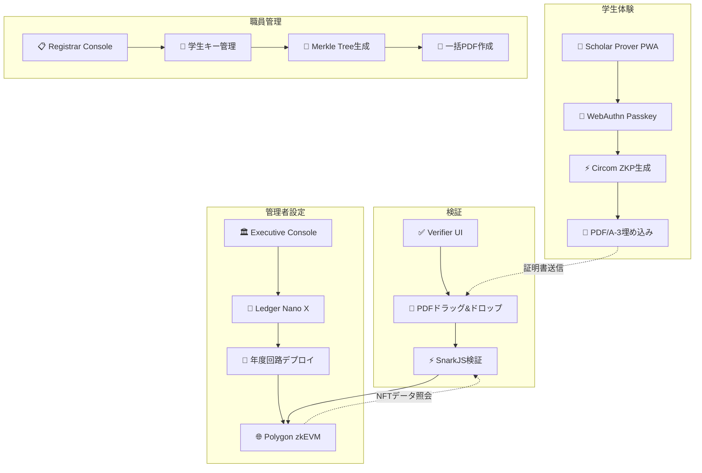
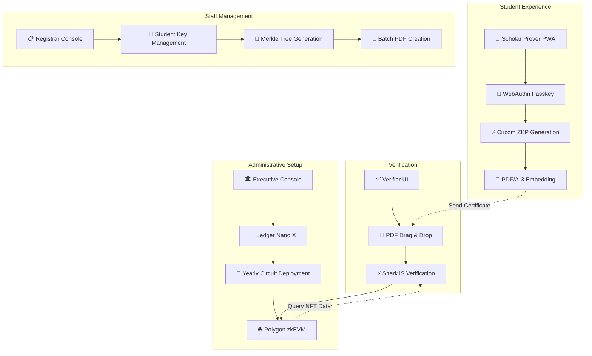

# ZK-CertFramework 🎓⚡

<div align="center">

### 🌐 Language / 言語

**[🇯🇵 日本語](#japanese) | [🇺🇸 English](#english)**

*Click the language links above to jump to your preferred version*  
*上記の言語リンクをクリックして、お好みのバージョンにジャンプしてください*

</div>

---

<div id="japanese">

# 🇯🇵 ZK-CertFramework 🎓⚡

> **Trust Minimized・完全バックエンドレス・ゼロ知識証明書システム**

学生本人のみがCircom回路とSnarkJSを使用して時限付きゼロ知識証明を生成し、**Ledger Nano X ハードウェアセキュリティ**による管理者操作を実現する革新的な卒業証書システム。検証者はPDFファイルとPolygon zkEVMオンチェーンデータのみで真正性を確認できます。

<div align="center">

[](https://opensource.org/licenses/MIT)
[](https://www.typescriptlang.org/)
[](https://github.com/iden3/circom)
[](https://www.electronjs.org/)

**[🇺🇸 Switch to English](#english)**

</div>

## 🌟 主要機能

### 🔐 **Trust Minimization（信頼最小化）**
- **バックエンドサーバーゼロ** - API、データベース、クラウド依存性なし
- **ハードウェアセキュリティ** - 全管理者操作にLedger Nano X物理確認必須
- **年度別独立性** - 各卒業年度が完全に独立した回路とNFTで動作
- **エアギャップ検証** - 100%オフライン証明書検証

### ⚡ **先進暗号技術**
- **Circom + SnarkJS** - 業界標準ゼロ知識証明システム
- **Poseidonハッシュ** - ZK最適化暗号プリミティブ
- **WebAuthn統合** - 生体認証によるパスワードレス認証
- **EIP-191署名** - ハードウェア保護管理者操作

### 🏗️ **4コンポーネント・アーキテクチャ**
- **Scholar Prover (PWA)** - 学生向け証明書生成インターフェース
- **Executive Console (Electron)** - Ledger保護回路デプロイ
- **Registrar Console (Electron)** - ローカル学生データ管理
- **Verifier UI (SSG)** - ドラッグ&ドロップ証明書検証

## 🎯 クイックスタート

### 前提条件
- **Node.js** 18+ および npm
- **Ledger Nano X** (Executive Console用)
- **Chrome/Edge** 111+ または Safari 16.4+ (WebAuthn Level 2)

### インストール

```bash
# リポジトリをクローン
git clone https://github.com/your-org/zk-CertFramework.git
cd zk-CertFramework

# 全コンポーネントの依存関係をインストール
npm run install:all

# 回路をビルド (circom と snarkjs が必要)
npm run build:circuits

# 開発サーバーを起動
npm run dev:all
```

### コンポーネント設定

#### 🎓 Scholar Prover (学生インターフェース)
```bash
cd scholar-prover
npm install
npm run dev
# http://localhost:3000 でアクセス
```

#### 🏛️ Executive Console (管理者インターフェース)
```bash
cd executive-console
npm install
npm run electron:dev
# Ledger Nano X接続が必要
```

#### 📋 Registrar Console (職員インターフェース)
```bash
cd registrar-console
npm install
npm run electron:dev
```

#### ✅ Verifier UI (企業インターフェース)
```bash
cd verifier-ui
npm install
npm run dev
# http://localhost:3001 でアクセス
```

## 🏗️ アーキテクチャ概要



## 🔧 技術スタック

### コア技術
- **ゼロ知識証明**: Circom 2.1.4 + SnarkJS 0.7 (Groth16)
- **ブロックチェーン**: Polygon zkEVM (メインネット/Amoyテストネット)
- **ハードウェアセキュリティ**: Ledger Nano X + EIP-191署名
- **PDF標準**: PDF/A-3 with embedded proofs

### コンポーネント技術
| コンポーネント | フレームワーク | 目的 | ストレージ |
|-----------|-----------|---------|---------|
| Scholar Prover | React 18 + Vite (PWA) | ZKP生成 | IndexedDB + localStorage |
| Executive Console | React 18 + Electron 27 | 回路デプロイ | ローカルJSONファイル |
| Registrar Console | Vue 3 + Electron 27 | 学生管理 | ローカルJSONファイル |
| Verifier UI | Next.js 14 (SSG) | 証明書検証 | 永続ストレージなし |

## 📋 使用ワークフロー

### 1. 🏛️ **管理者設定** (Executive Console)
```typescript
// 1. Ledger Nano X接続
// 2. Certificate{Year}.circomアップロード
// 3. Powers of Tauで回路コンパイル
// 4. Ledgerでデプロイメント署名
// 5. Polygon zkEVMにYearlySetデプロイ
```

### 2. 📋 **学生登録** (Registrar Console)
```typescript
// 1. 学生データインポート (CSV/JSON)
// 2. Poseidon Merkle Tree構築
// 3. 一括PDF/A-3証明書生成
// 4. 学生に配布
```

### 3. 🎓 **証明書生成** (Scholar Prover)
```typescript
// 1. WebAuthn Passkey登録
// 2. PDF証明書ドラッグ + 詳細入力
// 3. ゼロ知識証明生成
// 4. PDF/A-3にproof埋め込み
// 5. 拡張証明書ダウンロード
```

### 4. ✅ **証明書検証** (Verifier UI)
```typescript
// 1. PDF証明書ドラッグ&ドロップ
// 2. 埋め込みZKP自動抽出
// 3. SnarkJSでproof検証
// 4. Polygon zkEVMでVK照会
// 5. 検証結果表示
```

## 🔐 セキュリティ機能

### Trust Minimization原則
- **外部依存性なし** (Polygon zkEVM除く)
- **ハードウェア保護管理者操作** (Ledger Nano X必須)
- **年度別独立性** (年度間依存性なし)
- **エアギャップ検証** (完全オフライン動作)

### 暗号学的セキュリティ
- **量子耐性**: SHA-3-512ハッシュ (256ビット耐量子セキュリティ)
- **ZK最適化**: 回路効率のためのPoseidonハッシュ
- **WebAuthn Level 2**: 生体認証サポート
- **EIP-191署名**: ハードウェア保護パーソナルメッセージ署名

## 🧪 テスト

### 全テスト実行
```bash
npm run test:all
```

### コンポーネント別テスト
```bash
# 回路テスト
cd circuits && npm run test

# Scholar Proverテスト
cd scholar-prover && npm run test

# Executive Consoleテスト
cd executive-console && npm run test:electron

# Registrar Consoleテスト
cd registrar-console && npm test

# Verifier UIテスト
cd verifier-ui && npm test

# E2Eテスト
npm run test:e2e
```

## 🚀 デプロイメント

### プロダクションビルド
```bash
# 全コンポーネントビルド
npm run build:all

# 個別コンポーネントビルド
npm run build:scholar-prover    # PWAビルド
npm run build:executive         # Electronパッケージ
npm run build:registrar         # Electronパッケージ  
npm run build:verifier          # 静的サイトエクスポート
```

## 🤝 コントリビューション

コントリビューションを歓迎します！詳細は[コントリビューションガイド](CONTRIBUTING.md)をご覧ください。

## 📜 ライセンス

このプロジェクトはMITライセンスの下でライセンスされています - 詳細は[LICENSE](LICENSE)ファイルをご覧ください。

## 🔗 リンク

- **ドキュメント**: [技術仕様書](documents/)
- **Circom回路**: [circuits/](circuits/)
- **Polygon zkEVM**: [公式ドキュメント](https://polygon.technology/polygon-zkevm)

---

**デジタル証明書のtrust-minimized未来のために ❤️ で構築**

*「ゼロ知識暗号学を通じて機関の信頼を維持しながら、学生に自己主権的で検証可能な証明書を提供する。」*

</div>

---

<div id="english">

# 🇺🇸 ZK-CertFramework 🎓⚡

> **Trust-Minimized, Fully Backendless Zero-Knowledge Certificate System**

A revolutionary graduation certificate system where **only students can generate time-bound zero-knowledge proofs** using Circom circuits and SnarkJS, with **Ledger Nano X hardware security** for administrative operations. Verifiers can confirm authenticity using only the PDF file and on-chain Polygon zkEVM data.

<div align="center">

[](https://opensource.org/licenses/MIT)
[](https://www.typescriptlang.org/)
[](https://github.com/iden3/circom)
[](https://www.electronjs.org/)

**[🇯🇵 日本語版に切り替え](#japanese)**

</div>

## 🌟 Key Features

### 🔐 **Trust Minimization**
- **Zero Backend Servers** - No APIs, databases, or cloud dependencies
- **Hardware Security** - All admin operations require Ledger Nano X physical confirmation
- **Yearly Independence** - Each graduation year operates with completely separate circuits and NFTs
- **Air-Gapped Verification** - 100% offline certificate validation

### ⚡ **Advanced Cryptography**
- **Circom + SnarkJS** - Industry-standard zero-knowledge proof system
- **Poseidon Hashing** - ZK-optimized cryptographic primitives
- **WebAuthn Integration** - Passwordless authentication with biometrics
- **EIP-191 Signatures** - Hardware-secured administrative operations

### 🏗️ **Four-Component Architecture**
- **Scholar Prover (PWA)** - Student certificate generation interface
- **Executive Console (Electron)** - Ledger-secured circuit deployment
- **Registrar Console (Electron)** - Local student data management
- **Verifier UI (SSG)** - Drag-and-drop certificate verification

## 🎯 Quick Start

### Prerequisites
- **Node.js** 18+ and npm
- **Ledger Nano X** (for Executive Console)
- **Chrome/Edge** 111+ or Safari 16.4+ (WebAuthn Level 2)

### Installation

```bash
# Clone the repository
git clone https://github.com/your-org/zk-CertFramework.git
cd zk-CertFramework

# Install dependencies for all components
npm run install:all

# Build circuits (requires circom and snarkjs)
npm run build:circuits

# Start development servers
npm run dev:all
```

### Component Setup

#### 🎓 Scholar Prover (Student Interface)
```bash
cd scholar-prover
npm install
npm run dev
# Access at http://localhost:3000
```

#### 🏛️ Executive Console (Admin Interface)
```bash
cd executive-console
npm install
npm run electron:dev
# Requires Ledger Nano X connected
```

#### 📋 Registrar Console (Staff Interface)
```bash
cd registrar-console
npm install
npm run electron:dev
```

#### ✅ Verifier UI (Employer Interface)
```bash
cd verifier-ui
npm install
npm run dev
# Access at http://localhost:3001
```

## 🏗️ Architecture Overview



## 🔧 Technology Stack

### Core Technologies
- **Zero-Knowledge**: Circom 2.1.4 + SnarkJS 0.7 (Groth16)
- **Blockchain**: Polygon zkEVM (Mainnet/Amoy Testnet)
- **Hardware Security**: Ledger Nano X + EIP-191 signing
- **PDF Standard**: PDF/A-3 with embedded proofs

### Component Technologies
| Component | Framework | Purpose | Storage |
|-----------|-----------|---------|---------|
| Scholar Prover | React 18 + Vite (PWA) | ZKP generation | IndexedDB + localStorage |
| Executive Console | React 18 + Electron 27 | Circuit deployment | Local JSON files |
| Registrar Console | Vue 3 + Electron 27 | Student management | Local JSON files |
| Verifier UI | Next.js 14 (SSG) | Certificate verification | No persistent storage |

## 📋 Usage Workflow

### 1. 🏛️ **Administrative Setup** (Executive Console)
```typescript
// 1. Connect Ledger Nano X
// 2. Upload Certificate{Year}.circom
// 3. Compile circuit with Powers of Tau
// 4. Sign deployment with Ledger
// 5. Deploy YearlySet to Polygon zkEVM
```

### 2. 📋 **Student Registration** (Registrar Console)
```typescript
// 1. Import student data (CSV/JSON)
// 2. Build Poseidon Merkle Tree
// 3. Generate batch PDF/A-3 certificates
// 4. Distribute to students
```

### 3. 🎓 **Certificate Generation** (Scholar Prover)
```typescript
// 1. Register WebAuthn Passkey
// 2. Drag PDF certificate + enter details
// 3. Generate zero-knowledge proof
// 4. Embed proof in PDF/A-3
// 5. Download enhanced certificate
```

### 4. ✅ **Certificate Verification** (Verifier UI)
```typescript
// 1. Drag and drop PDF certificate
// 2. Extract embedded ZKP automatically
// 3. Verify proof with SnarkJS
// 4. Query Polygon zkEVM for VK
// 5. Display verification result
```

## 🔐 Security Features

### Trust Minimization Principles
- **No External Dependencies** (except Polygon zkEVM)
- **Hardware-Secured Admin Operations** (Ledger Nano X required)
- **Yearly Independence** (no cross-year dependencies)
- **Air-Gapped Verification** (works completely offline)

### Cryptographic Security
- **Quantum Resistance**: SHA-3-512 hashing (256-bit post-quantum security)
- **ZK-Optimized**: Poseidon hashing for circuit efficiency
- **WebAuthn Level 2**: Biometric authentication support
- **EIP-191 Signing**: Hardware-secured personal message signing

## 🧪 Testing

### Run All Tests
```bash
npm run test:all
```

### Component-Specific Testing
```bash
# Circuit testing
cd circuits && npm run test

# Scholar Prover testing
cd scholar-prover && npm run test

# Executive Console testing
cd executive-console && npm run test:electron

# Registrar Console testing
cd registrar-console && npm test

# Verifier UI testing
cd verifier-ui && npm test

# End-to-end testing
npm run test:e2e
```

## 🚀 Deployment

### Production Build
```bash
# Build all components
npm run build:all

# Build individual components
npm run build:scholar-prover    # PWA build
npm run build:executive         # Electron package
npm run build:registrar         # Electron package  
npm run build:verifier          # Static site export
```

### Deployment Targets
- **Scholar Prover**: Deploy PWA to any static hosting (Vercel, Netlify, GitHub Pages)
- **Executive Console**: Distribute as Electron executable (.dmg, .exe, .AppImage)
- **Registrar Console**: Distribute as Electron executable
- **Verifier UI**: Deploy static site to CDN/GitHub Pages

## 🤝 Contributing

We welcome contributions! Please see our [Contributing Guide](CONTRIBUTING.md) for details.

### Development Setup
1. Fork the repository
2. Create a feature branch (`git checkout -b feature/amazing-feature`)
3. Install dependencies (`npm run install:all`)
4. Make your changes
5. Run tests (`npm run test:all`)
6. Commit changes (`git commit -m 'Add amazing feature'`)
7. Push to branch (`git push origin feature/amazing-feature`)
8. Open a Pull Request

## 📜 License

This project is licensed under the MIT License - see the [LICENSE](LICENSE) file for details.

## 🔗 Links

- **Documentation**: [Technical Specifications](documents/)
- **Circom Circuits**: [circuits/](circuits/)
- **Polygon zkEVM**: [Official Documentation](https://polygon.technology/polygon-zkevm)

---

**Built with ❤️ for a trust-minimized future of digital credentials**

*"Empowering students with self-sovereign, verifiable certificates while maintaining institutional trust through zero-knowledge cryptography."*

</div> 