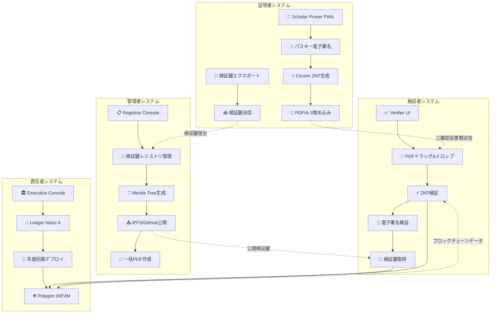
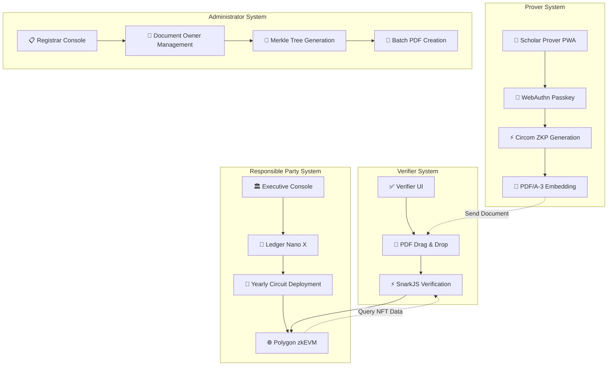

# Tri-CertFramework 🎓⚡🔐
**Version 2.4 – 最終更新: 2025-01-21**

<div align="center">

### 🌐 Language / 言語

**[🇯🇵 日本語](#japanese) | [🇺🇸 English](#english)**

*Click the language links above to jump to your preferred version*  
*上記の言語リンクをクリックして、お好みのバージョンにジャンプしてください*

</div>

---

<div id="japanese">

# 🇯🇵 Tri-CertFramework 🎓⚡🔐

> **Trust Minimized・完全バックエンドレス・三層認証書類真正性証明システム**  
> **ZKP + ブロックチェーン + 電子署名 = 究極の信頼性**

**あらゆる書類に適応可能な汎用的真正性証明システム**として設計され、**例として卒業証書の真正性証明**を実装。書類所有者のみがCircom回路・SnarkJS・パスキー電子署名を使用して三層の証明を生成し、**Ledger Nano X ハードウェアセキュリティ**による一線を画したセキュリティを実現。検証者はPDFファイル・Polygon zkEVMオンチェーンデータ・公開検証鍵リポジトリで完全な真正性を確認できます。

<div align="center">

[](https://opensource.org/licenses/MIT)
[](https://www.typescriptlang.org/)
[](https://github.com/iden3/circom)
[](https://tauri.app/)

**[🇺🇸 Switch to English](#english)**

</div>

## 🌟 主要機能

### 🔐 **Trust Minimization（信頼最小化）**
- **バックエンドサーバーゼロ** - API、データベース、クラウド依存性なし
- **ハードウェアセキュリティ** - 全管理者操作にLedger Nano X物理確認必須
- **年度別独立性** - 各卒業年度が完全に独立した回路とNFTで動作
- **分散型検証鍵配布** - IPFS/GitHub公開リポジトリによる透明性確保

### ⚡ **三層認証技術**
- **Circom + SnarkJS** - 業界標準ゼロ知識証明システム（第1層）
- **Polygon zkEVM** - 分散型ブロックチェーン検証（第2層）
- **パスキー電子署名** - ES256デジタル署名による所有者証明（第3層）
- **Poseidonハッシュ** - ZK最適化暗号プリミティブ
- **EIP-191署名** - ハードウェア保護管理者操作

### 🏗️ **4システム・アーキテクチャ**
- **証明者システム (Scholar Prover PWA)** - ZKP生成 + 電子署名 + 検証鍵エクスポート
- **責任者システム (Executive Console Tauri)** - Ledger保護回路デプロイ
- **管理者システム (Registrar Console Tauri)** - 検証鍵レジストリ管理 + 公開リポジトリ運用
- **検証者システム (Verifier UI SSG)** - 三層認証統合検証

## 🎯 クイックスタート

### 前提条件
- **Node.js** 18+ および npm
- **Ledger Nano X** (Executive Console用)
- **Chrome/Edge** 111+ または Safari 16.4+ (WebAuthn Level 2)

### インストール

```bash
# リポジトリをクローン
git clone https://github.com/Blank-Vulture/zk-CertFramework.git
cd zk-CertFramework

# 全コンポーネントの依存関係をインストール
npm run install:all

# 回路をビルド (circom と snarkjs が必要)
npm run build:circuits

# 開発サーバーを起動
npm run dev:all
```

### コンポーネント設定

#### 🎓 Scholar Prover (証明者インターフェース)
```bash
cd scholar-prover
npm install
npm run dev
# http://localhost:3000 でアクセス
```

#### 🏛️ Executive Console (責任者インターフェース)
```bash
cd executive-console
npm install
npm run tauri:dev
# Ledger Nano X接続が必要
```

#### 📋 Registrar Console (管理者インターフェース)
```bash
cd registrar-console
npm install
npm run tauri:dev
```

#### ✅ Verifier UI (検証者インターフェース)
```bash
cd verifier-ui
npm install
npm run dev
# http://localhost:3001 でアクセス
```

## 🏗️ アーキテクチャ概要



## 🔧 技術スタック

### コア技術
- **ゼロ知識証明**: Circom 2.1.4 + SnarkJS 0.7 (Groth16)
- **ブロックチェーン**: Polygon zkEVM (メインネット/Cardonaテストネット)
- **電子署名**: ES256 (ECDSA P-256) + WebAuthn Level 2
- **検証鍵配布**: IPFS + GitHub (分散型公開リポジトリ)
- **ハードウェアセキュリティ**: Ledger Nano X + EIP-191署名
- **PDF標準**: PDF/A-3 with embedded proofs + signatures
- **デスクトップフレームワーク**: Tauri v2 (Rust + OS WebView)

### コンポーネント技術
| システム | フレームワーク | 目的 | ストレージ |
|-----------|-----------|---------|---------|
| 証明者システム | React 18 + Vite (PWA) | ZKP生成 + 電子署名 | IndexedDB + localStorage |
| 責任者システム | React 18 + TypeScript + Tauri v2 | 回路デプロイ | ローカルJSONファイル |
| 管理者システム | React 18 + TypeScript + Tauri v2 | 検証鍵レジストリ管理 | ローカルJSONファイル + 公開リポジトリ |
| 検証者システム | Next.js 15 (SSG) + App Router | 三層認証検証 | 永続ストレージなし |

## 📋 使用ワークフロー

### 1. 🏛️ **責任者システム設定** (Executive Console)
```typescript
// 1. Ledger Nano X接続
// 2. Document{Year}.circomアップロード
// 3. Powers of Tauで回路コンパイル
// 4. Ledgerでデプロイメント署名
// 5. Polygon zkEVMにYearlySetデプロイ
```

### 2. 📋 **管理者システム運用** (Registrar Console)
```typescript
// 1. 学生からの検証鍵収集
// 2. 検証鍵レジストリ構築
// 3. IPFS/GitHubに公開
// 4. Poseidon Merkle Tree構築
// 5. 一括PDF/A-3書類生成
// 6. 書類所有者に配布
```

### 3. 🎓 **証明者システム利用** (Scholar Prover)
```typescript
// 1. WebAuthn Passkey登録 + 電子署名鍵生成
// 2. 検証鍵エクスポート + 管理者提出
// 3. PDF書類ドラッグ + 詳細入力
// 4. ゼロ知識証明生成
// 5. PDF電子署名生成
// 6. PDF/A-3にproof + signature埋め込み
// 7. 三層認証書類ダウンロード
```

### 4. ✅ **検証者システム利用** (Verifier UI)
```typescript
// 1. PDF書類ドラッグ&ドロップ
// 2. 埋め込みZKP + 電子署名自動抽出
// 3. SnarkJSでZKP検証 (第1層)
// 4. Polygon zkEVMでVK照会 (第2層)
// 5. 公開リポジトリから検証鍵取得
// 6. 電子署名検証 (第3層)
// 7. 三層認証統合結果表示
```

## 🔐 セキュリティ機能

### Trust Minimization原則
- **最小外部依存性** (Polygon zkEVM + 公開リポジトリのみ)
- **ハードウェア保護管理者操作** (Ledger Nano X必須)
- **年度別独立性** (年度間依存性なし)
- **分散型検証鍵配布** (IPFS/GitHub透明性)
- **三層認証検証** (ZKP + ブロックチェーン + 電子署名)

### 暗号学的セキュリティ
- **量子耐性**: SHA-3-512ハッシュ (256ビット耐量子セキュリティ)
- **ZK最適化**: 回路効率のためのPoseidonハッシュ
- **電子署名**: ES256 ECDSA (RFC 7515準拠)
- **WebAuthn Level 2**: 生体認証サポート
- **EIP-191署名**: ハードウェア保護パーソナルメッセージ署名
- **検証鍵整合性**: SHA-3チェックサムによる改ざん検出

## 🧪 テスト

### 全テスト実行
```bash
npm run test:all
```

### コンポーネント別テスト
```bash
# 回路テスト
cd circuits && npm run test

# Scholar Proverテスト
cd scholar-prover && npm run test

# Executive Consoleテスト
cd executive-console && npm run test:tauri

# Registrar Consoleテスト
cd registrar-console && npm test

# Verifier UIテスト
cd verifier-ui && npm test

# E2Eテスト
npm run test:e2e
```

## 🚀 デプロイメント

### プロダクションビルド
```bash
# 全コンポーネントビルド
npm run build:all

# 個別コンポーネントビルド
npm run build:scholar-prover    # PWAビルド
npm run build:executive         # Tauriパッケージ
npm run build:registrar         # Tauriパッケージ  
npm run build:verifier          # 静的サイトエクスポート
```

## 📚 学術的利用について

このプロジェクトは学術研究目的で開発されています。研究や教育目的での利用を歓迎します。商用利用については事前にご相談ください。

## 📜 ライセンス

このプロジェクトはMITライセンスの下でライセンスされています - 詳細は[LICENSE](LICENSE)ファイルをご覧ください。

## 🔗 リンク

- **ドキュメント**: [技術仕様書](documents/)
- **Circom回路**: [circuits/](circuits/)
- **Polygon zkEVM**: [公式ドキュメント](https://polygon.technology/polygon-zkevm)
- **リポジトリ**: [GitHub](https://github.com/Blank-Vulture/zk-CertFramework)

</div>

---

<div id="english">

# 🇺🇸 Tri-CertFramework 🎓⚡🔐

> **Trust-Minimized, Fully Backendless Triple-Layer Document Authenticity System**  
> **ZKP + Blockchain + Digital Signature = Ultimate Trust**

A **universal document authenticity verification system adaptable to any type of document**, with **graduation certificates as an example implementation**. Only document owners can generate time-bound zero-knowledge proofs, digital signatures, and verification keys using Circom circuits, SnarkJS, and passkey cryptography, with **Ledger Nano X hardware security** for responsible party operations. Verifiers can confirm authenticity using the PDF file, on-chain Polygon zkEVM data, and public verification key repositories.

<div align="center">

[](https://opensource.org/licenses/MIT)
[](https://www.typescriptlang.org/)
[](https://github.com/iden3/circom)
[](https://tauri.app/)

**[🇯🇵 日本語版に切り替え](#japanese)**

</div>

## 🌟 Key Features

### 🔐 **Trust Minimization**
- **Zero Backend Servers** - No APIs, databases, or cloud dependencies
- **Hardware Security** - All admin operations require Ledger Nano X physical confirmation
- **Yearly Independence** - Each graduation year operates with completely separate circuits and NFTs
- **Air-Gapped Verification** - 100% offline certificate validation

### ⚡ **Advanced Cryptography**
- **Circom + SnarkJS** - Industry-standard zero-knowledge proof system
- **Poseidon Hashing** - ZK-optimized cryptographic primitives
- **WebAuthn Integration** - Passwordless authentication with biometrics
- **EIP-191 Signatures** - Hardware-secured administrative operations

### 🏗️ **Four-System Architecture**
- **Prover System (Scholar Prover PWA)** - Document owner authenticity proof generation interface
- **Responsible Party System (Executive Console Tauri)** - Ledger-secured circuit deployment
- **Administrator System (Registrar Console Tauri)** - Local document data management
- **Verifier System (Verifier UI SSG)** - Drag-and-drop document verification

## 🎯 Quick Start

### Prerequisites
- **Node.js** 18+ and npm
- **Ledger Nano X** (for Executive Console)
- **Chrome/Edge** 111+ or Safari 16.4+ (WebAuthn Level 2)

### Installation

```bash
# Clone the repository
git clone https://github.com/Blank-Vulture/zk-CertFramework.git
cd zk-CertFramework

# Install dependencies for all components
npm run install:all

# Build circuits (requires circom and snarkjs)
npm run build:circuits

# Start development servers
npm run dev:all
```

### System Setup

#### 🎓 Scholar Prover (Prover Interface)
```bash
cd scholar-prover
npm install
npm run dev
# Access at http://localhost:3000
```

#### 🏛️ Executive Console (Responsible Party Interface)
```bash
cd executive-console
npm install
npm run tauri:dev
# Requires Ledger Nano X connected
```

#### 📋 Registrar Console (Administrator Interface)
```bash
cd registrar-console
npm install
npm run tauri:dev
```

#### ✅ Verifier UI (Verifier Interface)
```bash
cd verifier-ui
npm install
npm run dev
# Access at http://localhost:3001
```

## 🏗️ Architecture Overview



## 🔧 Technology Stack

### Core Technologies
- **Zero-Knowledge**: Circom 2.1.4 + SnarkJS 0.7 (Groth16)
- **Blockchain**: Polygon zkEVM (Mainnet/Cardona Testnet)
- **Hardware Security**: Ledger Nano X + EIP-191 signing
- **PDF Standard**: PDF/A-3 with embedded proofs
- **Desktop Framework**: Tauri v2 (Rust + OS WebView)

### System Technologies
| System | Framework | Purpose | Storage |
|-----------|-----------|---------|---------|
| Prover System | React 18 + Vite (PWA) | ZKP generation | IndexedDB + localStorage |
| Responsible Party System | React 18 + TypeScript + Tauri v2 | Circuit deployment | Local JSON files |
| Administrator System | React 18 + TypeScript + Tauri v2 | Document owner management | Local JSON files |
| Verifier System | Next.js 15 (SSG) + App Router | Document verification | No persistent storage |

## 📋 Usage Workflow

### 1. 🏛️ **Responsible Party System Setup** (Executive Console)
```typescript
// 1. Connect Ledger Nano X
// 2. Upload Document{Year}.circom
// 3. Compile circuit with Powers of Tau
// 4. Sign deployment with Ledger
// 5. Deploy YearlySet to Polygon zkEVM
```

### 2. 📋 **Administrator System Operation** (Registrar Console)
```typescript
// 1. Import document owner data (CSV/JSON)
// 2. Build Poseidon Merkle Tree
// 3. Generate batch PDF/A-3 documents
// 4. Distribute to document owners
```

### 3. 🎓 **Prover System Usage** (Scholar Prover)
```typescript
// 1. Register WebAuthn Passkey
// 2. Drag PDF document + enter details
// 3. Generate zero-knowledge proof
// 4. Embed proof in PDF/A-3
// 5. Download enhanced document
```

### 4. ✅ **Verifier System Usage** (Verifier UI)
```typescript
// 1. Drag and drop PDF document
// 2. Extract embedded ZKP automatically
// 3. Verify proof with SnarkJS
// 4. Query Polygon zkEVM for VK
// 5. Display verification result
```

## 🔐 Security Features

### Trust Minimization Principles
- **No External Dependencies** (except Polygon zkEVM)
- **Hardware-Secured Admin Operations** (Ledger Nano X required)
- **Yearly Independence** (no cross-year dependencies)
- **Air-Gapped Verification** (works completely offline)

### Cryptographic Security
- **Quantum Resistance**: SHA-3-512 hashing (256-bit post-quantum security)
- **ZK-Optimized**: Poseidon hashing for circuit efficiency
- **WebAuthn Level 2**: Biometric authentication support
- **EIP-191 Signing**: Hardware-secured personal message signing

## 🧪 Testing

### Run All Tests
```bash
npm run test:all
```

### System-Specific Testing
```bash
# Circuit testing
cd circuits && npm run test

# Prover System testing
cd scholar-prover && npm run test

# Responsible Party System testing
cd executive-console && npm run test:tauri

# Administrator System testing
cd registrar-console && npm test

# Verifier System testing
cd verifier-ui && npm test

# End-to-end testing
npm run test:e2e
```

## 🚀 Deployment

### Production Build
```bash
# Build all systems
npm run build:all

# Build individual systems
npm run build:scholar-prover    # PWA build
npm run build:executive         # Tauri package
npm run build:registrar         # Tauri package  
npm run build:verifier          # Static site export
```

### Deployment Targets
- **Prover System**: Deploy PWA to any static hosting (Vercel, Netlify, GitHub Pages)
- **Responsible Party System**: Distribute as Tauri executable (.dmg, .exe, .AppImage)
- **Administrator System**: Distribute as Tauri executable
- **Verifier System**: Deploy static site to CDN/GitHub Pages

## 📚 Academic Usage

This project is developed for academic research purposes. We welcome its use for research and educational purposes. For commercial use, please contact us in advance.

## 📜 License

This project is licensed under the MIT License - see the [LICENSE](LICENSE) file for details.

## 🔗 Links

- **Documentation**: [Technical Specifications](documents/)
- **Circom Circuits**: [circuits/](circuits/)
- **Polygon zkEVM**: [Official Documentation](https://polygon.technology/polygon-zkevm)
- **Repository**: [GitHub](https://github.com/Blank-Vulture/zk-CertFramework)

---

**Built with ❤️ for academic research and a trust-minimized future of digital credentials**

*"An academic exploration of empowering document owners with self-sovereign, verifiable documents while maintaining institutional trust through zero-knowledge cryptography."*

</div> 