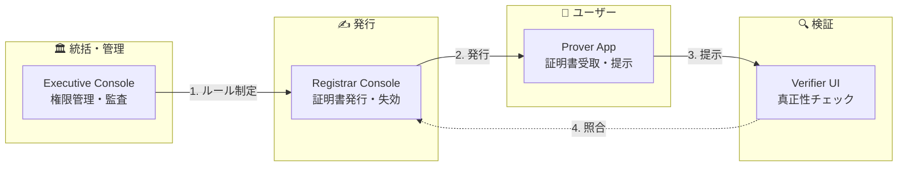

# Tri-Cert Framework
> **次世代の「信頼」を、もっと身近に、もっと確実に。**  
> デジタル時代の新しい証明書エコシステム

<div align="center">
  
</div>

## 🔰 Overview（概要）

**Tri-Cert Framework** は、卒業証書、資格証明、会員証などの「証明書」を、スマートフォンやPCで安全かつ簡単に発行・管理・検証できるデジタルプラットフォームです。

紙の証明書における「偽造リスク」「紛失」「確認の手間」といった課題を、最新の暗号技術と使いやすいインターフェースで解決します。

### 🎯 誰のためのシステム？

| 利用者 | メリット | 対応アプリケーション |
|:---|:---|:---|
| **経営者・管理者** | 組織全体の証明書発行ルールを統制。不正防止とコスト削減を実現。 | 🏛️ **Executive Console** |
| **発行担当者** | 窓口業務の負担を軽減。数クリックで公的なデジタル証明書を発行。 | ✍️ **Registrar Console** |
| **証明書を持つ人** | あなただけ、その時だけの証明ファイルを証書に添付。 | 📱 **Prover** |
| **確認する人** | 目の前の証明書が本物かどうか、瞬時に自動判定。目視確認は不要。 | 🔍 **Verifier UI** |

---

## 🔄 How It Works（仕組み）

Tri-Certは、3つの役割（発行者・保持者・検証者）と、それを統括する管理者の4者間で「信頼のバトン」を繋ぎます。


```mermaid
graph LR
    subgraph Management ["🏛️ 統括・管理"]
        Executive[Executive Console<br>権限管理・監査]
    end

    subgraph Issuance ["✍️ 発行"]
        Registrar[Registrar Console<br>証明書発行・失効]
    end

    subgraph User ["👤 ユーザー"]
        Prover[Prover App<br>証明書受取・提示]
    end

    subgraph Verification ["🔍 検証"]
        Verifier[Verifier UI<br>真正性チェック]
    end

    Executive -- "1. ルール制定" --> Registrar
    Registrar -- "2. 発行" --> Prover
    Prover -- "3. 提示" --> Verifier
    Verifier -. "4. 照合" .-> Registrar
```

---

## 📦 Components（構成要素）

本リポジトリには、エコシステムを構成する4つの主要アプリケーションが含まれています。

<details open>
<summary><h3>🏛️ Executive Console (管理コンソール)</h3></summary>
組織のトップレベル管理者が使用するダッシュボードです。<br>
<b>特徴:</b> 高いセキュリティと堅牢性。

- **Path**: `/executive-console`
- **Tech**: Rust (Tauri), React
- **Role**: ルート認証局の管理、システム設定、監査ログの監視

</details>

<details>
<summary><h3>✍️ Registrar Console (発行実務コンソール)</h3></summary>
大学の教務課や企業の総務部など、現場担当者が使用するデスクトップアプリです。<br>
<b>特徴:</b> 事務作業に馴染む軽快な操作性。

- **Path**: `/registrar-console`
- **Tech**: Go (Wails), Frontend
- **Role**: 個別の証明書発行、申請の承認/却下

</details>

<details>
<summary><h3>📱 Prover (証明書ウォレット)</h3></summary>
一般ユーザーが自分の証明書を受け取り、管理するためのWebアプリケーションです。<br>
<b>特徴:</b> スマホファーストで直感的なデザイン。

- **Path**: `/prover`
- **Tech**: Next.js, TypeScript
- **Role**: 証明書の保管、検証者への提出

</details>

<details>
<summary><h3>🔍 Verifier UI (検証ポータル)</h3></summary>
企業や機関が、提示された証明書が本物かを確認するWebサイトです。<br>
<b>特徴:</b> ログイン不要で誰でも即座に検証可能

- **Path**: `/verifier-ui`
- **Tech**: Next.js, TypeScript
- **Role**: 証明書の署名検証、有効期限確認

</details>

---

## 🛠 Tech Stack（技術スタック）

エンジニア向けの技術構成情報です。各コンポーネントは役割に最適な言語・フレームワークを選定しています。

| Component | Framework | Language | Key Features |
|-----------|-----------|----------|--------------|
| **Executive** | [Tauri](https://tauri.app/) | Rust, TS | 安全性、ネイティブパフォーマンス |
| **Registrar** | [Wails](https://wails.io/) | Go, JS | 軽量なバイナリ、クロスプラットフォーム |
| **Prover** | [Next.js](https://nextjs.org/) | TypeScript | 高速なレンダリング、SEO、PWA対応 |
| **Verifier** | [Next.js](https://nextjs.org/) | TypeScript | エッジ展開、高いアクセシビリティ |

---

## 🚀 Getting Started

リポジトリをクローンし、各ディレクトリで開発サーバーを起動できます。

### Prerequisites
- Node.js (v18+)
- Go (v1.20+)
- Rust (Latest Stable)

### Installation

```bash
# リポジトリのクローン
git clone https://github.com/your-org/tri-cert-framework.git
cd tri-cert-framework

# 例: Prover (ユーザーアプリ) の起動
cd prover
npm install
npm run dev
```

DBは必要ありません。全てファイルベースで動作します。<br>Executive ConsoleにはLedgerデバイスが必要です。

---

## 🛡 Security & Compliance

- **Open Standards**: W3C Verifiable Credentials (VC) 準拠（予定）
- **Privacy First**: ユーザーの同意なしに個人情報は共有されません。
- **Audit**: 全ての操作ログは改ざん困難な形式で記録されます。

---

<div align="center">
  <small>Use with ❤️ by the Tri-Cert Development Team.</small>
</div>

