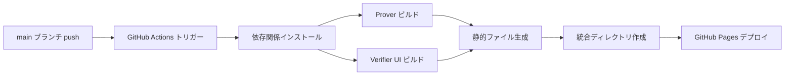

# GitHub Pages デプロイ設計書

最終更新: 2025-01-XX

## 1. 概要

本ドキュメントは、`prover` と `verifier-ui` を GitHub Pages にデプロイするための設計と実装方針を定義します。

### 1.1 デプロイ先

- **リポジトリ**: `Blank-Vulture/Tri-CertFramework`
- **デプロイ先URL**:
  - Prover: `https://blank-vulture.github.io/Tri-CertFramework/prover/`
  - Verifier UI: `https://blank-vulture.github.io/Tri-CertFramework/verifier-ui/`

### 1.2 技術スタック

- **フレームワーク**: Next.js 15.5.0
- **ビルド方式**: Static Site Generation (SSG)
- **デプロイ方式**: GitHub Actions + GitHub Pages
- **Node.js バージョン**: 20.x (LTS)

## 2. アーキテクチャ設計

### 2.1 デプロイフロー



### 2.2 ディレクトリ構造

```
.github/
└── workflows/
    └── deploy-pages.yml     # デプロイワークフロー

prover/
├── next.config.ts           # 静的エクスポート設定追加
├── package.json             # export スクリプト追加
└── out/                     # ビルド出力（gitignore）

verifier-ui/
├── next.config.ts           # 静的エクスポート設定追加
├── package.json             # export スクリプト追加
└── out/                     # ビルド出力（gitignore）

deploy/
└── dist/                    # 統合デプロイディレクトリ（GitHub Pages用）
    ├── prover/
    │   └── ...              # prover の静的ファイル
    └── verifier-ui/
        └── ...              # verifier-ui の静的ファイル
```

## 3. Next.js 設定

### 3.1 静的エクスポート設定

両方のアプリケーションに以下を追加:

```typescript
const nextConfig: NextConfig = {
  output: 'export',                    // 静的エクスポート有効化
  basePath: '/Tri-CertFramework/prover', // または /verifier-ui
  assetPrefix: '/Tri-CertFramework/prover', // または /verifier-ui
  images: {
    unoptimized: true,                 // 画像最適化無効（静的エクスポート必須）
  },
  // 既存の設定...
};
```

### 3.2 basePath の動的設定

GitHub Pages のサブパスデプロイに対応するため、`basePath` を環境変数で制御:

- 開発時: `basePath: ''` (ルート)
- ビルド時: `basePath: '/Tri-CertFramework/prover'` または `/verifier-ui`

## 4. GitHub Actions ワークフロー設計

### 4.1 ワークフロー概要

1. **トリガー**: `main` ブランチへの push、または手動実行
2. **権限**: GitHub Pages への書き込み権限
3. **ジョブ構成**:
   - **Build**: 両アプリをビルド
   - **Deploy**: GitHub Pages にデプロイ

### 4.2 ビルドプロセス

```yaml
- Node.js セットアップ (v20)
- 依存関係インストール（キャッシュ活用）
- Prover ビルド（basePath 設定）
- Verifier UI ビルド（basePath 設定）
- 統合ディレクトリ作成
- GitHub Pages デプロイ
```

### 4.3 キャッシュ戦略

- `node_modules` キャッシュ（プロジェクト単位）
- Next.js ビルドキャッシュ（`.next` ディレクトリ）

## 5. パス解決の考慮事項

### 5.1 アセットパス

- 静的ファイル（`.wasm`, `.zkey`, `.json`）は `public/` から提供
- `basePath` を考慮したパス解決が必要

### 5.2 API Routes の扱い

- Next.js の API Routes は静的エクスポートでは使用不可
- クライアントサイドのみの実装が必要

## 6. セキュリティ考慮事項

### 6.1 シークレット管理

- ビルド時の環境変数は不要（完全静的サイト）
- GitHub Secrets は使用しない

### 6.2 CORS ポリシー

- GitHub Pages からの配信は同一オリジン
- 外部API呼び出し時は適切なCORS設定が必要

## 7. デプロイ手順

### 7.1 初回セットアップ

1. リポジトリ設定で GitHub Pages を有効化
2. Source を "GitHub Actions" に設定
3. ワークフローファイルをコミット・プッシュ

### 7.2 継続的デプロイ

- `main` ブランチへの push で自動デプロイ
- デプロイ完了後、数分で反映

## 8. トラブルシューティング

### 8.1 よくある問題

- **404 エラー**: `basePath` の設定ミスを確認
- **アセット読み込み失敗**: `assetPrefix` の設定を確認
- **ビルドエラー**: Node.js バージョンの不一致を確認

### 8.2 デバッグ方法

- GitHub Actions のログを確認
- ローカルで `npm run export` を実行して検証
- `basePath` を一時的に空にして動作確認

## 9. 参考資料

- [Next.js Static HTML Export](https://nextjs.org/docs/app/building-your-application/deploying/static-exports)
- [GitHub Actions for GitHub Pages](https://github.com/actions/deploy-pages)
- [GitHub Pages Documentation](https://docs.github.com/pages)

