:::caution[過去バージョン]
これは過去バージョン（v2.58）です。最新版は [v2.60](./thesis-v2-60/) をご覧ください。
:::

# デジタル文書の真正性検証: ３層認証アーキテクチャの設計と実装

　神戸情報大学院大学
　情報技術研究科 情報システム専攻

　学籍番号：24024
　氏名：白石鷹也

　提出日：2026年1月16日

---

## 内容梗概

　従来の卒業証明書や資格証明書などの文書の真正性検証には3つの課題があった。第一に、印刷技術の発達により偽造が容易となり目視では真偽判定が困難である。第二に、発行機関への照会には1〜2週間と手数料が必要で非効率である。第三に、検証に際し不要な個人情報の開示を求められる場合がある。本研究では、上記の課題の解決策として、暗号学的証明技術と生体認証を組み合わせた文書真正性検証フレームワーク「Tri-CertFramework」を提案する。本フレームワークは、発行機関による登録確認・暗号学的証明・生体認証署名の3層認証で偽造を暗号学的に不可能とし、証明データをPDFに埋め込むことで発行機関への照会なしに即時検証を実現し、必要最小限の情報開示でプライバシーを保護する。システムは、利用者登録のRegistrar Console、検証鍵管理のExecutive Console、証明生成のProver、検証のVerifierで構成される。事例として、卒業証明書を対象に実装し、想定ユーザーによる評価を得た。検証の結果、従来1〜2週間を要した検証が約3秒で完了し、「実務と心理両面の負担軽減になる」など好評価を得た。本フレームワークは医療資格証明など多様な文書に応用可能である。

---

---

# 目次

- [第1章 序論](#第1章-序論)
  - [1.1 研究の背景](#11-研究の背景)
  - [1.2 真正性検証とは](#12-真正性検証とは)
  - [1.3 現在の真正性検証が抱える課題](#13-現在の真正性検証が抱える課題)
    - [1.3.1 課題1： 真正性の担保が脆弱](#131-課題1：-真正性の担保が脆弱)
    - [1.3.2 課題2： 確認プロセスが非効率](#132-課題2：-確認プロセスが非効率)
    - [1.3.3 課題3： 過度な個人情報の開示](#133-課題3：-過度な個人情報の開示)
  - [1.4 本研究の目的と対象領域](#14-本研究の目的と対象領域)
  - [1.5 本研究の特徴](#15-本研究の特徴)
  - [1.6 本論文の構成](#16-本論文の構成)
- [第2章 先行研究と技術基盤](#第2章-先行研究と技術基盤)
  - [2.0 章概要](#20-章概要)
  - [2.1 デジタル証明書の現状](#21-デジタル証明書の現状)
    - [2.1.1 従来のデジタル証明書](#211-従来のデジタル証明書)
    - [2.1.2 既存手法の限界](#212-既存手法の限界)
  - [2.2 ゼロ知識証明（ZKP）](#22-ゼロ知識証明（zkp）)
    - [2.2.1 ZKPの概要](#221-zkpの概要)
    - [2.2.2 zk-SNARKsとGroth16](#222-zk-snarksとgroth16)
    - [2.2.3 Poseidonハッシュ関数](#223-poseidonハッシュ関数)
  - [2.3 WebAuthn と FIDO2](#23-webauthn-と-fido2)
    - [2.3.1 FIDO2規格の概要](#231-fido2規格の概要)
    - [2.3.2 本研究での活用](#232-本研究での活用)
  - [2.4 関連研究](#24-関連研究)
    - [2.4.1 学術証明書へのZKP適用](#241-学術証明書へのzkp適用)
    - [2.4.2 Self-Sovereign Identity（SSI）](#242-self-sovereign-identity（ssi）)
  - [2.5 本研究のポジショニング](#25-本研究のポジショニング)
    - [2.5.1 既存手法との比較](#251-既存手法との比較)
- [第3章 システム設計と実装](#第3章-システム設計と実装)
  - [3.1 設計思想とアーキテクチャ](#31-設計思想とアーキテクチャ)
    - [3.1.1 設計原則](#311-設計原則)
    - [3.1.2 システムアーキテクチャ](#312-システムアーキテクチャ)
    - [3.1.3 検証プロセス](#313-検証プロセス)
    - [3.1.4 3層認証の詳細](#314-3層認証の詳細)
  - [3.2 Registrar Console](#32-registrar-console)
    - [3.2.1 概要](#321-概要)
    - [3.2.2 主要機能](#322-主要機能)
    - [3.2.3 ハッシュ計算アルゴリズム](#323-ハッシュ計算アルゴリズム)
    - [3.2.4 Allowlistの構造](#324-allowlistの構造)
    - [3.2.5 一括登録機能](#325-一括登録機能)
  - [3.3 Executive Console](#33-executive-console)
    - [3.3.1 概要](#331-概要)
    - [3.3.2 VK生成プロセス](#332-vk生成プロセス)
    - [3.3.3 VKNFTバンドル構造](#333-vknftバンドル構造)
    - [3.3.4 マニフェストファイル](#334-マニフェストファイル)
  - [3.4 Prover（証明生成UI）](#34-prover（証明生成ui）)
    - [3.4.1 概要](#341-概要)
    - [3.4.2 証明生成フロー](#342-証明生成フロー)
    - [3.4.3 ZKP回路の設計](#343-zkp回路の設計)
    - [3.4.4 PDFへの証明埋め込み](#344-pdfへの証明埋め込み)
  - [3.5 Verifier UI（検証UI）](#35-verifier-ui（検証ui）)
    - [3.5.1 概要](#351-概要)
    - [3.5.2 検証プロセス](#352-検証プロセス)
    - [3.5.3 ZKP検証](#353-zkp検証)
    - [3.5.4 WebAuthn署名検証](#354-webauthn署名検証)
  - [3.6 データ構造とプロトコル](#36-データ構造とプロトコル)
    - [3.6.1 証明データスキーマ](#361-証明データスキーマ)
    - [3.6.2 ハッシュアルゴリズム](#362-ハッシュアルゴリズム)
    - [3.6.3 国際化対応](#363-国際化対応)
- [第4章 検証](#第4章-検証)
  - [4.1 検証方法](#41-検証方法)
    - [4.1.1 検証手順](#411-検証手順)
    - [4.1.2 協力者](#412-協力者)
  - [4.2 検証結果](#42-検証結果)
    - [4.2.1 システム利用体験後のフィードバック](#421-システム利用体験後のフィードバック)
    - [4.2.2 性能評価](#422-性能評価)
    - [4.2.3 検証結果の総括](#423-検証結果の総括)
  - [4.3 セキュリティ評価](#43-セキュリティ評価)
    - [4.3.1 脅威モデル](#431-脅威モデル)
    - [4.3.2 セキュリティ保証](#432-セキュリティ保証)
    - [4.3.3 攻撃シナリオ分析](#433-攻撃シナリオ分析)
  - [4.4 既存手法との比較](#44-既存手法との比較)
    - [4.4.1 比較対象](#441-比較対象)
    - [4.4.2 比較結果](#442-比較結果)
    - [4.4.3 本システムの優位性](#443-本システムの優位性)
- [第5章 考察](#第5章-考察)
  - [5.1 プライバシー保護の観点](#51-プライバシー保護の観点)
    - [5.1.1 最小限情報開示の原則](#511-最小限情報開示の原則)
    - [5.1.2 リンカビリティ分析](#512-リンカビリティ分析)
    - [5.1.3 GDPR・個人情報保護法への適合性](#513-gdpr・個人情報保護法への適合性)
  - [5.2 運用面での考慮事項](#52-運用面での考慮事項)
    - [5.2.1 鍵管理](#521-鍵管理)
    - [5.2.2 障害時対応](#522-障害時対応)
    - [5.2.3 長期運用](#523-長期運用)
    - [5.2.4 発行機関消滅時の対応](#524-発行機関消滅時の対応)
  - [5.3 応用可能性と社会的意義](#53-応用可能性と社会的意義)
    - [5.3.1 他分野への応用](#531-他分野への応用)
    - [5.3.2 社会的意義](#532-社会的意義)
  - [5.4 本システムの限界と課題](#54-本システムの限界と課題)
    - [5.4.1 技術的な限界](#541-技術的な限界)
    - [5.4.2 運用上の課題](#542-運用上の課題)
    - [5.4.3 検証から得られた反省点](#543-検証から得られた反省点)
- [第6章 結論と今後の課題](#第6章-結論と今後の課題)
  - [6.1 結論](#61-結論)
  - [6.2 本研究の貢献](#62-本研究の貢献)
  - [6.3 今後の課題と展望](#63-今後の課題と展望)
    - [6.3.1 技術的課題](#631-技術的課題)
    - [6.3.2 運用面での課題](#632-運用面での課題)
    - [6.3.3 展望](#633-展望)
- [謝辞](#謝辞)
- [参考文献](#参考文献)
- [付録](#付録)

---

# 第1章 序論

## 1.1 研究の背景

　現代社会は、様々な「文書」の信頼性によって支えられている。企業間の契約書、行政機関が発行する戸籍謄本や住民票、医療機関の診断書、教育機関の卒業証明書など、これらの重要書類は社会生活の基盤として機能している。

　しかしながら、これら重要書類の真正性を担保する現在の方法には、深刻な信頼性の問題がある。2024年から2025年にかけて、静岡県伊東市長の学歴詐称疑惑や、東京都知事のカイロ大学卒業疑惑が再燃するなど、学歴証明の信頼性に関する社会問題が連日報道された [1][2]。これらの事例は、現代の印刷技術では目視での真偽判定が極めて困難であり、卒業証書を提示しても疑惑が晴れないケースがあることを示している。

　また、朝日新聞の報道によれば、採用時に候補者の経歴を確認する「リファレンスチェック」を行う企業が急増している [1]。これは、従来の証明書提示だけでは信頼性が不十分であることの裏返しでもある。学歴詐称が発覚した場合、採用取り消しや懲戒解雇の対象となるだけでなく、企業側も採用プロセスの見直しや信用失墜といった損害を被る。

　このような状況は学歴証明に限定されるものではない。企業の重要書類（契約書、決算報告書など）の改竄、行政文書の偽造、医療資格の詐称など、文書の真正性に関わる問題は社会の様々な場面で発生している。デジタル化が進む現代において、「その文書・ファイルが正式なものであるか」を確実に検証できる仕組みの構築は、社会全体の喫緊の課題となっている。

　さらに、発行機関・本人・検証者の三者の責任分担が曖昧なまま運用されていることが、問題を長期化させている。検証者は追加確認に追われ、発行機関は照会対応で疲弊し、本人は必要以上の情報提供を求められる。社会的コストを抑えつつ信頼を確保する仕組みが求められる。

## 1.2 真正性検証とは

　本研究における「真正性検証」とは、図1.1に示す3つの要素を確認するプロセスを指す。

1. **発行元の正当性**: その文書が、正当な権限を持つ機関・個人によって発行されたものであるか
2. **内容の完全性**: その文書が発行後に改竄されていないか
3. **所有者の本人性**: その文書を提示している人物が、正当な所有者本人であるか

<pre class="mermaid">
　flowchart TD
    　subgraph Validation ["真正性検証の3要素"]
        　direction TB
        　A["発行元の正当性<br>（誰が作ったか）"]
        　B["内容の完全性<br>（書き換えられていないか）"]
        　C["所有者の本人性<br>（この人のものか）"]
    　end

    　D["真正性が証明済みの文書"]

    　A --> D
    　B --> D
    　C --> D
</pre>

<p align="center"><strong>図1.1: 真正性検証の3要素</strong></p>

　この3要素のいずれかが欠けると、検証者は判断の根拠を失う。発行元が不明であれば偽造の疑いは残り、内容が改竄されていれば意思決定は誤る。所有者の本人性が確かでなければ、正規の証明書でも不正利用が起き得る。真正性検証とは「誰が・何を・どのように提示したか」を一括で確認する行為である。

　従来、これらの検証は物理的な手段（印影、透かし、特殊インク等）や、発行機関への直接照会によって行われてきた。しかし、デジタル化の進展により、これらの従来手法は限界を迎えつつある。以上の状況から、次節では解決すべき課題を整理する。

## 1.3 現在の真正性検証が抱える課題

### 1.3.1 課題1： 真正性の担保が脆弱

　現代の印刷技術やデジタル編集技術の発達により、文書の偽造は年々容易になっている。高品質なスキャナーとプリンターがあれば、紙の証明書を複製することは技術的に可能である。デジタル文書に至っては、メタデータの改竄やPDFの編集が比較的容易に行える。

　学歴詐称の問題が後を絶たないのは、卒業証明書の目視確認だけでは真偽判定が極めて困難であることの証左である。さらに、卒業証書を提示しても疑惑が晴れないケースがあるように、証明書単体では十分な証明力を持たない場合も多い [2]。

　**この問題が発生する根本原因は、現行の証明書システムに暗号学的な検証メカニズムが組み込まれていないことにある。** 従来の偽造防止手段である印影、透かし、特殊インクなどの物理的手法は、印刷技術の発展に伴いその有効性を失いつつある。また、目視による確認は検証者の知識や経験に依存し、高度な偽造には対応できない。デジタル文書においても、電子署名の導入は限定的であり、多くの証明書は署名なしのPDFとして発行されている。つまり、**改竄を検知する技術的基盤が存在しないため、検証者は偽造を見破る手段を持たない**のである。この結果、検証者は判断を先送りせざるを得ず、採用や契約といった実務の意思決定が滞る。

### 1.3.2 課題2： 確認プロセスが非効率

　検証者（例：採用企業）が発行元（例：大学）に直接照会する場合、以下のような非効率が発生する。

- **時間的コスト**: 郵送での確認には往復で1〜2週間を要する
- **金銭的コスト**: 大学への卒業証明書の発行依頼には1通あたり数百円の手数料が発生する。採用候補者100人の経歴確認を行う場合、手数料だけで数万円、担当者の作業時間を含めると相当のコストとなる
- **人的コスト**: 発行機関側においても問い合わせ対応に業務コストが発生する。大学事務局では年度末の繁忙期に証明書発行業務が集中し、対応遅延が発生することもある

　特に、大規模な採用活動や、複数の資格確認が必要な業務（医療機関での資格確認など）では、この非効率性は深刻な業務負担となる。例えば、300床規模の病院では医師・看護師など数百人の職員の資格確認が必要であり、更新時期が重なると事務部門の負担は極めて大きい。

　**この非効率が発生する根本原因は、真正性を検証するための一元的なオンライン検証プロトコルが存在しないことにある。** 現状では、各発行機関が独自の確認プロセスを持ち、検証者は証明書ごとに異なる発行機関に個別に問い合わせる必要がある。オンラインで即時に検証できる仕組みがないため、物理的な郵送や電話による照会に頼らざるを得ず、時間と費用が発生する。**検証に必要な情報が証明書自体に含まれていれば、発行機関への照会は不要**となるが、そのような設計は従来の証明書システムには存在しない。本研究では、この「照会前提」を排し、検証情報を証明書自身に内包する設計を目指す。

### 1.3.3 課題3： 過度な個人情報の開示

　真正性を証明するために、必要以上の個人情報開示を求められるケースがある。例えば、

- 卒業の事実だけを確認したいのに、成績証明書の提出を求められる
- 資格の有無だけを確認したいのに、取得年月日や試験成績まで開示が必要

　一般的な成績証明書には以下のような情報が記載されている。

- 氏名、生年月日、学籍番号
- 学部・学科・専攻
- 入学年月日、卒業年月日
- 履修した全科目名と成績（優/良/可/不可、または A/B/C/D/F）
- GPA（累積成績平均）

　採用企業が確認したいのは「この人が本当にこの大学を卒業したか」という一点のみであるにもかかわらず、上記のすべての情報が開示されてしまう。これらの詳細な成績情報は検証目的には不要であり、むしろ採用判断に不適切なバイアスを与える可能性もある。個人情報保護の観点から、検証に必要な最小限の情報のみを開示できる仕組みが望ましい。

　**この問題が発生する根本原因は、従来のデジタル署名技術が「選択的開示」に対応していないことにある。** X.509証明書に代表される従来の電子署名方式は、文書全体のハッシュ値に対して署名を行う。このため、署名の検証には文書全体が必要となり、一部の情報だけを開示して署名を検証することは技術的に不可能である。結果として、検証者は「全ての情報を見せてもらう」か「何も検証できない」かの二択を迫られる。**必要な情報だけを選択的に開示しながら、文書の真正性を暗号学的に証明する技術**が必要であるが、従来の証明書システムにはそのような機能は実装されていない。この「選択的開示」を実現する暗号技術として、近年「ゼロ知識証明（Zero-Knowledge Proof）」が注目されている。これは「ある情報を持っていること」を、その情報自体を明かさずに証明できる技術であり、第2章で詳しく説明する。本研究では、この技術を活用することで、「卒業の事実」だけを証明し、成績や学籍番号などの詳細情報を一切開示しない仕組みを実現する。

　選択的開示ができない現状は、本人のプライバシー侵害にとどまらず、検証者の判断に不要な情報が混入し、意思決定の公平性を損なう恐れがある。

　これらの課題は、表1.1のように整理できる。

<p align="center"><strong>表1.1: 真正性検証の3つの課題</strong></p>

| 課題 | 現状の問題 | 理想的な解決策 |
|------|-----------|---------------|
| 真正性の担保が脆弱 | 目視確認では偽造を見破れない | 暗号学的な改竄検知 |
| 確認プロセスが非効率 | 照会に1〜2週間、手数料発生 | 即時・無料での検証 |
| 過度な個人情報開示 | 検証に不要な情報まで開示 | 必要最小限の情報のみ |

　本研究の探究チャートを図1.2に示す。問題意識として、文書偽造が後を絶たないこと、現行の真正性検証は確認プロセスが煩雑で非効率であること、検証時に過度な個人情報開示が求められることの3点を設定した。これらに対する解決策として、効率的かつプライバシーを保護した文書真正性検証システムを提案する。

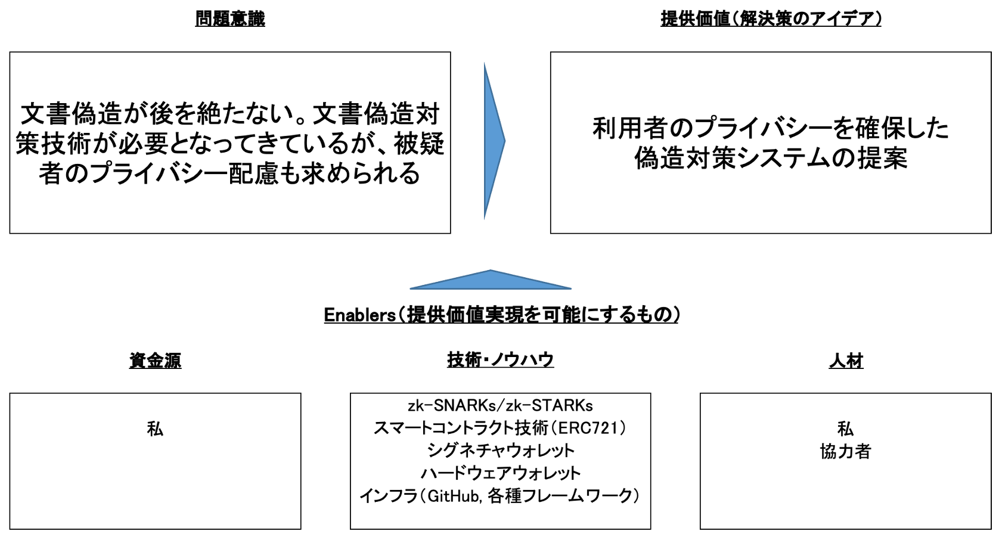

<p align="center"><strong>図1.2: 本研究の探究チャート</strong></p>

## 1.4 本研究の目的と対象領域

　本研究では、上述の3つの課題を解決するため、暗号学的手法を用いた新しい文書真正性検証フレームワーク **Tri-CertFramework** を提案・実装する。

　ここで「暗号学的手法」とは、数学的な計算の困難さを利用してデータの安全性を保証する技術の総称である。

　例として、「2つの大きな素数を掛け算する」計算は電卓でも一瞬でできる。しかし、「その答えから元の2つの素数を当てる」計算は、世界最高速のスーパーコンピュータでも何百年もかかる。暗号学的手法は、このような「一方通行の計算」を利用して、データを守る仕組みを作る技術である。

　本研究では主に以下の3つの技術を組み合わせて使用する。

- **ゼロ知識証明（Zero-Knowledge Proof）**: 「証明書が本物である」という事実を、証明書の内容を見せずに証明する技術。第2章で詳述。
- **WebAuthn/FIDO2**: スマートフォンやパソコンの指紋認証・顔認証を利用して、本人確認を行う国際標準規格。パスワードを使わない安全な認証方式である。第2章で詳述。
- **ハッシュ関数**: 任意のデータを固定長の「指紋」のような値に変換する技術。データが1文字でも変わると全く異なる値になるため、改竄検知に使用される。

　本フレームワークで使用する具体的な技術については第2章で詳述するが、本節ではその目的と解決策の概要を述べる。

　本研究の目的は、(1) 改竄検知を暗号学的に担保する、(2) 検証に必要な情報を証明書に内包して照会を不要にする、(3) 提示者が正当な所有者であることを確認できるようにする、という3点により、検証者が即時に判断できる状態を実現することである。

　**本研究の対象領域は「デジタル文書全般」の真正性検証である。** 本フレームワークは、契約書、診断書、資格証明書、学位証明書など、発行機関が存在し真正性の証明が求められるあらゆるデジタル文書に適用可能な汎用的なアーキテクチャとして設計されている。ただし、本論文では具体的な適用事例として **教育機関における卒業証明書** を取り上げ、システムの設計・実装・検証を行う。

　本フレームワークは、表1.2に示す3層構造で証明書の真正性を保証する。

<p align="center"><strong>表1.2: 3層認証構造</strong></p>

| 層 | 役割 | 防ぐ攻撃 |
|----|------|---------|
| **第1層：登録確認** | 発行機関が正規に登録した証明書であることを確認 | 架空の機関による偽造証明書 |
| **第2層：内容保全** | 証明書の内容が改竄されていないことを暗号学的に検証 | 正規証明書の内容改竄 |
| **第3層：所有者確認** | 提示者が正当な所有者であることを生体認証で確認 | 他人の証明書の不正使用 |

　この3層すべてを通過しなければ検証は成功しないため、いずれか1層でも異常があれば偽造が露呈する。各層の技術的詳細は第2章で、実装の詳細は第3章で述べる。

　さらに、本フレームワークは以下の利点を提供する。

1. **即時性（PDF埋め込み検証）**: 証明データをPDFに直接埋め込むことで、発行機関への照会なしに数秒で検証完了。従来は郵送で1〜2週間かかっていた確認が、ブラウザ上で即座に完了する
2. **秘匿性（選択的開示）**: 検証に必要な最小限の情報（「卒業した」という事実と卒業年度）のみを開示し、成績や学籍番号などの詳細情報は一切開示しない

　卒業証明書を適用事例として選択した理由は以下の通りである。

1. **社会的関心の高さ**: 学歴詐称問題が社会問題化しており、解決へのニーズが明確
2. **評価の容易性**: 大学院生という立場から、利用者・発行機関の両方の視点での評価が可能
3. **汎用性の検証**: 卒業証明書で有効性が示されれば、他の証明書への応用可能性も高い

　本研究では、上記3つの課題に対して以下の定量的目標を設定する。

<p align="center"><strong>表1.3: 本研究の定量的目標</strong></p>

| 課題 | 定量的目標 | 根拠 |
|------|-----------|------|
| 真正性の担保 | 128ビット以上の計算量的安全性[^1] | 現代の暗号学的基準に準拠 |
| 確認プロセスの効率化 | 検証時間5秒以内 | 従来の1〜2週間から99.99%以上短縮 |
| 個人情報開示の最小化 | 開示項目2項目以下 | 卒業年度と登録状態のみ |

[^1]: 128ビットの計算量的安全性とは、攻撃者が暗号を解読するために2^128（約3.4×10^38）回の計算が必要となる難易度を意味する。現在の最高速スーパーコンピュータでも、この回数の計算には宇宙の年齢を超える時間がかかり、実質的に解読不可能とされる。

　測定方法は以下の通りである。

- **真正性の担保**: Groth16（BN128曲線）が提供する計算量的安全性に基づき評価する
- **検証時間**: 第4章の性能評価で、証明生成から検証完了までの実測値で評価する
- **開示項目数**: 検証結果画面で公開される項目数を基準に評価する

　これらの目標が達成されたかどうかは、第4章の検証において評価する。

### 本研究の位置づけと範囲

　文書真正性検証システムの社会実装を実現するためには、理想的には以下のプロセスが必要である。

1. **要件定義**: 実際の発行機関（大学等）と検証機関（企業等）へのヒアリングによる業務要件の把握
2. **プロトタイプ開発**: 要件に基づくシステム設計・実装
3. **実証実験**: 実機関での試験運用と効果測定
4. **効果検証**: 業務効率化、コスト削減、ユーザー満足度の定量的評価
5. **普及戦略**: 採用障壁の分析と導入支援体制の構築

　しかし、修士課程の1年間という時間的制約の中で、上記すべてを網羅的に実施することは現実的ではない。特に、実機関での本格的な実証実験（ステップ3〜5）には、機関とのコネクション確立から承認、スケジュール調整など長期的な効果測定期間が必要であり、これらは修士研究の範囲を超える。

　本研究では、上記プロセスのうち **「2. プロトタイプ開発」を中心に、「3. 実証実験」の予備的評価** までを実施範囲とする。具体的には、以下の3点に注力する。

1. **技術的実現可能性の実証**: 暗号学的手法を用いた文書真正性検証が、実用的な性能で動作することを示す
2. **システム設計の具体化**: 発行機関・証明書保持者・検証者という3者の関係性を考慮した実装を行う
3. **予備的評価の実施**: 少数の協力者による利用評価を通じて、実用化への課題と可能性を明らかにする

　本研究は、社会実装に向けた第一段階として「技術的に可能であること」を実証するものであり、大規模な実証実験や普及戦略の策定は今後の課題として位置づける。この位置づけを踏まえ、第4章では上記3点の達成度を評価し、第5章では社会実装に向けた残課題を考察する。

## 1.5 本研究の特徴

　本研究では、前節で述べた3つの課題を解決するため、表1.4に示す技術を採用した。各技術の詳細は第2章で述べる。

　以下の特徴は、課題1〜3の解決と定量目標の達成に直結する設計判断である。したがって本章では「何が新しいか」だけでなく「なぜそれが有効なのか」にも重点を置く。

<p align="center"><strong>表1.4: 本研究で採用した主要技術</strong></p>

| 技術 | 解決する課題 | 本研究での役割 | 詳細 |
|------|------------|---------------|------|
| ゼロ知識証明（ZKP） | 課題1（真正性）、課題3（プライバシー） | 証明書の内容を見せずに「本物である」ことを証明 | 2.2節 |
| WebAuthn/FIDO2 | 課題1（真正性）の一部 | 指紋・顔認証による所有者の本人確認 | 2.3節 |
| Poseidonハッシュ | 課題2（効率化） | ZKP回路内での高速なハッシュ計算により、証明生成を数秒に短縮 | 2.2.3節 |

　以下、本研究の特徴として4点を挙げる。

　**1. プライバシー保護と真正性検証の両立**

　従来の電子署名やブロックチェーン証明書は、証明書の真正性を保証するために証明書の内容をそのまま開示する必要があった。本研究では、暗号学的手法を用いることで、「卒業の事実」を証明しながら、成績や学籍番号などの詳細情報を一切開示しないことを可能にした。これは、GDPR（EU一般データ保護規則）や日本の個人情報保護法が求める「データ最小化の原則」に適合するアプローチである。

　**2. 所有者の本人性確認機能の統合**

　既存のデジタル証明書規格（X.509、Open Badges、Blockcerts等）は、いずれも「証明書が本物であること」は確認できても、「それを提示している人物が正当な所有者であるか」は確認できない。本研究では、生体認証を統合することで、証明書の真正性と所有者の本人性を同時に検証可能にした。これにより、他人の証明書を不正利用する「なりすまし」を防止できる。

　**3. 完全分散型アーキテクチャ**

　本システムは、検証時に発行機関のサーバーへの問い合わせを必要としない。検証に必要な情報（検証鍵、登録リスト）は公開リポジトリで配布されており、オフライン環境でも検証が可能である。これにより、発行機関のサーバー障害や、極端な場合には発行機関の消滅後も、証明書の検証が継続可能となる。

　**4. 実用的なシステムとしての完成度**

　本研究は理論提案にとどまらず、4つのコンポーネント（発行者向けコンソール、管理者向けコンソール、証明生成UI、検証UI）を実装し、実際に動作するシステムとして完成させた。医療事務従事者を含む協力者による評価では、「実務負担だけでなく心理的負担も軽減できる」との肯定的な評価を得ており、実用化への道筋を示すことができた。

　**5. 無料運用とオープンソースによる透明性**

　本システムは利用者が無料で使用できる設計となっている。これが可能な理由は以下の3点にある。

1. **サーバーレス設計**: 証明生成と検証はすべてブラウザ上で完結するため、運営者側に継続的なサーバー費用が発生しない。検証鍵などのデータはGitHubなどの無料ホスティングサービスで配布可能である
2. **ブロックチェーン手数料の排除**: 本システムはブロックチェーンを使用しないため、トランザクション手数料（ガス代）が発生しない。BlockcertsなどのBlockchain方式では証明書の発行や検証のたびに少額の手数料がかかるが、本システムにはそのような費用がない
3. **オープンソース公開**: システム全体のソースコードをGitHub上で公開しており、誰でも無料で利用・検証・改変できる。これにより、技術的な透明性が担保され、「なぜ安全と言えるのか」を第三者が検証可能である

　この設計思想は、教育機関や検証者に新たな金銭的負担を強いることなく、信頼性の高い検証基盤を提供することを目指している。

#### 運用資金の流れ

　本システムの運用にあたり、資金面での実現可能性について説明する。

　**開発費用**

　本研究は個人の研究活動として実施されており、外部からの研究資金は受け取っていない。開発に使用したソフトウェアはすべてオープンソースまたは無料のツールである。

　**導入費用**

　Tri-CertFrameworkを導入する機関が負担する費用は、以下に限定される。

1. **ハードウェアウォレット**: 検証鍵の署名に使用するLedgerデバイス（約1万円〜2万円）
2. **ドメイン費用**（任意）: 独自ドメインでの運用を希望する場合のみ

　証明生成・検証のためのソフトウェアライセンス費用は発生しない。

　**運用費用**

　完全なバックエンドレス設計により、以下の継続的コストが不要となる。

- サーバー維持費: 全システムがGitHub Pages等の静的ホスティングサービスで公開可能
- データベース費用: 登録データはJSONファイルとしてリポジトリに保存
- トランザクション手数料: ブロックチェーンを使用しないため発生しない

　これにより、発行機関は初期導入費用のみで長期運用が可能となる。

## 1.6 本論文の構成

　本論文は以下のように構成される。

　**第1章**では、社会課題の背景を整理し、本研究の目的・課題・定量目標を定義する。本章で定義した3つの課題（課題1〜課題3）は、以降の章で解決策が示される。

　**第2章**では、既存手法の限界を確認した上で、課題1〜課題3を解決するための技術選定の理由を説明する。

　**第3章**では、第2章で選定した技術を用いてTri-CertFrameworkを設計・実装する。本章では課題1〜課題3の具体的な解決策を示す。

　**第4章**では、第1章で設定した定量目標に対する検証方法と結果を示し、達成度を評価する。

　**第5章**では、第4章の検証結果を踏まえ、プライバシー・運用・限界・社会的意義を考察する。

　**第6章**では、第1章の課題に対する結論を総括し、第5章で述べた限界を克服するための今後の課題と展望を示す。

### 本章のまとめ

　本章では、文書真正性検証における課題と真因を整理し、Tri-CertFrameworkの目的と定量目標を明確化した。以降の章は、この目標達成に必要な技術選定・設計・検証の妥当性を示すために構成される。


---

# 第2章 先行研究と技術基盤

## 2.0 章概要

　本章では、本研究の基盤となる技術と関連研究について述べる。まず、本章で使用する主要な用語の正式名称を表2.0aに、本研究での役割を表2.0bに示す。

　本章は専門用語が多いため、結論を先に述べる。本研究が満たしたい要件は「改竄されていないこと」「照会なしで確認できること」「提示者が本人であること」の3点である。これを実現するために、ZKP（中身を見せずに正しさを証明）、PDF埋め込み（照会を不要化）、WebAuthn（本人性確認）を組み合わせる。以降では、その理由と限界を整理する。

<p align="center"><strong>表2.0a: 本章で使用する主要用語（正式名称）</strong></p>

| 略称 | 正式名称 |
|------|----------|
| ZKP | Zero-Knowledge Proof（ゼロ知識証明） |
| zk-SNARKs | Zero-Knowledge Succinct Non-Interactive Argument of Knowledge |
| WebAuthn | Web Authentication API |
| FIDO2 | Fast IDentity Online 2 |
| CTAP | Client to Authenticator Protocol |
| VK | Verification Key（検証鍵） |
| PKI | Public Key Infrastructure |

<p align="center"><strong>表2.0b: 本章で使用する主要用語（本研究での役割）</strong></p>

| 用語 | 本研究での役割 |
|------|----------------|
| ZKP | 証明書の中身を相手に見せずに「この証明書は本物です」と証明できる技術 |
| zk-SNARKs | ZKPの具体的な実装手順。軽量で高速に処理できるのが特徴 |
| Groth16 | zk-SNARKsをソフトウェアに組み込めるようにしたライブラリ。本システムで採用 |
| Poseidon | 一般的な数列をZKP向けの数列に変換する関数 |
| WebAuthn | Webブラウザで指紋認証やUSBキー認証を使えるようにする国際標準規格 |
| FIDO2 | パスワードを使わずにログインできる仕組みの業界標準。WebAuthnの上位規格 |
| CTAP | パソコンとUSBキー（認証デバイス）の間でデータをやり取りする通信規格 |
| VK | 「この証明は正しい」と確認するために必要な公開データ。誰でも検証に使える |
| PKI | 現在広く使われている電子証明書の仕組み。本研究が改善を目指す対象 |
| X.509 | PKIで使われる電子証明書のファイル形式。SSL証明書などで利用されている |

　非専門読者向けに言い換えると、以下の理解で十分である。

- **ZKP**: 「中身は見せないが、本物だと言い切れる」仕組み
- **Groth16**: ZKPを現実のスピードで動かすための実装方式
- **WebAuthn/FIDO2**: 生体認証やセキュリティキーで本人性を担保する仕組み
- **VK/PKI/X.509**: 検証に必要な“公開された根拠情報”と従来方式

　以下、2.1節ではデジタル証明書の現状と課題を、2.2節ではゼロ知識証明の基礎理論を、2.3節ではWebAuthnとFIDO2の技術仕様を、2.4節では関連研究を、2.5節では本研究のポジショニングを述べる。

#### なぜこれらの技術を選んだのか

　本研究では、第1章で述べた3つの課題を解決するために、以下の技術を選定した。表2.0cに課題と技術の対応を示す。

<p align="center"><strong>表2.0c: 課題と選定技術の対応</strong></p>

| 課題 | 根本原因 | 選定技術 | 解決の仕組み |
|------|---------|---------|-------------|
| 真正性の担保が脆弱 | 暗号学的検証メカニズムの欠如 | ZKP（Groth16） | 数学的に偽造不可能な証明を生成 |
| 確認プロセスが非効率 | オンライン検証プロトコルの不在 | PDF埋め込み + GitHub公開 | 検証に必要な情報を証明書自体に含め、発行機関への照会を不要化 |
| 過度な個人情報開示 | 選択的開示技術の欠如 | ZKP（選択的開示） | 必要な情報のみを開示し、その他は秘匿したまま検証 |

　さらに、本研究では所有者の本人確認という従来の証明書システムでは解決されていない課題にも対応する。WebAuthn/FIDO2を採用することで、証明書の所有者が本人であることを生体認証により保証する。これにより、証明書の「真正性」だけでなく「所有者の正当性」も同時に検証可能となる。

## 2.1 デジタル証明書の現状

### 2.1.1 従来のデジタル証明書

　現在、デジタル証明書の代表的な規格としてX.509証明書が広く使用されている [4]。X.509は公開鍵基盤（PKI）に基づいており、認証局（CA）が発行者の身元を保証する階層的な信頼モデルを採用している。

　しかし、教育証明書の分野では、X.509とは異なるアプローチも登場している。

- **Open Badges**: Mozilla財団が策定し、現在は一般財団法人オープンバッジ・ネットワーク [3] などが推進するデジタルバッジ規格で、JSONベースのメタデータと発行者の署名により、スキルや達成を証明する。Courseraなどのオンライン教育プラットフォームや、企業の社内研修修了証として広く採用されている。
- **Blockcerts**: MITが開発したブロックチェーンベースの証明書規格で、Bitcoinブロックチェーンにハッシュを記録することで改竄耐性を実現する [5]。MITやCentral New Mexico Community Collegeなどが試験運用を行っている。
- **European Digital Credentials (EDCI)**: 欧州委員会が推進する資格証明のデジタル化イニシアチブで、EU加盟国の教育機関が発行する学位や資格を標準化されたフォーマットで発行・検証できる基盤として整備が進められている [6]。

　これらの方式は「発行元の正当性」や「改竄耐性」を一定程度担保できるが、検証時の照会負荷や本人性確認の不足といった課題が残る。次節では、この限界をより明確に整理する。

### 2.1.2 既存手法の限界

　これらの既存手法には、表2.1に示すような限界がある。

<p align="center"><strong>表2.1: 既存手法の限界</strong></p>

| 手法 | 問題点 |
|------|--------|
| X.509/PKI | 認証局への依存、長期的な鍵管理の困難さ |
| Open Badges | 発行者サーバーへの検証時アクセスが必要 |
| Blockcerts | トランザクション手数料、スケーラビリティの課題 |
| EDCI | 特定の管轄地域（EU）への依存 |

　特に重要な点として、これらの手法はいずれも「所有者の本人性」を証明する機能を持たない。すなわち、証明書が本物であることは確認できても、それを提示している人物が正当な所有者であるかは確認できない。これは第1章で述べた課題（真正性の担保・確認プロセス・過度な開示）のうち、本人性と効率性の両面で決定的な弱点となる。これらの課題に対する解決策は第3章で提案する。

　次節では、これらの課題のうち特に「過度な開示」を解決し、証明書の中身を見せずに正しさを証明するための技術基盤として、ゼロ知識証明について説明する。

## 2.2 ゼロ知識証明（ZKP）

### 2.2.1 ZKPの概要

　ゼロ知識証明（Zero-Knowledge Proof、以下ZKP）とは、ある命題が真であることを、その命題が真である理由以外の情報を一切漏らさずに証明する技術である。1985年にGoldwasser、Micali、Rackoffによって導入された [7]。

#### ZKPの基本的な考え方

　従来の証明では、「これが正しい」と主張するために、その根拠となる情報をすべて見せる必要があった。しかしZKPでは、根拠を見せずに「正しい」という結論だけを数学的に証明できる。

　わかりやすい例として「金庫の暗証番号を知っている」ことを証明する場面を考える。

- **従来の方法**: 「暗証番号は1234です」と教える → 暗証番号が第三者に知られてしまう
- **ZKPの方法**: 「では金庫を開けてみせます」と実演する → 暗証番号は教えないが、知っていることは証明できた

　同様に、卒業証明書の検証でも、

- **従来の方法**: 「成績証明書を見せます」 → 成績や学籍番号がすべて開示される
- **ZKPの方法**: 「正しい証明書を持っていることを数学で証明します」 → 成績は見せないが、正規の卒業生であることは証明できる

　これがZKPの革新的なアイデアである。

#### 用語の定義

　ここで本システムにおける用語を定義する。「証明者」とは、自分が本人であると主張する人を指す。例えば面接を受けに来た学生がこれにあたる。「検証者」とは、本当に本人かを確かめる人を指す。例えば企業の人事担当者がこれにあたる。

#### 年齢証明の例

　例として、「自分が20歳以上である」ことを証明したい場面を考える。従来の方法では、運転免許証や保険証を見せて生年月日を開示する必要があった。しかし、ZKPを使えば、生年月日そのものを明かすことなく「20歳以上である」という事実だけを数学的に証明できる。検証者は年齢の条件を満たしていることを確信できるが、具体的な生年月日は知ることができない。

　ZKPは以下の3つの性質を満たす。

1. **完全性（Completeness）**: 命題が真である場合、正直な証明者は検証者を確信させることができる。
2. **健全性（Soundness）**: 命題が偽である場合、不正な証明者が検証者を騙すことは（計算量的に）不可能である。
3. **ゼロ知識性（Zero-Knowledge）**: 検証者は命題が真であること以外の情報を得ることができない。

　本研究では、この技術を卒業証明書の検証に応用する。具体的には、「この証明書が正規に発行されたものである」「内容が改竄されていない」という事実を、証明書の詳細な内容を開示することなく証明できる。これは第1章の課題1（改竄検知）と課題3（過度な開示）の双方に直接対応する。

　ただし従来のZKPには課題があった。証明者と検証者が同じタイミングで通信する必要があり、例えば学生が海外にいて企業が日本にいる場合、検証のたびに双方が同時に接続可能な状態でなければならなかった。この課題を解決したのが、次節で説明するzk-SNARKsである。

#### コミットメント

　本システムでは、証明書のハッシュ値と所有者だけが知る秘密の値を組み合わせた「コミットメント」を使用する。以下にその仕組みを説明する。

　クイズ大会で自分の予想を紙に書いて封筒に入れ、司会者に預けておく場面を考える。

1. 封筒を預ける時点では、中身は誰にもわからない（**秘匿性**）
2. 封筒を預けた後は、中身を書き換えることはできない（**束縛性**）
3. 正解発表後に封筒を開けて「最初からこの答えを書いていた」と証明できる

　コミットメントとは、この「封印された予想」をデジタルで実現する暗号技術である。本システムでは以下のように機能する。

1. 証明書保持者は、証明書のハッシュ値と自分だけが知る秘密の値からコミットメント値を生成
2. 検証者はコミットメント値を見ても、元の証明書内容を復元できない
3. しかし、証明書保持者が正しい証明書を持っていることは数学的に検証可能

　これにより、証明書の中身を見せずに「正規の証明書である」ことを証明できる。

#### なぜハッシュ値だけでなくZKPが必要か

　PDFのハッシュ値だけでも改竄は検知できる。しかし、ハッシュ値のみによる検証には以下の3つの問題がある。

　**問題1: 検証のためにPDFの内容をすべて開示する必要がある**

　ハッシュ値は「このデータからこのハッシュ値が計算される」という対応関係でしか検証できない。つまり、検証者はPDF全体を見なければハッシュ値が正しいか確認できない。ZKPを使うと、PDFの内容を開示せずに「正しいPDFを持っている」ことだけを証明できる。

　**問題2: 誰でも同じハッシュ値を計算できる**

　PDFさえ手に入れば、誰でもそのハッシュ値を計算できる。他人のPDFを入手した攻撃者も、正しいハッシュ値を持っていると主張できてしまう。ZKPでは、学生だけが知る秘密の値を組み合わせて証明を生成する。この秘密の値を知らない限り、有効な証明を生成することはできない。

　**問題3: ハッシュ値自体の差し替え**

　ハッシュ値自体を攻撃者が別の値に差し替えることができる。改竄したPDFに対応する新しいハッシュ値を計算して添付すれば、検証をすり抜けられる。ZKPでは、発行機関が事前に「正しい学生の情報」を許可リストに登録しておく。改竄されたPDFからは、この許可リストと整合する証明を生成できない。

<p align="center"><strong>表2.2: ハッシュのみとZKP併用の比較</strong></p>

| 機能 | ハッシュのみ | ハッシュ+ZKP |
|------|-----------|-------------|
| 改竄の検知 | ○ | ○ |
| 内容を開示せずに検証 | × | ○ |
| 所有者の本人性確認 | × | ○ |
| ハッシュ値自体の差し替え防止 | × | ○ |

#### 従来のZKPの限界

　1985年にGoldwasserらが提案した最初のZKP [7] は「対話型」であった。対話型とは、証明者と検証者が同時にオンラインでやり取りしながら証明を行う方式である。これには以下の問題があった。

1. **証明者がオンラインでなければならない**: 証明書を提示するたびに、学生がアプリを起動して通信する必要がある
2. **証明を保存できない**: 対話の結果は一度きりで、PDFに埋め込んで再利用することができない
3. **検証のたびに通信が必要**: 検証者が確認するたびに証明者との通信が発生し、オフライン検証は不可能

　本研究が目指す「PDFに証明を埋め込んで、いつでも誰でも検証できる」というユースケースでは、これらの問題を解決する「非対話型」のZKPが必要となる。

#### zk-SNARKsによる解決

　zk-SNARKsは、この対話型の問題を解決した方式である。証明者が一度だけ証明データを作成すれば、検証者はいつでも・何度でも検証できる。双方が同時に通信する必要がなくなったことで、ZKPを実際のシステムに組み込みやすくなった。

#### Groth16を選択した理由

　zk-SNARKsには複数の方式が存在する。本研究では、その中でもGroth16 [8] という方式を採用した。他の方式との比較を表2.3に示す。

<p align="center"><strong>表2.3: zk-SNARKs方式の比較</strong></p>

| 方式 | 証明サイズ | 検証時間 | 特徴 |
|------|----------|---------|------|
| **Groth16** | **約200バイト** | **数ミリ秒（1000分の数秒）** | **最小の証明サイズ、最速の検証** |
| Plonk | 約400バイト | 数十ミリ秒 | 汎用性が高いが証明サイズが大きい |
| Marlin | 約500バイト | 数十ミリ秒 | 透明性が高いが検証が遅い |

　証明サイズとは、証明データの大きさのことである。200バイトは半角英数字約200文字分に相当し、一般的なPDFファイル（数百キロバイト〜数メガバイト）と比較すると極めて小さい。

　Groth16を採用した理由は2つある。

1. 証明サイズが約200バイトと最小であり、PDFに埋め込んでも容量がほとんど増えない
2. 検証が最も高速で、第1章の目標「検証時間5秒以内」を達成できる

　これらの特徴により、Groth16はWebブラウザ上での証明生成・検証に適している。証明データが小さいためPDFファイルに埋め込んでも容量がほとんど増えず、検証も瞬時に完了する。

　Groth16で証明を生成するには、ZKP向けに最適化されたハッシュ関数が必要となる。次節では、本システムで採用したPoseidonハッシュ関数について説明する。

### 2.2.3 Poseidonハッシュ関数

　ZKP回路内でのハッシュ計算には、ZKPに最適化されたPoseidonハッシュ関数 [11] を使用している。本節では、まずハッシュ関数について説明し、その後**なぜ広く使われているSHA-256ではなく、あえてPoseidonを選択したのか**を説明する。

#### ハッシュ関数とは

　ハッシュ関数とは、任意のデータを固定長の値（ハッシュ値）に変換する関数である。すなわち、文書の「指紋」を作る仕組みである。

　人間の指紋は人によって異なり、同じ人なら何度取っても同じ指紋が得られる。しかし、指紋を見ても元の人物の顔や身長を復元することはできない。ハッシュ関数も同様の性質を持つ。

　例えば、「パスワード」という文字列をハッシュ関数で処理すると「a9694dc2e83bf1d3dd839259eaeb984fbbd86b31」という文字列になる。この結果から元の「パスワード」という文字列を逆算することはできない。一方で「パスワード」という同じ文字列からは、何度処理しても必ず上記の同じ結果が得られる。

　この性質により、ハッシュ関数には以下の特徴がある。

1. **再現性**: 同じデータからは必ず同じハッシュ値が得られる
2. **一方通行性**: ハッシュ値から元のデータを予測することは困難である
3. **敏感性**: 1文字でも異なれば全く異なるハッシュ値になる

　これらの性質により、改竄検知が可能になる。例えば、卒業証明書のハッシュ値を発行時に計算しておき、検証時に再計算したハッシュ値と比較する。もし1文字でも改竄されていれば、ハッシュ値が全く異なる値になるため、改竄が即座に検出される。逆に、ハッシュ値が一致していれば「文書は発行時から一切変更されていない」と数学的に保証できる。

#### SHA-256が不適切である理由

　SHA-256は、Webサイトの通信暗号化（HTTPS）やビットコインなど、現代のインターネットで最も広く使われているハッシュ関数である。セキュリティ面では十分な強度を持つ。しかし、ZKP回路の中で使うには致命的な問題がある。

　ZKP回路では、計算を「制約」と呼ばれる数学的な等式で表現する。制約の数が多いほど証明の生成に時間がかかる。SHA-256は「ビット演算」（0と1を使った計算）を多用する設計であり、これをZKP回路に変換すると約25,000〜50,000個の制約が必要となる。

　具体的な処理時間の差を示す。

- **SHA-256を使った場合**: 証明生成に **30秒〜2分**
- **Poseidonを使った場合**: 証明生成に **1〜3秒**

　第1章で掲げた「検証時間5秒以内」という目標を達成するには、SHA-256では不可能であり、Poseidonの採用が必須となる。

#### なぜPoseidonは速いのか

　Poseidonは、ZKP回路での使用を前提に設計されたハッシュ関数である。SHA-256がZKP回路で遅くなる技術的な理由と、Poseidonがそれを解決する仕組みの詳細は付録に記載する。

　結論として、Poseidonを使用することでSHA-256と比較して証明生成時間を大幅に短縮できる。

<p align="center"><strong>表2.4: ハッシュ関数のZKP回路における性能比較</strong></p>

| ハッシュ関数 | 証明生成時間 | 用途 |
|-------------|-------------|------|
| SHA-256 | 数十秒〜数分 | 一般的な改竄検知 |
| Poseidon | 1〜3秒 | ZKP回路内での計算 |

#### 本システムでのハッシュ関数の使い分け

　ハッシュ関数には複数の方式が存在する。その中でも一般的に広く使われているのはSHA-256という方式である。しかし、本研究ではより高い安全性を確保するためにSHA3-512を採用した。SHA3-512はSHA-256よりも新しい規格であり、出力される文字列も長いため、より安全性が高い。これにより、一度生成した証明データは将来においても安全に利用できると考えられる。

　本システムでは2種類のハッシュ関数を使い分けている。

- **PDF改竄検知**: SHA3-512（上記の理由で採用）
- **ZKP内部計算**: Poseidon（証明生成の処理時間を大幅に短縮できる）

　これにより、セキュリティと処理速度の両立を実現している。

　ZKPは証明書の内容が正しいことを保証するが、その証明書を提示している人物が正当な所有者であるかは保証しない。次節では、この本人性確認を実現するWebAuthn/FIDO2について説明する。

## 2.3 WebAuthn と FIDO2

### 2.3.1 FIDO2規格の概要

　FIDO2（Fast Identity Online 2）は、パスワードに依存しない認証を実現するための標準規格である [12]。

　従来のパスワード認証には、パスワードの漏洩、フィッシング詐欺、パスワードの使い回しによる被害拡大など、多くのセキュリティ上の問題があった。FIDO2は、指紋認証や顔認証などの生体認証、またはセキュリティキーと呼ばれる専用デバイスを使用することで、これらの問題を解決する。

　本研究においてFIDO2は「証明書を提示しているのが本人であること」を担保するための中核技術である。
　代表例として、iPhoneのFace IDやTouch ID、WindowsのWindows Helloがこの技術を採用している。パスワードを入力する代わりに、指紋や顔をかざすだけでログインできる仕組みがFIDO2である。

　FIDO2は以下の2つのコンポーネントで構成される。

1. **WebAuthn**: W3Cが標準化したWebブラウザ向けの認証API
2. **CTAP2**: 外部認証器（セキュリティキー、スマートフォンなど）との通信プロトコル

　これら2つの役割分担を図2.2に示す。

<pre class="mermaid">
flowchart LR
    Browser["ブラウザ<br/>(Webサイト)"]
    OS["OS"]
    Authenticator["認証器<br/>(指紋/顔/鍵)"]
    PrivateKey["秘密鍵はここに<br/>安全に保管"]
    
    Browser <-- "WebAuthn API" --> OS
    OS <-- "CTAP2" --> Authenticator
    Authenticator -.-> PrivateKey
    
    style PrivateKey fill:#f9f9f9,stroke:#999,stroke-dasharray: 5 5
</pre>

<p align="center"><strong>図2.2: FIDO2のアーキテクチャ</strong></p>

　**WebAuthn**はブラウザとWebサイト間の通信を担当し、**CTAP2**はOSと認証器（指紋センサー、USBセキュリティキー等）間の通信を担当する。重要な点は、秘密鍵が認証器の中に閉じ込められ、外部に出ることがないことである。これにより、たとえOSやブラウザが攻撃されても、秘密鍵が漏洩するリスクを最小化できる。

### 2.3.2 本研究での活用

　本研究では、WebAuthnをPDFへの電子署名手段として活用している。

#### なぜ指紋認証が証明書検証に必要なのか

　PDFファイルは簡単にコピーできる。そのため、他人の卒業証明書PDFを入手すれば、それを自分のものとして提示できてしまうという問題がある。ZKPだけでは「証明書が本物か」は確認できても、「それを提示している人が正当な所有者か」までは確認できない。

　この問題を解決するのがWebAuthnである。本システムでは、証明書を「指紋認証できる本人だけが使える」状態にする。具体的には、

1. 学生が証明書を作成するとき、自分のスマートフォンやパソコンの指紋認証と紐付ける
2. PDFには「この人の認証器でないと使えない」という情報が暗号的に埋め込まれる
3. 企業が検証するとき、学生にその場で指紋認証を求める
4. 指紋が一致しなければ、たとえPDFが本物でも検証は失敗する

　つまり「PDFを盗んでも使えない」仕組みであり、これにより「なりすまし」を防止できる。

#### 電子署名としてのWebAuthn

　電子署名とは、紙の書類における印鑑や手書きの署名に相当するものである。電子署名があることで、「この文書は確かにこの人が作成・承認した」「文書の内容は署名後に改竄されていない」ということを証明できる。

　本研究では、ユーザーが証明書を生成する際に、Touch IDやWindows Helloなどの認証器を使って電子署名を行う。この仕組みの重要な点は、署名に使う秘密鍵がユーザーのデバイス（スマートフォンやパソコン）の中に安全に保管され、外部に出ることがないことである。

　具体的には以下の処理を行う。

1. **鍵ペア生成**: ユーザーの認証器（Touch ID、Windows Helloなど）内で鍵ペア（公開鍵と秘密鍵のセット）を生成。ここで「公開鍵」とは誰でも見ることができる鍵で署名の検証に使う。「秘密鍵」とは本人だけが持つ鍵で署名の作成に使う。
2. **署名生成**: 証明書のハッシュに対して秘密鍵を使って署名を生成
3. **公開鍵の埋め込み**: 公開鍵をPDFに埋め込み。これにより、検証者は公開鍵を使って署名を検証できる

　これにより、秘密鍵が認証器の外部に出ることなく、本人確認と署名が同時に行える。例えば、ユーザーがTouch IDに指を置くだけで、本人確認と電子署名が完了する。従来の電子署名のように利用者が秘密鍵を管理する必要がないため、非技術者でも運用可能な本人性確認を実現できる。

　以上のZKPとWebAuthnを組み合わせることで、第1章で述べた3要素（発行元の正当性、内容の完全性、所有者の本人性）をすべて満たすシステムが実現できる。次章では、この技術基盤を用いた具体的なシステム設計について説明する。

## 2.4 関連研究

### 2.4.1 学術証明書へのZKP適用

　近年、学術証明書へのZKP適用に関する研究が進展している。代表的な研究を以下に示す。

　**Yilmaz et al. (2023)** [13] は、ブロックチェーンベースの学術証明書検証システムに関する体系的文献レビュー（SLR）を実施し、既存システムの課題を整理している。彼らのレビューによると、多くのシステムが以下の共通課題を抱えている。

- ブロックチェーン（改竄が極めて困難な分散型台帳技術）への依存（ガス代（ブロックチェーンへの記録に必要な手数料）、ネットワーク停止リスク）
- オフライン環境での検証が不可能
- 所有者の本人性確認機能が欠如

　**ZK-Creds (Rosenberg et al., 2023)** [15] は、属性ベースの資格証明にZKPを適用した研究である。選択的開示（例：「卒業年度は2020年以降」のみを証明）を実現しているが、検証には中央サーバーへのアクセスが必要であり、完全なオフライン検証は実現していない。これらの先行研究と本研究の比較を表2.5に示す。

<p align="center"><strong>表2.5: 学術証明書へのZKP適用研究の比較</strong></p>

| 研究 | ZKPプロトコル | インフラ依存 | オフライン検証 | 本人性確認 |
|------|-------------|-------------|--------------|----------|
| 既存ブロックチェーン基盤システム [13] | 各種 | ブロックチェーン | × | × |
| ZK-Creds [15] | Bulletproofs | 中央サーバー | △ | × |
| **本研究** | Groth16 | GitHubのみ | ○ | ○（WebAuthn） |

　本研究は、これらの先行研究と比較して、以下の点で独自性を有する。

1. **完全なインフラ独立性**: ブロックチェーンや中央サーバーを必要とせず、GitHubの静的ファイルホスティングのみで運用可能である。ZK-Credsは検証鍵を中央サーバーで管理するため、サーバー停止時には検証が不可能となる。一方、本研究では検証鍵をGitHubで公開することで、GitHubが停止しても検証鍵のコピーを保持していれば検証が継続可能である

2. **真のオフライン検証**: PDFに埋め込まれた情報のみで完結する検証プロセスを実現している。既存のブロックチェーンベースシステムでは、検証のたびにブロックチェーンネットワークへの接続が必要となり、ネットワーク障害時や航空機内などのオフライン環境では検証ができない。本研究では、証明データをPDFに直接埋め込むため、インターネット接続なしで検証が完結する

3. **WebAuthnによる本人性確認**: 証明書の所有者が正当な保持者であることを生体認証により証明可能である。ZK-CredsやYilmazらのレビュー対象システムには、この本人性確認機能が実装されていない。そのため、正規の証明書を入手した第三者による不正使用を防ぐことができない

　以上より、本研究は「改竄検知」「照会不要」「本人性確認」という要件を同時に満たす点で、先行研究より一歩踏み込んだ位置づけにある。

### 2.4.2 Self-Sovereign Identity（SSI）

　SSI（Self-Sovereign Identity、自己主権型アイデンティティ）は、個人が自身のアイデンティティデータを管理・制御するパラダイムである [14]。従来の中央集権型アイデンティティ管理（企業や政府がデータを保持）に対し、SSIでは個人がデータの主権者となる。

### SSIの基本原則

　SSIは以下の原則に基づいている。

1. **存在性（Existence）**: アイデンティティは独立して存在する
2. **制御性（Control）**: ユーザーが自身のアイデンティティを制御する
3. **アクセス性（Access）**: ユーザーは自身のデータにアクセスできる
4. **最小化（Minimization）**: 開示は必要最小限にとどめる

### 主要なSSI実装

　現在、SSIの実装として複数のプロジェクトが存在し、表2.6にその比較を示す。

<p align="center"><strong>表2.6: 主要なSSI実装の比較</strong></p>

| プロジェクト | 技術基盤 | 特徴 | 限界 |
|-------------|---------|------|------|
| Hyperledger Indy | 許可型DLT（参加者が限定された分散台帳技術） | 企業向け、高信頼性 | 参加障壁が高い |
| uPort/Veramo | Ethereum | 開発者フレンドリー | ガス代（記録手数料）、スケーラビリティ（利用者増加への対応力） |
| ION (Microsoft) | Bitcoin | 高いセキュリティ | トランザクション遅延 |

　これらのSSI実装は、W3CのDID（Decentralized Identifiers）仕様 [16] およびVerifiable Credentials Data Model [17] に準拠している。

### 本研究とSSIの関係

　本研究のアプローチは、SSIの原則に沿いつつ、以下の点で差別化される。

1. **文書真正性への特化**: SSIは汎用的なアイデンティティ管理を目指すが、本研究は「文書の真正性検証」という特定のユースケースに最適化している。
2. **ZKP+WebAuthnの統合**: 既存SSI実装にはない、ゼロ知識証明と生体認証の組み合わせを実現している。
3. **実装の簡素さ**: DLT不要のアーキテクチャにより、導入・運用コストを大幅に削減している。

　以上より、本研究はSSIの思想を踏まえつつ、非技術者が理解・運用できる具体的な文書真正性の仕組みに焦点を絞っている。


## 2.5 本研究のポジショニング

### 2.5.1 既存手法との比較

　以上の先行研究・技術基盤の分析を踏まえ、本研究の位置づけを明確にする。

### デジタル証明書システムの比較

　既存のデジタル証明書システムと本研究を、「分散性」と「プライバシー保護」の2軸で比較する。

<pre class="mermaid">
quadrantChart
    title "デジタル証明書システムの比較"
    x-axis "中央集権型" --> "分散型"
    y-axis "プライバシー低" --> "プライバシー高"
    quadrant-1 "理想領域"
    quadrant-2 "従来型"
    quadrant-3 "非推奨"
    quadrant-4 "部分的解決"
    "X.509/PKI": [0.2, 0.3]
    "Open Badges": [0.4, 0.2]
    Blockcerts: [0.7, 0.4]
    "SSI Hyperledger": [0.6, 0.6]
    "本研究": [0.85, 0.9]
</pre>

<p align="center"><strong>図2.1: デジタル証明書システムの比較</strong></p>

　本図における「分散性」は、発行機関への照会を必要としない検証の自立性を意味し、「プライバシー保護」は必要最小限の情報開示を指す。図2.1に示すように、既存手法にはそれぞれ「分散性」と「プライバシー保護」の両立において課題がある。従来のX.509/PKIは認証局への依存度が高く、Open Badgesは発行者サーバーへの依存がある。BlockcertsやHyperledger系のSSIはブロックチェーンにより分散性を確保しているが、プライバシー保護は限定的である。

### 技術的特徴の比較

　本章で分析した既存手法の技術的特徴を表2.7にまとめる。

<p align="center"><strong>表2.7: 技術的特徴の比較</strong></p>

| 特徴 | X.509 | Open Badges | Blockcerts | SSI |
|------|-------|-------------|------------|-----|
| 証明方式 | PKI署名 | JSON署名 | ブロックチェーン | DID/VC |
| 検証鍵管理 | CA | 発行者サーバー | スマートコントラクト | DLT |
| オフライン検証 | △ | × | × | △ |
| 選択的開示 | × | × | × | △ |
| 本人性確認 | × | × | × | × |
| 導入コスト | 高 | 低 | 高 | 高 |

　この比較から、既存手法には「選択的開示」と「本人性確認」の両方を実現するものがないことがわかる。これらの課題を解決する本研究のアプローチは、次章で詳述する。

### 本章のまとめ

　本章では、既存手法の限界を整理し、ZKPとWebAuthnを組み合わせる必要性を示した。要点は「照会不要」と「本人性確認」を同時に満たす技術選定であり、これが第1章の課題に直接対応する。

---

# 第3章 システム設計と実装

## 3.1 設計思想とアーキテクチャ

### 3.1.1 設計原則

　Tri-CertFrameworkは、第1章で述べた3つの課題および第2章で分析した既存手法の限界を解決するため、以下の設計原則に基づいている。設計原則は「検証者が即時に判断できること」「本人に過度な負担をかけないこと」「発行機関の運用が破綻しないこと」を同時に満たすよう逆算して設定した。

### 既存手法の限界に対する本研究のアプローチ

　第2章で分析した既存手法の限界に対して、本研究では表3.1に示すアプローチで対応する。

<p align="center"><strong>表3.1: 既存手法の限界と本研究のアプローチ</strong></p>

| 既存手法の限界 | 本研究での対応 |
|--------------|---------------|
| X.509/PKI: 認証局への依存、長期的な鍵管理の困難さ | GitHubベースの分散管理、Ledger署名による鍵保護 |
| Open Badges: 発行者サーバーへの検証時アクセスが必要 | PDF埋め込みによるオフライン検証 |
| Blockcerts: トランザクション手数料、スケーラビリティの課題 | ブロックチェーン不要、無料で即時検証 |
| EDCI: 特定の管轄地域（EU）への依存 | 地域に依存しないオープンな規格 |
| 全手法共通: 所有者の本人性を証明できない | WebAuthn/FIDO2による生体認証の統合 |

### 3つの課題に対する解決策

　表3.2に3つの課題に対する解決策を示す。

<p align="center"><strong>表3.2: 課題と解決策の対応</strong></p>

| 課題 | 解決策 | 効果 |
|------|--------|------|
| 真正性の担保が脆弱 | 改竄耐性（3層認証） | 偽造は暗号学的に実行不可能 |
| 確認プロセスの非効率性 | 即時性（PDF埋め込み検証） | 1〜2週間 → 数秒に短縮 |
| 過剰な個人情報の開示 | 秘匿性（ゼロ知識証明） | 必要最小限の情報のみを開示 |

### 本研究の独自性（新規性）

　第2章で分析した既存手法との比較から、本研究の独自性を表3.3に示す。

<p align="center"><strong>表3.3: 本研究の独自性</strong></p>

| 観点 | 既存手法の限界 | 本研究の解決策 |
|------|--------------|---------------|
| プライバシー | 属性が全て開示される | ZKPによる選択的証明 |
| 本人性確認 | 証明書の所有者を確認できない | WebAuthn署名の統合 |
| インフラ依存 | ブロックチェーン/サーバー必須 | GitHubのみで運用可能 |
| 検証環境 | オンライン接続が必要 | 完全オフライン検証対応 |
| 鍵管理 | ユーザーによる秘密鍵管理 | 認証器内で鍵を保護 |

　本研究は、**ZKPによるプライバシー保護**と**WebAuthnによる本人性確認**を統合した初めての文書真正性検証システムであり、既存手法では達成できなかった「プライバシーと信頼性の両立」を実現する。

### 設計原則

　システム全体として以下の原則を採用している。

1. **分散性（Decentralization）**: 中央サーバーへの依存を最小化し、オフライン検証を可能にする
2. **プライバシー・バイ・デザイン**: 個人情報の最小限開示を設計段階から考慮
3. **オープン性**: オープンソースとして公開し、透明性と監査可能性を確保
4. **段階的セキュリティ**: ハードウェアセキュリティモジュール対応により、必要に応じてセキュリティレベルを向上可能

### 3.1.2 システムアーキテクチャ

　Tri-CertFrameworkは、図3.1に示す4つの主要コンポーネントで構成される。

<pre class="mermaid">
　flowchart TD
    　subgraph System ["Tri-CertFramework Architecture"]
        　%% Top Layer
        　subgraph Consoles [ ]
            　direction LR
            　RC["**Registrar Console**<br>(Wails/Go)<br><br>• 利用者（例：学生）登録<br>• アクティベーションコード（Salt）発行<br>• アクティベーションコード<br>リスト（AllowList）管理"]
            　EC["**Executive Console**<br>(Tauri/Rust)<br><br>• VK生成<br>• Ledger署名<br>• VKNFT管理"]
        　end

        　%% Middle Layer
        　subgraph GitHub ["GitHub Repository"]
            　direction LR
            　RegData["**registrations/**<br>• allowlist.json<br>• index.json"]
            　VKData["**VKNFT/**<br>• 2025/manifest.json<br>• 2025/files/*.wasm<br>• 2025/files/*.zkey<br>• 2025/files/*.json"]
        　end

        　%% Bottom Layer
        　subgraph WebApps [ ]
            　direction LR
            　Prover["**Prover**<br>(Next.js)<br><br>• PDF読込<br>• ZKP生成<br>• WebAuthn署名<br>• PDF出力"]
            　Verifier["**Verifier UI**<br>(Next.js)<br><br>• PDF読込<br>• ZKP検証<br>• WebAuthn検証<br>• 登録確認"]
        　end

        　%% Connections
        　RC --> RegData
        　EC --> VKData
        
        　GitHub --- Prover
        　GitHub --- Verifier
        
        　Prover -- "証明書PDF" --> Verifier
        
        　%% Styling
        　style Consoles fill:transparent,stroke:none
        　style WebApps fill:transparent,stroke:none
    　end
</pre>

<p align="center"><strong>図3.1: Tri-CertFrameworkのシステムアーキテクチャ</strong></p>

　図3.1の4コンポーネントは、発行機関（Registrar/Executive）、証明書保持者（Prover）、検証者（Verifier）の役割分担に対応している。これにより、誰が何を担うのかが設計上明確になる。

　以上の設計思想に基づき、以下ではシステムを構成する4つのコンポーネントを説明する。各コンポーネントと3層認証の対応を表3.4に示す。

<p align="center"><strong>表3.4: コンポーネントと3層認証の対応</strong></p>

| コンポーネント | 役割 | 対応する認証層 |
|--------------|------|--------------|
| Registrar Console | 学生情報の登録 | 第1層（発行元の正当性） |
| Executive Console | 検証鍵の生成・管理 | 第2層の検証基盤 |
| Prover | 証明データの生成 | 第2層（内容の完全性）、第3層（所有者の本人性） |
| Verifier UI | 証明の検証 | 3層すべての検証 |

### 3.1.3 検証プロセス

　本フレームワークはデジタル文書全般に適用可能であるが、以下では教育機関における卒業証明書の検証を具体例として、データフローを説明する。本節の目的は「誰が、どの時点で、何を確認するのか」を可視化することである。

　図3.3に、証明書の発行から検証までのデータフローを示す。本図では、プロセス（角丸矩形）とデータストア（円筒形）を明確に分離し、各矢印にはデータ名を記載している。

<pre class="mermaid">
　flowchart TB
    　subgraph Phase1 ["1. 登録フェーズ"]
        　direction LR
        　P1_1((教務課職員))
        　P1_2[Registrar Console]
        　D1[(commit-allowlist.json)]

        　P1_1 -->|"学生情報<br/>(氏名,生年月日,年度)"| P1_2
        　P1_2 -->|"Salt<br/>(16桁コード)"| P1_1
        　P1_2 -->|"activation_hash"| D1
    　end

    　subgraph Phase2 ["2. VK準備フェーズ"]
        　direction LR
        　P2_1[Executive Console]
        　P2_2[ZKP回路]
        　P2_3((Ledger))
        　D2[(GitHub)]

        　P2_1 -->|"回路定義"| P2_2
        　P2_2 -->|"verification_key.json<br/>proving_key.json"| P2_1
        　P2_1 -->|"VKハッシュ"| P2_3
        　P2_3 -->|"署名"| P2_1
        　P2_1 -->|"VKNFTバンドル"| D2
    　end

    　subgraph Phase3 ["3. 証明生成フェーズ"]
        　direction TB
        　P3_0((学生))
        　P3_1[Prover]
        　P3_2((WebAuthn認証器))

        　P3_0 -->|"PDF + Salt<br/>氏名 + 生年月日"| P3_1
        　D2 -->|"VKNFT"| P3_1
        　D1 -->|"登録リスト"| P3_1
        　P3_1 -->|"チャレンジ"| P3_2
        　P3_2 -->|"署名"| P3_1
        　P3_1 -->|"証明付きPDF"| P3_0
    　end

    　subgraph Phase4 ["4. 検証フェーズ"]
        　direction TB
        　P4_0((検証者))
        　P4_1[Verifier UI]

        　P4_0 -->|"証明付きPDF"| P4_1
        　D2 -->|"VKNFT"| P4_1
        　D1 -->|"登録リスト"| P4_1
        　P4_1 -->|"検証結果<br/>(成功/失敗)"| P4_0
    　end
</pre>

<p align="center"><strong>図3.3: データフロー図</strong></p>

　**凡例:**
- **円形 (( ))**: 外部エンティティ（人物・デバイス）
- **角丸矩形 [ ]**: プロセス（システムコンポーネント）
- **円筒形 [( )]**: データストア（永続化データ）
- **矢印**: データの流れ（矢印上にデータ名を記載）

　**図の読み方ガイド（一般読者向け）:**

　この図は、卒業証明書が「登録」されてから「検証」されるまでの流れを示している。全体を4つのフェーズに分けて理解すると分かりやすい。

1. **登録フェーズ**: 大学職員が学生の情報をシステムに登録し、学生に「アクティベーションコード」を渡す
2. **VK準備フェーズ**: システム管理者が検証に必要な「鍵」を作成し、公開リポジトリに配置する
3. **証明生成フェーズ**: 学生が自分のPDFに暗号的な証明を付与し、指紋認証で署名する
4. **検証フェーズ**: 企業がPDFをアップロードすると、約3秒で真正性が確認される

　重要なポイントは、検証フェーズで大学への問い合わせが発生しないことである。必要なデータはすべて公開リポジトリ（GitHub）に配置されているため、検証者は誰でも、いつでも、無料で検証を行える。

　各フェーズにおけるデータの流れを以下に説明する。

### 1. 登録フェーズ（Registrar Console）

　このフェーズでは、発行機関が学生の情報をシステムに登録する。

　**入力データ:**
- 学生の氏名、生年月日、卒業年度

　**生成されるデータ:**
- Salt（ランダムな16桁の文字列）: 学生に渡されるアクティベーションコード
- activation_hash: 個人情報とSaltを組み合わせたハッシュ値

　**出力先:**
- Salt → 学生（書面またはメールで通知）
- activation_hash → commit-allowlist.json（公開リポジトリ）

### 2. VK準備フェーズ（Executive Console）

　このフェーズでは、年度ごとの検証鍵を生成し、署名して公開する。

　**入力データ:**
- ZKP回路の定義ファイル（commitment.circom）

　**生成されるデータ:**
- proving_key.json: 証明生成に使用する鍵（約50MB）
- verification_key.json: 検証に使用する鍵（約2KB）
- Ledger署名: 検証鍵の真正性を保証する署名

　**出力先:**
- VKNFTバンドル → GitHub（proving_key、verification_key、署名を含む）

### 3. 証明生成フェーズ（Prover）

　このフェーズでは、学生が自身の証明書に対してZKP証明と署名を付与する。

　**入力データ:**
- 卒業証明書PDF
- Salt（アクティベーションコード）
- 氏名、生年月日

　**参照データ:**
- VKNFT（GitHubから取得）
- commit-allowlist.json（登録確認用）

　**生成されるデータ:**
- ZKP証明（proof.json）: 証明書が正当であることの暗号学的証明
- WebAuthn署名: 所有者の本人確認を証明する署名
- 公開鍵（JWK形式）: 署名検証用

　**出力:**
- 証明付きPDF: 上記の全データを埋め込んだPDFファイル

### 4. 検証フェーズ（Verifier UI）

　このフェーズでは、検証者が証明付きPDFの真正性を確認する。

　**入力データ:**
- 証明付きPDF

　**参照データ:**
- VKNFT（GitHubから取得）
- commit-allowlist.json（登録状況確認用）

　**検証内容:**
- ZKP証明の数学的検証
- WebAuthn署名の検証
- 許可リストへの登録確認

　**出力:**
- 検証結果（成功/失敗）
- 検証詳細（卒業年度、登録状況など）

### 3.1.4 3層認証の詳細

　本システムの「3層認証」は、図3.2に示す3つの独立した認証メカニズムで構成される。

<pre class="mermaid">
　flowchart TD
    　subgraph ThreeLayers ["3層認証構造"]
        　L1["**第1層: 発行機関による登録**<br><br>• Saltの発行とactivation_hashの計算<br>• Allowlistへの登録<br>→ 発行機関が正当に登録したことを証明"]
        　L2["**第2層: ゼロ知識証明（ZKP）**<br><br>• PDFハッシュ、卒業年度、秘密値のコミットメント<br>• Groth16[8]による証明生成<br>→ 文書の内容が改竄されていないことを証明"]
        　L3["**第3層: WebAuthn署名**<br><br>• 認証器内での秘密鍵による署名<br>• 生体認証（Touch ID等）との連携<br>→ 提示者が正当な所有者であることを証明"]

        　L1 --> L2
        　L2 --> L3
    　end
</pre>

<p align="center"><strong>図3.2: 3層認証の構造</strong></p>

　この3層構造は、第1章で定義した真正性検証の3要素（発行元の正当性、内容の完全性、所有者の本人性）にそれぞれ対応する。以下、各層の役割と仕組みを詳細に説明する。

### 第1層: 発行機関による登録

　第1層は、「この証明書が確かに正規の発行機関から発行されたものである」ことを保証する。

　例として、銀行口座を開設する際に本人確認書類を提出し、銀行が「この人は確かに存在する正当な顧客である」と認めて口座番号を発行するのと同様である。本システムでは、大学が「この学生は確かに本学を卒業した」と認めて登録を行う。

　具体的な処理は以下の通りである。

1. 教務課職員がRegistrar Consoleを使用して、学生の情報（氏名、生年月日、卒業年度）を入力
2. システムがランダムな値（Salt）を生成し、これを学生に渡す「アクティベーションコード」として使用
3. 入力された情報とSaltを組み合わせて「activation_hash」を計算
4. このハッシュ値をcommit-allowlist.json（許可リスト）に登録

　重要な点は、許可リストには個人情報が直接記録されないことである。記録されるのはハッシュ値のみであり、これを見ても元の個人情報を復元することは計算量的に不可能である。

### 第2層: ゼロ知識証明（ZKP）

　第2層は、「この証明書の内容が発行時から一切改竄されていない」ことを保証する。

　従来の電子署名では、署名を検証するために証明書の全内容を検証者に開示する必要があった。しかし、ZKPを使用することで、「卒業証明書の内容が正しい」という事実だけを証明し、具体的な内容（成績、学籍番号など）を開示せずに済む。

　具体的な処理は以下の通りである。

1. 学生がProverアプリケーションにPDFをアップロード
2. アプリケーションがPDFの内容からハッシュ値を計算
3. このハッシュ値、卒業年度、そして学生だけが知る秘密の値を組み合わせて「コミットメント」を生成
4. Groth16プロトコルを使用して、このコミットメントが正しいことの証明を生成

　生成された証明は約200バイトと極めて小さく、PDFに埋め込んでも容量がほとんど増えない。また、証明からは元のデータを復元できないため、プライバシーが保護される。

### 第3層: WebAuthn署名

　第3層は、「この証明書を提示している人が、証明書の正当な所有者である」ことを保証する。

　紙の証明書の問題点の一つは、他人の証明書を借りて自分のものとして提示できることである。本システムでは、証明書の生成時に所有者の生体認証と紐付けることで、この問題を解決する。

　具体的な処理は以下の通りである。

1. 証明書生成時に、学生のデバイス（スマートフォンやパソコン）内で秘密鍵と公開鍵のペアを生成
2. 秘密鍵はデバイス内のセキュアな領域（Touch IDやWindows Helloの認証器）に保管され、外部に出ることはない
3. 学生が指紋認証や顔認証を行うと、秘密鍵を使って証明書に電子署名が付与される
4. 公開鍵はPDFに埋め込まれ、検証者は公開鍵を使って署名を検証できる

　この仕組みにより、たとえ証明書PDFが他人に渡ったとしても、秘密鍵を持たない人は有効な署名を付与できず、正当な所有者として証明書を提示することはできない。

### 3層の連携

　3層認証の強みは、それぞれの層が独立して機能しつつ、相互に補完し合う点にある。各層が防ぐ攻撃の種類を表3.5に示す。

<p align="center"><strong>表3.5: 各認証層が防ぐ攻撃</strong></p>

| 攻撃の種類 | 第1層 | 第2層 | 第3層 |
|-----------|:-----:|:-----:|:-----:|
| 架空の証明書の作成 | ○ | - | - |
| 既存証明書の内容改竄 | - | ○ | - |
| 他人の証明書の不正使用 | - | - | ○ |
| 発行機関の偽装 | ○ | - | - |
| 中間者攻撃 | - | ○ | ○ |

　**凡例:** ○ = 当該層で防御可能、- = 当該層の対象外

　3層認証の強みは、以下の3つの特性にある。

1. **独立性**: 各層が単独で異なる種類の攻撃を防ぐ。第1層は「存在しない証明書」を、第2層は「改竄された証明書」を、第3層は「なりすまし」をそれぞれ独立に検出する
2. **相互補完性**: 中間者攻撃のように複数の層が協調して防ぐ攻撃も存在する。攻撃者が通信を傍受しても、第2層のZKP検証と第3層の署名検証の両方を突破する必要がある
3. **多重防御**: 仮に1つの層が何らかの理由で突破されても、他の層が防御線として機能する。例えば、許可リストが漏洩しても、ZKPと署名による検証は依然として有効である

　例えば、攻撃者が架空の卒業証明書を作成しようとしても、第1層の許可リストに登録されていないため検証に失敗する。既存の証明書を改竄しようとしても、第2層のZKP検証で改竄が検出される。他人の証明書を盗んで使用しようとしても、第3層の署名検証で本人でないことが判明する。このように、3層それぞれが異なる種類の攻撃を防ぐことで、システム全体として高いセキュリティを実現している。

## 3.2 Registrar Console

### 3.2.1 概要

　Registrar Console（登録者コンソール）は、教務課職員（発行機関）が学生情報を登録するためのデスクトップアプリケーションである。Go言語とWailsフレームワークで実装されており、クロスプラットフォーム（複数のOS（Windows、macOS、Linux）で動作する）で動作する。

　本コンポーネントは3層認証の**第1層（発行元の正当性）**を担う。このコンソールの役割は「発行機関が正規に登録した」という事実を記録することである。非技術者の理解としては、従来の名簿登録を暗号学的に裏付ける仕組みと考えればよい。

### 画面構成

　図3.4 にRegistrar Consoleのメイン画面を示す。

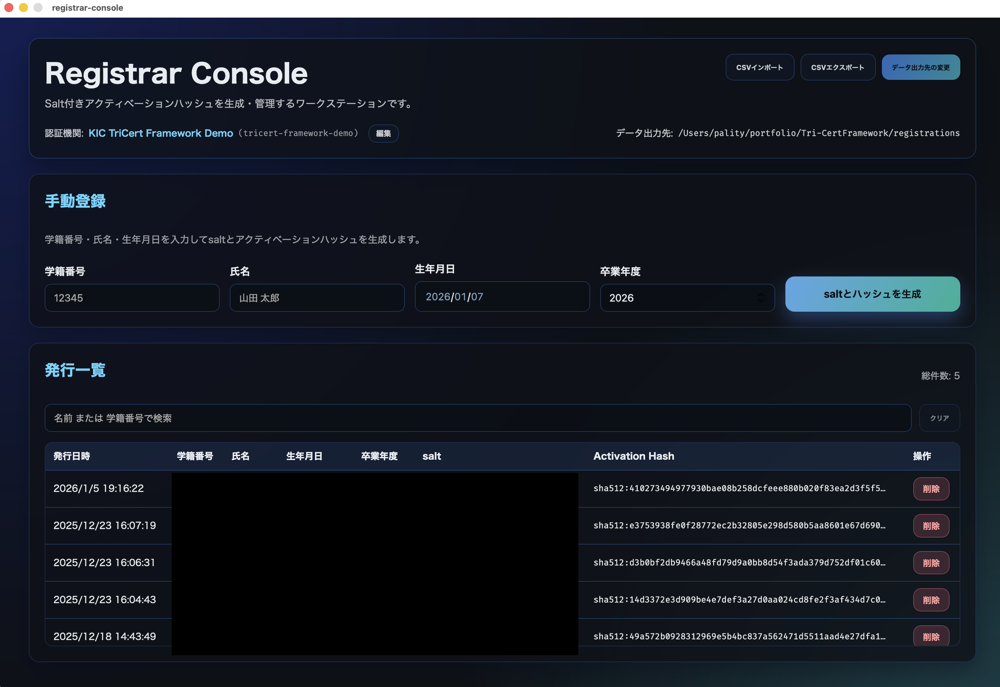

<p align="center"><strong>図3.4: Registrar Console メイン画面</strong></p>

　画面左側に登録フォーム、右側に登録済み学生の一覧が表示される。職員は学籍番号、氏名、生年月日を入力し、「登録」ボタンを押すことで学生をAllowlistに追加する。

### 技術選定

　バックエンド（処理を行う部分）はGo言語、フロントエンド（画面表示部分）はReactで実装した。デスクトップフレームワークにはWailsを採用した。ハッシュ関数にはSHA3-512を使用している。

　Wailsフレームワークを採用した理由は、Goの高速な処理とWebベースのUI開発の柔軟性を両立可能であるためである。また、単一バイナリ（1つの実行ファイル）として配布可能であり、インストールの手間を軽減できる点も利点として挙げられる。

　次節では、Executive Consoleについて説明する。

### 3.2.2 主要機能

　本節では、教務課職員が実際に行う操作と、その結果として生成されるデータの関係を明確にする。

### 学生登録機能

　学生登録の入力データと出力データの詳細な構造は付録Dに示す。本文では、入力が学籍番号・氏名・生年月日・Saltであり、出力としてハッシュ化された登録情報とアクティベーションコードが生成される点に注目する。

### 登録フロー

　図3.5 に登録完了後のアクティベーションコード表示画面を示す。

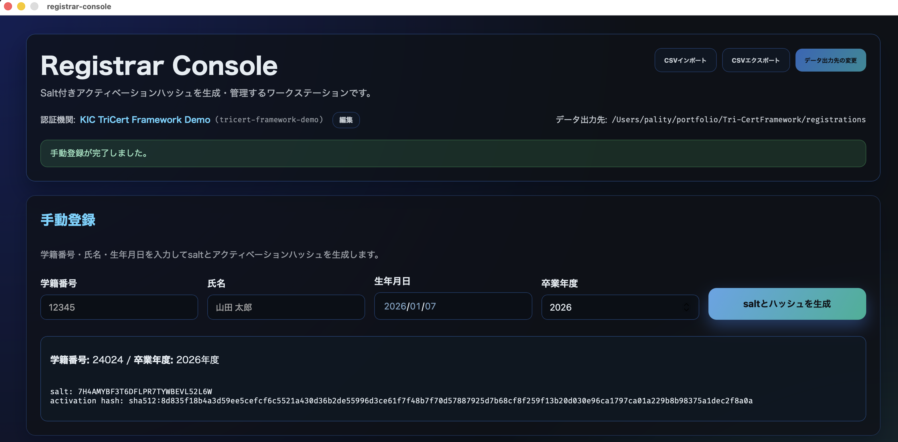

<p align="center"><strong>図3.5: 登録完了・アクティベーションコード表示画面</strong></p>

　登録が完了すると、学生に配布するアクティベーションコード（Salt）が生成される。このアクティベーションコードは学生本人のみに安全な方法で伝達され、証明生成時に必要となる。アクティベーションコードは一度しか表示されないため、職員は学生に確実に伝達する必要がある。

### 学生削除機能

　図3.6 に学生削除画面を示す。

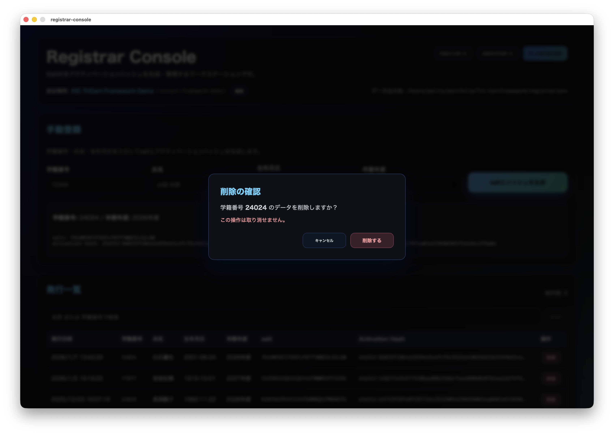

<p align="center"><strong>図3.6: 学生削除確認画面</strong></p>

　誤って登録した学生の削除も可能である。削除時には確認ダイアログが表示され、誤操作を防止する設計となっている。

### 3.2.3 ハッシュ計算アルゴリズム

　ハッシュ計算アルゴリズムの実装例は付録Dに示す。学生の認証に使用するハッシュは、Salt、正規化された氏名・生年月日、および学籍番号から生成される。ここでの狙いは、個人情報そのものを公開せずに「登録済みである」という事実だけを証明できる形に変換することである。

### 3.2.4 Allowlistの構造

　登録情報は`commit-allowlist.json`として公開される。Allowlistファイルの構造例は付録Dに示す。このファイルには個人情報は含まれず、ハッシュ値のみが記録される。検証者にとっては「発行機関が確かに登録した」という公開証拠として機能する。

### 3.2.5 一括登録機能

　大規模な教育機関での運用を想定し、CSVファイルによる一括登録機能を実装している。1名1行のCSVファイルをインポートすることで、複数の学生を一括登録可能である。これは発行機関側の運用負担を抑え、課題2（確認プロセスの非効率）を発行側からも軽減するための設計である。

### CSV一括登録画面

　図3.7 にCSV一括登録画面を示す。

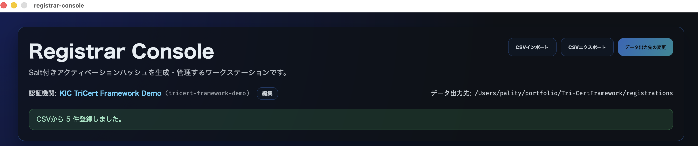

<p align="center"><strong>図3.7: CSV一括登録画面</strong></p>

　CSVファイルの形式は以下の通りである。

```csv
studentId,name,birthdate
24001,山田太郎,1999-04-15
24002,佐藤花子,2000-01-20
24003,鈴木一郎,1999-12-01
```

### 処理フロー

　一括登録は以下の手順で処理される。

1. **CSVパース**: ファイルを読み込み、各行を解析
2. **バリデーション**: 学籍番号の重複チェック、日付形式の検証
3. **ハッシュ計算**: 各学生のactivationHashを計算
4. **アクティベーションコード生成**: 暗号学的に安全な乱数でアクティベーションコード（Salt）を生成
5. **Allowlist更新**: GitHubリポジトリのJSONファイルを更新
6. **結果出力**: 各学生のアクティベーションコードをCSVファイルとして出力

　一括登録完了後、各学生のアクティベーションコードを含むCSVファイルのエクスポートが可能である。このファイルは厳重に管理し、各学生に個別に配布する必要がある。

## 3.3 Executive Console

### 3.3.1 概要

　Executive Console（管理者コンソール）は、ゼロ知識証明の検証鍵（VK）を生成・管理するためのデスクトップアプリケーションである。RustとTauriフレームワークで実装されており、ハードウェアウォレット（Ledger）との連携機能を備える。

　本コンポーネントは**ZKP検証の根拠となる検証鍵を管理する**役割を担う。検証鍵は「この証明は正しい」と判断するための公開根拠であり、発行機関が信頼されるための起点となる。Executive Consoleは、その根拠が改竄されないよう署名し公開する役割を担う。

### 画面構成

　図3.8 にExecutive Consoleのメイン画面を示す。

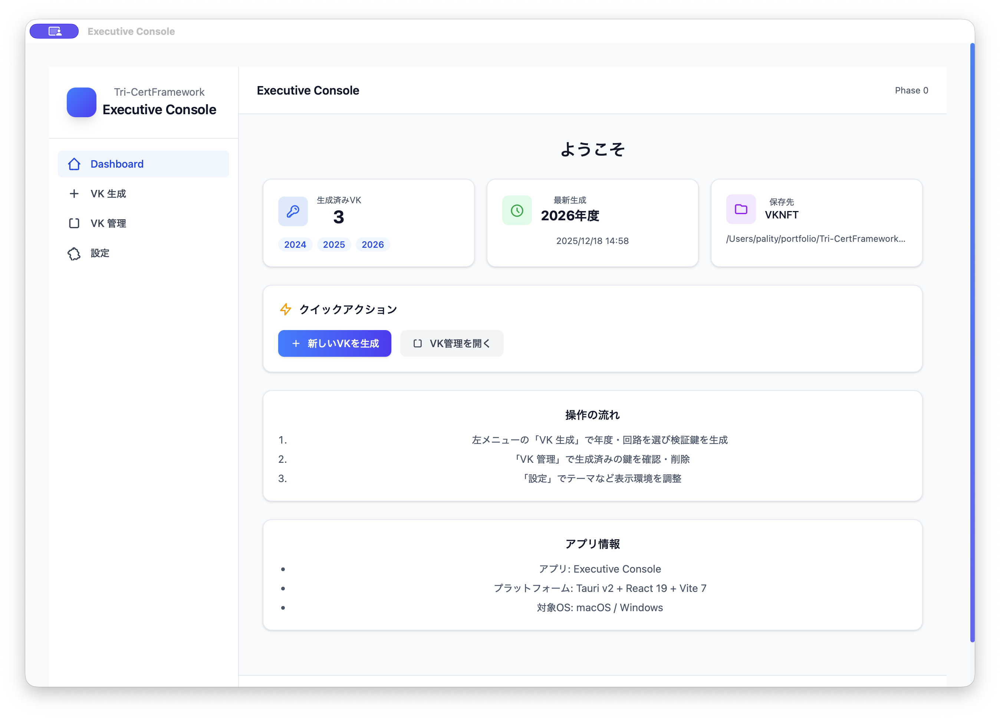

<p align="center"><strong>図3.8: Executive Console メイン画面</strong></p>

　Executive Consoleは以下の3つのタブで構成される。

1. **VK生成タブ**: 年度ごとの検証鍵バンドルを生成
2. **VK管理タブ**: 発行済みの検証鍵を一覧表示・管理
3. **設定タブ**: Ledger接続やGitHub連携の設定

### 技術選定

　バックエンドはRust、フロントエンドはReactで実装した。デスクトップフレームワークにはTauriを採用した。ZKP証明にはGroth16 [8] を使用し、検証鍵への署名にはLedgerハードウェアウォレットを使用している。

　Tauriフレームワークを採用した理由は、Rustのメモリ安全性（プログラムの不具合による情報漏洩を防ぐ性質）とパフォーマンスを活用しつつ、Ledgerとの通信を実装可能であるためである。

　次節では、Prover（証明生成UI）について説明する。

### 3.3.2 VK生成プロセス

　年度ごとの検証鍵を生成するプロセスは以下の通りである。

1. **回路ファイル準備**: Circom[10]で記述されたZKP回路をコンパイル
2. **WASM/ZKey生成**: ブラウザで実行可能なWASMファイルと証明鍵を生成
3. **VKハッシュ計算**: 検証鍵のSHA3-256ハッシュを計算
4. **バンドル作成**: マニフェストファイルとともにZIPアーカイブを作成
5. **Ledger署名**: ハードウェアウォレットでZIPのハッシュに署名

　この手順により、検証鍵の作成過程が第三者に検証可能となり、「発行機関が正当に公開した鍵である」ことを示せる。

### VK生成画面

　図3.9 にVK生成画面を示す。

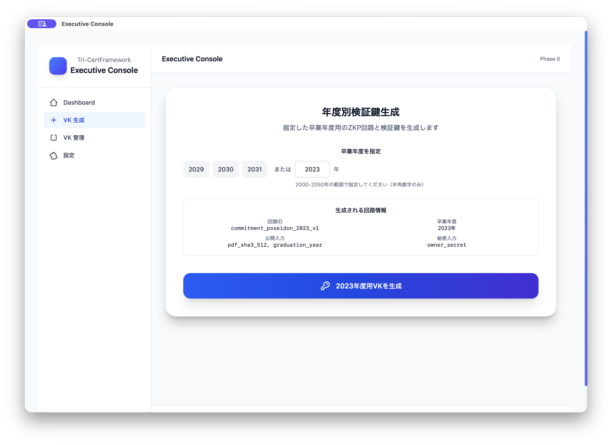

<p align="center"><strong>図3.9: VK生成画面</strong></p>

　管理者は年度を選択し、「生成」ボタンを押すことでVKバンドルの生成を開始する。生成には数分を要し、進捗状況がリアルタイムで表示される。

### バンドル生成完了画面

　図3.10 にバンドル生成完了画面を示す。

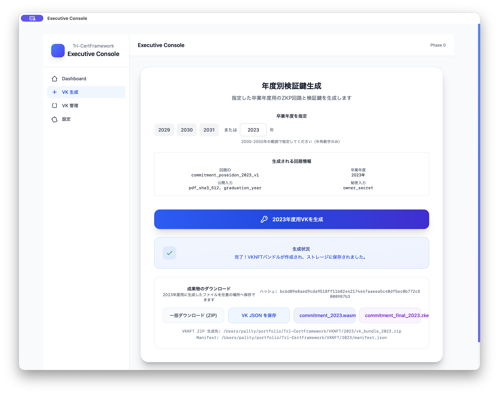

<p align="center"><strong>図3.10: VKバンドル生成完了画面</strong></p>

　生成が完了すると、VKバンドルのハッシュ値とLedger署名が表示される。管理者はこの情報を確認し、GitHubリポジトリにアップロードする。

### Ledger署名プロセス

　VKバンドルの署名には、ハードウェアウォレットLedgerを使用する。図3.11〜3.15 にLedger署名プロセスを示す。

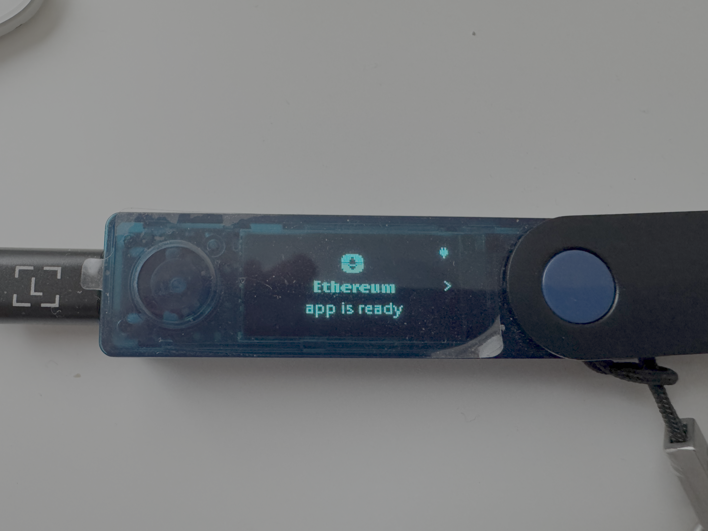

<p align="center"><strong>図3.11: Ledger署名待機画面</strong></p>

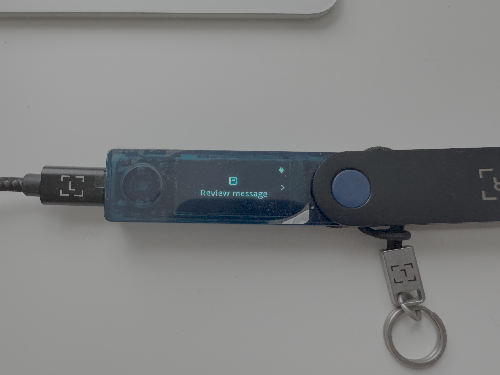

<p align="center"><strong>図3.12: Ledger署名タスク受信</strong></p>

　図3.12に示すように、Ledgerデバイスが接続されると署名タスクがデバイスに送信される。


<p align="center"><strong>図3.13: 署名詳細確認（1/2）</strong></p>

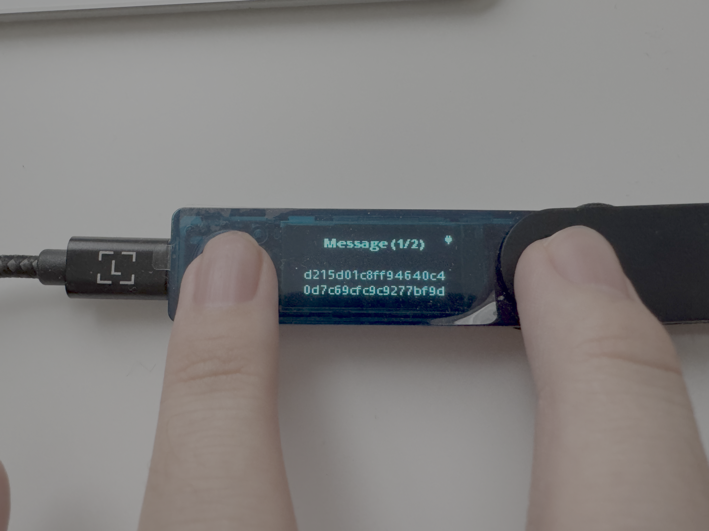

<p align="center"><strong>図3.14: 署名詳細確認（2/2）</strong></p>

　図3.13および図3.14に示すように、管理者はLedgerの画面でハッシュ値を確認し、物理ボタンで署名を承認する。

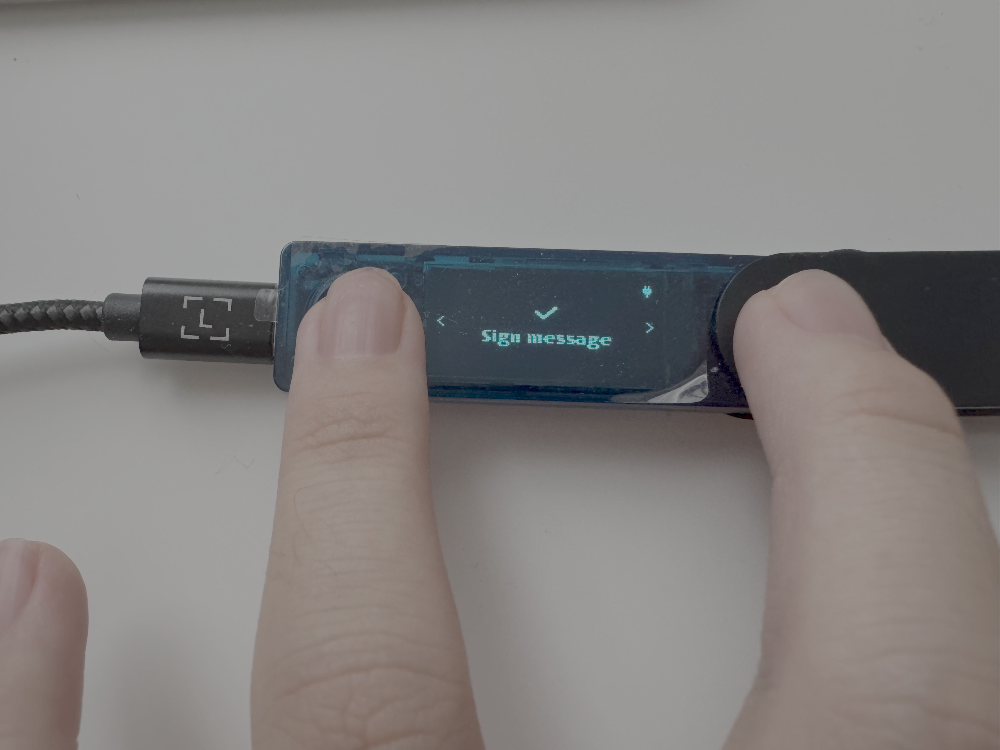

<p align="center"><strong>図3.15: 署名確認</strong></p>

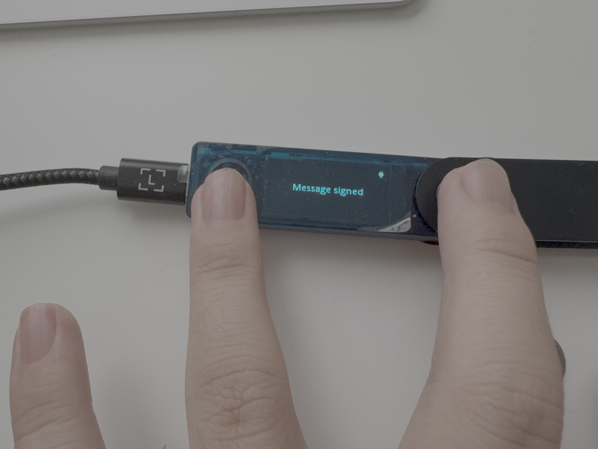

<p align="center"><strong>図3.16: 署名完了</strong></p>

　図3.15で署名の最終確認を行い、図3.16に示す署名完了画面が表示される。この物理的な承認プロセスにより、秘密鍵がLedgerの外部に出ることなく、安全に署名が行われる。

### 署名ログ

　図3.17 に署名処理のログを示す。

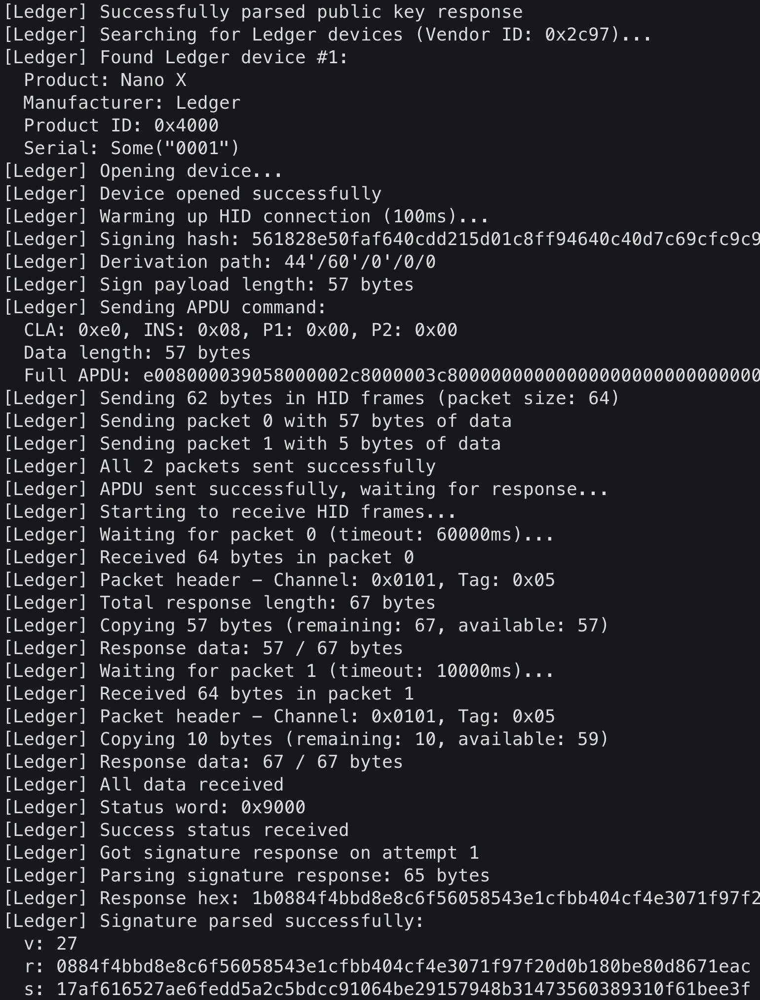

<p align="center"><strong>図3.17: 署名処理ログ</strong></p>

　署名プロセスの各ステップがログに記録され、監査可能性を確保している。

### 3.3.3 VKNFTバンドル構造

　生成された検証鍵は、VKNFT（Verification Key Non-Fungible Token）形式でバンドル化される。ここで「バンドル化」とは、検証に必要な複数のファイル（検証鍵、証明鍵、回路など）を1つのパッケージにまとめることを指す。これにより、検証者は個別のファイルを管理する必要がなくなり、1つのバンドルをダウンロードするだけで検証に必要なすべてのデータが揃う。なお、現時点ではブロックチェーン上のNFTとしての実装は行っていないが、将来的なオンチェーン管理への拡張を想定してこの名称を採用している。一般読者向けには「検証鍵パッケージ」と理解すれば十分である。図3.29にVKNFTバンドルのディレクトリ構造を示す。

```
VKNFT/
└── 2025/
    ├── manifest.json           # メタデータとハッシュ値
    ├── vk_bundle_2025.zip      # 全ファイルのアーカイブ
    ├── vk_bundle_2025.sig      # Ledger署名
    └── files/
        ├── commitment_2025.wasm     # 回路のWASM
        ├── commitment_final_2025.zkey # 証明鍵
        └── vkey_2025.json           # 検証鍵
```

<p align="center"><strong>図3.29: VKNFTバンドルのディレクトリ構造</strong></p>

### 3.3.4 マニフェストファイル

　マニフェストファイルの構造例は付録Eに示す。マニフェストファイルには、ファイルの整合性検証に必要なハッシュ値とLedger署名情報が含まれる。検証者はこの情報を使って「検証鍵が改竄されていない」ことを確認できる。

## 3.4 Prover（証明生成UI）

### 3.4.1 概要

　Prover（証明者アプリケーション）は、学生（証明者）が卒業証明書PDFに対してゼロ知識証明とWebAuthn署名を添付するためのWebアプリケーションである。Next.jsで実装されており、ブラウザ上で動作する。

　本コンポーネントは3層認証の**第2層（内容の完全性）と第3層（所有者の本人性）**を担う。Proverの役割は「内容が改竄されていないこと」と「提示者が本人であること」を同時に担保する証明を生成する点にある。これにより、検証者は証明書の中身を全て見なくても判断できる。

### 画面構成

　図3.18 にProverの初期画面を示す。

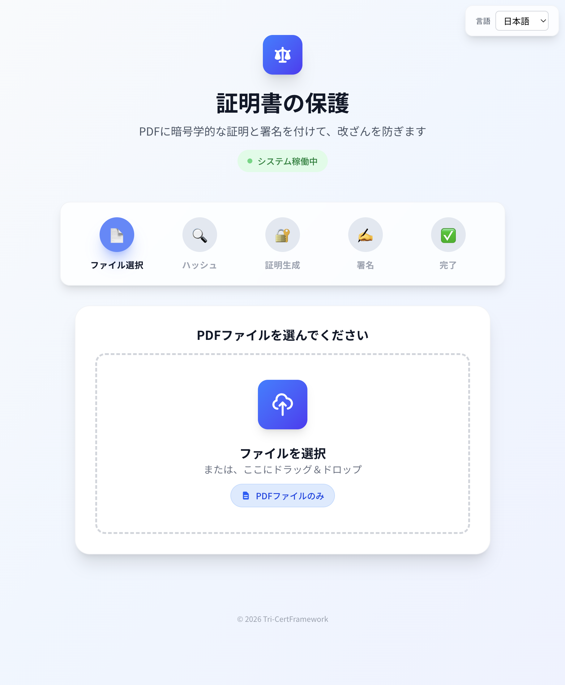

<p align="center"><strong>図3.18: Prover 初期画面</strong></p>

　初期画面では、PDFファイルのドラッグアンドドロップエリアが表示される。ユーザーは卒業証明書のPDFをアップロードすることで、証明生成プロセスを開始する。

### 技術選定

　WebフレームワークにはNext.jsを採用した。ZKP生成にはGroth16 [8] をWebAssembly（Webブラウザ上で高速に動作するプログラム形式）で実行し、署名にはWebAuthn API [12] を使用している。

　Next.jsを採用した理由は、静的サイト生成によりオフラインでも動作可能であり、サーバーへの依存を排除できるためである。

### セキュリティ設計

　Proverはクライアントサイド（利用者のコンピュータ内）で完全に動作し、サーバーに機密情報を送信しない設計である。

- **アクティベーションコード**: ユーザーの入力値はブラウザ内でのみ処理
- **秘密鍵**: WebAuthn認証器（指紋認証やFace IDなどの生体認証デバイス）内で生成・保持
- **PDFコンテンツ**: サーバーにアップロードされない

　この設計により、中間者攻撃（通信の途中で情報を盗み取る攻撃）やサーバー侵害による情報漏洩のリスクを排除している。

　次節では、Verifier UI（検証UI）について説明する。

### 3.4.2 証明生成フロー

　証明生成フローの実装例は付録Fに示す。証明生成は5つのステップで構成される。Step1は発行機関の登録済み確認、Step2は改竄検知、Step3は選択的開示を可能にするZKP生成、Step4は本人性確認、Step5は証明情報の証明書内包（照会不要化）を担当する。

### アクティベーションコード入力画面

　図3.19、図3.20 にアクティベーションコード入力画面を示す。

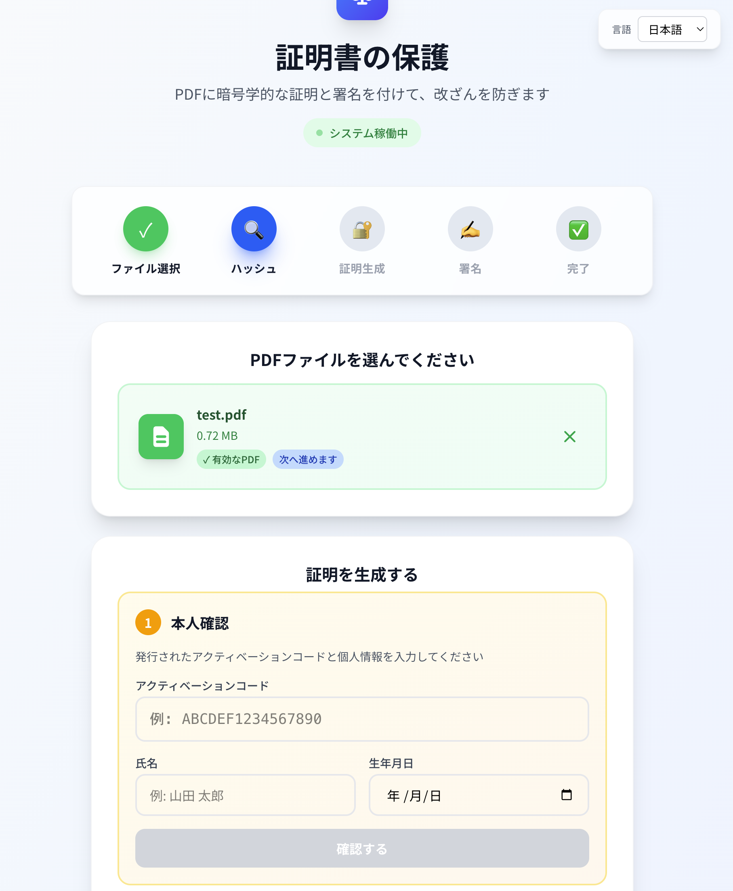

<p align="center"><strong>図3.19: アクティベーションコード入力画面（入力前）</strong></p>

　ユーザーはPDFをアップロード後、教務課から配布されたアクティベーションコード（Salt）を入力する。アクティベーションコードは学籍番号、氏名、生年月日と組み合わせてハッシュ化され、Allowlistとの照合に使用される。

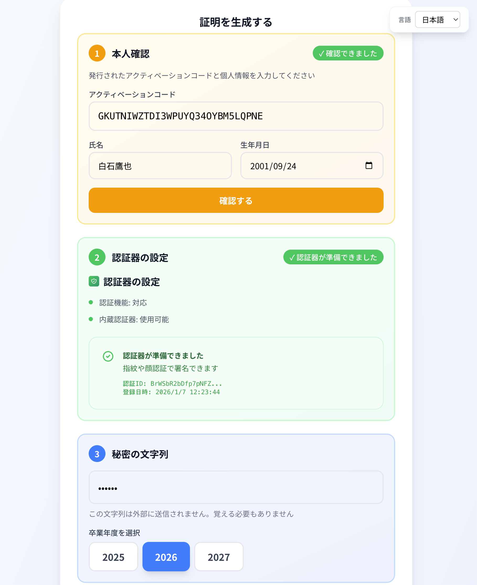

<p align="center"><strong>図3.20: アクティベーションコード入力画面（入力後）</strong></p>

　アクティベーションコードの検証が成功すると、「検証成功」のメッセージが表示され、証明生成ボタンが有効化される。

### WebAuthn認証

　図3.21 にWebAuthn認証ダイアログを示す。

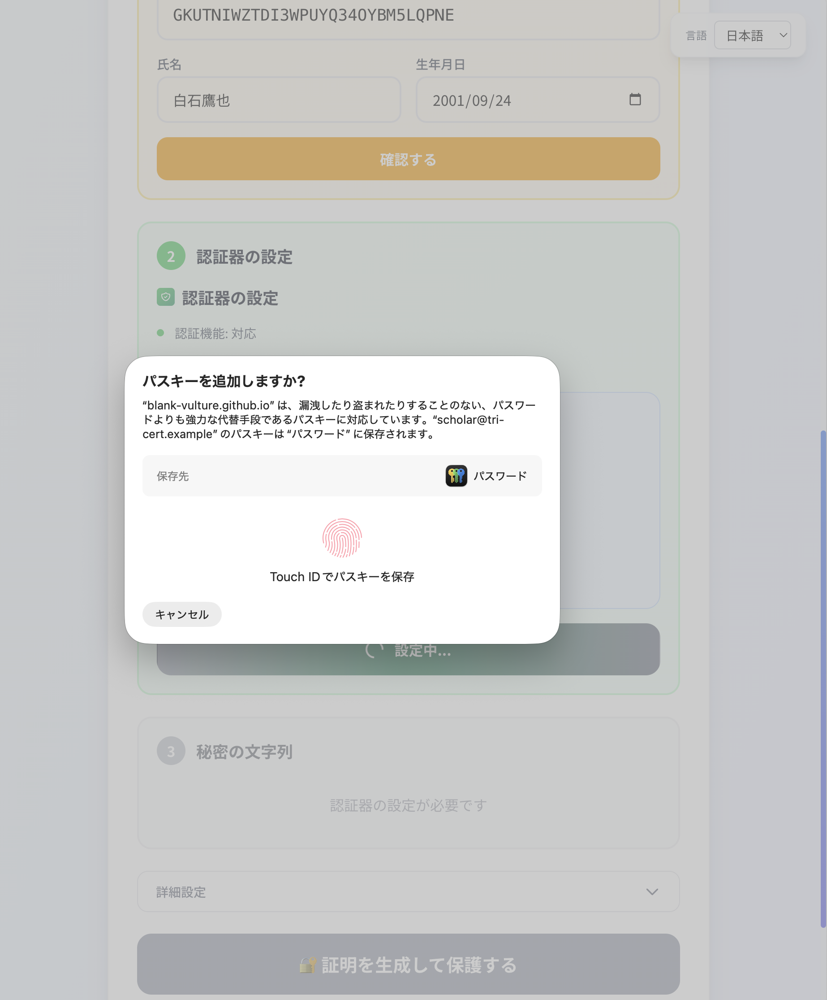

<p align="center"><strong>図3.21: WebAuthn認証ダイアログ</strong></p>

　証明生成時にWebAuthn認証が要求される。ユーザーはTouch ID、Face ID、Windows Hello、またはセキュリティキーを使用して認証を行う。この認証により、証明書の所有者が本人であることが暗号学的に証明される。

### 証明生成完了

　図3.22 に証明生成完了画面を示す。

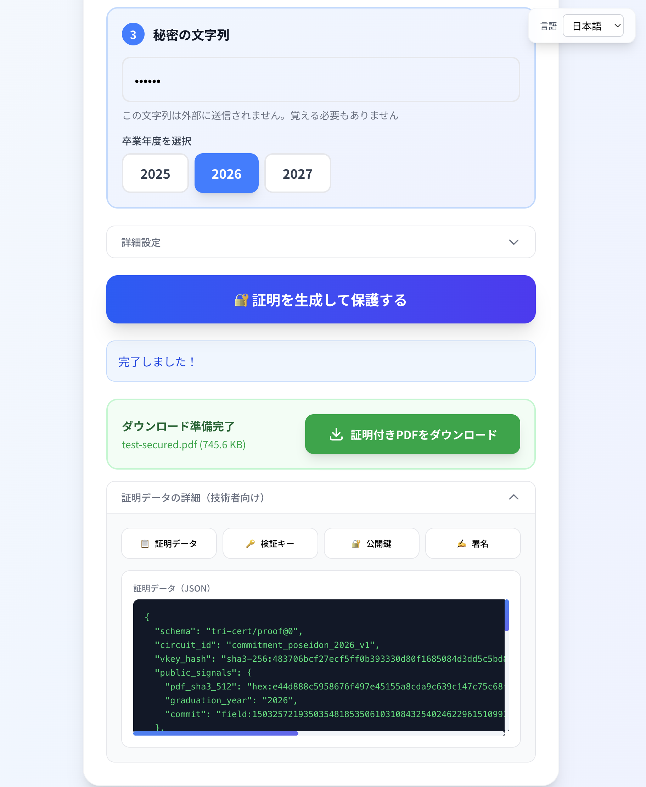

<p align="center"><strong>図3.22: 証明生成完了画面</strong></p>

　証明生成が完了すると、証明付きPDFのダウンロードボタンが表示される。生成されたPDFには、ゼロ知識証明とWebAuthn署名が埋め込まれており、Verifier UIで検証可能である。

### 3.4.3 ZKP回路の設計

　本システムで使用するZKP回路は、Poseidonハッシュ[11]を用いたコミットメントスキームに基づいている。ここで示したい要点は「証明書の内容は隠しつつ、正しい内容であることだけを証明する」点である。回路の概念的構造例は付録Fに示す。

### 3.4.4 PDFへの証明埋め込み

　生成された証明は、PDFのメタデータ（Subject フィールド）にBase64エンコードして埋め込まれる。暗号化されたPDFの場合は、ファイル末尾に追記する方式（tail-append）を使用する。これにより、検証に必要な情報が証明書自身に内包され、発行機関への照会を不要にできる。証明バンドルのインターフェース定義は付録Fに示す。

## 3.5 Verifier UI（検証UI）

### 3.5.1 概要

　Verifier UI（検証者UI）は、証明付きPDFの真正性を検証するためのWebアプリケーションである。Proverと同様にNext.jsで実装されており、オフラインでも動作可能である。

　本コンポーネントは**3層認証のすべての検証を実行する**役割を担う。具体的には以下を検証する。

- **第1層の検証**: 許可リストに登録された正当な学生であるか
- **第2層の検証**: ZKP証明が正しいか（内容が改竄されていないか）
- **第3層の検証**: WebAuthn署名が正しいか（所有者が本人であるか）

　Verifier UIの目的は、非技術者の検証者（例：企業の人事担当者）でも「なぜ信頼できるのか」を理解できる形で結果を提示することにある。
### 画面構成

　図3.23 にVerifier UIの初期画面を示す。

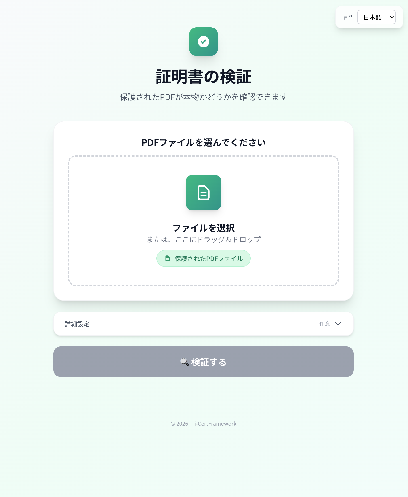

<p align="center"><strong>図3.23: Verifier UI 初期画面</strong></p>

　初期画面では、PDFファイルのアップロードエリアが表示される。検証者（採用担当者など）は、受け取った卒業証明書PDFをアップロードすることで、検証プロセスを開始する。

### 技術選定

　Proverと同様にNext.jsを採用した。ZKP検証はGroth16 [8] をWebAssemblyで実行し、署名検証にはWebCrypto APIを使用している。

### オフライン動作

　Verifier UIはService Worker（ブラウザがオフラインでも動作するための技術）を使用してオフラインでも動作する。検証に必要なファイル（検証鍵、WASM（Webブラウザ上で高速に動作するプログラム形式））は初回アクセス時にキャッシュされ、インターネット接続がない環境でも検証を実行可能である。これは、セキュリティが重視される企業内ネットワークでの運用を想定した設計である。

### 3.5.2 検証プロセス

　検証は以下の5つのステップで行われる。

- データ抽出: PDFから証明データを抽出
- ハッシュ検証: PDFハッシュの一致確認
- ZKP検証: ゼロ知識証明の検証
- 署名検証: WebAuthn署名の検証
- 登録確認: Allowlistとの照合

　この5ステップは、(1)文書が改竄されていないこと、(2)証明が正しいこと、(3)本人性と登録状況が一致することを順に確認する流れである。実装例は付録Gに示す。

### 検証中の画面

　図3.24 に検証中の5ステップ表示を示す。

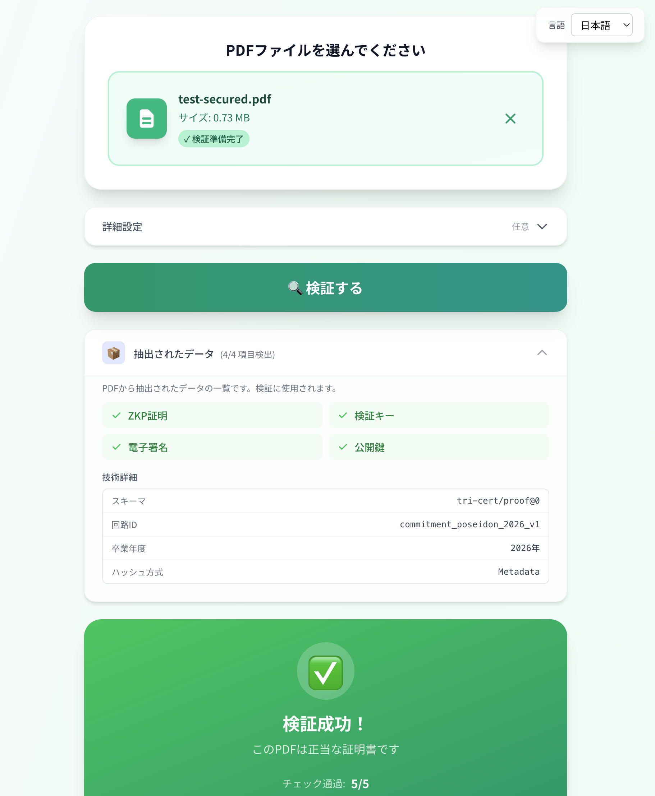

<p align="center"><strong>図3.24: 検証プロセス表示</strong></p>

　検証は自動的に5つのステップを順番に実行する。各ステップの進捗状況がリアルタイムで表示され、ユーザーは検証の進行状況を視覚的に把握可能である。

### 検証成功時の画面

　図3.25 に検証成功時の結果画面を示す。

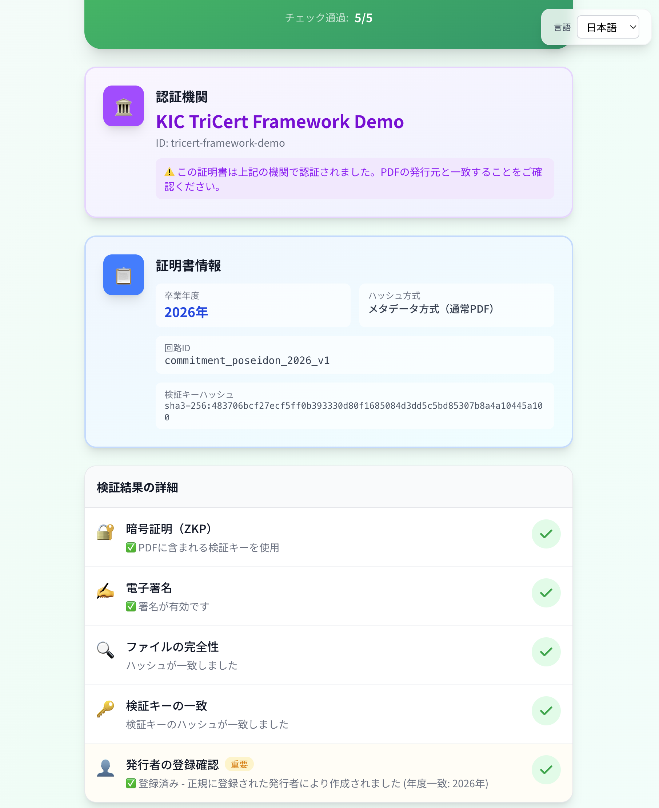

<p align="center"><strong>図3.25: 検証成功画面（詳細情報）</strong></p>

　検証が成功すると、以下の情報が表示される。

- **検証ステータス**: 5つのステップすべてが成功
- **証明書情報**: 卒業年度、発行機関名
- **公開鍵情報**: WebAuthn署名に使用された公開鍵のフィンガープリント

### 検証結果の詳細説明

　図3.26 に検証結果の詳細説明画面を示す。

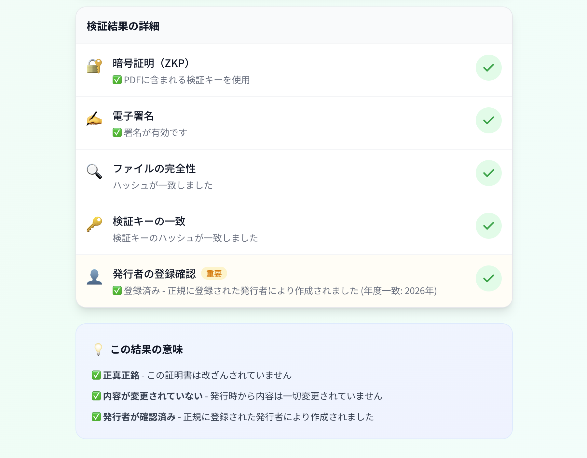

<p align="center"><strong>図3.26: 検証結果の詳細説明</strong></p>

　検証者は各検証ステップの詳細を確認可能である。これにより、非技術者であっても検証結果の意味を理解することが可能となる。

### 検証失敗時の画面

　図3.27、図3.28 に検証失敗時の画面を示す。

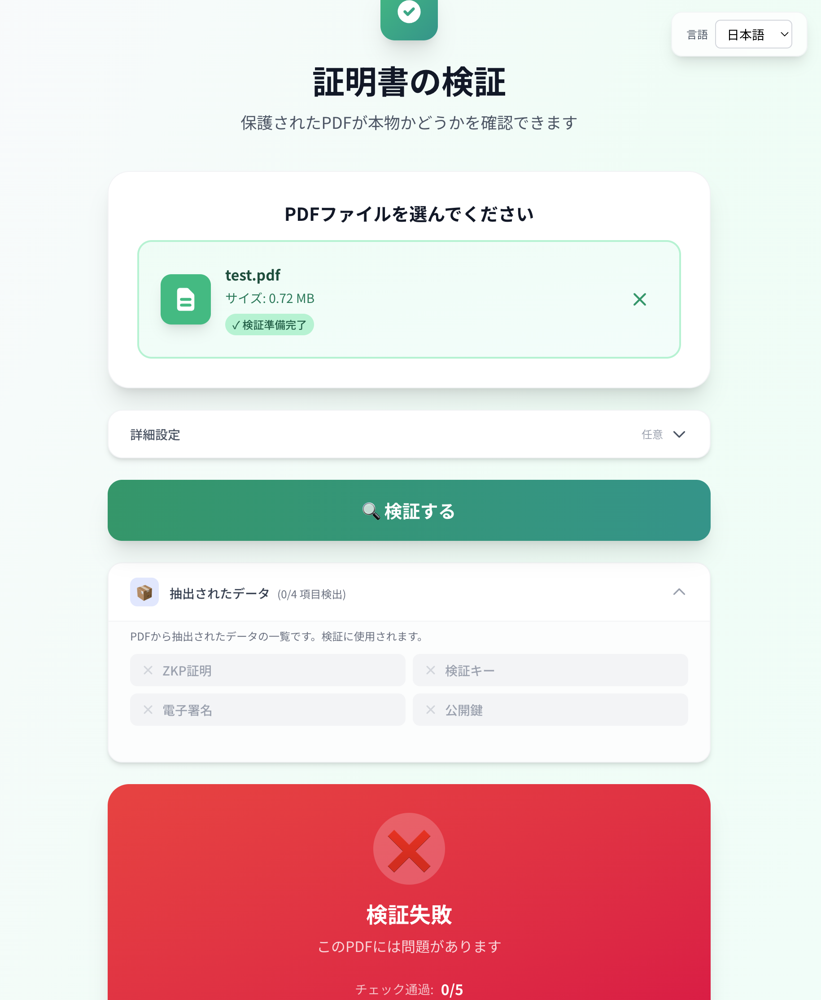

<p align="center"><strong>図3.27: 検証失敗画面（概要）</strong></p>

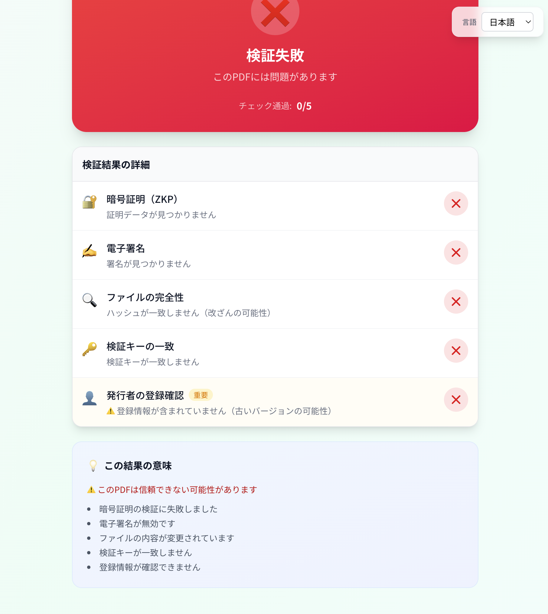

<p align="center"><strong>図3.28: 検証失敗画面（詳細）</strong></p>

　検証が失敗した場合、失敗したステップが明確に表示される。失敗の原因として想定されるケースを表3.6に示す。

<p align="center"><strong>表3.6: 検証失敗時の原因一覧</strong></p>

| 失敗ステップ | 考えられる原因 |
|------------|--------------|
| データ抽出 | PDFが証明付きでない、またはファイルが破損 |
| ハッシュ検証 | PDFが改竄されている |
| ZKP検証 | 証明データが不正、または検証鍵が不一致 |
| 署名検証 | 署名が無効、または公開鍵が改竄されている |
| 登録確認 | Allowlistに登録されていない |

### 3.5.3 ZKP検証

　Groth16[8]証明の検証は、snarkjs[9]ライブラリを使用して行われる。ここで確認しているのは「証明書の中身を開示せずに、改竄されていないことを示せるか」である。実装例は付録Gに示す。

### 3.5.4 WebAuthn署名検証

　WebAuthn[12]署名の検証は、クライアントサイドで完結する。ここでは「証明書を提示している人物が本人であるか」を確認する。実装例は付録Gに示す。

## 3.6 データ構造とプロトコル

### 3.6.1 証明データスキーマ

　本システムで使用する主要なデータスキーマ（データの構造定義）は付録Hに示す。スキーマを明示することで、誰が検証しても同じ手順で確認できる状態を確保する。

　**証明データ (proof.json)**

　証明データは、証明に必要な公開情報と署名情報をまとめた構造である。この証明データの各要素と3層認証の対応は以下の通りである。

- **activation_hash**: 第1層（発行元の正当性）の検証に使用。許可リストとの照合に用いる
- **zkp_proof**: 第2層（内容の完全性）の検証に使用。ZKP証明データ本体
- **webauthn_signature**: 第3層（所有者の本人性）の検証に使用。生体認証による署名

　**署名ターゲット (sig_target.json)**

　署名ターゲットは、WebAuthn署名の検証に必要な情報を固定化した構造である。

### 3.6.2 ハッシュアルゴリズム

　本システムでは、表3.7に示すように用途に応じて複数のハッシュアルゴリズムを使用している。目的は「安全性」と「実用速度」を両立させることである。

<p align="center"><strong>表3.7: ハッシュアルゴリズムの使い分け</strong></p>

| 用途 | アルゴリズム | 理由 |
|------|-------------|------|
| PDFハッシュ | SHA3-512 | 高いセキュリティ強度、量子耐性への備え |
| VKハッシュ | SHA3-256 | 十分なセキュリティと簡潔さのバランス |
| 学生ID/Activation | SHA-512 | 広く実装されており、十分な強度 |
| ZKP内部 | Poseidon | ZKP回路に最適化された構造 |

### 3.6.3 国際化対応

　ProverおよびVerifier UIは、日本語と英語の2言語に対応している。翻訳データはJSONファイルで管理され、動的な切り替えが可能である。導入先の多様性を想定し、非技術者でも理解しやすい表示を維持するための設計である。

### 本章のまとめ

　本章では、Tri-CertFrameworkの設計原則とアーキテクチャ、3層認証、各コンポーネントの実装を示した。発行機関・本人・検証者の役割を分離しつつ、照会不要と本人性確認を両立する設計であることを明確にした。


---

# 第4章 検証

## 4.1 検証方法

### 4.1.1 検証手順

　本システムの検証は、第1章で設定した定量目標（安全性・検証時間・開示項目数）に対して、実際に達成できているかを確認することを目的とする。各検証項目と第1章の目標との対応を表4.1に示す。

<p align="center"><strong>表4.1: 検証項目と第1章の目標との対応</strong></p>

| 検証項目 | 対応する目標 | 対応する課題 |
|---------|------------|------------|
| セキュリティ評価 | 安全性 | 課題1（真正性の担保が脆弱） |
| 性能評価（検証時間） | 検証時間5秒以内 | 課題2（確認プロセスが非効率） |
| 開示項目数の確認 | 開示項目数3以下 | 課題3（過度な個人情報の開示） |

　検証は以下の手順で実施した。

1. 発行機関の担当者がRegistrar Consoleを使用し、テスト用の学生データを登録する
2. 学生が生成されたアクティベーションコード（Salt）を用いて、Proverにおいて証明ファイル付きPDFを作成する
3. 検証者（企業担当者等）が作成されたPDFをVerifier UIで検証する
4. 利用者（学生視点）および検証者（企業視点）の双方の観点から、システムのUI/UXに関するフィードバックを収集する

### 4.1.2 協力者

　本検証にあたり、以下の協力者の参加を得た。

- **協力者A**: 医療関連資格確認業務における実務経験を有する
- **協力者B**: 学生および企業双方の立場に対する深い理解を有する
- **協力者C**: 現役会社員として営業・技術両面の知見を有する
- **協力者D**: セキュリティ分野に精通している

　協力者は「利用者視点」「検証者視点」「セキュリティ視点」をバランスよく含むよう選定した。非技術者による理解度の確認を重視している。

## 4.2 検証結果

### 4.2.1 システム利用体験後のフィードバック

　本節では、非技術者が「理解できるか」「信頼できると感じるか」という観点からの評価を整理する。

　定量評価には5段階評価を使用した。各スコアの定義は以下の通りである。

<p align="center"><strong>表4.2: 5段階評価の定義</strong></p>

| スコア | 定義 | 判断基準 |
|--------|------|----------|
| 5 | 非常に良い | 改善点がなく、そのまま実用可能 |
| 4 | 良い | 軽微な改善点はあるが、実用上は問題ない |
| 3 | 普通 | 使用可能だが、改善が望ましい |
| 2 | やや悪い | 使用に支障があり、改善が必要 |
| 1 | 悪い | 使用困難であり、根本的な改善が必要 |

　評価項目は「理解しやすさ」（UIの説明が分かりやすいか）と「操作しやすさ」（迷わずに操作を完了できるか）の2軸で、ProverとVerifierそれぞれについて評価を依頼した。

　**協力者A**

　**初見時の所感**
> 「できた！これは安心できるね」

　**肯定的評価**
- 本人がこのPDFを厚生労働省の専用ページへアップロードすることで届出が可能となれば、煩雑な事務処理を大幅に削減できる
- 現在、資格確認はExcelシートによる代行手続きが導入されたばかりであり、エラーの多発により現場は混乱している。本システムが資格確認の標準となれば、実務負担のみならず心理的負担も軽減される可能性がある

　**今後への期待**
- 証明ファイル付きPDFは、現在在職中の看護師全員を初回登録する際には負担が生じるものの、一度作成すれば期限付きの資格ではないため、以降は新入職者のみを登録すればよい
- 退職時に証明書の有効期限が失効するシステムであれば、より実用的である

　**懸念点**
- 大規模病院等における1000人規模の届出に対応可能かという疑問が残る

　**懸念への対応**
- アクティベーションコードは1名1行のCSV形式で一括発行できる設計としている
- 1000人分を手書きで処理する場合と比較して、事務担当者の負担軽減につながるとの評価を得た
- 定期的に証明書の有効期限が満了する設計を採用し、管理ソフトから登録を抹消することでアクティベーションコードが無効となる機能を実装済みである

---

　**協力者B**

　表4.3に定量評価（5段階評価）の結果を示す。

<p align="center"><strong>表4.3: 協力者Bによるシステム評価</strong></p>

| 評価項目 | スコア |
|---------|--------|
| Proverの理解しやすさ | 4 / 5 |
| Proverの操作しやすさ | 5 / 5 |
| Verifierの理解しやすさ | 4 / 5 |
| Verifierの操作しやすさ | 5 / 5 |

　**肯定的評価**
- 円滑に動作した

　**懸念点**
- ガイドのみでは仕組みの理解が困難である可能性がある
- ZKP等の複雑な技術を簡潔に説明することは困難である

　**今後への期待**
- 応用例（他分野への適用可能性）の拡大

---

　**協力者C**

　表4.4に定量評価（5段階評価）の結果を示す。

<p align="center"><strong>表4.4: 協力者Cによるシステム評価</strong></p>

| 評価項目 | スコア |
|---------|--------|
| Proverの理解しやすさ | 4 / 5 |
| Proverの操作しやすさ | 2.5 / 5 |
| Verifierの理解しやすさ | 2 / 5 |
| Verifierの操作しやすさ | 5 / 5 |

　**肯定的評価**
- ステップ形式で進行し、各タスクの完了後に自動的に次のステップへ遷移するため、操作手順が明確である

　**改善要望**

　*Prover関連:*
- 氏名入力時に姓と名の間に空白を挿入しないことを明記する必要がある
- 認証器を使用できない環境ではProverが利用不可であることを明記する必要がある
- 「ファイルを選択」ボタンがタップ可能であることが視認しにくい（アイコンの拡大、PDFファイルのみ受付可能である旨の明示等）
- 生年月日の入力が煩雑である（年・月・日を一括入力可能なUIが望ましい）
- 日付選択時に再選択が必要となる点が円滑な操作の妨げとなる

　*Verifier関連:*
- 応募者の学歴を検証する立場（人事担当者）として、教育機関もTri-Cert Frameworkを導入しているという実感を得られる表示が必要である
- Proverで付与された証明ファイルが信頼に値する理由が不明確である
- 「オープンソースであるため安全である」という説明は、非エンジニアには理解しにくい
- 発行機関が学生をシステムに登録した事実を明示する必要がある
- 契約者情報（教育機関側と取り決めた公開情報）の表示が必要である（例：神戸情報大学院大学 学生課 電話番号）

---

　**協力者D**

　協力者Dからのフィードバックは、本論文の執筆期間内に得られなかった。スケジュール調整を試みたが、協力者の業務都合により期限内での評価実施が困難であった。

### 4.2.2 性能評価

　第1章で設定した「検証時間5秒以内」という目標に対し、実測値を用いて達成度を確認する。

<p align="center"><strong>表4.5: 検証時間の比較</strong></p>

| 検証方法 | 所要時間 | 備考 |
|---------|---------|------|
| 従来（郵送照会） | 1〜2週間 | 手数料も発生 |
| 従来（電話照会） | 数日 | 担当者不在時は遅延 |
| 本システム | **約3秒** | オフライン可能 |

　本システムの処理時間の内訳を表4.6に示す。証明生成（Prover）と検証（Verifier）では処理内容が異なるため、それぞれの時間を計測した。測定環境はMacBook Pro（M1チップ）、Chrome 120で、5回の試行の平均値である。

<p align="center"><strong>表4.6: 本システムの処理時間内訳</strong></p>

| 処理 | 所要時間 | 内容 |
|------|---------|------|
| 証明生成（Prover側） | 約2〜3秒 | PDFハッシュ計算、ZKP証明生成、WebAuthn署名 |
| 検証処理（Verifier側） | 約0.5〜1秒 | ZKP検証、署名検証、登録確認 |
| **全体プロセス** | **約3秒** | 証明生成から検証完了まで |

　検証処理のみに着目すると約0.5〜1秒で完了するが、本論文では利用者の体験全体を考慮し、「約3秒」を代表値として使用する。

### 4.2.3 検証結果の総括

　本節では、4.2.1節および4.2.2節で示したフィードバックと性能評価の結果を総括し、本システムの評価を行う。評価の軸は「定量目標の達成」と「非技術者にとっての理解可能性」の2点である。

### 協力者の属性と評価傾向

　表4.7に示すように、協力者の属性によって評価の観点と傾向に明確な違いが見られた。

<p align="center"><strong>表4.7: 協力者属性と評価傾向の対応</strong></p>

| 協力者 | 属性 | 評価傾向 |
|-------|------|---------|
| A | 医療関連資格確認業務の実務者 | 実務視点で高評価。大規模運用への懸念はあるが、CSV一括発行機能により解消 |
| B | 学生・企業双方の視点を持つ | 操作性は高評価（5/5）。技術説明の難しさを指摘 |
| C | 営業・技術両面の知見を持つ会社員 | UX面で詳細な改善要望。非エンジニアへの説明性を重視 |

### プロトタイプとしての達成度

　本検証を通じて、以下の点が確認された。

　**核心機能の動作確認**: ZKP証明生成・検証、WebAuthn署名、登録確認という3層認証の核心機能は、全協力者において正常に動作した。これにより、技術的実証としては成功したと評価できる。

　**実務適用への可能性**: 協力者Aからは「現在の資格確認はExcelシートによる代行手続きでエラーが多発している。本システムが標準となれば、実務負担のみならず心理的負担も軽減される」との評価を得た。これは、本システムが単なる技術実証を超え、実務における課題解決に貢献しうることを示している。

　**UIの洗練は今後の課題**: 協力者Cからは具体的なUI改善要望が多数寄せられた。これらは今後の実用化に向けて対応すべき課題である。

### 「最小限開示」と「信頼の可視化」のトレードオフ

　本検証において、協力者Cから発行機関情報の表示を求める要望が寄せられた。具体的には、「発行機関が学生をシステムに登録した事実を明示する必要がある」「契約者情報（教育機関側と取り決めた公開情報）の表示が必要である」という指摘である。

　これは一見、本研究の「必要最小限の情報開示」という設計思想と矛盾するように思われる。本システムはZKPを用いて「検証に必要な情報のみを開示する」という原則に基づいて設計されているからである。

　しかし、詳細な分析の結果、このトレードオフは見かけ上のものであることが判明した。協力者Cが求める「発行機関の公開情報」は、学生個人のプライバシーとは無関係な情報である。発行機関名、公式HP URL、問い合わせ先電話番号などは元来公開されている情報であり、これを検証結果に併記しても保持者のプライバシーは一切侵害されない。

　すなわち、ZKPが保護すべき対象は「証明書保持者の個人情報」であり、発行機関の公開情報はこの保護対象に含まれない。「表示情報を増やす」ことと「プライバシーを保護する」ことは、保護対象のレイヤーが異なるため両立可能である。

　この知見は、プライバシー保護技術の実用化において重要な示唆を与える。技術的な設計思想（最小限開示）とユーザーの心理的安心感（信頼の可視化）は、保護対象を明確に区別することで両立できる。具体的には、検証成功画面に発行機関名、公式HP URL、問い合わせ先を表示することで、技術に詳しくない検証者でも「この証明書の出所を確認できる」という安心感を得られる設計が可能である。

### 当初課題に対する解決状況

　第1章で提示した3つの課題に対して、本システムがどのように改善をもたらしたかを表4.8に整理する。

<p align="center"><strong>表4.8: 当初課題と本システムによる解決</strong></p>

| 当初の課題 | 従来の問題 | 本システムによる解決 | 検証での確認結果 |
|-----------|-----------|-------------------|-----------------|
| 課題1: 真正性の担保が脆弱 | 目視確認では偽造を見破れない | ZKPによる暗号学的な改竄検知 | 全協力者でZKP検証が正常動作。改竄されたPDFは即座に検出 |
| 課題2: 確認プロセスが非効率 | 照会に1〜2週間、手数料発生 | オンラインで即時・無料の検証 | 検証時間は約3秒（表4.6参照）。協力者Aより「業務効率化に貢献」との評価 |
| 課題3: 過度な個人情報開示 | 検証に不要な情報まで開示 | ZKPで必要最小限の情報のみ証明 | 検証者に開示されるのは「卒業年度」と「登録済み」の事実のみ |

　**課題1（真正性の担保）への対応:**

　従来の紙やPDFによる証明書は、目視確認に依存していたため、精巧な偽造を見破ることが困難であった。本システムでは、3層認証（発行機関による登録、ZKP、WebAuthn署名）により、証明書の真正性を暗号学的に保証する。検証時には、ZKP証明の数学的検証、WebAuthn署名の検証、許可リストへの登録確認が自動的に行われ、いずれか一つでも不正があれば検証は失敗する。

　**課題2（確認プロセスの非効率性）への対応:**

　従来は発行元への直接照会が必要であり、郵送での確認には1〜2週間を要し、手数料も発生していた。本システムでは、検証者がWebブラウザ上でPDFをアップロードするだけで、即時に検証結果が得られる。発行機関への問い合わせは不要であり、24時間365日、無料で検証が可能である。性能評価の結果、全体プロセスで約3秒（検証処理のみでは約0.5〜1秒）であり、実務における時間的・金銭的コストを大幅に削減できることが確認された。

　**課題3（過度な個人情報開示）への対応:**

　従来は、卒業の事実を確認するためだけに成績証明書の提出を求められるなど、検証に不要な個人情報まで開示させられる問題があった。本システムでは、ZKPの特性を活用し、検証に必要な情報（証明書が正当であること）のみを証明し、それ以外の情報（氏名、学籍番号、成績など）は一切開示されない。検証者が確認できるのは「卒業年度」と「発行機関に登録されている」という事実のみである。

### 定量的目標の達成度

　第1章（表1.3）で設定した定量的目標に対する達成状況を表4.9に示す。

<p align="center"><strong>表4.9: 定量的目標の達成状況</strong></p>

| 目標項目 | 目標値 | 検証結果 | 達成状況 |
|---------|--------|---------|---------|
| 真正性の担保（セキュリティ） | 128ビット以上 | Groth16（BN128曲線）により128ビットの計算量的安全性を達成 | **達成** |
| 確認プロセスの効率化（検証時間） | 5秒以内 | 約3秒（表4.6参照） | **達成** |
| 個人情報開示の最小化（開示項目数） | 2項目以下 | 卒業年度・登録状態の2項目のみ | **達成** |

　3つの定量的目標すべてにおいて、設定した基準を満たすことが確認された。

#### これらの達成が意味すること

　技術的な数字だけでは、本システムの価値が伝わりにくい。以下に、各目標達成の社会的意義を示す。

<p align="center"><strong>表4.10: 定量目標達成の社会的意義</strong></p>

| 従来の方法 | 本システム | 社会的意義 |
|-----------|----------|-----------|
| 検証に1〜2週間、手数料1,000〜3,000円 | 約3秒、無料 | 採用業務が劇的に効率化。100人の応募者全員の学歴を即日確認可能 |
| 成績・学籍番号など全情報を開示 | 卒業年度のみ | プライバシーが守られる。採用判断への不適切なバイアスを排除 |
| 目視確認で偽造を見破れない | 数学的に偽造不可能 | 安心して信頼できる。詐称リスクを根本的に解消 |

### 総合評価

　以上の検証結果から、本システムは以下のように評価される。

1. **技術的実証**: 成功。3層認証の核心機能は全協力者で正常動作
2. **定量的目標の達成**: 達成。3項目すべてで目標値をクリア（表4.9）
3. **実用可能性**: 高い。実務者からは業務効率化への期待が示された
4. **UI/UX**: 改善の余地あり。特に非エンジニア向けの説明性向上が課題
5. **設計思想の妥当性**: 確認。プライバシー保護と信頼性の両立は、保護対象の明確化により実現可能
6. **当初課題の解決**: 第1章で提示した3つの課題すべてに対して、技術的解決策を提示し、その有効性を検証で確認

## 4.3 セキュリティ評価

### 4.3.1 脅威モデル

　前節までに述べたユーザー評価は、本システムの操作性や実用可能性に関する評価であった。しかし、本システムは証明書の真正性検証を目的としており、その性質上セキュリティの確保が極めて重要である。ユーザビリティが優れていても、セキュリティ上の脆弱性が存在すれば証明書システムとしての信頼性は担保されない。したがって本節では、ユーザー評価とは別の観点から、本システムのセキュリティ特性について独自の評価を行う。

　本システムのセキュリティ評価にあたり、以下の脅威モデルを想定する。非技術者向けに言えば「どのような不正が起き得るか」を整理したものである。

1. **攻撃者A1（外部攻撃者）**: 正当な証明書を保持しない第三者が、偽造証明書の作成を試みる
2. **攻撃者A2（内部攻撃者）**: 正当な証明書を保持する学生が、他者の証明書の偽造を試みる
3. **攻撃者A3（サーバー侵害者）**: GitHubリポジトリまたはVKNFTディレクトリの改竄を試みる

### 4.3.2 セキュリティ保証

　本節の要点は、現実的な計算時間では偽造が成立しないという点にある。第3章で述べた3層認証により、以下の安全性が達成された。

　**ZKPによる偽造防止（第2層の保証）**

　Groth16の健全性（Soundness）[8]により、正しいowner_secretを知らない攻撃者が有効な証明を生成することは計算量的に不可能である。

　攻撃成功確率は128ビットのセキュリティパラメータでは2^-128以下である。この数字を具体的に言うと、偽造が成功する確率は「宝くじに100回連続で当選する」よりもはるかに低い。現在の最高性能のスーパーコンピュータを使っても、攻撃が成功するまでに宇宙の年齢（約138億年）以上の時間を要する。つまり、実質的に「偽造は不可能」と考えて問題ない。

　**WebAuthnによる本人確認（第3層の保証）**

　WebAuthn/FIDO2[12]による署名は、認証器（指紋認証やFace IDなどの生体認証デバイス）内で生成された秘密鍵でのみ作成可能である。認証器から秘密鍵を抽出することは、ハードウェアレベルで防止されている。

　**Ledger署名によるVK保護（検証基盤の保証）**

　Executive Consoleで生成されるVK（検証鍵）はLedgerハードウェアウォレットで署名されており、攻撃者がVKを改竄しても署名検証に失敗する。

　これらの保証に基づき、表4.11に想定される攻撃シナリオと対策を示す。

### 4.3.3 攻撃シナリオ分析

<p align="center"><strong>表4.11: 攻撃シナリオと対策</strong></p>

| 攻撃シナリオ | 対策 | 残存リスク |
|-------------|------|-----------|
| 偽のZKP証明生成 | Groth16の健全性 | 計算量的に不可能 |
| WebAuthn署名偽造 | FIDO2ハードウェア保護 | 認証器の物理的盗難 |
| VKの改竄 | Ledger署名検証 | Ledger秘密鍵の漏洩 |
| Allowlistの改竄 | Git履歴による監査 | GitHubアカウント侵害 |

　表4.11は、想定される不正を「どこで止めるか」という視点で整理したものである。残存リスクは運用上の対策で補完する必要がある。

## 4.4 既存手法との比較

### 4.4.1 比較対象

　本システムを以下の既存手法と比較し、その結果を表4.12に示す。

1. **従来のPKI署名**: X.509証明書[4]による電子署名
2. **Blockcerts**: ブロックチェーン基盤の証明書システム[5]
3. **Open Badges 3.0**: Verifiable Credentials（検証可能な資格情報）に基づくデジタルバッジ[3]

　比較の観点は、第1章で示した課題（改竄検知・効率・最小開示・本人性）にどれだけ対応できるかである。

### 4.4.2 比較結果

　表4.12は、検証者の実務上の利得（速さ・わかりやすさ・本人性確認）に焦点を当てて整理したものである。

<p align="center"><strong>表4.12: 既存手法との比較</strong></p>

| 評価項目 | PKI署名 | Blockcerts | Open Badges | Tri-Cert |
|---------|---------|------------|-------------|----------|
| オフライン検証 | △ (失効確認に通信必要) | ○ | △ | ○ |
| プライバシー保護 | × | △ | △ | ○ |
| 中央集権依存度 | 高 | 低 | 中 | 低 |
| 実装複雑度 | 低 | 高 | 中 | 中 |
| 本人確認機能 | × | × | × | ○ |
| 長期保存性 | △ | ○ | △ | ○ |

### 4.4.3 本システムの優位性

　本システムの既存手法に対する優位性を以下に示す。

1. **ゼロ知識証明によるプライバシー保護**: 他の手法では実現困難な、暗号学的に保証されたプライバシー保護を提供する
2. **WebAuthn統合による本人確認**: 証明書の所有者が本人であることを同時に証明することが可能である
3. **ハードウェアセキュリティ**: LedgerおよびFIDO2認証器による多層的なセキュリティを実現する
4. **GitHubベースの分散性**: 特別なインフラストラクチャを必要とせず、標準的なWeb技術のみで検証が可能である

　以上は、第1章で掲げた課題と定量目標を同時に満たすための優位性である。

### 本章のまとめ

　本章では、性能評価とユーザー評価を通じて、定量目標の達成と実務上の有効性を確認した。特に「検証時間」「本人性の担保」「最小開示」の三点で、目標が達成されることを示した。


---

# 第5章 考察

## 5.1 プライバシー保護の観点

### 5.1.1 最小限情報開示の原則

　本システムは、プライバシー・バイ・デザインの原則に基づき設計されている。

1. **公開されるデータ**: ハッシュ値のみ（activation_hash, student_id_hash）
2. **証明に含まれる情報**: コミットメント値と証明（元データは含まれない）
3. **検証時に必要な情報**: PDF本体と証明データのみ

　これにより、第1章で述べた「課題3: 過度な個人情報の開示」を解決している。従来、卒業の事実を確認するためだけに成績証明書の提出を求められるといった問題が存在したが、本システムではそのような過度な情報開示は発生しない。結果として、検証者の判断に不要な情報が混入しにくくなり、公平性の確保にも寄与する。

### 5.1.2 リンカビリティ分析

　プライバシー上の重要な考慮事項として、リンカビリティ（紐付け可能性）の分析を行った。本分析におけるリンカビリティとは、別々の証明書から「同一人物だ」と推測できてしまうリスクを指す。具体例として、同じ印鑑を複数の契約書に押印すると、「この書類とあの書類は同じ人が押した」と紐付けられてしまうのと同様の問題である。

- **同一人物の証明書間**: 同一のowner_secret（所有者だけが知る秘密の値）を使用した場合、コミットメント値から紐付けが可能である。これは、同じ印鑑を使い回すと印影から同一人物と判別できるのと同じ原理である
- **証明書と個人情報**: activation_hashからアクティベーションコード、氏名、生年月日を逆算することは計算量的に困難である[7]。つまり、証明書を見ただけでは、そこから個人情報を読み取ることはできない
- **検証者による追跡**: オフライン検証であるため、検証行為は発行機関に通知されない。書類を確認するたびに発行元へ問い合わせる必要がないため、「いつ、誰が、どの書類を確認したか」という行動履歴が蓄積されることもない

### 5.1.3 GDPR・個人情報保護法への適合性

　本システムの設計は、以下の点でGDPR（General Data Protection Regulation、EU一般データ保護規則）および日本の個人情報保護法に適合している。

- **データ最小化**: 検証に必要な情報のみを開示する
- **目的制限**: 証明書検証という明確な目的に限定して処理する
- **透明性**: オープンソースによりアルゴリズムを公開している

　法制度への適合性は、技術の優位性とは独立に社会実装の成否を左右するため、早期の確認が重要である。

## 5.2 運用面での考慮事項

### 5.2.1 鍵管理

　本システムにおける鍵管理の責任分担を表5.1に示す。

<p align="center"><strong>表5.1: 鍵管理の責任分担</strong></p>

| 鍵の種類 | 管理責任者 | 保管場所 |
|---------|-----------|---------|
| Ledger秘密鍵 | 学校管理者 | Ledgerデバイス内 |
| WebAuthn秘密鍵 | 学生本人 | 認証器デバイス内 |
| Salt | 学生本人 | 個人保管（安全な保存が必要） |

　鍵管理の責任分担を明示することで、事故発生時の対応主体が曖昧にならないようにする。

### 5.2.2 障害時対応

　障害時の対応手順を明確にしておくことは、非技術者の不安を軽減し、運用上の信頼を維持するために重要である。

　**シナリオ1: 学生がSaltを紛失した場合**
- Registrar Consoleで新規Saltを再発行
- 旧Saltの無効化は不要（新activation_hashで上書き）

　**シナリオ2: VKNFTの喪失**
- GitHubリポジトリからの復元が可能
- Ledger署名の再生成は秘密鍵があれば可能

　**シナリオ3: 認証器の紛失**
- 新しい認証器で再度WebAuthn登録が必要
- 過去に発行した証明書の有効性は維持される（公開鍵がPDFに埋め込まれているため）

### 5.2.3 長期運用

　10年、20年といった長期運用を想定した場合、以下の対策が必要である。

- **暗号アルゴリズムの更新**: SHA-3（現行のSHA-256の後継となる、より安全性の高いハッシュ関数）への早期移行により量子コンピュータへの耐性を確保する
- **回路バージョニング**: circuit_id（ZKP回路のバージョンを識別する番号）による回路バージョン管理を行う。これにより、将来暗号方式を更新した際にも、古い証明書と新しい証明書を区別して正しく検証できる
- **後方互換性**: 旧バージョンの証明も検証可能なシステム設計を維持する。たとえば、10年前に発行された証明書であっても、当時の回路バージョンに対応した検証鍵を保持しておくことで検証が可能となる

　長期運用の設計は、発行機関の信頼維持と社会実装の継続性に直結する。

### 5.2.4 発行機関消滅時の対応

　教育機関の統廃合など、発行機関が消滅した場合においても、本システムでは以下の理由により証明書の検証が可能である。

1. **検証鍵の公開**: VKはGitHubで公開されており、発行機関の存続に依存しない
2. **Allowlistのアーカイブ**: Git履歴として永続的に保存される
3. **オフライン検証**: 検証時に発行機関への問い合わせが不要である

　発行機関が消滅しても検証が継続できることは、検証者にとって「長期的に信頼できるか」を判断する重要な材料となる。将来的には、ブロックチェーン連携機能の実装により、発行機関が消滅した場合においても証明可能な仕組みをさらに強化することが考えられる。

## 5.3 応用可能性と社会的意義

### 5.3.1 他分野への応用

　本技術は卒業証明書のみならず、表5.2に示すような多様な文書に適用可能である。

<p align="center"><strong>表5.2: 応用可能な分野</strong></p>

| 分野 | 対象文書 | 期待される効果 |
|------|---------|---------------|
| 医療分野 | 診断書、ワクチン証明、資格証明 | 医療資格の即時確認、偽造防止 |
| 法務分野 | 公的証明書、契約書、登記簿謄本 | 改竄検知、電子契約の信頼性向上、不動産取引の安全性確保 |
| 教育分野 | 成績証明書、資格証明 | 学歴詐称の防止[2] |
| 企業分野 | 決算報告書、監査報告書 | 企業情報の信頼性担保 |
| 行政分野 | 戸籍謄本、住民票、納税証明書 | 行政手続きの効率化、窓口業務の削減 |

　特に医療分野では、検証に協力した医療事務従事者から高い評価を得ており、資格確認業務の効率化に寄与できる可能性が示唆された。これは第4章の実務評価とも整合する。

### 5.3.2 社会的意義

　本研究は単なる技術革新にとどまらず、以下のような社会的意義を有する。

#### 1. 信頼の民主化

　従来、「この証明書は本物か」を確認するには、発行機関に問い合わせるか、認証局などの特権的な第三者を信頼するしかなかった。本システムでは、検証に必要な情報がすべて公開されているため、誰でも、いつでも、無料で検証できる。

　具体的には、
- **従来**: 発行元への照会が必要（1〜2週間、手数料1,000〜3,000円）
- **本システム**: 検証者自身がブラウザ上で即座に確認可能（約3秒、無料）

　これは「信頼」という行為が、特定の機関や専門家に限定されず、一般市民に開かれることを意味する。

#### 2. 業務効率化

　採用活動における学歴確認を例にとると、

- **従来**: 人事担当者が1人の学歴確認に30分〜1時間を費やしていた
- **本システム**: 3秒で完了。100人分の確認でも5分程度で終わる

　協力者Aからは「現在の資格確認はExcelシートによる代行手続きでエラーが多発している。本システムが標準となれば、実務負担のみならず心理的負担も軽減される」との評価を得た。

#### 3. デジタル社会基盤

　本システムは卒業証明書に限定されない。同じアーキテクチャを以下の文書に応用可能である。

- 資格証明書（医師免許、弁護士資格など）
- 契約書（署名の真正性確認）
- 診断書（医療機関からの証明）
- 登記簿謄本（不動産取引における真正性確認）
- 戸籍謄本・住民票（行政手続きの効率化）

　これらすべてにおいて、「発行機関への照会なしに即時検証」「必要最小限の情報のみ開示」という本システムの特性が活きる。

#### 三者への便益

　これらの社会的意義は、発行機関・本人・検証者の三者にまたがる事務コストと心理的負担を減らすことに直結する。表5.3に各関係者への便益を示す。

<p align="center"><strong>表5.3: 三者への便益</strong></p>

| 関係者 | 従来の負担 | 本システムによる改善 |
|-------|----------|-------------------|
| 発行機関 | 照会対応の人件費、窓口業務 | 登録作業のみ、以降の照会対応は不要 |
| 本人（学生等） | 証明書の再発行依頼、成績情報の開示 | 一度作成すれば何度でも使用可能、成績は非公開 |
| 検証者（企業等） | 照会の時間・費用、偽造リスク | 即時・無料・確実な検証 |

　結果として、検証のスピードと公平性の両面で社会的な便益が生まれる。


## 5.4 本システムの限界と課題

### 5.4.1 技術的な限界

　本システムには以下の技術的限界が存在する。

　**量子コンピュータへの脆弱性**

　本システムで採用しているGroth16プロトコルは、楕円曲線上の離散対数問題の困難性に基づいている[7]。量子コンピュータが実用化された場合、Shorのアルゴリズム（量子コンピュータを用いて、従来のコンピュータでは解読に膨大な時間を要する暗号を高速に解読する手法）によりこの前提が崩れる可能性がある。現時点では実用的な量子コンピュータは存在しないものの、10年から20年の長期運用を想定した場合、ポスト量子暗号（zk-STARKs等）への移行が必要となる。本システムでは、circuit_idによるバージョン管理を導入しており、将来的な暗号方式の更新に対応可能な設計としている。

　**証明生成の計算コスト**

　ZKP証明の生成には一定の計算リソースを要する。現在の実装では、デスクトップブラウザ上で証明生成に約2秒から3秒を要する。低性能なモバイルデバイスや旧式のブラウザでは、処理時間が長くなる可能性がある。ただし、検証処理は数十ミリ秒で完了するため、検証者の体験には影響を与えない。

　**認証器の互換性**

　WebAuthn認証は、Touch ID（macOS/iOS）、Windows Hello、Android生体認証等の主要なプラットフォームに対応しているが、旧式のデバイスや一部のブラウザでは動作しない場合がある。第4章の検証において、協力者Cから「認証器が使用できない環境ではProverが利用できないことを明記すべき」との指摘を受けた。認証器を持たないユーザーへの代替手段の提供は今後の課題である。

　総じて、現時点では実用的だが、長期運用を見据えた更新計画が不可欠である。

### 5.4.2 運用上の課題

　運用面では、技術的な正しさだけでは解決できない課題が残されている。以下では実務の受容性に直結する点を整理する。

　**導入コストと運用体制**

　発行機関がTri-CertFrameworkを導入するには、Registrar ConsoleおよびExecutive Consoleのセットアップ、Ledgerハードウェアウォレットの調達、GitHubリポジトリの管理体制の構築が必要となる。大規模な教育機関であれば既存のIT部門で対応可能であるが、小規模な機関にとっては負担となる可能性がある。将来的には、複数機関で共有可能なSaaS型の提供形態も検討すべきである。

　**ユーザビリティの課題**

　第4章の検証において、協力者Cから以下の改善要望が挙げられた。

- 名前入力時に姓と名の間に空白を入れないことの明記
- 「ファイルを選択」ボタンがタップ可能であることの視覚的明示
- 生年月日の入力UIの改善（年・月・日の一括入力）

　これらは技術的には軽微な修正で対応可能であるが、非技術者ユーザーにとっての使いやすさを検証段階で十分に考慮できていなかった点は反省すべきである。

　**信頼性の可視化**

　同じく協力者Cから、「Proverで付与された証明ファイルがなぜ信頼に値するのか分かりにくい」「発行機関が学生をシステムに登録したという事実を強調すべき」との指摘があった。技術的には3層認証により高いセキュリティを実現しているものの、その安全性を非技術者に伝える「信頼の可視化」が不足している。検証結果画面において、発行機関の情報（機関名、連絡先等）をより明確に表示する等の改善が必要である。

### 5.4.3 検証から得られた反省点

　本研究の検証プロセスを通じて、以下の反省点が明らかになった。

　**検証規模の限界**

　今回の検証は4名の協力者に限定された。医療事務従事者、会社員、セキュリティ専門家等、多様な背景を持つ協力者を選定したものの、統計的な有意性を示すには不十分なサンプル数であった。特に、セキュリティに精通した実務者（協力者D）からの評価は、スケジュール調整の結果、期限内に得られなかった。これにより、セキュリティ面での独立した第三者による検証が不完全となった。今後の課題として、外部セキュリティ専門家による監査や、脆弱性診断の実施が必要である。ユーザビリティ評価においては、一般的に5名程度で約85%の問題を発見できるとされるが[18]、本研究の目的である「多様なユーザー層における操作性の検証」を十分に達成するには、各ユーザー層（学生、企業人事担当者、発行機関職員等）から複数名ずつ、合計15名から20名程度の協力者を確保すべきであった。限られた時間と人脈の中での検証となったが、より多くの協力者からフィードバックを収集することで、UIの改善点やシステムの理解容易性について、より信頼性の高い知見が得られたと考えられる。

　**定量評価の不統一**

　第4章で示した5段階評価（理解しやすさ、操作しやすさ）は協力者B、Cの2名分のみであり、協力者Aからは定性的なフィードバックのみを収集した。評価項目を事前に統一し、全協力者から同一基準での定量データを収集すべきであった。これにより、改善点の優先順位付けがより客観的に行えたと考えられる。

　**発行機関視点の不足**

　協力者は主に「利用者（学生）」と「検証者（企業）」の視点からの評価であり、実際の発行機関（大学教務課職員等）からのフィードバックは得られなかった。Registrar Consoleの運用負担、一括登録機能の実用性、既存業務フローとの統合可能性等、発行機関視点での評価が不足している。

　**長期運用の検証不足**

　本研究では、システムの機能検証と短期的なユーザー評価を実施したが、数ヶ月から数年にわたる長期運用での課題（鍵の更新、バージョンアップ対応、データ移行等）は検証できていない。実際の教育機関での試験運用を通じた長期的な評価が今後の課題である。

　これらの反省点は、今後の研究においてより体系的な評価手法を採用する際の教訓となる。特に、発行機関視点と長期運用の評価設計は次段階の優先事項である。

### 本章のまとめ

　本章では、プライバシー・運用・社会的意義・限界を整理し、社会実装に必要な条件を明確化した。技術的な正しさだけでなく、運用負担と信頼の可視化が普及の鍵であることを示した。


---

# 第6章 結論と今後の課題

## 6.1 結論

　本研究では、第1章で掲げた文書の真正性検証における3つの課題に対し、表6.1に示す解決策を実現した。

<p align="center"><strong>表6.1: 課題と解決策の対応</strong></p>

| 第1章の課題 | 解決策 | 実現手段 |
|-----------|-------|---------|
| 課題1: 真正性の担保が脆弱 | 3層認証による改竄耐性 | ZKP + WebAuthn + 許可リスト |
| 課題2: 確認プロセスが非効率 | 即時検証による効率化 | PDF埋め込み + オフライン検証 |
| 課題3: 過度な個人情報開示 | ゼロ知識証明によるプライバシー保護 | 必要最小限の情報のみ開示 |

　表6.1に示した課題を解決するため、ゼロ知識証明とWebAuthn認証を組み合わせた文書真正性検証フレームワーク「Tri-CertFramework」を提案し、実装した。

　本フレームワークは以下の特徴を有する。

1. **3層認証による改竄耐性**（課題1の解決）: 発行機関による登録、ZKP、WebAuthn署名という3層の認証により、偽造は実質的に不可能である

2. **即時検証による効率化**（課題2の解決）: PDF埋め込みにより、従来1〜2週間を要していた検証を数秒で完了可能である

3. **ゼロ知識証明によるプライバシー保護**（課題3の解決）: 必要最小限の情報のみを開示し、検証に不要な個人情報は一切漏洩しない

4. **分散型アーキテクチャ**: GitHubリポジトリ（検証鍵を公開しているWebサービス上の保管場所）を活用することで、発行機関への照会を不要とし、発行機関が消滅した場合においても検証が可能である

　第1章で設定した定量目標（安全性・検証時間・開示項目数）は、第4章の検証においてすべて達成された。これにより、本研究の目的が技術的に実現可能であることが示された。

　実装したシステムは、Registrar Console（Go/Wails）、Executive Console（Rust/Tauri）、Prover（Next.js）、Verifier（Next.js）の4つのコンポーネントで構成され、教育機関での実運用を想定した設計となっている。

　検証の結果、医療事務従事者から「これは安心できる」「実務負担のみならず心理的負担も軽減できる」といった肯定的な評価を得た。

## 6.2 本研究の貢献

　本研究の学術的・実践的貢献は以下の通りである。これらは、課題の真因（改竄検知の欠如、照会依存、本人性の不在）に対する具体的な解決策として位置づけられる。

### 学術的貢献

1. **ZKPとWebAuthnの統合手法の提案**: ゼロ知識証明とWebAuthn認証を組み合わせた文書真正性検証スキームを提案した。先行研究であるZK-Creds [15] がブロックチェーンや中央サーバーへの依存を前提としていたのに対し、本研究は完全なオフライン検証を実現し、発行機関のインフラに依存しない設計を採用した点で差別化される。

   　**すなわち**: 既存の研究では、証明書を確認するたびにインターネット接続やサーバーへの問い合わせが必要であった。本研究では、一度ダウンロードした証明書をオフライン環境でも検証できるようにした。これにより、発行機関のサーバーが停止していても、あるいは発行機関が消滅した後でも、証明書の真正性を確認できる。

2. **3層認証モデルの設計**: 発行元の正当性、内容の完全性、所有者の本人性を同時に検証可能なアーキテクチャを提示した。従来の学術証明書システム [13] が「所有者の本人性確認」を欠いていたのに対し、本研究はWebAuthnによる生体認証を統合することで、なりすまし攻撃を防止する手段を提供した。

   　**すなわち**: 従来の電子証明書システムでは、「この証明書は本物か」は確認できても、「この証明書を提示している人が本当の持ち主か」までは確認できなかった。本研究では、指紋認証や顔認証を組み合わせることで、他人の証明書を盗んで使う「なりすまし」を防止できるようにした。

### 実践的貢献

1. **オープンソース実装の公開**: 4つのコンポーネントすべてをオープンソースとして公開し、他機関での利用を可能とした

2. **運用ガイドラインの策定**: 鍵管理、障害対応、長期運用に関する実践的なガイドラインを策定した

3. **実務者からのフィードバック取得**: 医療事務従事者など、資格確認業務に従事する実務者からの評価を得た

## 6.3 今後の課題と展望

### 6.3.1 技術的課題

　第5章で述べた技術的限界（量子コンピュータへの脆弱性、証明生成の計算コスト、認証器の互換性）を踏まえ、次段階で取り組むべき課題を整理する。

1. **モバイル対応とオフラインファースト**: モバイルデバイスでの操作性向上と、Service Workerを活用した完全オフライン検証の実現

2. **量子耐性暗号への移行計画**: circuit_idによるバージョン管理を活用し、zk-STARKs等への段階的移行

3. **大規模運用最適化**: 1000人規模の一括処理に対応するRegistrar Consoleの性能改善

### 6.3.2 運用面での課題

　運用面では、技術そのものよりも「現場で無理なく回るか」が評価を左右する。以下はその観点からの課題である。

1. **ユーザビリティの向上**: 技術的な専門知識を有さない利用者でも操作可能なUIへの改善が求められる

2. **発行機関間の相互運用性**: 複数の機関がTri-CertFrameworkを採用した場合における連携方法の標準化が必要である

3. **法制度への対応**: 電子署名法をはじめとする各国の法制度への適合性確認および対応が求められる

### 6.3.3 展望

　本フレームワークは、卒業証明書を起点として、以下の文書などへの展開を想定している。これらは第1章で示した課題が他分野にも共通することを踏まえた自然な拡張である。

- 医療資格証明書（看護師、医師等）
- 各種国家資格証明書
- 企業間契約書
- 行政機関が発行する公的証明書

　ゼロ知識証明技術の発展とWebAuthnの普及に伴い、本フレームワークのような分散型かつプライバシーを重視したアプローチが、デジタル社会における信頼基盤として普及することが期待される。


---

# 謝辞

　本研究は、神戸情報大学院大学情報技術研究科情報システム専攻において実施しました。

　指導教員の土田雅之教授には、研究の方向性から実装の詳細に至るまで、多大なご指導をいただきました。深く感謝申し上げます。

　また、同期の長須雛子さんには、ゼミナールでの議論を通じて貴重なご意見をいただき、本システムの検証にもご協力いただきました。

　副査の平石輝彦教授には、論文の内容に関して有益なご指摘を賜り、最終的な質を向上させることができました。心より感謝申し上げます。

　在学中にご指導いただいた教員の方々にも感謝申し上げます。技術者倫理をご担当いただいた石野かおり助教授、情報ネットワーク基礎論の嶋久登特任教授、Linux基礎・プログラミング基礎論C・プログラミング特論Cの大寺亮教授、プログラミング基礎論Python・Webアプリとデータベースの孫一准教授、Linux応用・ソフトウェア開発特論の奥田亮輔教授、情報セキュリティの宮坂虹槻助教授、プログラミング特論Javaの小藪康准教授、探究実践演習の炭谷俊樹学長には、本研究の基盤となる知識と技術を学ばせていただきました。

　そのほか、事務局のスタッフ様には在学中の様々な手続きでお世話になりました。

　皆様のご支援とご協力により、本研究を無事に完了することができました。心より感謝申し上げます。

　本システムの実装にあたり、オープンソースコミュニティで公開されているsnarkjs、Circom、Wails、Tauriなどの優れたライブラリを活用させていただきました。これらのプロジェクトの開発者の皆様に感謝いたします。

　最後に、研究活動を支えてくれた家族に感謝します。


---

# 参考文献

[1] 朝日新聞, "経歴詐称や退職代行見抜くリファレンスチェック 採用時の利用急増", 2025.
　https://www.asahi.com/articles/ASTBS3SWXTBSULLI003M.html （最終アクセス: 2026年1月9日）

[2] 集英社オンライン編集部ニュース班, "〈伊東市長から小池都知事に飛び火〉「学歴の保証の見返りに…そう見られても仕方ない」カイロ大卒業疑惑が再燃、追及してきた都議が話す"エジプトとの合意書"への違和感", 2025.
　https://news.yahoo.co.jp/articles/22f319227a500023bd55d09e388f6e524f9213e2 （最終アクセス: 2026年1月9日）

[3] 一般財団法人オープンバッジ・ネットワーク, "一般財団法人オープンバッジ・ネットワーク", 2025.
　https://www.openbadge.or.jp/ （最終アクセス: 2026年1月9日）

[4] D. Cooper et al., "Internet X.509 Public Key Infrastructure Certificate and Certificate Revocation List (CRL) Profile," RFC 5280, 2008.
　https://datatracker.ietf.org/doc/html/rfc5280 （最終アクセス: 2026年1月9日）

[5] MIT Media Lab, "Blockcerts: The Open Standard for Blockchain Credentials," 2016.
　https://www.blockcerts.org/ （最終アクセス: 2026年1月9日）

[6] European Commission, "European Digital Credentials for Learning," 2023.
　https://europass.europa.eu/en/european-digital-credentials-learning （最終アクセス: 2026年1月9日）

[7] S. Goldwasser, S. Micali, and C. Rackoff, "The knowledge complexity of interactive proof systems," SIAM Journal on Computing, vol. 18, no. 1, pp. 186-208, 1989.
　https://people.csail.mit.edu/silvio/Selected%20Scientific%20Papers/Proof%20Systems/The_Knowledge_Complexity_Of_Interactive_Proof_Systems.pdf （最終アクセス: 2026年1月9日）

[8] J. Groth, "On the Size of Pairing-Based Non-interactive Arguments," in Advances in Cryptology – EUROCRYPT 2016, pp. 305-326, 2016.
　https://eprint.iacr.org/2016/260.pdf （最終アクセス: 2026年1月9日）

[9] iden3, "SnarkJS: zkSNARK implementation in JavaScript & WASM," 2023.
　https://github.com/iden3/snarkjs （最終アクセス: 2026年1月9日）

[10] iden3, "Circom: zkSNARK circuit compiler," 2023.
　https://github.com/iden3/circom （最終アクセス: 2026年1月9日）

[11] L. Grassi et al., "Poseidon: A New Hash Function for Zero-Knowledge Proof Systems," in USENIX Security 2021, pp. 519-535, 2021.
　https://www.usenix.org/system/files/sec21-grassi.pdf （最終アクセス: 2026年1月9日）

[12] FIDO Alliance, "FIDO2: Web Authentication (WebAuthn)," 2019.
　https://fidoalliance.org/fido2/ （最終アクセス: 2026年1月9日）

[13] O. Yilmaz et al., "A Systematic Literature Review on Blockchain-Based Systems for Academic Certificate Verification," IEEE Access, vol. 11, pp. 64679-64696, 2023.
　https://ieeexplore.ieee.org/document/10163764/ （最終アクセス: 2026年1月9日）

[14] Sovrin Foundation, "Sovrin: A Protocol and Token for Self-Sovereign Identity and Decentralized Trust," Sovrin Foundation Whitepaper, 2018.
　https://sovrin.org/library/ （最終アクセス: 2026年1月9日）

[15] M. Rosenberg et al., "ZK-Creds: Flexible Anonymous Credentials from zkSNARKs and Existing Identity Infrastructure," in IEEE Symposium on Security and Privacy (SP), 2023, pp. 1-18.
　https://eprint.iacr.org/2022/878.pdf （最終アクセス: 2026年1月9日）

[16] W3C, "Decentralized Identifiers (DIDs) v1.0," W3C Recommendation, 2022.
　https://www.w3.org/TR/did-core/ （最終アクセス: 2026年1月9日）

[17] W3C, "Verifiable Credentials Data Model v1.1," W3C Recommendation, 2022.
　https://www.w3.org/TR/vc-data-model/ （最終アクセス: 2026年1月9日）

[18] J. Nielsen, "Why You Only Need to Test with 5 Users," Nielsen Norman Group, 2000.
　https://www.nngroup.com/articles/why-you-only-need-to-test-with-5-users/ （最終アクセス: 2026年1月9日）

[19] A. Cavoukian, "Privacy by Design: The 7 Foundational Principles," Information and Privacy Commissioner of Ontario, 2011.
　https://www.ipc.on.ca/wp-content/uploads/Resources/7foundationalprinciples.pdf （最終アクセス: 2026年1月9日）

[20] NIST, "Post-Quantum Cryptography Standardization," National Institute of Standards and Technology, 2024.
　https://csrc.nist.gov/projects/post-quantum-cryptography （最終アクセス: 2026年1月9日）


---

# 付録

## 用語集（一般読者向け）

　本論文で使用される専門用語を、IT知識がない読者向けに表A.1で解説する。

<p align="center"><strong>表A.1: 用語集</strong></p>

| 用語 | 平易な説明 |
|------|-----------|
| **ハッシュ / ハッシュ値** | 文書の「指紋」のようなもの。同じ文書からは必ず同じ値が出るが、1文字でも変わると全く異なる値になる。これを比較することで改竄を検知できる |
| **暗号学的手法** | 数学の計算を利用してデータを守る技術。「掛け算は簡単だが、その答えから元の数を当てるのは難しい」といった一方通行の性質を利用する |
| **ゼロ知識証明（ZKP）** | 「答えを知っている」ことを、答え自体を見せずに証明する技術。例：金庫を開けて見せることで、暗証番号を知っていることを証明する |
| **zk-SNARKs** | ゼロ知識証明の一種で、証明を「ファイルに保存」でき、後から何度でも検証できる。従来のZKPはリアルタイムの対話が必要だった |
| **Groth16** | zk-SNARKsの代表的な実装方式。証明サイズが小さく（約200バイト）、検証が高速という特徴がある |
| **WebAuthn / FIDO2** | スマートフォンの指紋認証やパソコンの顔認証を、Webサービスの本人確認に使うための国際標準規格 |
| **公開鍵 / 秘密鍵** | 錠前と鍵の関係に似た暗号技術。公開鍵（錠前）は誰でも見られ、秘密鍵（鍵）は本人だけが持つ。秘密鍵で署名し、公開鍵で検証する |
| **電子署名** | 紙の印鑑やサインに相当するデジタル技術。「この文書を確かにこの人が承認した」ことを証明する |
| **コミットメント** | 「封印された予想」のデジタル版。一度決めた内容を後から変更できないことを数学的に保証する |
| **Poseidonハッシュ** | ZKP回路内で使うために最適化されたハッシュ関数。従来のSHA-256より約10〜20倍高速に証明を生成できる |
| **回路（ZKP回路）** | ZKPで「何を証明するか」を定義したプログラム。計算を数学的な等式で表現したもの |
| **証明鍵 / 検証鍵** | ZKPで使う2種類の鍵。証明鍵は証明を作成する時に使い、検証鍵は証明を確認する時に使う |
| **認証器** | 指紋センサーや顔認識カメラなど、本人確認に使うデバイス。スマートフォンのTouch ID、Windows Helloなど |
| **Allowlist（許可リスト）** | 発行機関が「この人は正規の卒業生である」と登録したリスト。検証時にこのリストと照合される |
| **アクティベーションコード** | 学生が証明書を生成する際に必要な16桁のコード。教務課から学生に配布される。技術的には「Salt」と呼ばれる乱数値だが、本論文では利用者にわかりやすい「アクティベーションコード」を主に使用する |
| **VKNFT** | 本システムで使う検証鍵のパッケージ。検証鍵本体と、その真正性を保証する署名が含まれる |
| **バンドル** | 関連する複数のファイルを1つのパッケージにまとめたもの。本システムでは、検証鍵・証明鍵・回路などをまとめて「VKNFTバンドル」として配布する |

## A. 回路ソースコード（抜粋）

　Circomで記述されたコミットメント回路の概要を以下に示す。

```javascript
pragma circom 2.0.0;

include "poseidon.circom";

template Commitment() {
    signal input owner_secret;
    signal input pdf_sha3_512;
    signal input graduation_year;
    signal output commit;

    component hasher = Poseidon(3);
    hasher.inputs[0] <== owner_secret;
    hasher.inputs[1] <== pdf_sha3_512;
    hasher.inputs[2] <== graduation_year;

    commit <== hasher.out;
}

component main {public [pdf_sha3_512, graduation_year]} = Commitment();
```

## B. プロジェクト構成

```
Tri-CertFramework/
├── prover/                    # 証明生成WebUI (Next.js)
│   ├── src/app/
│   │   ├── components/
│   │   │   ├── ProofGenerator.tsx
│   │   │   └── WebAuthnSetup.tsx
│   │   └── api/vknft/
│   └── package.json
│
├── verifier-ui/               # 検証WebUI (Next.js)
│   ├── src/app/
│   │   ├── components/
│   │   │   └── VerificationResults.tsx
│   │   └── utils/
│   │       ├── webauthn-verifier.ts
│   │       └── registration-checker.ts
│   └── package.json
│
├── registrar-console/         # 登録者コンソール (Go/Wails)
│   ├── internal/registrar/
│   │   └── service.go
│   ├── app.go
│   └── main.go
│
├── executive-console/         # 管理者コンソール (Rust/Tauri)
│   ├── src/
│   │   ├── components/
│   │   │   └── VKGenerator.tsx
│   │   └── utils/
│   │       ├── vknft-bundle.ts
│   │       └── ledger-signer.ts
│   └── src-tauri/
│
├── VKNFT/                     # 検証鍵ストレージ
│   └── {year}/
│       ├── manifest.json
│       └── files/
│
└── registrations/             # 登録データ
    ├── commit-allowlist.json
    └── index.json
```

## C. 検証協力者へのインタビュー記録（抜粋）

　**被験者**: 50代女性、医療事務従事者

　**Q**: システムを使った感想は？

　**A**: できた！これは安心できるね。本人からこのPDFを厚労省の専用ページへアップロードすることで届出が可能になれば、こういった煩雑な事務処理が圧縮できる。

　**Q**: 現在の資格確認業務で困っていることは？

　**A**: 現在、資格確認はExcelシートでの代行手続きが可能になったばかりで、エラーの多発などによって現場は混乱している。本システムが資格確認の標準になれば資格確認に対する実務負担だけでなく心理的負担も軽減できる。

　**Q**: 懸念点は？

　**A**: 巨大病院など1000人規模の届出には疑問が残る。

　**Q**: 一括発行機能があればどうか？

　**A**: それでも1000人分手書きより事務方は喜ぶね必ず。証明ファイル付きPDFは初めて現在在職してる看護師を全員登録する時に大変かもだけど、一度作れば期限付きの資格ではないので、新入職のひとに作ればいいだけになる。

## D. Registrar Console関連の実装（抜粋）

### D-1. 学生登録のデータ構造

```go
// 学生登録の入力データ構造
type StudentInput struct {
    StudentID      string `json:"studentId"`
    Name           string `json:"name"`
    Birthdate      string `json:"birthdate"`
    Salt           string `json:"salt,omitempty"`
    ActivationHash string `json:"activationHash,omitempty"`
    IssuedAt       string `json:"issuedAt,omitempty"`
}

// 登録結果のデータ構造
type RegistrationResult struct {
    StudentID            string `json:"studentId"`
    StudentIDHash        string `json:"studentIdHash"`
    ActivationHash       string `json:"activationHash"`
    Salt                 string `json:"salt"`
    DisplayName          string `json:"displayName"`
    NormalizedName       string `json:"normalizedName"`
    NormalizedBirthdate  string `json:"normalizedBirthdate"`
    AllowlistEntryIndex  int    `json:"allowlistEntryIndex"`
    AllowlistTotalLength int    `json:"allowlistTotalLength"`
    IssuedAt             string `json:"issuedAt"`
}
```

### D-2. ハッシュ計算

```go
// activation_hash: Salt + 正規化氏名 + 正規化生年月日のSHA-512
func hashActivation(salt, name, birthdate string) string {
    h := sha512.Sum512([]byte("activation|" + salt + "|" + name + "|" + birthdate))
    return "sha512:" + hex.EncodeToString(h[:])
}

// student_id_hash: 学籍番号のSHA-512（個人情報保護のため）
func hashStudentID(studentID string) string {
    normalized := strings.ToUpper(strings.TrimSpace(studentID))
    sum := sha512.Sum512([]byte("student-id|" + normalized))
    return "sha512:" + hex.EncodeToString(sum[:])
}
```

### D-3. Allowlistファイルの構造

```json
{
  "schema": "tri-cert/commit-allowlist@1",
  "updated_at": "2025-11-27T05:37:44Z",
  "entries": [
    {
      "activation_hash": "sha512:c0f81b3fbd581e20ee7f681b72...",
      "student_id_hash": "sha512:db9510df3af0919feac2cd1fab...",
      "created_at": "2025-11-27T05:37:44Z",
      "updated_at": "2025-11-27T05:37:44Z"
    }
  ]
}
```

## E. Executive Console関連の実装（抜粋）

### E-1. マニフェストファイル

```json
{
  "schema": "tri-cert/vknft-bundle@1",
  "version": 1,
  "year": 2025,
  "generatedAt": "2025-11-26T04:54:22.353Z",
  "files": {
    "wasm": {
      "fileName": "commitment_2025.wasm",
      "sha3_256": "5c26eade3de675ee6c3156be3ac849da...",
      "size": 1747662
    },
    "zkey": {
      "fileName": "commitment_final_2025.zkey",
      "sha3_256": "c128eb21ab54cc8dbd1aea3cf025c269...",
      "size": 254684
    },
    "vk": {
      "fileName": "vkey_2025.json",
      "sha3_256": "fb070e76b1d53fc02216281ce624c918...",
      "size": 3396,
      "declaredHash": "bc6d09e8aed9cda9518ff11b82442174..."
    }
  },
  "ledgerSignature": {
    "scheme": "ledger-hardware",
    "algorithm": "ECDSA_secp256k1_SHA256",
    "signatureBase64": "+1HHKunoARxxPYwr9RYwLTcy5vbj...",
    "publicKeyJwk": { ... }
  }
}
```

## F. Prover関連の実装（抜粋）

### F-1. 証明生成フロー

```typescript
// 証明生成の主要ステップ
async function generateProof() {
  // Step 1: Salt検証（Allowlistとの照合）
  const saltResult = await verifySalt(saltInput, studentName, birthdate);
  if (!saltResult.isValid) {
    throw new Error('Salt verification failed');
  }

  // Step 2: PDFハッシュ計算（SHA3-512）
  const pdfHash = await calculatePdfHash(pdfBytes);

  // Step 3: ZKP生成（Groth16[8]）
  const { proof, vkey } = await generateZKProof(
    secret,      // 証明者の秘密値
    pdfHash,     // PDFのハッシュ
    graduationYear
  );

  // Step 4: WebAuthn署名
  const signature = await createWebAuthnSignature(
    proof,
    vkey,
    pdfHash,
    webauthnCredential
  );

  // Step 5: PDFへの証明添付
  const outputPdf = await attachToPdf(pdfBuffer, proof, signature, vkey);

  return outputPdf;
}
```

### F-2. ZKP回路の概念構造

```
// 回路の概念的な構造
circuit Commitment {
    // 公開入力
    signal input pdf_sha3_512;      // PDFのハッシュ（有限体に縮小）
    signal input graduation_year;    // 卒業年度

    // 秘密入力
    signal input owner_secret;       // 証明者の秘密値

    // 公開出力
    signal output commit;            // コミットメント値

    // Poseidonハッシュによるコミットメント計算
    commit <== Poseidon(owner_secret, pdf_sha3_512, graduation_year);
}
```

### F-3. 証明バンドルのインターフェース

```typescript
// 証明バンドルの構造
interface ProofBundle {
  version: '1.0';
  hash_method: 'raw' | 'normalized';
  proof: ProofData;
  vkey: VKeyData;
  webauthn_sig: WebAuthnSignature;
  webauthn_pub: JsonWebKey;
  sig_target: SignatureTarget;
}
```

## G. Verifier関連の実装（抜粋）

### G-1. 検証ステップ定義

```typescript
const verificationSteps = [
  { id: 'extract',     name: 'データ抽出',   description: 'PDFから証明データを抽出' },
  { id: 'hash',        name: 'ハッシュ検証', description: 'PDFハッシュの一致確認' },
  { id: 'zkp',         name: 'ZKP検証',     description: 'ゼロ知識証明の検証' },
  { id: 'signature',   name: '署名検証',    description: 'WebAuthn署名の検証' },
  { id: 'registration', name: '登録確認',   description: 'Allowlistとの照合' },
];
```

### G-2. ZKP検証

```typescript
async function verifyZKP(
  proof: ProofData,
  vkey: VKeyData,
  options?: { calculatedPdfHashHex?: string }
): Promise<boolean> {
  const snarkjs = await import('snarkjs');

  // BN128曲線の素体位数
  const FIELD_MODULUS = BigInt('21888242871839275222246405745257275088548364400416034343698204186575808495617');

  // 公開入力の準備
  const commitField = proof.public_signals.commit.replace('field:', '');
  const pdfField = (BigInt('0x' + pdfHex) % FIELD_MODULUS).toString();
  const year = proof.public_signals.graduation_year;

  // 検証実行
  const isValid = await snarkjs.groth16.verify(
    vkey,
    [commitField, pdfField, year],
    {
      pi_a: proof.proof.pi_a,
      pi_b: proof.proof.pi_b,
      pi_c: proof.proof.pi_c,
    }
  );

  return isValid;
}
```

### G-3. WebAuthn署名検証

```typescript
async function verifyWebAuthnComplete(
  context: SignatureVerificationContext
): Promise<{ isValid: boolean }> {
  const { webauthn, sig_target, webauthn_pub } = context;

  // 1. clientDataJSONの検証
  const clientDataJSON = JSON.parse(atob(webauthn.clientDataJSON));
  const expectedChallenge = await calculateChallenge(sig_target);
  if (clientDataJSON.challenge !== expectedChallenge) {
    return { isValid: false };
  }

  // 2. ECDSA署名の検証
  const publicKey = await importJWK(webauthn_pub);
  const signedData = concatenate(
    base64ToBytes(webauthn.authenticatorData),
    sha256(base64ToBytes(webauthn.clientDataJSON))
  );

  const isValid = await crypto.subtle.verify(
    { name: 'ECDSA', hash: 'SHA-256' },
    publicKey,
    base64ToBytes(webauthn.signature),
    signedData
  );

  return { isValid };
}
```

## H. 証明データスキーマ（JSON）

### H-1. proof.json

```json
{
  "schema": "tri-cert/proof@0",
  "circuit_id": "commitment_poseidon_2025_v1",
  "vkey_hash": "sha3-256:bc6d09e8aed9cda9518ff11b82442174...",
  "public_signals": {
    "pdf_sha3_512": "hex:a1b2c3d4e5f6...",
    "graduation_year": "2025",
    "commit": "field:12345678901234567890..."
  },
  "proof": {
    "pi_a": ["...", "..."],
    "pi_b": [["...", "..."], ["...", "..."]],
    "pi_c": ["...", "..."]
  },
  "registration": {
    "activation_hash": "sha512:c0f81b3fbd581e20...",
    "student_id_hash": "sha512:db9510df3af0919f...",
    "verified_at": "2025-11-27T10:30:00Z"
  }
}
```

### H-2. sig_target.json

```json
{
  "schema": "tri-cert/sig-target@0",
  "circuit_id": "commitment_poseidon_2025_v1",
  "vkey_hash": "sha3-256:bc6d09e8aed9cda9518ff11b82442174...",
  "pdf_sha3_512": "hex:a1b2c3d4e5f6...",
  "graduation_year": "2025",
  "commit": "field:12345678901234567890...",
  "issued_at": "2025-11-27T10:30:00Z"
}
```

---

　*本論文のソースコードはGitHubにて公開されています。*