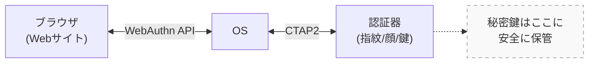

FIDO2（Fast Identity Online 2）は、パスワードに依存しない認証を実現するための標準規格である [12]。

従来のパスワード認証には、パスワードの漏洩、フィッシング詐欺、パスワードの使い回しによる被害拡大など、多くのセキュリティ上の問題があった。FIDO2は、指紋認証や顔認証などの生体認証、またはセキュリティキーと呼ばれる専用デバイスを使用することで、これらの問題を解決する。

本研究においてFIDO2は「証明書を提示しているのが本人であること」を担保するための中核技術である。
代表例として、iPhoneのFace IDやTouch ID、WindowsのWindows Helloがこの技術を採用している。パスワードを入力する代わりに、指紋や顔をかざすだけでログインできる仕組みがFIDO2である。

FIDO2は以下の2つのコンポーネントで構成される。

1. **WebAuthn**: W3Cが標準化したWebブラウザ向けの認証API
2. **CTAP2**: 外部認証器（セキュリティキー、スマートフォンなど）との通信プロトコル

これら2つの役割分担を図2.2に示す。

<strong>図2.2: FIDO2のアーキテクチャ</strong>

**WebAuthn**はブラウザとWebサイト間の通信を担当し、**CTAP2**はOSと認証器（指紋センサー、USBセキュリティキー等）間の通信を担当する。重要な点は、秘密鍵が認証器の中に閉じ込められ、外部に出ることがないことである。これにより、たとえOSやブラウザが攻撃されても、秘密鍵が漏洩するリスクを最小化できる。
