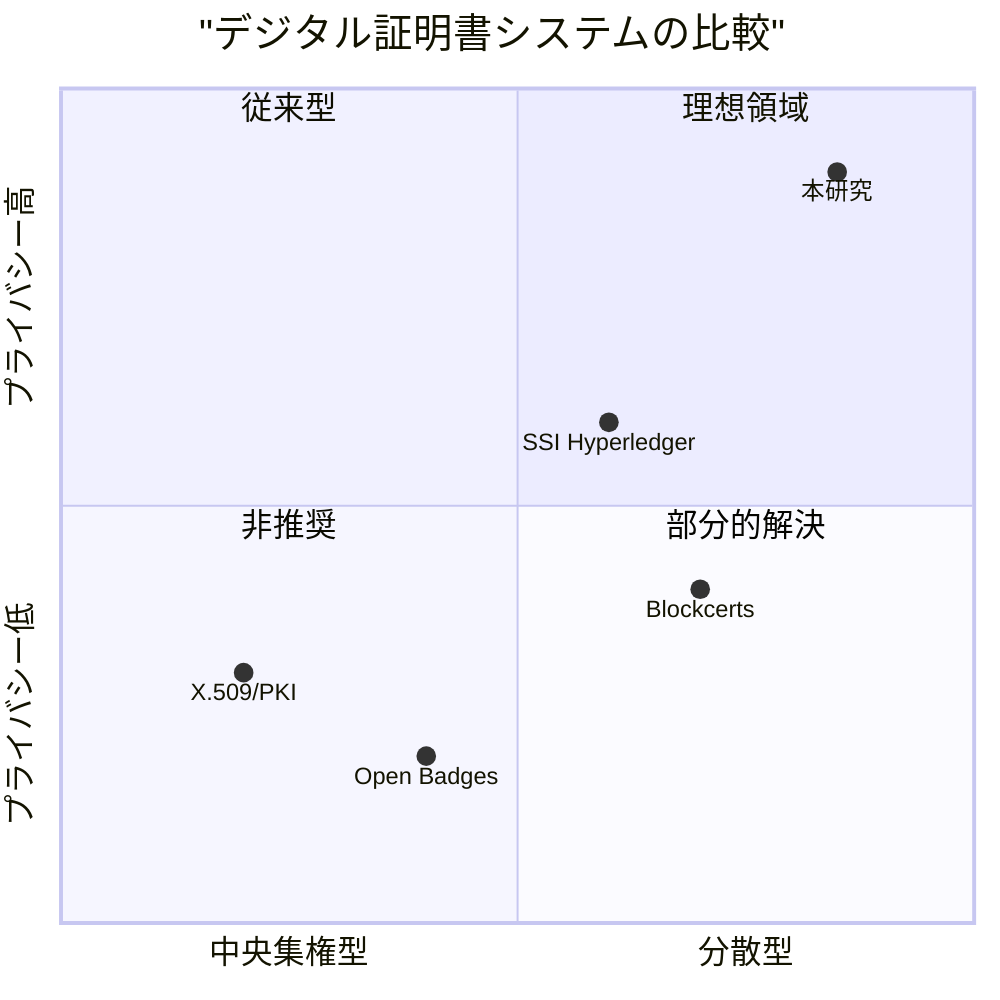

以上の先行研究・技術基盤の分析を踏まえ、本研究の位置づけを明確にする。

### デジタル証明書システムの比較

既存のデジタル証明書システムと本研究を、「分散性」と「プライバシー保護」の2軸で比較する。

<strong>図2.1: デジタル証明書システムの比較</strong>

図2.1に示すように、既存手法にはそれぞれ「分散性」と「プライバシー保護」の両立において課題がある。従来のX.509/PKIは認証局への依存度が高く、Open Badgesは発行者サーバーへの依存がある。BlockcertsやHyperledger系のSSIはブロックチェーンにより分散性を確保しているが、プライバシー保護は限定的である。

### 技術的特徴の比較

本章で分析した既存手法の技術的特徴を以下にまとめる。

<strong>表2.4: 技術的特徴の比較</strong>

| 特徴 | X.509 | Open Badges | Blockcerts | SSI |
|------|-------|-------------|------------|-----|
| 証明方式 | PKI署名 | JSON署名 | ブロックチェーン | DID/VC |
| 検証鍵管理 | CA | 発行者サーバー | スマートコントラクト | DLT |
| オフライン検証 | △ | × | × | △ |
| 選択的開示 | × | × | × | △ |
| 本人性確認 | × | × | × | × |
| 導入コスト | 高 | 低 | 高 | 高 |

この比較から、既存手法には「選択的開示」と「本人性確認」の両方を実現するものがないことがわかる。これらの課題を解決する本研究のアプローチは、次章で詳述する。
