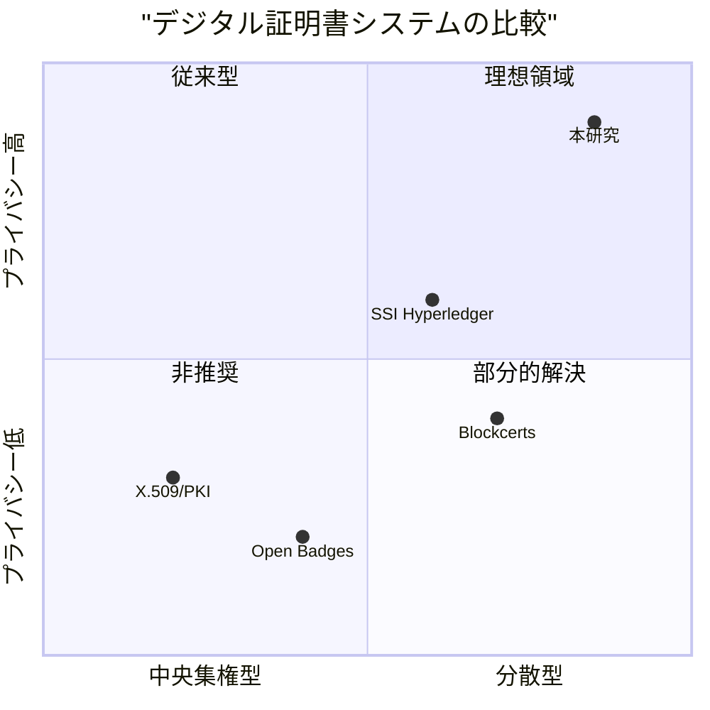

以上の先行研究・技術基盤の分析を踏まえ、本研究の位置づけを明確にする。

### デジタル証明書システムの比較

既存のデジタル証明書システムと本研究を、「分散性」と「プライバシー保護」の2軸で比較する。

<strong>図2.1: デジタル証明書システムの比較</strong>

図2.1に示すように、本研究は「分散型」かつ「プライバシー保護」の両方を高い水準で実現している。従来のX.509/PKIは認証局への依存度が高く、Open Badgesは発行者サーバーへの依存がある。BlockcertsやHyperledger系のSSIはブロックチェーンにより分散性を確保しているが、プライバシー保護は限定的である。

### 本研究の独自性（新規性）

<strong>表2.4: 本研究の独自性</strong>

| 観点 | 既存手法の限界 | 本研究の解決策 |
|------|--------------|---------------|
| プライバシー | 属性が全て開示される | ZKPによる選択的証明 |
| 本人性確認 | 証明書の所有者を確認できない | WebAuthn署名の統合 |
| インフラ依存 | ブロックチェーン/サーバー必須 | GitHubのみで運用可能 |
| 検証環境 | オンライン接続が必要 | 完全オフライン検証対応 |
| 鍵管理 | ユーザーによる秘密鍵管理 | 認証器内で鍵を保護 |

本研究は、**ZKPによるプライバシー保護**と**WebAuthnによる本人性確認**を統合した初めての文書真正性検証システムであり、既存手法では達成できなかった「プライバシーと信頼性の両立」を実現する。

### 技術的差異のまとめ

本研究と既存手法の技術的差異を以下にまとめる。

<strong>表2.5: 技術的特徴の詳細比較</strong>

| 特徴 | X.509 | Open Badges | Blockcerts | SSI | 本研究 |
|------|-------|-------------|------------|-----|--------|
| 証明方式 | PKI署名 | JSON署名 | ブロックチェーン | DID/VC | ZKP |
| 検証鍵管理 | CA | 発行者サーバー | スマートコントラクト | DLT | GitHub |
| オフライン検証 | △ | × | × | △ | ○ |
| 選択的開示 | × | × | × | △ | ○ |
| 本人性確認 | × | × | × | × | ○ |
| 導入コスト | 高 | 低 | 高 | 高 | 低 |

この比較から明らかなように、本研究は既存手法の限界を克服しつつ、実用性も確保したバランスの取れたアプローチである。
