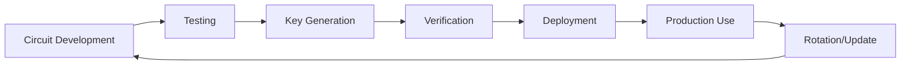

# 基本設計書 (Basic Design) — 責任者システム (Executive Console)
**ZK Document Authenticity Framework / 責任者システム** 最終更新: 2025-06-21

> **汎用的書類真正性証明システム** - あらゆる書類に適応可能な設計で、例として卒業証書の真正性証明を実装

---

## 1. システム概要

### 1.1 目的
責任者がゼロ知識証明回路の管理、YearNFTの発行、およびブロックチェーン上のMerkle Root管理を行うための高権限管理システム。

### 1.2 主要機能
- ZKP回路 (Proving Key / Verifying Key) 管理
- YearNFT コントラクト管理・発行
- Merkle Root のブロックチェーン更新
- システム全体の設定・監視
- 権限管理・監査ログ

### 1.3 非機能要件
- セキュリティレベル: 最高
- 同時ユーザー数: ≤ 5人（責任者のみ）
- 応答時間: ≤ 5秒
- 可用性: 99.95%

---

## 2. システム構成

### 2.1 アーキテクチャ（Trust Minimized版）
```
[Responsible Party] → [Tauri Desktop App]
                            ↓
                    [Local JSON Files] ← → [Local File System]
                            ↓                       ↓
                    [Web3 Provider] ← → [Circuits/Keys/Exports]
                            ↓
                    [Polygon zkEVM] ← → [Smart Contracts]
                                            • YearlyDeploymentManager
                                            • DocumentNFT{Year}
```

### 2.2 技術スタック（Ledger Nano X版）
| 層 | 技術 | 目的 |
|----|------|------|
| Frontend | React 18 + TypeScript + Tauri v2 | デスクトップアプリ |
| データ管理 | JSONファイル | ローカル設定・状態 |
| 認証 | Ledger Nano X + EIP-191 | ハードウェア署名 |
| Blockchain | Polygon zkEVM (読み取り専用) | スマートコントラクト |
| Key Storage | Ledger Nano X | 完全ハードウェア保護 |
| Circuit Storage | ローカルファイル | 回路ファイル保存 |
| 配布 | GitHub Releases | 署名付きバイナリ |

---

## 3. ブロックチェーン設計

### 3.1 スマートコントラクト構成（シンプル版）
```solidity
// YearlyDeploymentManager.sol - 年度セット管理
contract YearlyDeploymentManager {
    struct YearlySet {
        uint256 year;
        address nftContract;
        bytes32 vkHash;
        bytes32 merkleRoot;
        bytes32 circuitHash;
        uint256 deployedAt;
    }
    
    mapping(uint256 => YearlySet) public yearlySets;
    
    // 年度セット一括作成
    function createYearlySet(
        uint256 year,
        bytes32 vkHash,
        bytes32 merkleRoot,
        bytes32 circuitHash,
        string calldata nftName,
        string calldata nftSymbol
    ) external onlyOwner returns (address);
}

// DocumentNFT.sol - 年度別NFT（完全独立）
contract DocumentNFT is ERC721 {
    uint256 public immutable ISSUANCE_YEAR;
    bytes32 public immutable VK_HASH;
    bytes32 public merkleRoot;
    mapping(address => bool) public hasClaimed;
    
    // ZKP検証・NFT発行（年度独立）
    function mintDocumentNFT(
        bytes calldata zkProof,
        uint256[] calldata publicInputs,
        bytes32[] calldata merkleProof
    ) external;
}
```

### 3.2 ガス最適化設計
- **バッチ処理**: 複数操作の一括実行
- **Proxy パターン**: アップグレード可能性
- **Storage 最適化**: packed struct使用
- **Event ログ**: 効率的なインデックス設計

---

## 4. ZKP回路管理

### 4.1 回路ライフサイクル


### 4.2 年度セット管理（JSONファイルベース）
```json
// config/yearly-sets.json
{
  "version": "1.0.0",
  "sets": {
    "2025": {
      "year": 2025,
      "nftContract": "0x...",
      "vkHash": "0x...",
      "merkleRoot": "0x...",
      "circuitHash": "0x...",
              "localFiles": {
          "circuit": "./circuits/Document2025.circom",
          "vk": "./keys/Document2025_vk.json",
          "zkey": "./keys/Document2025.zkey"
        },
      "deployedAt": "2025-03-01T10:00:00Z",
      "deployTx": "0x...",
      "status": "active"
    },
    "2026": {
      // 同様の構造
    }
  }
}
```

**特徴: データベース不要・完全ローカル管理**

### 4.3 年度別VK管理（シンプル設計）
- **完全独立方式**: 各年度が独立したVK・回路・NFTセット
- **永続利用**: 各年度のVKは永続的に利用可能（無効化なし）
- **単純デプロイ**: 年度ごとにワンクリック一括デプロイ
- **相互非依存**: 他年度への影響は一切なし

#### VK管理戦略（最終版）

**🔹 年度独立設計**
```
2025年度: Document2025.circom + VK2025 + NFT2025
2026年度: Document2026.circom + VK2026 + NFT2026
2027年度: Document2027.circom + VK2027 + NFT2027
↓
各年度は完全独立・永続利用・他年度に影響なし
```

**🔹 シンプルな管理**
- **VKローテーション**: 不要（各年度永続利用）
- **有効期限**: なし（永続的に有効）
- **緊急無効化**: 年度単位での対応のみ
- **段階的移行**: 不要（独立設計）

**🔹 実装方式**
```solidity
// 各年度独立デプロイ
function createYearlySet(
    uint256 year,
    bytes32 vkHash,
    bytes32 merkleRoot,
    bytes32 circuitHash
) external onlyOwner
```

---

## 5. NFT発行システム

### 5.1 YearNFT 仕様
```typescript
interface YearNFTMetadata {
  name: string;           // "Graduation Certificate 2025"
  description: string;    // "Zero-Knowledge Verified Graduation Certificate"
  image: string;          // ローカル画像パス
  attributes: [
    {
      trait_type: "Graduation Year";
      value: 2025;
    },
    {
      trait_type: "University";
      value: "Example University";
    },
    {
      trait_type: "Verification Method";
      value: "Zero-Knowledge Proof";
    }
  ];
  proof_verified: boolean; // ZKP検証済みフラグ
  issued_date: string;     // 発行日時
}
```

### 5.2 年度セット発行フロー（シンプル版）
1. **ワンクリックデプロイ**: Executive Consoleで年度セット一括作成
2. **独立セット構築**: 回路・VK・NFT・Merkle Rootを同時デプロイ
3. **即座利用開始**: デプロイ完了後すぐに学生利用可能
4. **永続運用**: 他年度に影響されず永続的に利用可能

#### 年度セット作成の実装
```solidity
// 年度セット一括作成（超シンプル）
function createYearlySet(
    uint256 year,
    bytes32 vkHash,
    bytes32 merkleRoot,
    bytes32 circuitHash,
    string calldata nftName,
    string calldata nftSymbol
) external onlyOwner returns (address) {
    // 1. NFTコントラクト作成
    GraduationNFT nft = new GraduationNFT(
        year, vkHash, merkleRoot, nftName, nftSymbol
    );
    
    // 2. 記録・完了
    yearlySets[year] = YearlySet({...});
    return address(nft);
}
```

**特徴: 2025年卒業生は永続的にVK2025を使用可能（他年度の影響なし）**

### 5.3 年次運用例（シンプル）

**毎年3月の年度セット作成:**
```typescript
// Executive Consoleでの操作
1. 「新年度セット作成」ボタンクリック
2. 2025年度 Certificate2025.circom アップロード
3. 学生公開鍵リスト（CSV）アップロード
4. ワンクリックデプロイ実行
5. 2025年度セット完成・即座利用開始

結果:
- Certificate2025.circom → VK2025 → NFT2025
- 2024年度以前のシステムに影響なし
- 2025年卒業生は永続的にVK2025を利用可能
```

**特徴:**
- ✅ **理解しやすい**: 1年 = 1セット
- ✅ **実装が簡単**: 複雑な互換性チェック不要
- ✅ **運用が安全**: 他年度に影響しない
- ✅ **将来性**: 技術進化に柔軟対応
- ✅ **デバッグ容易**: 問題の局所化

---

## 6. セキュリティ設計

### 6.1 認証・認可（シンプル版）
```
Local Admin: デスクトップアプリ利用者
- WebAuthn/パスキー認証
- 物理デバイス（YubiKey/Ledger）認証
- ローカル秘密鍵による署名
- 年度セット管理・デプロイ権限
```

### 6.2 EIP-191署名認証システム
- **Ledger Nano X必須**: 全管理操作で物理確認
- **EIP-191 Personal Sign**: 人間可読メッセージ署名
- **構造化認証**: 操作内容・タイムスタンプ・ドメイン包含
- **二重確認**: デバイス画面での操作内容確認必須

#### EIP-191署名メッセージ構造
```typescript
interface AuthMessage {
  domain: string;           // "zk-cert-framework.local"
  operation: string;        // "deploy_yearly_set"
  year: number;            // 2025
  timestamp: number;       // Unix timestamp
  nonce: string;          // ランダムnonce（リプレイ攻撃防止）
  circuitHash: string;    // 対象回路のハッシュ
}

// EIP-191署名対象
const message = `
zk-CertFramework Executive Console

Operation: Deploy Yearly Set ${year}
Circuit Hash: ${circuitHash}
Timestamp: ${new Date(timestamp).toISOString()}
Nonce: ${nonce}

⚠️  WARNING: Only sign if you trust this application
Domain: ${domain}
`;
```

### 6.3 秘密鍵管理（Ledger Nano X重点）
- **Ledger Nano X**: EIP-191署名による管理者認証
- **ハードウェア分離**: 秘密鍵の完全ハードウェア保護
- **EIP-191 Personal Sign**: 構造化メッセージ署名
- **フィッシング対策**: ドメイン検証・メッセージ検証実装

### 6.4 EIP-191セキュリティ対策

#### 主要セキュリティリスク
1. **フィッシング攻撃**: 悪意のあるサイトでの署名要求
2. **リプレイ攻撃**: 過去の署名の不正再利用
3. **メッセージ偽装**: 意図しない内容への署名誘導
4. **ドメイン詐称**: 類似ドメインでの攻撃

#### セキュリティ対策実装
```typescript
class SecureEIP191Signer {
  private static readonly DOMAIN = "zk-cert-framework.local";
  private static readonly VERSION = "1.0.0";
  
  // 1. フィッシング対策：厳格なドメイン検証
  private validateDomain(): boolean {
    const currentDomain = window.location.hostname;
    return currentDomain === this.DOMAIN || currentDomain === "localhost";
  }
  
  // 2. リプレイ攻撃対策：時間窓とnonce
  private generateSecureMessage(operation: AuthMessage): string {
    const timestamp = Date.now();
    const nonce = crypto.randomUUID();
    
    // 5分以内の署名のみ有効
    const expiry = timestamp + (5 * 60 * 1000);
    
    return `
🔐 zk-CertFramework Executive Console v${SecureEIP191Signer.VERSION}

⚠️  SECURITY WARNING ⚠️
Only sign if you initiated this action!

Operation: ${operation.operation}
Year: ${operation.year}
Circuit Hash: ${operation.circuitHash}
Timestamp: ${new Date(timestamp).toISOString()}
Valid Until: ${new Date(expiry).toISOString()}
Nonce: ${nonce}
Domain: ${SecureEIP191Signer.DOMAIN}

📱 Verify on Ledger screen:
- Operation matches your intention
- Year is correct: ${operation.year}
- Circuit hash is expected

❌ NEVER sign if:
- You didn't initiate this action
- Operation details don't match
- Domain is not ${SecureEIP191Signer.DOMAIN}
`;
  }
  
  // 3. メッセージ検証：署名前の二重確認
  async signWithConfirmation(operation: AuthMessage): Promise<string> {
    // ドメイン検証
    if (!this.validateDomain()) {
      throw new Error("Invalid domain - potential phishing attack");
    }
    
    // ユーザー確認
    const confirmed = await this.showConfirmationDialog(operation);
    if (!confirmed) {
      throw new Error("Operation cancelled by user");
    }
    
    // Ledger署名
    const message = this.generateSecureMessage(operation);
    return await this.ledger.signPersonalMessage(message);
  }
  
  // 4. 署名検証：受信時の完全検証
  verifySignature(signature: string, operation: AuthMessage): boolean {
    const message = this.generateSecureMessage(operation);
    const recovered = ethers.verifyMessage(message, signature);
    
    // 時間窓検証（5分以内）
    const now = Date.now();
    if (now - operation.timestamp > 5 * 60 * 1000) {
      return false;
    }
    
    // nonce重複チェック
    if (this.usedNonces.has(operation.nonce)) {
      return false;
    }
    
    this.usedNonces.add(operation.nonce);
    return recovered === this.expectedSigner;
  }
}
```

### 6.5 監査・ログ（EIP-191対応）
- **署名ログ**: 全EIP-191署名の詳細記録
- **操作ログ**: ローカルJSONファイルに記録
- **ブロックチェーンログ**: パブリック検証可能
- **セキュリティ監査**: 異常署名パターンの検知

---

## 7. インターフェース設計

### 7.1 ダッシュボード構成（シンプル版）
| セクション | 機能 | アクセス |
|-----------|------|----------|
| 年度セット管理 | 年度別一括管理 | ローカル認証 |
| 回路ファイル管理 | ローカル回路・キー管理 | ローカル認証 |
| デプロイ履歴 | ブロックチェーン履歴 | 読み取り専用 |
| システム状態 | ネットワーク・接続状況 | 読み取り専用 |
| 設定・バックアップ | ローカル設定管理 | ローカル認証 |

### 7.2 Ledger Nano X統合
```typescript
// Ledger統合Web3サービス
interface LedgerWeb3Service {
  connectLedger(): Promise<string>;              // Ledger Nano X接続
  signEIP191Message(message: string): Promise<string>; // EIP-191署名
  signTransaction(tx: any): Promise<string>;     // トランザクション署名
  getAddress(): Promise<string>;                 // Ledgerアドレス取得
  verifyConnection(): Promise<boolean>;          // 接続状態確認
}

// セキュア年度セット管理
interface SecureYearlySetManager {
  createYearlySetWithLedger(
    year: number, 
    files: LocalFiles, 
    ledgerSignature: string
  ): Promise<DeployResult>;
  
  verifyLedgerSignature(
    operation: AuthMessage, 
    signature: string
  ): Promise<boolean>;
  
  getSigningHistory(): Promise<SigningRecord[]>; // 署名履歴
}

// Ledger操作タイプ
enum LedgerOperation {
  DEPLOY_YEARLY_SET = "deploy_yearly_set",
  UPDATE_CONFIG = "update_config", 
  EXPORT_DATA = "export_data",
  BACKUP_KEYS = "backup_keys"
}

// EIP-191署名レコード
interface SigningRecord {
  timestamp: number;
  operation: LedgerOperation;
  year?: number;
  signature: string;
  address: string;
  verified: boolean;
}
```

---

## 8. エラー処理・復旧

### 8.1 障害分類
| 障害レベル | 内容 | 対応時間 | 対応者 |
|----------|------|---------|--------|
| Critical | ブロックチェーン接続断 | 15分以内 | System Admin |
| High | 回路検証エラー | 1時間以内 | Lead Professor |
| Medium | NFT発行遅延 | 4時間以内 | Professor |
| Low | UI表示不具合 | 24時間以内 | 開発チーム |

### 8.2 災害復旧（ローカル完結）
- **ローカルバックアップ**: 設定・キーファイルの自動バックアップ
- **データポータビリティ**: JSONファイルによる環境移行
- **オフライン復旧**: ネットワーク不要での基本機能継続
- **分散バックアップ**: 複数デバイス・USB等での冗長化

---

## 9. 運用・保守

### 9.1 定期保守（Trust Minimized版）
- **アプリ更新**: GitHub Releasesからの署名付き更新
- **回路監査**: 年度セット単位での検証
- **ローカルバックアップ**: 設定・履歴の定期保存
- **ファイル整理**: 古い一時ファイルのクリーンアップ

### 9.2 監視項目（ローカル重点）
- **ブロックチェーン**: ガス価格・ネットワーク状況（読み取り専用）
- **ローカル性能**: ファイル操作・回路処理時間
- **デバイス状態**: 物理セキュリティキー・認証状況
- **年度セット状況**: デプロイ状況・利用統計

### 9.3 パフォーマンス目標（ローカル重点）
- **年度セットデプロイ**: ≤ 3分（ワンクリック）
- **ローカルファイル処理**: ≤ 10秒
- **アプリ起動時間**: ≤ 5秒
- **設定バックアップ**: ≤ 1秒 

**年次運用（理想的なシンプルさ）:**

```
毎年3月：
1. Executive Consoleで「新年度セット作成」ボタンクリック
2. 回路ファイル・学生リストをアップロード
3. ワンクリックデプロイ
4. 卒業式で即座に利用開始

結果：
- Certificate2025.circom → VK2025 → NFT2025 (完全独立)
- 他の年度に影響なし
- 失敗しても局所的
- アップデートが自由
```

**シンプル設計の利点:**
- ✅ **理解しやすい**: 1年 = 1セット
- ✅ **実装が簡単**: 複雑な互換性チェック不要  
- ✅ **運用が安全**: 他年度に影響しない
- ✅ **将来性**: 技術進化に柔軟対応
- ✅ **デバッグ容易**: 問題の局所化
- ✅ **Trust Minimized**: 外部依存なし 