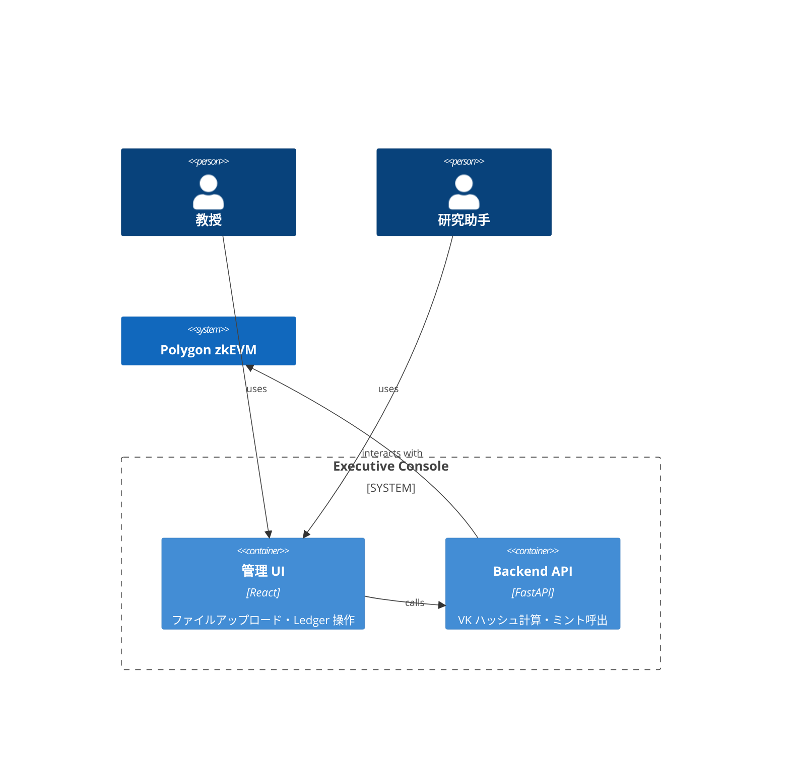
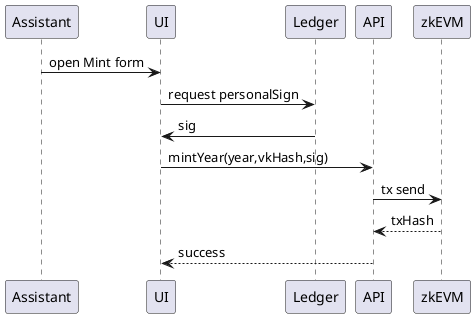

# 機能設計書 (FSD) — Executive Console  
最終更新: 2025-06-16

---

## 1. C4 コンテキスト

## 2. UI モック
- **ダッシュボード**: 回路一覧テーブル + [新規登録] ボタン  
- **ミント画面**: 年度入力・ハッシュ確認・Ledger 署名ダイアログ  

## 3. REST API
| メソッド | パス | 説明 |
|----------|------|------|
| POST | /circuits | 回路(CRS)アップロード |
| POST | /mintYear | YearNFT 発行 |

## 4. データ辞書
| フィールド | 型 | 説明 |
|-----------|----|------|
| circuitId | uuid | 回路識別 |
| vkHash | hex128 | SHA‑3‑512 |

## 5. シーケンス (UC‑PC‑02)

## 6. エラーハンドリング
100: LedgerDisconnected 101: GasTooLow 102: InvalidSig

## 7. テストケース
TC‑M1 正常ミント → 200  
TC‑M2 署名改竄 → 102
