# 機能設計書 (FSD) — Executive Console  
最終更新: 2025-07-10 (Version 2.2)

---

## 1. C4 コンテキスト (Ledger統合・バックエンドレス版)

```mermaid
C4Context
Person(Professor, "教授")
Person(Assistant, "研究助手")
System_Boundary(EC, "Executive Console Tauri App") {
  Container(UI, "管理UI", "React 18", "年度別セット管理・Ledger操作")
  Container(Ledger, "Ledger統合", "Node.js HID", "EIP-191署名・ハードウェア認証")
  Container(Compiler, "Circom コンパイラ", "Node.js", "回路コンパイル・VK生成")
  Container(Storage, "ローカルストレージ", "JSON Files", "設定・回路・鍵ファイル")
}
System(zkEVM, "Polygon zkEVM", "ブロックチェーン", "年度別NFT・スマートコントラクト")

Rel(Professor, UI, "年度セット作成・承認")
Rel(Assistant, UI, "デプロイ実行")
Rel(UI, Ledger, "EIP-191署名要求")
Rel(UI, Compiler, "回路コンパイル")
Rel(UI, Storage, "設定・ファイル管理")
Rel(Ledger, zkEVM, "署名付きトランザクション")
```


## 2. 機能概要 (年度別独立システム)
### 2.1 年度別セット管理
- **2025年度**: Document2025.circom → VK2025 → DocumentNFT2025
- **2026年度**: Document2026.circom → VK2026 → DocumentNFT2026  
- **完全独立**: 年度間の依存関係・共有状態なし

### 2.2 Ledger Nano X 必須操作
- 全ての管理操作でハードウェア署名必須
- EIP-191 personal message 形式
- デバイス画面での操作内容確認

## 3. UI コンポーネント構成
```typescript
// メイン画面構成
<ExecutiveConsoleApp>
  <Header />
  <Sidebar>
    <YearlySetList />        // 年度一覧
    <LedgerStatus />         // Ledger接続状態
  </Sidebar>
  <MainContent>
    <YearlySetDashboard />   // 年度別ダッシュボード
    <CircuitManager />       // 回路ファイル管理
    <DeploymentWizard />     // デプロイウィザード
    <SignatureHistory />     // 署名履歴
  </MainContent>
</ExecutiveConsoleApp>
```

## 4. ローカルファイル構造
```
~/.zk-cert-framework/
├── config/
│   ├── yearly-sets.json          # デプロイ済み年度情報
│   ├── network-config.json       # ブロックチェーン設定
│   └── ledger-settings.json      # Ledger設定
├── circuits/
│   ├── Certificate2025.circom    # 年度別回路ファイル
│   ├── Certificate2026.circom
│   └── common/
│       ├── poseidon.circom       # 共通ライブラリ
│       └── ecdsa.circom
├── build/
│   ├── Certificate2025.wasm      # コンパイル済み回路
│   ├── Certificate2025.zkey      # 証明鍵
│   ├── Certificate2025_vk.json   # 検証鍵
│   └── powersOfTau_bn128_16.ptau # Powers of Tau
└── logs/
    ├── operations.log            # 操作ログ
    └── signatures.log            # Ledger署名ログ
```

## 5. API イベント (Tauri Rust Backend)
| メソッド | パラメータ | 説明 |
|----------|------------|------|
| `loadYearlySets()` | - | 設定ファイルから年度情報読込 |
| `compileCircuit(year, file)` | year, circuitFile | Circom コンパイル実行 |
| `connectLedger()` | - | Ledger Nano X 接続 |
| `signWithLedger(message)` | EIP191Message | ハードウェア署名 |
| `deployYearlySet(params)` | year, vkHash, etc. | 年度セット一括デプロイ |
| `exportYearData(year)` | year | 年度データエクスポート |

## 6. Ledger EIP-191 メッセージ構造
```typescript
interface YearlySetDeployMessage {
  domain: "zk-cert-framework.local";
  operation: "deploy_yearly_set";
  year: number;
  timestamp: number;
  nonce: string;
  parameters: {
    vkHash: string;
    circuitHash: string;
    merkleRoot: string;
    nftName: string;
    nftSymbol: string;
  };
}

// 実際の署名対象メッセージ
const message = `
🔐 zk-CertFramework Executive Console v2.0

⚠️  SECURITY WARNING ⚠️
Only sign if you initiated this action!

Operation: Deploy Yearly Set ${year}
Circuit Hash: ${circuitHash}
VK Hash: ${vkHash}
Merkle Root: ${merkleRoot}
NFT: ${nftName} (${nftSymbol})
Timestamp: ${new Date(timestamp).toISOString()}
Nonce: ${nonce}

📱 Verify on Ledger screen:
- Operation: Deploy Yearly Set
- Year: ${year}
- All parameters match your intention

❌ NEVER sign if:
- You didn't initiate this action
- Domain is not zk-cert-framework.local
- Parameters don't match
`;
```

## 7. 年度セット作成フロー

```mermaid
sequenceDiagram
    participant Professor
    participant EC as Executive Console
    participant CC as Circom Compiler
    participant Ledger as Ledger Nano X
    participant Chain as Polygon zkEVM

    Professor->>EC: 新年度セット作成開始
    EC->>Professor: 回路ファイル (Document{Year}.circom) アップロード
    Professor->>EC: 回路ファイル選択
    EC->>CC: circom compile + snarkjs setup
    CC-->>EC: {wasm, zkey, vk.json}
    EC->>EC: VKハッシュ・回路ハッシュ計算
    EC->>Professor: デプロイ内容確認画面
    Professor->>EC: "デプロイ実行" ボタン
    EC->>Ledger: EIP-191署名要求
    Ledger->>Professor: デバイス画面で内容確認
    Professor->>Ledger: 物理ボタンで承認
    Ledger-->>EC: 署名データ (65 bytes)
    EC->>Chain: YearlyDeploymentManager.createYearlySet()
    Chain-->>EC: トランザクションハッシュ
    EC->>EC: yearly-sets.json 更新
    EC-->>Professor: デプロイ完了通知
```


## 8. UI モックアップ
### 8.1 メインダッシュボード
```
┌─────────────────────────────────────────────────────┐
│ Executive Console - 年度別セット管理                  │
├─────────────────────────────────────────────────────┤
│ 🔗 Ledger: Connected (0x1234...abcd) │ [新規作成] │
├─────────────────────────────────────────────────────┤
│ 年度   │ NFTコントラクト           │ ステータス    │
├─────────────────────────────────────────────────────┤
│ 2025  │ 0x5678...ef01            │ ✅ デプロイ済 │
│ 2026  │ 0x9abc...def2            │ ✅ デプロイ済 │
│ 2027  │ -                        │ 📝 作成中     │
└─────────────────────────────────────────────────────┘
```

### 8.2 デプロイウィザード
```
┌─────────────────────────────────────────────────────┐
│ Step 1: 回路ファイル設定                             │
├─────────────────────────────────────────────────────┤
│ 年度: [2027          ] NFT名: [Graduation 2027  ]  │
│ 回路: [Certificate2027.circom        ] [📁選択]    │
│ PTAU: [powersOfTau_bn128_16.ptau     ] [📁選択]    │
├─────────────────────────────────────────────────────┤
│ Step 2: コンパイル結果                               │
├─────────────────────────────────────────────────────┤
│ VKハッシュ: 0x789a...bcde                           │
│ 回路ハッシュ: 0xfedc...ba09                         │
│ 制約数: 64,823                                      │
├─────────────────────────────────────────────────────┤
│ Step 3: Ledger署名                                  │
├─────────────────────────────────────────────────────┤
│ 🔐 Ledger Nano Xで署名を確認してください            │
│ [キャンセル]                        [署名実行] │
└─────────────────────────────────────────────────────┘
```

## 9. Tauri セキュリティ設定
```rust
// main.rs - セキュアなTauriセットアップ
const mainWindow = new BrowserWindow({
  width: 1200,
  height: 800,
  webPreferences: {
    nodeIntegration: false,        // Node.js無効化
    contextIsolation: true,        // コンテキスト分離
    enableRemoteModule: false,     // remote module無効
    preload: path.join(__dirname, 'preload.js')
  }
});

// preload.js - 安全なIPC通信
// Tauri APIコマンド定義
  // Ledger操作
  connectLedger: () => ipcRenderer.invoke('ledger:connect'),
  signMessage: (message: string) => ipcRenderer.invoke('ledger:sign', message),
  
  // ファイル操作
  selectCircuitFile: () => ipcRenderer.invoke('file:select-circuit'),
  compileCircuit: (params) => ipcRenderer.invoke('circuit:compile', params),
  
  // 設定管理
  loadConfig: () => ipcRenderer.invoke('config:load'),
  saveConfig: (config) => ipcRenderer.invoke('config:save', config)
});
```

## 10. エラーハンドリング
| エラーコード | メッセージ | UI対応 |
|-------------|------------|--------|
| 100 | LEDGER_NOT_CONNECTED | Ledger接続画面表示 |
| 101 | LEDGER_SIGNATURE_REJECTED | 署名キャンセル処理 |
| 102 | CIRCUIT_COMPILE_FAILED | コンパイルエラー詳細表示 |
| 103 | BLOCKCHAIN_TX_FAILED | ガス不足・ネットワークエラー案内 |
| 104 | VK_HASH_MISMATCH | 回路ファイル再確認案内 |
| 105 | YEAR_ALREADY_EXISTS | 既存年度エラー |

## 11. 配布・インストール
```bash
# ビルド
npm run build:rust-backend
npm run build:react-frontend

# パッケージング (各OS)
tauri build --target x86_64-apple-darwin    # ExecutiveConsole-2.0.0.dmg
tauri build --target x86_64-pc-windows-msvc # ExecutiveConsole-2.0.0.exe
tauri build --target x86_64-unknown-linux-gnu # ExecutiveConsole-2.0.0.AppImage

# 署名検証 (macOS)
codesign --verify --deep --display ExecutiveConsole.app
spctl --assess --verbose ExecutiveConsole.app
```

## 12. 運用・監査
- **操作ログ**: 全操作をローカルログファイルに記録
- **署名履歴**: Ledger署名の詳細履歴を保持
- **設定バックアップ**: 設定ファイルの自動バックアップ
- **ハードウェア要件**: Ledger Nano X + USB接続必須
