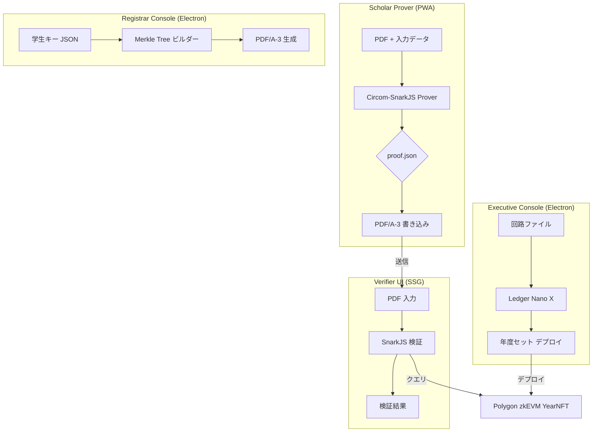
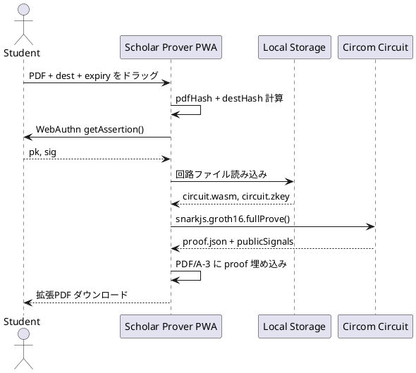

# 機能設計書 (FSD) — ZKP 付き卒業証書システム
**バージョン 2.0 最終更新: 2025‑06‑17**

---

## 1. システム構成 (C4)


## 2. UI 仕様
### 2.1 Passkey 登録画面（Scholar Prover）
| 要素 | ID | 機能 |
|------|----|------|
| 登録ボタン | btnRegister | `navigator.credentials.create()` 実行 |
| 学生ID入力 | txtStudentId | 学生ID（数値検証付き） |
| ローカル保存 | localStorageKey | Passkeyデータをローカル保存 |

### 2.2 証明生成画面（Scholar Prover）
| 要素 | ID | 機能 |
|------|----|------|
| PDF ドロップ | dropPDF | ファイル入力（MIME: application/pdf） |
| 提出先入力 | txtDest | SHA‑3‑512(dest) をblur時に計算 |
| 期限入力 | dateExpire | 最大365日後まで設定可能 |
| 生成ボタン | btnGenerate | 入力が有効になるまで無効化 |

### 2.3 年度セット管理（Executive Console）
| 要素 | ID | 機能 |
|------|----|------|
| 回路ファイル | fileCircuit | Certificate{Year}.circom アップロード |
| Ptauファイル | filePtau | Powers of Tau セレモニーファイル |
| Ledger署名 | btnLedgerSign | Ledger Nano X EIP-191 署名実行 |
| 年度入力 | yearInput | 卒業年度（2025+） |

### 2.4 学生キー管理（Registrar Console）
| 要素 | ID | 機能 |
|------|----|------|
| 学生キーファイル | fileStudentKeys | 学生Passkeyデータ JSON |
| Merkleビルド | btnBuildMerkle | Poseidon Merkle Tree 構築 |
| PDF生成 | btnGeneratePDFs | 一括 PDF/A-3 生成 |

## 3. バックエンドレス・データ管理

### 3.1 ローカルストレージアーキテクチャ
```
Executive Console (Electron):
config/
├── yearly-sets.json          # デプロイ済み年度セット
├── circuits/Certificate{Year}.circom
├── build/Certificate{Year}.zkey
└── signatures/operations.log  # Ledger署名ログ

Registrar Console (Electron):
data/
├── students-{year}.json       # 学生Passkeyデータ
├── merkle-tree-{year}.json    # 計算済みMerkle tree
└── generated-pdfs/{year}/     # 一括生成PDF

Scholar Prover (PWA):
localStorage:
- passkey_info: {publicKey, credentialId}
- circuit_cache: {wasm, zkey, vk}
- proof_history: [{pdfHash, timestamp, proofId}]
```

## 4. 詳細ワークフロー - 証明生成



## 5. データ辞書
| フィールド | 型 | 説明 |
|-----------|----|------|
| commit | hex[64] | Poseidon256(pk) |
| vkHash | hex[128]| SHA‑3‑512 of VK |
| merkleRoot | hex[64] | Poseidon256 |
| yearlySetAddr | hex[40] | デプロイ済みコントラクトアドレス |
| circuitHash | hex[128] | 回路ファイルのSHA‑3‑512 |
| ledgerSignature | hex[130] | Ledger からの EIP-191 署名 |

## 6. エラーハンドリング
| コード | メッセージ | UI アクション |
|-------|-----------|-------------|
| 1001 | INVALID_PDF_HASH | 赤バナー表示 |
| 1002 | EXPIRED | 黄バナー表示 |
| 1003 | LEDGER_DISCONNECTED | 接続ダイアログ表示 |
| 1004 | CIRCUIT_COMPILE_FAILED | エラー詳細表示 |
| 1005 | SNARKJS_PROOF_FAILED | 異なる入力で再試行 |

## 7. Trust Minimization 機能

### 7.1 外部依存性排除
- ✅ バックエンドサーバーなし
- ✅ データベースなし
- ✅ クラウドサービス使用なし
- ✅ 外部ストレージ（IPFS等）なし

### 7.2 信頼できるコンポーネントのみ
- 🔐 Polygon zkEVM（パブリックブロックチェーン）
- 📱 Ledger Nano X（ハードウェア認証済み）
- 🌐 npm パッケージ（ビルド時検証済み）
- 💻 ブラウザ標準API

### 7.3 年度別独立性
- 各年度 = 完全に独立した回路 + VK + NFT
- キーローテーション複雑性なし
- 年度間依存性なし
- シンプルな検証ロジック

## 8. テストケース
- TC‑01: 正常生成（PWA + Circom）
- TC‑02: 期限切れ（Verifier UI）
- TC‑03: PDF 改竄検出（SnarkJS）
- TC‑04: Ledger署名検証（Executive Console）
- TC‑05: バックエンドレス動作確認（全コンポーネント）
