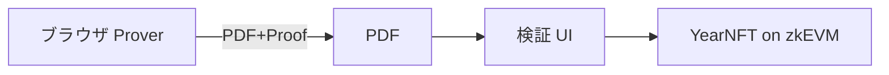
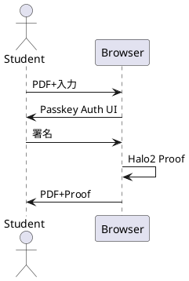

# 機能設計書 (FSD) — ZKP 付き卒業証書システム
最終更新: 2025‑06‑17

---

## 1. システム構成 (C4)

## 2. UI 仕様
### 2.1 Passkey 登録画面
| 要素 | ID | 機能 |
|------|----|------|
| 登録ボタン | btnRegister | WebAuthn Registration |

### 2.2 証明生成画面
| 要素 | ID | 機能 |
|------|----|------|
| PDF ドロップ | dropPDF | ファイル入力 |
| 提出先入力 | txtDest | text |
| 期限入力 | dateExpire | date |
| 生成ボタン | btnGenerate | Proof 作成 |

## 3. API
| Method | Path | Body | Res |
|--------|------|------|-----|
| POST | /register | { id,pubKey } | 200 |
| GET  | /leaf/:id | ― | { leaf,path } |

## 4. データ辞書 (抜粋)
| フィールド | 型 | 説明 |
|-----------|----|------|
| commit | hex[64] | Poseidon256 |
| vkHash | hex[128]| SHA‑3‑512 |
| salt | hex[32] | 16 B |

## 5. 詳細シーケンス

## 6. エラーハンドリング
| コード | メッセージ |
|-------|-----------|
| 1001 | INVALID_PDF_HASH |
| 1002 | EXPIRED |

## 7. テストケース
- TC‑01: 正常生成  
- TC‑02: 期限切れ  
- TC‑03: PDF 改竄  
