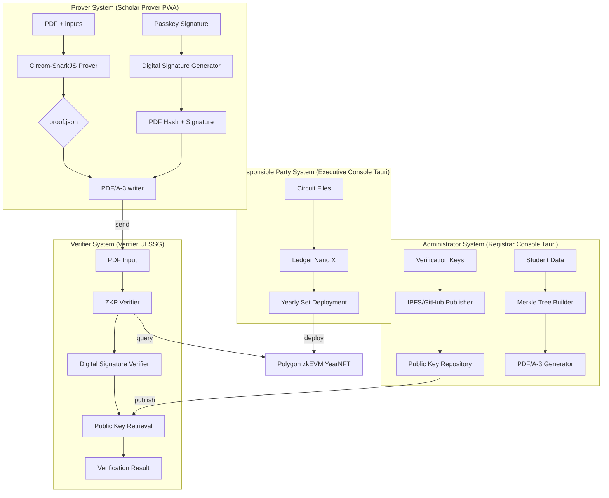
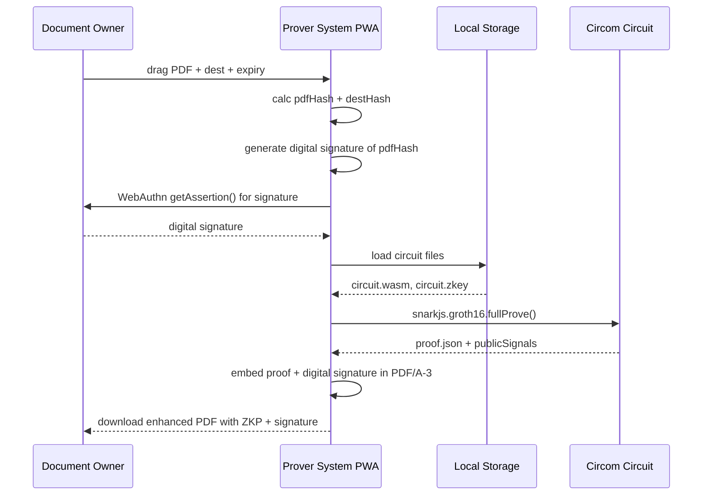
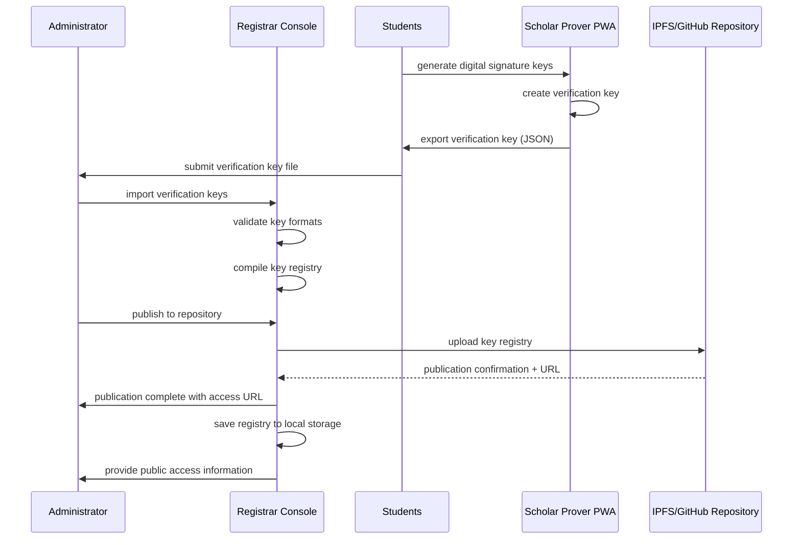
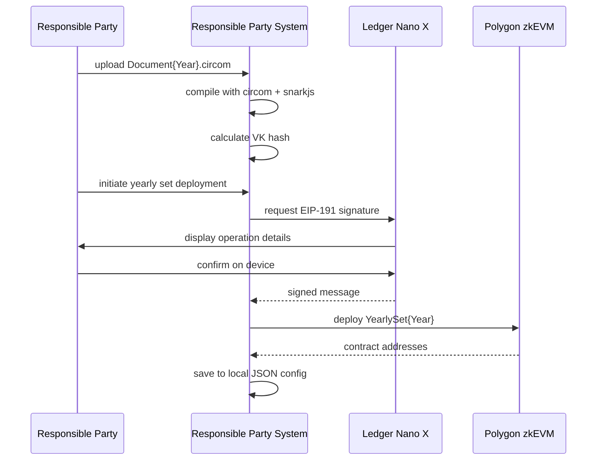

# Functional Design Specification (FSD) — Tri-CertFramework
**Version 2.4 – 2025‑08‑09**

> **Tri-Certification Framework** - ZKP + Blockchain + Digital Signature for Universal Document Authenticity

---

## 1 Context Diagram  



## 2 User‑Interface Specifications  
### 2.1 Digital Signature Key Generation (Prover System)
| Element ID | Type | Description |  
|------------|------|-------------|  
| `btnGenerateKeys` | button | initiates passkey-based signature key generation |  
| `txtOwnerId` | input | document owner ID (validation: numeric) |  
| `localStorageKey` | storage | stores signature key info locally |
| `btnExportVerificationKey` | button | exports verification key for registrar |
| `verificationKeyDisplay` | textarea | displays verification key in JSON format |
| `exportInstructions` | text | instructions for sharing verification key |

### 2.2 Proof Generator with Digital Signature (Prover System)
| ID | Type | Validation |  
|----|------|------------|  
| `dropPdf` | drag‑zone | MIME `application/pdf` |  
| `txtDest` | text | SHA‑3‑512(dest) computed on blur |  
| `dateExpire` | date | must be ≤ 365 days future |  
| `btnGenerate` | button | disabled until inputs valid |
| `signatureProgress` | progress | shows digital signature generation progress |
| `signaturePreview` | text | displays generated digital signature |  

### 2.3 Yearly Set Management (Responsible Party System)
| ID | Type | Description |
|----|------|-------------|
| `fileCircuit` | file | Document{Year}.circom upload |
| `filePtau` | file | Powers of Tau ceremony file |
| `btnLedgerSign` | button | triggers Ledger Nano X EIP-191 signature |
| `yearInput` | number | document issuance year (2025+) |

### 2.4 Verification Key Management (Administrator System)  
| ID | Type | Description |
|----|------|-------------|
| `fileVerificationKeys` | file | JSON file with verification keys from students |
| `btnBuildMerkle` | button | constructs Poseidon Merkle Tree |
| `btnGeneratePDFs` | button | batch PDF/A-3 generation |
| `btnPublishKeys` | button | publishes verification keys to IPFS/GitHub |
| `publicationProgress` | progress | key publication progress |
| `publicationStatus` | text | publication status display |
| `keyRepository` | table | published verification key registry |

### 2.5 Public Key Repository (Administrator System)
| ID | Type | Description |
|----|------|-------------|
| `yearSelector` | select | select year for key management |
| `repositoryURL` | input | IPFS/GitHub repository URL |
| `btnPublishToIPFS` | button | publish to IPFS repository |
| `btnPublishToGitHub` | button | publish to GitHub repository |
| `publicationLog` | table | publication history and status |
| `keyValidation` | text | verification key validation results |
| `accessTokenInput` | input | GitHub access token for private repos |

## 3 Detailed Workflow – Proof Generation with Digital Signature  



## 4 Verification Key Publication Workflow  



## 5 Yearly Set Deployment (Responsible Party System)



## 6 Data Dictionary  

| Field | Type | Notes |  
|-------|------|-------|  
| `commit` | hex(64) | Poseidon256(verification_key) |  
| `vkHash` | hex(128) | SHA‑3‑512 of VK |  
| `merkleRoot` | hex(64) | Poseidon256 |  
| `yearlySetAddr` | hex(40) | deployed contract address |
| `circuitHash` | hex(128) | SHA‑3‑512 of circuit file |
| `ledgerSignature` | hex(130) | EIP-191 signature from Ledger |
| `digitalSignature` | base64 | PDF hash digital signature |  
| `verificationKey` | json | Public key for signature verification |
| `repositoryURL` | url | IPFS/GitHub repository URL |
| `keyRegistryHash` | hex(128) | SHA‑3‑512 of key registry |

## 7 Verification Key Data Format

### 7.1 Verification Key Registry Structure
```json
{
  "version": "2.4",
  "framework": "Tri-CertFramework",
  "year": 2025,
  "registryMetadata": {
    "generatedAt": 1704067200000,
    "totalKeys": 150,
    "administrator": "university-admin",
    "repositoryType": "github"
  },
  "verificationKeys": [
    {
      "studentId": "2025001",
      "studentName": "田中太郎",
      "email": "tanaka@university.edu",
      "verificationKey": {
        "kty": "EC",
        "crv": "P-256",
        "x": "MKBCTNIcKUSDii11ySs3526iDZ8AiTo7Tu6KPAqv7D4",
        "y": "4Etl6SRW2YiLUrN5vfvVHuhp7x8PxltmWWlbbM4IFyM",
        "use": "sig",
        "alg": "ES256"
      },
      "generatedAt": 1704067200000,
      "integrity": {
        "keyHash": "sha3-512-hash-of-key",
        "signature": "self-signed-verification"
      }
    }
  ],
  "integrity": {
    "registryHash": "sha3-512-hash-of-registry",
    "adminSignature": "admin-signature"
  }
}
```

### 7.2 Repository Publication Specifications
- **Format**: JSON with JWK (JSON Web Key) format
- **Storage**: IPFS/GitHub repository
- **Access**: Public read-only access
- **Encoding**: UTF-8 JSON
- **Size Limit**: 10MB per registry file
- **Versioning**: Git-based version control

## 8 Local Storage Architecture

### 8.1 Responsible Party System (Tauri)
```
config/
├── yearly-sets.json          # deployed yearly sets
├── circuits/Document{Year}.circom
├── build/Document{Year}.zkey
├── build/Document{Year}_vk.json
└── signatures/operations.log  # Ledger signature log
```

### 8.2 Administrator System (Tauri)  
```
data/
├── verification-keys-{year}.json  # verification key registry
├── merkle-tree-{year}.json        # computed Merkle tree
├── generated-pdfs/{year}/         # batch generated PDFs
├── published-registries/{year}/   # published key registries
│   ├── ipfs-{hash}.json          # IPFS publication data
│   └── github-{repo}.json        # GitHub publication data
└── config.json                   # app configuration
```

### 8.3 Prover System (PWA)
```
localStorage:
- signature_key_info: {privateKey, publicKey, algorithm}
- verification_key: {jwk, keyId, algorithm}
- circuit_cache: {wasm, zkey, vk} 
- proof_history: [{pdfHash, timestamp, proofId, signatureId}]
- signature_history: [{signatureId, timestamp, pdfHash}]
```

## 9 Error Handling  

| Code | Message | UI Action |  
|------|---------|-----------|  
| 1001 | INVALID_PDF_HASH | show red banner |  
| 1002 | EXPIRED | show yellow banner |  
| 1003 | LEDGER_DISCONNECTED | show connection dialog |
| 1004 | CIRCUIT_COMPILE_FAILED | show error details |
| 1005 | SNARKJS_PROOF_FAILED | retry with different inputs |
| 2001 | SIGNATURE_GENERATION_FAILED | show signature error message |
| 2002 | VERIFICATION_KEY_INVALID | show key validation prompt |
| 2003 | REPOSITORY_PUBLISH_FAILED | show publication retry options |
| 2004 | KEY_REGISTRY_CORRUPTED | show registry validation error |
| 2005 | INVALID_SIGNATURE_FORMAT | show signature format error |

## 10 Trust Minimization Features

### 10.1 Minimal External Dependencies
- ✅ Zero backend servers
- ✅ Zero databases  
- ✅ Zero cloud APIs
- 📂 Public repositories only (IPFS/GitHub for key distribution)

### 10.2 Trusted Components Only
- 🔐 Polygon zkEVM (public blockchain)
- 📱 Ledger Nano X (hardware verified)
- 🌐 npm packages (build-time verified)
- 💻 Browser standard APIs
- 📂 IPFS/GitHub (decentralized/public repositories)

### 10.3 Yearly Independence
- Each year = completely separate circuit + VK + NFT
- No key rotation complexity
- No cross-year dependencies
- Simple verification logic

### 10.4 Digital Signature Security
- 🔒 Local signature generation (passkey-based)
- 🔒 Public key distribution (IPFS/GitHub)
- 🔒 Cryptographic verification (ES256)
- 🔒 Integrity verification (hash-based validation)

## 11 Traceability Matrix  

| ReqID | TestID | Module/Implementation |  
|-------|--------|-----------------------|  
| FR‑01 | TC‑P01 | `scholar-prover/pdf-embedder.ts` |
| FR‑02 | TC‑P02 | `circuits/Document{Year}.circom` |  
| FR‑03 | TC‑N03 | `verifier-ui/expiry-check.ts` |  
| FR‑04 | TC‑N04 | `verifier-ui/vk-verification.ts` |
| FR‑05 | TC‑P05 | `executive-console/ledger-integration.ts` |
| FR‑06 | TC‑S01 | `scholar-prover/digital-signature.ts` |
| FR‑07 | TC‑S02 | `registrar-console/key-publisher.ts` |
| FR‑08 | TC‑S03 | `verifier-ui/signature-verifier.ts` |

---

