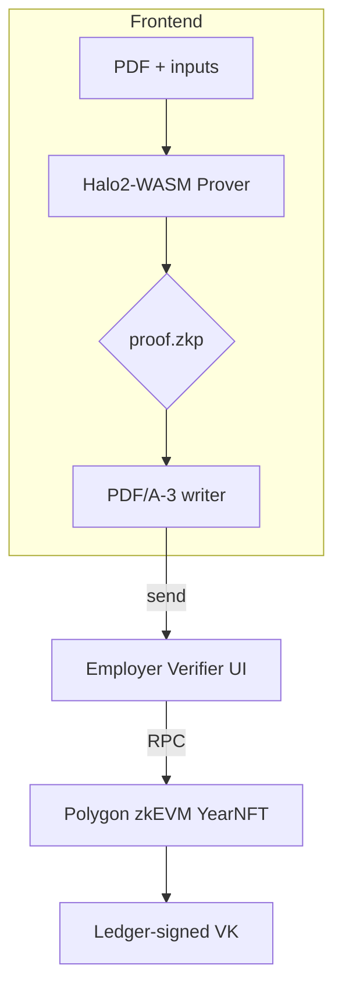
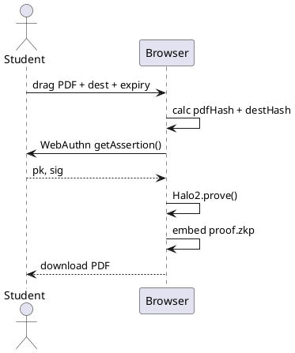

# Functional Design Specification (FSD) — ZK-CertFramework
**Version 1.0 – 2025‑06‑17**

---

## 1 Context Diagram  



## 2 User‑Interface Specifications  
### 2.1 Passkey Registration  
| Element ID | Type | Description |  
|------------|------|-------------|  
| `btnRegister` | button | initiates `navigator.credentials.create()` |  
| `txtStudentId` | input | student ID (validation: numeric) |  

### 2.2 Proof Generator  
| ID | Type | Validation |  
|----|------|------------|  
| `dropPdf` | drag‑zone | MIME `application/pdf` |  
| `txtDest` | text | SHA‑3‑512(dest) computed on blur |  
| `dateExpire` | date | must be ≤ 365 days future |  
| `btnGenerate` | button | disabled until inputs valid |  

## 3 Detailed Workflow – Proof Generation  



## 4 API Specification (excerpt, OpenAPI 3.1)

```yaml
paths:
  /register:
    post:
      summary: Register Passkey
      requestBody:
        content:
          application/json:
            schema:
              $ref: '#/components/schemas/PublicKeyRegistration'
      responses:
        '201':
          description: Created
        '409':
          description: Duplicate commit
```

## 5 Data Dictionary  

| Field | Type | Notes |  
|-------|------|-------|  
| `commit` | hex(64) | Poseidon256(pk) |  
| `vkHash` | hex(128) | SHA‑3‑512 of VK |  
| `merkleRoot` | hex(64) | Poseidon256 |  
| `salt` | hex(32) | 16 bytes random |  

## 6 Error Handling  

| Code | Message | UI Action |  
|------|---------|-----------|  
| 1001 | INVALID_PDF_HASH | show red banner |  
| 1002 | EXPIRED | show yellow banner |  
| 1003 | E‑SIG | show red banner |

## 7 Traceability Matrix (excerpt)  

| ReqID | TestID | Module/Func |  
|-------|--------|-------------|  
| FR‑02 | TC‑P02 | `zk/circuit.rs::verify_es256` |  
| FR‑03 | TC‑N03 | `frontend/verify.ts::checkExpiry` |  

---

