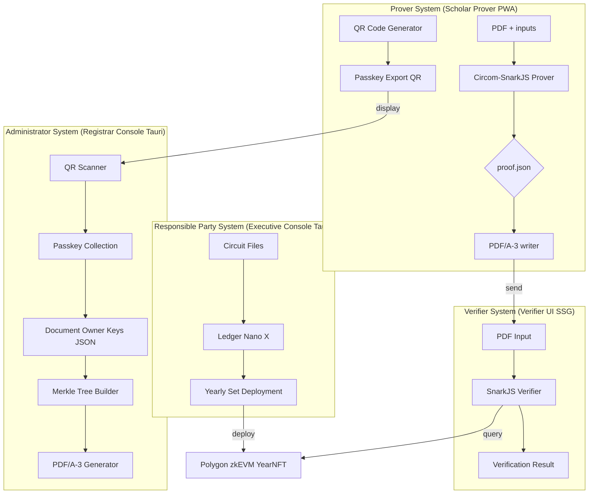
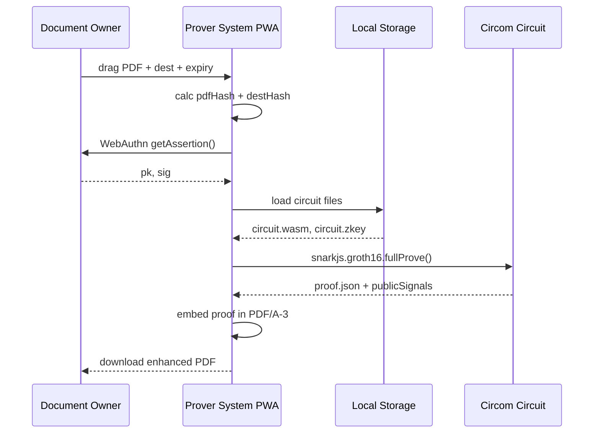
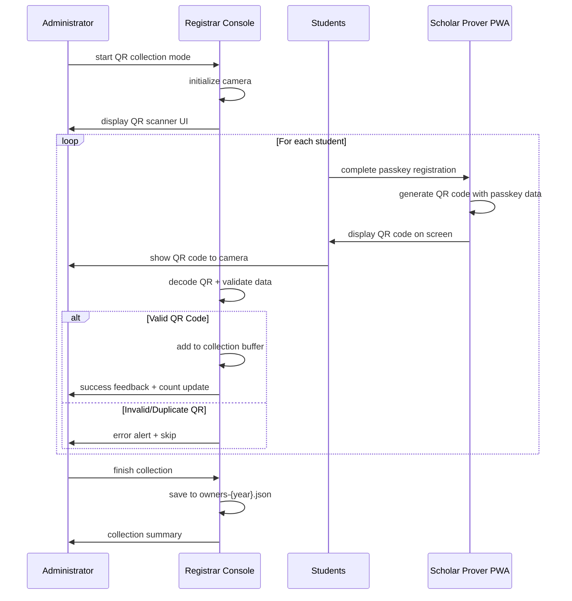
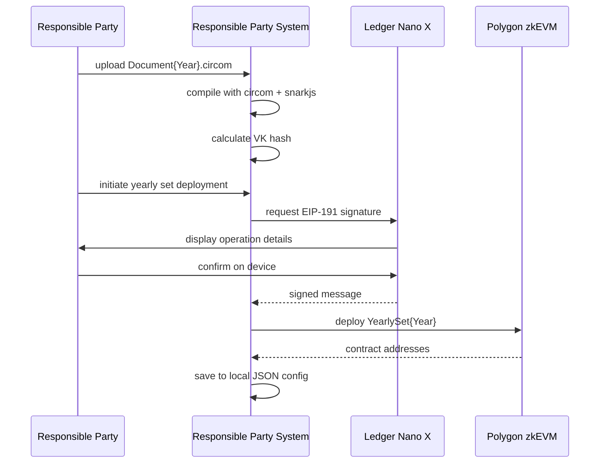

# Functional Design Specification (FSD) — ZK Document Authenticity Framework
**Version 2.2 – 2025‑01‑20**

> **Universal Document Authenticity System** - Adaptable to any document type with graduation certificates as example implementation

---

## 1 Context Diagram  



## 2 User‑Interface Specifications  
### 2.1 Passkey Registration (Prover System)
| Element ID | Type | Description |  
|------------|------|-------------|  
| `btnRegister` | button | initiates `navigator.credentials.create()` |  
| `txtOwnerId` | input | document owner ID (validation: numeric) |  
| `localStorageKey` | storage | stores passkey info locally |
| `btnExportQR` | button | generates QR code for passkey export |
| `qrDisplay` | canvas | displays QR code with passkey data |
| `qrInstructions` | text | QR code usage instructions |

### 2.2 Proof Generator (Prover System)
| ID | Type | Validation |  
|----|------|------------|  
| `dropPdf` | drag‑zone | MIME `application/pdf` |  
| `txtDest` | text | SHA‑3‑512(dest) computed on blur |  
| `dateExpire` | date | must be ≤ 365 days future |  
| `btnGenerate` | button | disabled until inputs valid |  

### 2.3 Yearly Set Management (Responsible Party System)
| ID | Type | Description |
|----|------|-------------|
| `fileCircuit` | file | Document{Year}.circom upload |
| `filePtau` | file | Powers of Tau ceremony file |
| `btnLedgerSign` | button | triggers Ledger Nano X EIP-191 signature |
| `yearInput` | number | document issuance year (2025+) |

### 2.4 Document Owner Key Management (Administrator System)  
| ID | Type | Description |
|----|------|-------------|
| `fileOwnerKeys` | file | JSON file with document owner passkey data |
| `btnBuildMerkle` | button | constructs Poseidon Merkle Tree |
| `btnGeneratePDFs` | button | batch PDF/A-3 generation |
| `btnStartQRScan` | button | starts QR code scanning mode |
| `qrScannerView` | video | camera preview for QR scanning |
| `qrScanStatus` | text | scan status and progress display |
| `qrCollectedList` | table | collected passkey data from QR scans |

### 2.5 QR Code Passkey Collection (Administrator System)
| ID | Type | Description |
|----|------|-------------|
| `yearSelector` | select | select year for passkey collection |
| `btnCameraStart` | button | start camera for QR scanning |
| `cameraPreview` | video | live camera feed |
| `scanOverlay` | div | QR code detection overlay |
| `collectionProgress` | progress | collection progress bar |
| `collectedCount` | counter | number of collected passkeys |
| `duplicateAlert` | alert | duplicate QR code warning |
| `btnFinishCollection` | button | complete collection session |

## 3 Detailed Workflow – Proof Generation  



## 4 QR Code Passkey Collection Workflow  



## 5 Yearly Set Deployment (Responsible Party System)



## 6 Data Dictionary  

| Field | Type | Notes |  
|-------|------|-------|  
| `commit` | hex(64) | Poseidon256(pk) |  
| `vkHash` | hex(128) | SHA‑3‑512 of VK |  
| `merkleRoot` | hex(64) | Poseidon256 |  
| `yearlySetAddr` | hex(40) | deployed contract address |
| `circuitHash` | hex(128) | SHA‑3‑512 of circuit file |
| `ledgerSignature` | hex(130) | EIP-191 signature from Ledger |
| `qrData` | base64 | QR encoded passkey data |  
| `qrTimestamp` | unix | QR generation timestamp |
| `scanSession` | uuid | QR collection session ID |

## 7 QR Code Data Format

### 7.1 QR Code Payload Structure
```json
{
  "version": "2.2",
  "type": "passkey_export",
  "studentId": "2025001",
  "year": 2025,
  "passkey": {
    "publicKey": "pQECAyYgASFYIBwf...rKjY",
    "credentialId": "AQIDBAUGBwgJ...",
    "algorithm": -7
  },
  "metadata": {
    "name": "田中太郎",
    "email": "tanaka@university.edu",
    "generatedAt": 1704067200000,
    "sessionId": "uuid-v4"
  },
  "integrity": {
    "checksum": "sha3-512-hash",
    "signature": "self-signed-payload"
  }
}
```

### 7.2 QR Code Technical Specifications
- **Format**: QR Code 2005 (ISO/IEC 18004)
- **Error Correction**: Level M (15% recovery)
- **Encoding**: UTF-8 JSON string
- **Size**: 33x33 modules (Version 3)
- **Capacity**: ~900 characters
- **Colors**: Black/White (high contrast)

## 8 Local Storage Architecture

### 8.1 Responsible Party System (Tauri)
```
config/
├── yearly-sets.json          # deployed yearly sets
├── circuits/Document{Year}.circom
├── build/Document{Year}.zkey
├── build/Document{Year}_vk.json
└── signatures/operations.log  # Ledger signature log
```

### 8.2 Administrator System (Tauri)  
```
data/
├── owners-{year}.json         # document owner passkey data
├── merkle-tree-{year}.json    # computed Merkle tree
├── generated-pdfs/{year}/     # batch generated PDFs
├── qr-sessions/{year}/        # QR collection session logs
│   ├── session-{uuid}.json    # individual session data
│   └── duplicates.log         # duplicate detection log
└── config.json               # app configuration
```

### 8.3 Prover System (PWA)
```
localStorage:
- passkey_info: {publicKey, credentialId}
- circuit_cache: {wasm, zkey, vk} 
- proof_history: [{pdfHash, timestamp, proofId}]
- qr_export_history: [{qrId, timestamp, exported}]
```

## 9 Error Handling  

| Code | Message | UI Action |  
|------|---------|-----------|  
| 1001 | INVALID_PDF_HASH | show red banner |  
| 1002 | EXPIRED | show yellow banner |  
| 1003 | LEDGER_DISCONNECTED | show connection dialog |
| 1004 | CIRCUIT_COMPILE_FAILED | show error details |
| 1005 | SNARKJS_PROOF_FAILED | retry with different inputs |
| 2001 | QR_GENERATION_FAILED | show QR error message |
| 2002 | CAMERA_ACCESS_DENIED | show camera permission prompt |
| 2003 | QR_DECODE_FAILED | show scan retry instruction |
| 2004 | DUPLICATE_QR_DETECTED | show duplicate warning |
| 2005 | INVALID_QR_FORMAT | show format error details |

## 10 Trust Minimization Features

### 10.1 No External Dependencies
- ✅ Zero backend servers
- ✅ Zero databases  
- ✅ Zero cloud APIs
- ✅ Zero IPFS/external storage

### 10.2 Trusted Components Only
- 🔐 Polygon zkEVM (public blockchain)
- 📱 Ledger Nano X (hardware verified)
- 🌐 npm packages (build-time verified)
- 💻 Browser standard APIs
- 📷 Device camera (local processing only)

### 10.3 Yearly Independence
- Each year = completely separate circuit + VK + NFT
- No key rotation complexity
- No cross-year dependencies
- Simple verification logic

### 10.4 QR Code Security
- 🔒 Local QR generation (no external QR services)
- 🔒 Camera processing (no image uploads)
- 🔒 Session-based collection (time-bounded)
- 🔒 Integrity verification (checksums + signatures)

## 11 Traceability Matrix  

| ReqID | TestID | Module/Implementation |  
|-------|--------|-----------------------|  
| FR‑01 | TC‑P01 | `scholar-prover/pdf-embedder.ts` |
| FR‑02 | TC‑P02 | `circuits/Document{Year}.circom` |  
| FR‑03 | TC‑N03 | `verifier-ui/expiry-check.ts` |  
| FR‑04 | TC‑N04 | `verifier-ui/vk-verification.ts` |
| FR‑05 | TC‑P05 | `executive-console/ledger-integration.ts` |
| FR‑06 | TC‑Q01 | `scholar-prover/qr-generator.ts` |
| FR‑07 | TC‑Q02 | `registrar-console/qr-scanner.ts` |
| FR‑08 | TC‑Q03 | `registrar-console/camera-integration.ts` |

---

