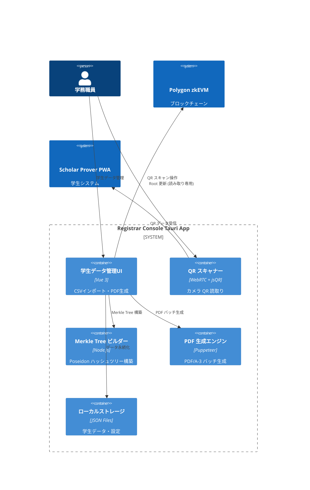
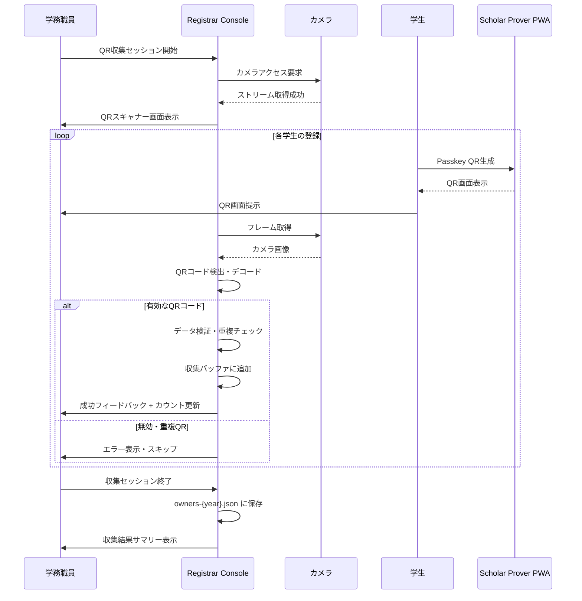
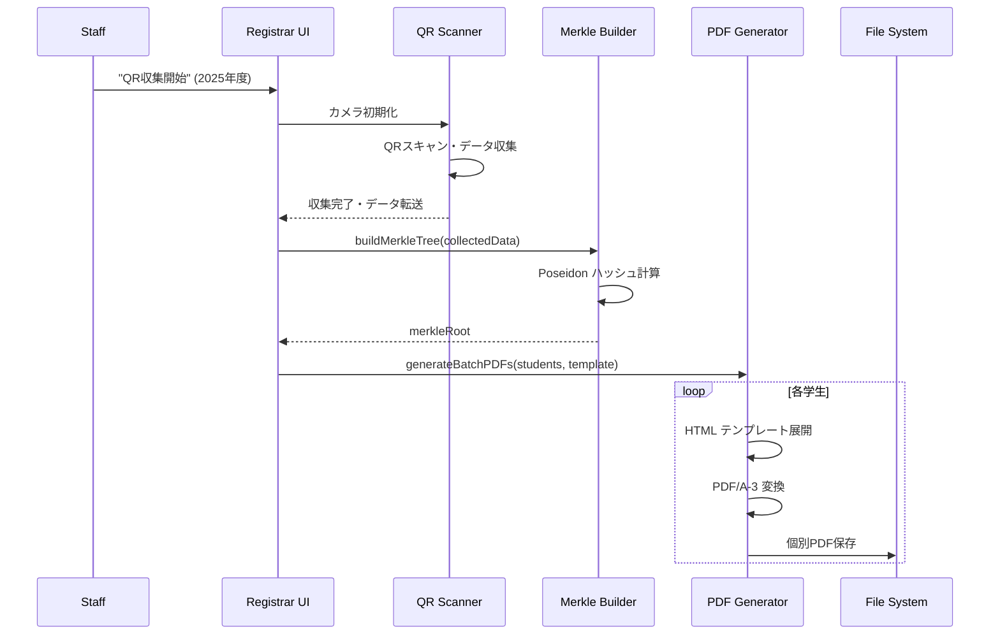

# 機能設計書 (FSD) — Registrar Console  
最終更新: 2025-08-09 (Version 2.4)

## 1. システムコンテキスト (C4 - 完全バックエンドレス版)  


## 2. 主要機能 (年度別独立管理)
### 2.1 学生データ管理
- **JSONインポート**: Passkey公開鍵データの一括取込み
- **QRスキャン収集**: カメラを使用したリアルタイム Passkey データ収集
- **年度別分離**: 2025年度、2026年度等を完全独立管理
- **データ検証**: 公開鍵形式・重複チェック

### 2.2 QR コード収集機能
- **カメラ統合**: デバイスカメラへの WebRTC アクセス
- **リアルタイム QR 認識**: jsQR ライブラリによる高速 QR デコード
- **重複検出**: スキャン済みデータの自動検出・警告
- **セッション管理**: 収集セッションの開始・終了・進捗管理

### 2.3 Merkle Tree 構築
- **Poseidon ハッシュ**: ZK-friendlyなハッシュ関数使用
- **256葉固定**: depth=8の完全バランス木
- **高速計算**: Node.js ネイティブ実装

### 2.4 PDF/A-3 生成
- **テンプレート**: カスタマイズ可能な証明書レイアウト
- **バッチ処理**: 全学生分の一括生成
- **メタデータ埋込み**: 年度・ハッシュ情報を埋込み

## 3. QR コード収集ワークフロー


## 4. ローカルファイル構造
```
~/.zk-cert-registrar/
├── data/
│   ├── students-2025.json        # 2025年度学生データ
│   ├── students-2026.json        # 2026年度学生データ
│   └── merkle-trees/
│       ├── merkle-2025.json      # 2025年度 Merkle Tree
│       └── merkle-2026.json      # 2026年度 Merkle Tree
├── qr-sessions/                  # QR収集セッション管理
│   ├── 2025/
│   │   ├── session-{uuid}.json   # 個別セッションデータ
│   │   └── duplicates.log        # 重複検出ログ
│   └── 2026/
├── templates/
│   ├── certificate-template.html  # PDF生成テンプレート
│   └── styles.css                # CSS スタイル
├── generated/
│   ├── pdfs-2025/                # 生成済みPDF (2025年度)
│   │   ├── student_001.pdf
│   │   └── student_002.pdf
│   └── pdfs-2026/                # 生成済みPDF (2026年度)
└── config/
    ├── settings.json             # アプリケーション設定
    └── camera-config.json        # カメラ設定
```

## 5. QR スキャン UI 設計
### 5.1 QR 収集開始画面
```
┌─────────────────────────────────────────────────────┐
│ QR コード収集 - 2025年度                           │
├─────────────────────────────────────────────────────┤
│ 年度選択: [2025年度 ▼]                             │
│ セッション名: [QR収集_2025-08-09] [編集]           │
├─────────────────────────────────────────────────────┤
│ カメラ設定:                                         │
│ デバイス: [Built-in Camera ▼]                      │
│ 解像度: [1280x720 ▼]    品質: [高 ▼]              │
├─────────────────────────────────────────────────────┤
│ [カメラ開始]              [設定]  [ヘルプ]         │
└─────────────────────────────────────────────────────┘
```

### 5.2 QR スキャン中画面
```
┌─────────────────────────────────────────────────────┐
│ QR スキャン中 - 2025年度                           │
├─────────────────────────────────────────────────────┤
│                                                     │
│    ┌─────────────────────────────────────┐        │
│    │                                     │        │
│    │         [カメラ映像]                │        │
│    │                                     │        │
│    │    ┌─────────────────────┐         │        │
│    │    │   QR 検出エリア     │         │        │
│    │    └─────────────────────┘         │        │
│    │                                     │        │
│    └─────────────────────────────────────┘        │
│                                                     │
├─────────────────────────────────────────────────────┤
│ 収集状況: 12/150 (8%)    [█████░░░░░░░░░░░░░░░░]     │
│ 最後のスキャン: 田中太郎 (2025001) ✅               │
│ 重複検出: 1件    エラー: 0件                        │
├─────────────────────────────────────────────────────┤
│ [収集完了]  [一時停止]  [設定]  [履歴表示]         │
└─────────────────────────────────────────────────────┘
```

### 5.3 収集完了画面
```
┌─────────────────────────────────────────────────────┐
│ QR 収集完了 - 2025年度                             │
├─────────────────────────────────────────────────────┤
│ セッション結果:                                     │
│ 開始時刻: 2025-08-09 10:00:00                      │
│ 終了時刻: 2025-08-09 11:30:00                      │
│ 所要時間: 1時間30分                                 │
├─────────────────────────────────────────────────────┤
│ 収集統計:                                           │
│ 成功: 148件  重複: 2件  エラー: 0件                 │
│ 総学生数: 150件  収集率: 98.7%                      │
├─────────────────────────────────────────────────────┤
│ 次のステップ:                                       │
│ ☐ Merkle Tree 構築                                │
│ ☐ PDF バッチ生成                                   │
│ ☐ セッションデータ保存                              │
├─────────────────────────────────────────────────────┤
│ [Merkle Tree 構築] [レポート出力] [閉じる]         │
└─────────────────────────────────────────────────────┘
```

## 6. JSON データスキーマ
### 6.1 学生データ (students-{year}.json)
```json
{
  "version": "2.2",
  "year": 2025,
  "lastUpdated": 1704067200000,
  "collectionMethod": "qr_scan",
  "students": [
    {
      "id": "2025001",
      "name": "田中太郎", 
      "email": "tanaka@university.edu",
      "passkey": {
        "publicKey": "pQECAyYgASFYIBwf...rKjY",
        "credentialId": "AQIDBAUGBwgJ...",
        "algorithm": -7
      },
      "commit": "0x1a2b3c4d...",
      "merkleIndex": 0,
      "registrationDate": 1704067200000,
      "qrScanSession": {
        "sessionId": "uuid-v4",
        "scannedAt": 1704067200000,
        "scannerVersion": "2.2",
        "checksum": "sha3-hash"
      }
    }
  ],
  "statistics": {
    "totalStudents": 1,
    "merkleRoot": "0xabcd1234...",
    "merkleDepth": 8
  }
}
```

### 6.2 QR収集セッション (session-{uuid}.json)
```json
{
  "sessionId": "uuid-v4",
  "year": 2025,
  "startTime": 1704067200000,
  "endTime": 1704070800000,
  "status": "completed",
  "operator": "学務太郎",
  "statistics": {
    "totalScanned": 150,
    "successful": 148,
    "duplicates": 2,
    "errors": 0,
    "scanRate": 98.7
  },
  "scannedStudents": [
    {
      "studentId": "2025001",
      "scannedAt": 1704067200000,
      "qrData": "base64-encoded-qr-payload",
      "status": "success",
      "checksum": "sha3-hash"
    }
  ],
  "duplicates": [
    {
      "studentId": "2025002",
      "firstScanAt": 1704067300000,
      "duplicateScanAt": 1704067400000,
      "action": "skipped"
    }
  ]
}
```

## 7. API イベント (Tauri Rust Backend)
| メソッド | パラメータ | 説明 |
|----------|------------|------|
| `startQRSession(year, sessionName)` | year, sessionName | QR収集セッション開始 |
| `initializeCamera(deviceId, config)` | deviceId, cameraConfig | カメラ初期化・設定 |
| `scanQRCode(frameData)` | imageData | QRコードスキャン・デコード |
| `validateQRData(qrPayload)` | jsonPayload | QRデータ検証・重複チェック |
| `addToCollection(studentData)` | validatedData | 収集バッファに追加 |
| `finishQRSession(sessionId)` | sessionId | セッション終了・保存 |
| `importStudentData(year, file)` | year, jsonFile | 学生データJSON取込み |
| `buildMerkleTree(year)` | year | Poseidon Merkle Tree 構築 |
| `generatePDFs(year, template)` | year, templateId | PDF/A-3 バッチ生成 |
| `exportMerkleRoot(year)` | year | Merkle Root エクスポート |

## 8. QR スキャナー実装
```typescript
// QR スキャナー統合クラス
class QRPasskeyScanner {
  private camera: MediaStream | null = null;
  private video: HTMLVideoElement;
  private canvas: HTMLCanvasElement;
  private context: CanvasRenderingContext2D;
  private scanInterval: number;
  private collectionBuffer: StudentData[] = [];
  
  async initializeCamera(constraints: MediaStreamConstraints): Promise<void> {
    try {
      this.camera = await navigator.mediaDevices.getUserMedia(constraints);
      this.video.srcObject = this.camera;
      await this.video.play();
      
      // カメラ初期化完了イベント
      this.emit('camera:initialized', {
        width: this.video.videoWidth,
        height: this.video.videoHeight
      });
    } catch (error) {
      throw new Error(`カメラアクセスエラー: ${error.message}`);
    }
  }
  
  startScanning(): void {
    this.scanInterval = setInterval(() => {
      this.scanFrame();
    }, 100); // 10fps でスキャン
  }
  
  private scanFrame(): void {
    // ビデオフレームをCanvasに描画
    this.context.drawImage(
      this.video, 
      0, 0, 
      this.canvas.width, 
      this.canvas.height
    );
    
    // Canvas から ImageData 取得
    const imageData = this.context.getImageData(
      0, 0, 
      this.canvas.width, 
      this.canvas.height
    );
    
    // jsQR でQRコード検出
    const qrResult = jsQR(imageData.data, imageData.width, imageData.height);
    
    if (qrResult) {
      this.processQRData(qrResult.data);
    }
  }
  
  private async processQRData(qrData: string): Promise<void> {
    try {
      // 1. JSON パース
      const qrPayload = JSON.parse(qrData);
      
      // 2. 形式検証
      if (!this.validateQRFormat(qrPayload)) {
        throw new Error('無効なQR形式');
      }
      
      // 3. チェックサム検証
      if (!await this.verifyChecksum(qrPayload)) {
        throw new Error('チェックサム検証失敗');
      }
      
      // 4. 重複チェック
      if (this.isDuplicate(qrPayload.studentId)) {
        this.emit('scan:duplicate', qrPayload);
        return;
      }
      
      // 5. 収集バッファに追加
      this.addToCollectionBuffer(qrPayload);
      
      // 6. 成功イベント発火
      this.emit('scan:success', {
        studentId: qrPayload.studentId,
        name: qrPayload.metadata.name,
        timestamp: Date.now()
      });
      
    } catch (error) {
      this.emit('scan:error', {
        error: error.message,
        rawData: qrData
      });
    }
  }
  
  private validateQRFormat(payload: any): boolean {
    return (
      payload.version === '2.2' &&
      payload.type === 'passkey_export' &&
      payload.studentId &&
      payload.year &&
      payload.passkey &&
      payload.passkey.publicKey &&
      payload.passkey.credentialId &&
      payload.integrity &&
      payload.integrity.checksum
    );
  }
  
  private async verifyChecksum(payload: any): Promise<boolean> {
    const { integrity, ...payloadWithoutIntegrity } = payload;
    const calculatedChecksum = await this.calculateSHA3(
      JSON.stringify(payloadWithoutIntegrity)
    );
    return calculatedChecksum === integrity.checksum;
  }
  
  private isDuplicate(studentId: string): boolean {
    return this.collectionBuffer.some(
      student => student.id === studentId
    );
  }
  
  stopScanning(): void {
    if (this.scanInterval) {
      clearInterval(this.scanInterval);
    }
    
    if (this.camera) {
      this.camera.getTracks().forEach(track => track.stop());
      this.camera = null;
    }
  }
  
  getCollectionSummary(): CollectionSummary {
    return {
      totalScanned: this.collectionBuffer.length,
      sessionDuration: Date.now() - this.sessionStartTime,
      scanRate: this.calculateScanRate()
    };
  }
}

// Vue.js コンポーネント実装
const QRScannerComponent = {
  template: `
    <div class="qr-scanner">
      <div class="camera-container">
        <video ref="video" autoplay muted></video>
        <canvas ref="canvas" class="scan-overlay"></canvas>
        <div class="scan-guide">
          QRコードをカメラに向けてください
        </div>
      </div>
      
      <div class="scan-status">
        <div class="progress-bar">
          <div class="progress" :style="{width: progressPercent + '%'}"></div>
        </div>
        <div class="scan-info">
          収集済み: {{ collectedCount }} / {{ totalExpected }}
          ({{ Math.round(progressPercent) }}%)
        </div>
      </div>
      
      <div class="scan-controls">
        <button @click="startSession" :disabled="isScanning">
          収集開始
        </button>
        <button @click="pauseSession" :disabled="!isScanning">
          一時停止
        </button>
        <button @click="finishSession" :disabled="!isScanning">
          収集完了
        </button>
      </div>
    </div>
  `,
  
  data() {
    return {
      scanner: null,
      isScanning: false,
      collectedCount: 0,
      totalExpected: 150,
      sessionId: null
    };
  },
  
  computed: {
    progressPercent() {
      return (this.collectedCount / this.totalExpected) * 100;
    }
  },
  
  methods: {
    async startSession() {
      this.scanner = new QRPasskeyScanner();
      
      // イベントリスナー設定
      this.scanner.on('scan:success', this.onScanSuccess);
      this.scanner.on('scan:duplicate', this.onScanDuplicate);
      this.scanner.on('scan:error', this.onScanError);
      
      // カメラ初期化・スキャン開始
      await this.scanner.initializeCamera({
        video: { width: 1280, height: 720 }
      });
      
      this.scanner.startScanning();
      this.isScanning = true;
    },
    
    onScanSuccess(data) {
      this.collectedCount++;
      this.showSuccessNotification(data);
    },
    
    onScanDuplicate(data) {
      this.showDuplicateWarning(data);
    },
    
    finishSession() {
      this.scanner.stopScanning();
      this.isScanning = false;
      
      const summary = this.scanner.getCollectionSummary();
      this.showCompletionDialog(summary);
    }
  }
};
```

## 9. Merkle Tree アルゴリズム
```typescript
// Poseidon Merkle Tree 実装
import { poseidon2 } from "@noble/hashes/poseidon";

class PoseidonMerkleTree {
  private readonly DEPTH = 8;
  private readonly ZERO_VALUE = BigInt(0);
  
  constructor() {
    this.zeroHashes = this.computeZeroHashes();
  }
  
  buildTree(commits: bigint[]): MerkleTreeData {
    // 1. 256葉にパディング
    const leaves = [...commits];
    while (leaves.length < 256) {
      leaves.push(this.ZERO_VALUE);
    }
    
    // 2. レベル別ハッシュ計算
    const tree: bigint[][] = [leaves];
    
    for (let level = 0; level < this.DEPTH; level++) {
      const currentLevel = tree[level];
      const nextLevel: bigint[] = [];
      
      for (let i = 0; i < currentLevel.length; i += 2) {
        const left = currentLevel[i];
        const right = currentLevel[i + 1];
        const parent = poseidon2([left, right]);
        nextLevel.push(parent);
      }
      
      tree.push(nextLevel);
    }
    
    return {
      depth: this.DEPTH,
      leaves,
      tree,
      root: tree[this.DEPTH][0]
    };
  }
  
  getMerkleProof(tree: bigint[][], leafIndex: number): MerkleProof {
    const proof: bigint[] = [];
    const pathIndices: number[] = [];
    
    let currentIndex = leafIndex;
    
    for (let level = 0; level < this.DEPTH; level++) {
      const siblingIndex = currentIndex % 2 === 0 ? currentIndex + 1 : currentIndex - 1;
      proof.push(tree[level][siblingIndex]);
      pathIndices.push(currentIndex % 2);
      currentIndex = Math.floor(currentIndex / 2);
    }
    
    return { proof, pathIndices };
  }
}
```

## 10. PDF 生成フロー


## 11. バッチ処理最適化
- **並列生成**: 複数PDF同時生成 (CPU cores数)
- **メモリ管理**: 大量データの段階的処理
- **プログレス表示**: リアルタイム進捗表示
- **エラー回復**: 部分失敗時の自動リトライ

## 12. データ検証機能
```typescript
// データ整合性検証
class DataValidator {
  validateStudentData(students: StudentData[]): ValidationResult {
    const errors: ValidationError[] = [];
    
    for (const student of students) {
      // 1. Passkey公開鍵形式検証
      if (!this.isValidCOSEKey(student.passkey.publicKey)) {
        errors.push({ studentId: student.id, error: 'Invalid COSE key format' });
      }
      
      // 2. Commit値検証
      const computedCommit = this.computePoseidonCommit(student.passkey.publicKey);
      if (computedCommit !== student.commit) {
        errors.push({ studentId: student.id, error: 'Commit mismatch' });
      }
      
      // 3. 重複チェック
      if (this.isDuplicate(student.passkey.credentialId)) {
        errors.push({ studentId: student.id, error: 'Duplicate credential ID' });
      }
    }
    
    return { valid: errors.length === 0, errors };
  }
}
```

## 13. エラーハンドリング
| エラーコード | メッセージ | UI対応 |
|-------------|------------|--------|
| 2001 | INVALID_JSON_FORMAT | JSONファイル形式エラー表示 |
| 2002 | DUPLICATE_STUDENT_ID | 重複学生ID一覧表示 |
| 2003 | INVALID_PASSKEY_FORMAT | 無効Passkey詳細表示 |
| 2004 | MERKLE_BUILD_FAILED | Merkle Tree構築エラー |
| 2005 | PDF_GENERATION_FAILED | PDF生成失敗原因表示 |
| 2006 | STORAGE_QUOTA_EXCEEDED | ディスク容量不足警告 |

## 14. セキュリティ・プライバシー
- **ローカル処理**: 学生データは外部送信しない
- **暗号化保存**: 機密データの暗号化オプション
- **アクセス制御**: ファイルシステムレベルの権限管理
- **監査ログ**: 全操作のローカルログ記録

