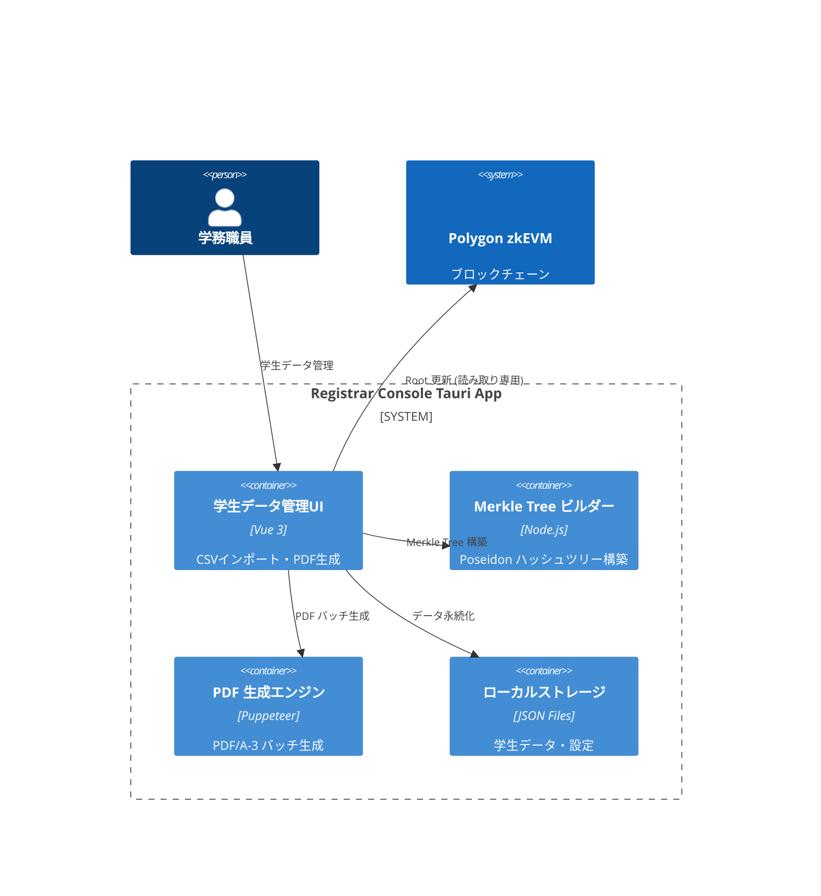
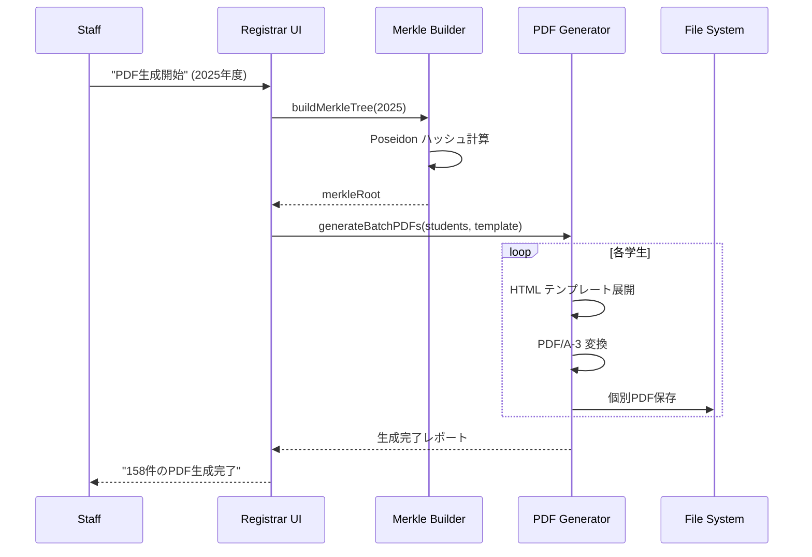

# 機能設計書 (FSD) — Registrar Console  
最終更新: 2025-06-17 (Version 2.0)

## 1. システムコンテキスト (C4 - 完全バックエンドレス版)  


## 2. 主要機能 (年度別独立管理)
### 2.1 学生データ管理
- **JSONインポート**: Passkey公開鍵データの一括取込み
- **年度別分離**: 2025年度、2026年度等を完全独立管理
- **データ検証**: 公開鍵形式・重複チェック

### 2.2 Merkle Tree 構築
- **Poseidon ハッシュ**: ZK-friendlyなハッシュ関数使用
- **256葉固定**: depth=8の完全バランス木
- **高速計算**: Node.js ネイティブ実装

### 2.3 PDF/A-3 生成
- **テンプレート**: カスタマイズ可能な証明書レイアウト
- **バッチ処理**: 全学生分の一括生成
- **メタデータ埋込み**: 年度・ハッシュ情報を埋込み

## 3. ローカルファイル構造
```
~/.zk-cert-registrar/
├── data/
│   ├── students-2025.json        # 2025年度学生データ
│   ├── students-2026.json        # 2026年度学生データ
│   └── merkle-trees/
│       ├── merkle-2025.json      # 2025年度 Merkle Tree
│       └── merkle-2026.json      # 2026年度 Merkle Tree
├── templates/
│   ├── certificate-template.html  # PDF生成テンプレート
│   └── styles.css                # CSS スタイル
├── generated/
│   ├── pdfs-2025/                # 生成済みPDF (2025年度)
│   │   ├── student_001.pdf
│   │   └── student_002.pdf
│   └── pdfs-2026/                # 生成済みPDF (2026年度)
└── config/
    └── settings.json             # アプリケーション設定
```

## 4. JSON データスキーマ
### 4.1 学生データ (students-{year}.json)
```json
{
  "version": "2.0",
  "year": 2025,
  "lastUpdated": 1704067200000,
  "students": [
    {
      "id": "2025001",
      "name": "田中太郎", 
      "email": "tanaka@university.edu",
      "passkey": {
        "publicKey": "pQECAyYgASFYIBwf...rKjY", // Base64 COSE_Key
        "credentialId": "AQIDBAUGBwgJ...",        // Base64 credential ID
        "algorithm": -7                           // ES256
      },
      "commit": "0x1a2b3c4d...",                 // Poseidon(publicKey)
      "merkleIndex": 0,                          // Merkle Tree上の位置
      "registrationDate": 1704067200000
    }
  ],
  "statistics": {
    "totalStudents": 1,
    "merkleRoot": "0xabcd1234...",
    "merkleDepth": 8
  }
}
```

### 4.2 Merkle Tree (merkle-{year}.json)
```json
{
  "version": "2.0", 
  "year": 2025,
  "depth": 8,
  "totalLeaves": 256,
  "actualStudents": 1,
  "root": "0xabcd1234efgh5678...",
  "leaves": [
    "0x1a2b3c4d...", // commit[0]
    "0x0000000000...", // zeroValue (padding)
    "..."
  ],
  "tree": {
    "level0": ["0x1a2b3c4d...", "0x0000000000...", "..."], // 256 leaves
    "level1": ["0x2b3c4d5e...", "0x0000000000...", "..."], // 128 nodes  
    "level2": ["0x3c4d5e6f...", "0x0000000000...", "..."], // 64 nodes
    "level3": ["0x4d5e6f70...", "0x0000000000...", "..."], // 32 nodes
    "level4": ["0x5e6f7081...", "0x0000000000...", "..."], // 16 nodes
    "level5": ["0x6f708192...", "0x0000000000...", "..."], // 8 nodes
    "level6": ["0x708192a3...", "0x0000000000...", "..."], // 4 nodes
    "level7": ["0x8192a3b4...", "0x0000000000...", "..."], // 2 nodes
    "level8": ["0xabcd1234efgh5678..."]                    // 1 root
  },
  "generatedAt": 1704067200000
}
```

## 5. UI ワークフロー
### 5.1 データインポート画面
```
┌─────────────────────────────────────────────────────┐
│ 学生データインポート - 2025年度                      │
├─────────────────────────────────────────────────────┤
│ ファイル選択: [students-passkeys.json] [📁参照]    │
│ インポート形式: ○JSON  ○CSV                        │
├─────────────────────────────────────────────────────┤
│ プレビュー (先頭3件):                               │
│ ID      │ 氏名      │ Passkey公開鍵    │ ステータス │
│ 2025001 │ 田中太郎  │ pQECAyYgASFY... │ ✅ Valid  │
│ 2025002 │ 佐藤花子  │ pQECAyYgBSFY... │ ✅ Valid  │  
│ 2025003 │ 山田太郎  │ pQECAyYgCSFY... │ ❌ Dup    │
├─────────────────────────────────────────────────────┤
│ 検証結果: 正常 2件 / エラー 1件                     │
│ [キャンセル]              [インポート実行]        │
└─────────────────────────────────────────────────────┘
```

### 5.2 Merkle Tree 管理画面
```
┌─────────────────────────────────────────────────────┐
│ Merkle Tree 管理 - 2025年度                         │
├─────────────────────────────────────────────────────┤
│ 学生数: 158名 / 256葉 (62%使用率)                   │
│ Merkle Root: 0xabcd1234efgh5678... [📋コピー]      │
│ 最終更新: 2024-12-31 15:30:00                      │
├─────────────────────────────────────────────────────┤
│ Tree 可視化:                                        │
│                  [Root]                             │
│                 /      \                            │
│            [Node1]    [Node2]                       │
│            /    \      /    \                       │
│       [Leaf1][Leaf2][Leaf3][...]                   │
├─────────────────────────────────────────────────────┤
│ [Tree 再構築]  [エクスポート]  [検証実行]          │
└─────────────────────────────────────────────────────┘
```

## 6. API イベント (Tauri Rust Backend)
| メソッド | パラメータ | 説明 |
|----------|------------|------|
| `importStudentData(year, file)` | year, jsonFile | 学生データJSON取込み |
| `buildMerkleTree(year)` | year | Poseidon Merkle Tree 構築 |
| `generatePDFs(year, template)` | year, templateId | PDF/A-3 バッチ生成 |
| `exportMerkleRoot(year)` | year | Merkle Root エクスポート |
| `validateData(year)` | year | データ整合性検証 |
| `getStudentProof(year, studentId)` | year, studentId | 個別学生の Merkle Proof |

## 7. Merkle Tree アルゴリズム
```typescript
// Poseidon Merkle Tree 実装
import { poseidon2 } from "@noble/hashes/poseidon";

class PoseidonMerkleTree {
  private readonly DEPTH = 8;
  private readonly ZERO_VALUE = BigInt(0);
  
  constructor() {
    this.zeroHashes = this.computeZeroHashes();
  }
  
  buildTree(commits: bigint[]): MerkleTreeData {
    // 1. 256葉にパディング
    const leaves = [...commits];
    while (leaves.length < 256) {
      leaves.push(this.ZERO_VALUE);
    }
    
    // 2. レベル別ハッシュ計算
    const tree: bigint[][] = [leaves];
    
    for (let level = 0; level < this.DEPTH; level++) {
      const currentLevel = tree[level];
      const nextLevel: bigint[] = [];
      
      for (let i = 0; i < currentLevel.length; i += 2) {
        const left = currentLevel[i];
        const right = currentLevel[i + 1];
        const parent = poseidon2([left, right]);
        nextLevel.push(parent);
      }
      
      tree.push(nextLevel);
    }
    
    return {
      depth: this.DEPTH,
      leaves,
      tree,
      root: tree[this.DEPTH][0]
    };
  }
  
  getMerkleProof(tree: bigint[][], leafIndex: number): MerkleProof {
    const proof: bigint[] = [];
    const pathIndices: number[] = [];
    
    let currentIndex = leafIndex;
    
    for (let level = 0; level < this.DEPTH; level++) {
      const siblingIndex = currentIndex % 2 === 0 ? currentIndex + 1 : currentIndex - 1;
      proof.push(tree[level][siblingIndex]);
      pathIndices.push(currentIndex % 2);
      currentIndex = Math.floor(currentIndex / 2);
    }
    
    return { proof, pathIndices };
  }
}
```

## 8. PDF 生成フロー


## 9. バッチ処理最適化
- **並列生成**: 複数PDF同時生成 (CPU cores数)
- **メモリ管理**: 大量データの段階的処理
- **プログレス表示**: リアルタイム進捗表示
- **エラー回復**: 部分失敗時の自動リトライ

## 10. データ検証機能
```typescript
// データ整合性検証
class DataValidator {
  validateStudentData(students: StudentData[]): ValidationResult {
    const errors: ValidationError[] = [];
    
    for (const student of students) {
      // 1. Passkey公開鍵形式検証
      if (!this.isValidCOSEKey(student.passkey.publicKey)) {
        errors.push({ studentId: student.id, error: 'Invalid COSE key format' });
      }
      
      // 2. Commit値検証
      const computedCommit = this.computePoseidonCommit(student.passkey.publicKey);
      if (computedCommit !== student.commit) {
        errors.push({ studentId: student.id, error: 'Commit mismatch' });
      }
      
      // 3. 重複チェック
      if (this.isDuplicate(student.passkey.credentialId)) {
        errors.push({ studentId: student.id, error: 'Duplicate credential ID' });
      }
    }
    
    return { valid: errors.length === 0, errors };
  }
}
```

## 11. エラーハンドリング
| エラーコード | メッセージ | UI対応 |
|-------------|------------|--------|
| 2001 | INVALID_JSON_FORMAT | JSONファイル形式エラー表示 |
| 2002 | DUPLICATE_STUDENT_ID | 重複学生ID一覧表示 |
| 2003 | INVALID_PASSKEY_FORMAT | 無効Passkey詳細表示 |
| 2004 | MERKLE_BUILD_FAILED | Merkle Tree構築エラー |
| 2005 | PDF_GENERATION_FAILED | PDF生成失敗原因表示 |
| 2006 | STORAGE_QUOTA_EXCEEDED | ディスク容量不足警告 |

## 12. セキュリティ・プライバシー
- **ローカル処理**: 学生データは外部送信しない
- **暗号化保存**: 機密データの暗号化オプション
- **アクセス制御**: ファイルシステムレベルの権限管理
- **監査ログ**: 全操作のローカルログ記録

