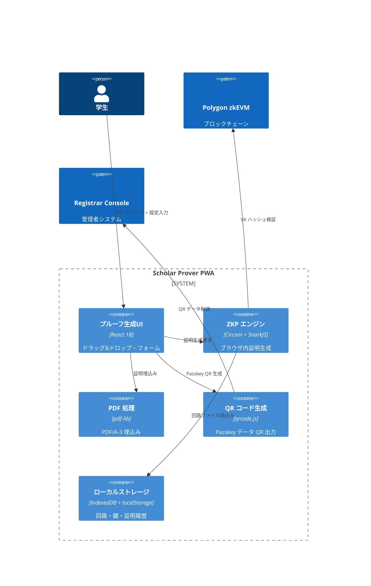
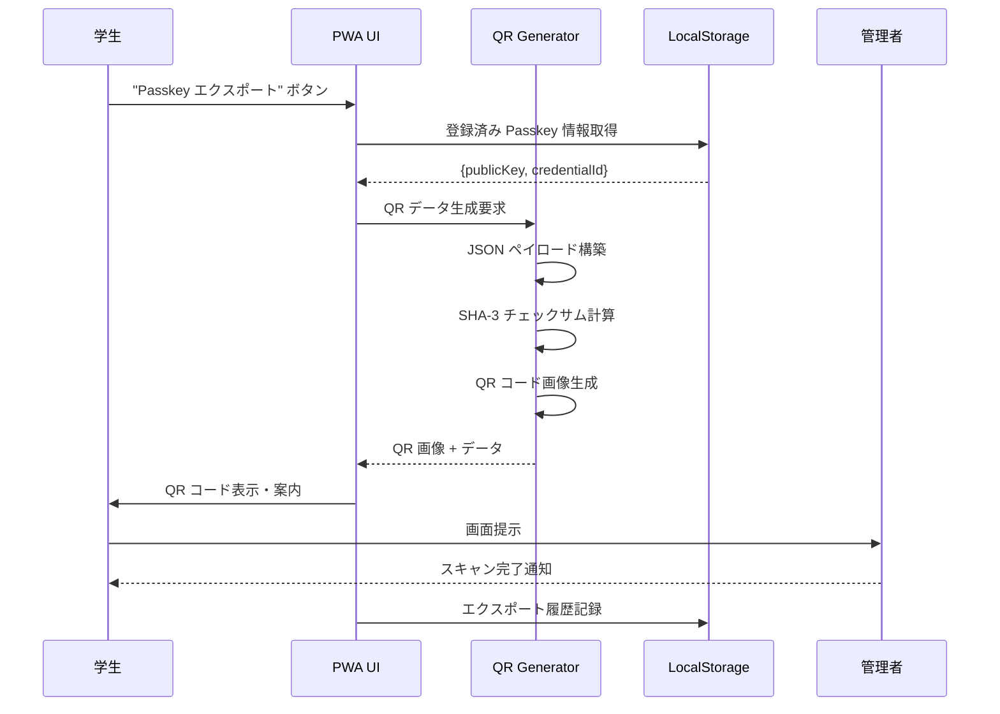
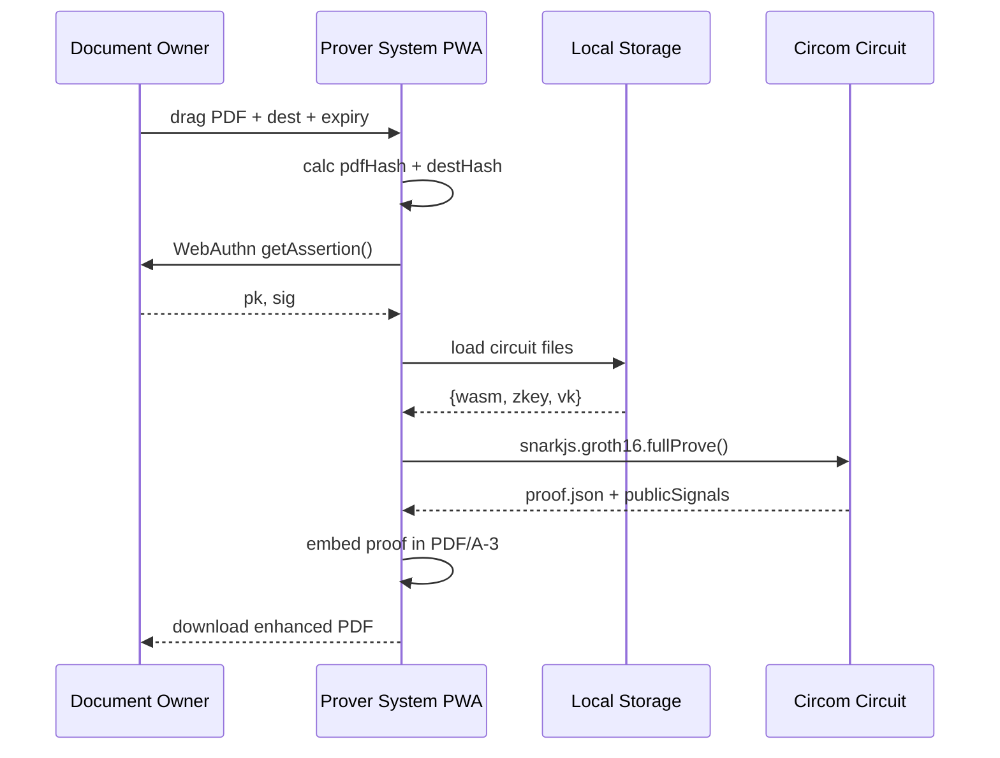

# 機能設計書 (FSD) — Scholar Prover  
最終更新: 2025-07-10 (Version 2.2)

## 1. システム構成 (C4 コンテキスト)  


## 2. UI フロー (完全ブラウザ内完結)
1. **初回セットアップ**: WebAuthn Passkey 登録 + 回路ファイルダウンロード
2. **Passkey エクスポート**: QR コード生成 + 管理者スキャン
3. **証明生成**: PDF ドロップ → 設定入力 → 証明生成 → PDF/A-3 埋込み → ダウンロード
4. **履歴管理**: 過去の証明生成履歴をローカル表示

## 3. PWA イベント API  
| イベント | データ | 説明 |
|----------|--------|------|
| REGISTER_PASSKEY | {studentId, credentialOptions} | WebAuthn 登録 |
| EXPORT_PASSKEY_QR | {year, studentId, metadata} | QR コード生成・表示 |
| LOAD_CIRCUIT | {year} | 年度別回路ファイル取得 |
| GENERATE_PROOF | {inputs, pdf, dest, expiry} | Circom/SnarkJS 証明生成 |
| EMBED_PDF | {pdf, proof, publicSignals} | PDF/A-3 添付 |
| VERIFY_LOCAL | {proof, publicSignals} | ローカル検証 |

## 4. ローカルストレージ構造
```typescript
// localStorage キー
interface LocalStorageKeys {
  'zk-cert.passkey': PasskeyInfo;
  'zk-cert.settings': UserSettings;
  'zk-cert.proof-history': ProofHistoryEntry[];
  'zk-cert.qr-export-history': QRExportEntry[];
}

// IndexedDB オブジェクトストア
interface CircuitStore {
  storeName: 'circuits';
  keyPath: 'year';
  data: {
    year: number;
    wasmFile: Uint8Array;
    zkeyFile: Uint8Array;
    vkJson: VerifyingKey;
    circuitHash: string;
  };
}

// QR エクスポート履歴
interface QRExportEntry {
  exportId: string;
  year: number;
  studentId: string;
  exportedAt: Date;
  status: 'generated' | 'scanned' | 'expired';
}
```

## 5. QR コード生成・表示フロー


## 6. QR コード データ形式
```json
{
  "version": "2.2",
  "type": "passkey_export",
  "studentId": "2025001",
  "year": 2025,
  "passkey": {
    "publicKey": "pQECAyYgASFYIBwf...rKjY",
    "credentialId": "AQIDBAUGBwgJ...",
    "algorithm": -7
  },
  "metadata": {
    "name": "田中太郎",
    "email": "tanaka@university.edu",
    "generatedAt": 1704067200000,
    "sessionId": "uuid-v4"
  },
  "integrity": {
    "checksum": "sha3-512-hash-of-payload",
    "signature": "self-signed-validation"
  }
}
```

## 7. JSON 形式 (証明データ)
```json
{
  "proof": {
    "pi_a": ["0x...", "0x...", "0x1"],
    "pi_b": [["0x...", "0x..."], ["0x...", "0x..."], ["0x1", "0x0"]],
    "pi_c": ["0x...", "0x...", "0x1"],
    "protocol": "groth16",
    "curve": "bn128"
  },
  "publicSignals": [
    "0x...", // vkHash
    "0x...", // schemaHash  
    "0x...", // merkleRoot
    "0x...", // pdfHash
    "0x...", // destHash
    "1704067200000" // expireTs
  ],
  "metadata": {
    "version": "2.2",
    "year": 2025,
    "generatedAt": 1688140800000,
    "proofId": "uuid-v4"
  }
}
```

## 8. シーケンス (正常フロー - Circom版)


## 9. QR コード統合実装
```typescript
// QR コード生成・表示クラス
class PasskeyQRExporter {
  async generateQRCode(
    studentId: string,
    year: number,
    passkeyData: PasskeyCredentials,
    metadata: StudentMetadata
  ): Promise<QRCodeResult> {
    // 1. QR ペイロード構築
    const payload = {
      version: "2.2",
      type: "passkey_export",
      studentId,
      year,
      passkey: {
        publicKey: passkeyData.publicKey,
        credentialId: passkeyData.credentialId,
        algorithm: passkeyData.algorithm
      },
      metadata: {
        name: metadata.name,
        email: metadata.email,
        generatedAt: Date.now(),
        sessionId: crypto.randomUUID()
      }
    };
    
    // 2. 整合性チェックサム計算
    const payloadString = JSON.stringify(payload);
    const checksum = await this.calculateSHA3(payloadString);
    payload.integrity = { checksum };
    
    // 3. QR コード画像生成
    const qrDataString = JSON.stringify(payload);
    const qrCodeDataURL = await QRCode.toDataURL(qrDataString, {
      errorCorrectionLevel: 'M',
      type: 'image/png',
      quality: 0.92,
      margin: 2,
      color: {
        dark: '#000000',
        light: '#FFFFFF'
      }
    });
    
    // 4. エクスポート履歴記録
    await this.recordExportHistory({
      exportId: payload.metadata.sessionId,
      year,
      studentId,
      exportedAt: new Date(),
      status: 'generated'
    });
    
    return {
      qrCodeImage: qrCodeDataURL,
      payload,
      exportId: payload.metadata.sessionId
    };
  }
  
  private async calculateSHA3(data: string): Promise<string> {
    const encoder = new TextEncoder();
    const dataBuffer = encoder.encode(data);
    const hashBuffer = await crypto.subtle.digest('SHA-384', dataBuffer);
    return Array.from(new Uint8Array(hashBuffer))
      .map(b => b.toString(16).padStart(2, '0'))
      .join('');
  }
}

// React コンポーネント実装
const QRExportModal: React.FC<QRExportProps> = ({ 
  isOpen, 
  onClose, 
  studentData, 
  passkeyData 
}) => {
  const [qrCode, setQRCode] = useState<string | null>(null);
  const [isGenerating, setIsGenerating] = useState(false);
  
  const generateQR = async () => {
    setIsGenerating(true);
    try {
      const exporter = new PasskeyQRExporter();
      const result = await exporter.generateQRCode(
        studentData.id,
        studentData.year,
        passkeyData,
        studentData.metadata
      );
      setQRCode(result.qrCodeImage);
    } catch (error) {
      console.error('QR生成エラー:', error);
      // エラーハンドリング
    } finally {
      setIsGenerating(false);
    }
  };
  
  return (
    <Modal isOpen={isOpen} onClose={onClose}>
      <div className="qr-export-modal">
        <h2>Passkey データ QR エクスポート</h2>
        
        {!qrCode && (
          <button 
            onClick={generateQR} 
            disabled={isGenerating}
            className="generate-qr-btn"
          >
            {isGenerating ? 'QR生成中...' : 'QRコード生成'}
          </button>
        )}
        
        {qrCode && (
          <div className="qr-display">
            
            <p className="qr-instructions">
              この QR コードを管理者に提示してください。<br/>
              スキャン完了まで画面を表示し続けてください。
            </p>
          </div>
        )}
      </div>
    </Modal>
  );
};
```

## 10. 回路統合詳細
```typescript
// Circom/SnarkJS 統合実装
class CircomProofGenerator {
  async generateProof(inputs: ProofInputs): Promise<ProofResult> {
    // 1. 回路ファイルをIndexedDBから取得
    const { wasm, zkey } = await this.loadCircuitFiles(inputs.year);
    
    // 2. SnarkJS でGroth16証明生成
    const { proof, publicSignals } = await snarkjs.groth16.fullProve(
      {
        privateKey: inputs.privateKey,
        signature: inputs.signature,
        pdfHash: inputs.pdfHash,
        destHash: inputs.destHash,
        expireTs: inputs.expireTs,
        merkleProof: inputs.merkleProof,
        merkleIndex: inputs.merkleIndex
      },
      wasm,
      zkey
    );
    
    // 3. 形式変換してPDF埋込み用に返却
    return {
      proof: this.formatProof(proof),
      publicSignals: publicSignals.map(BigInt),
      metadata: {
        version: "2.2",
        year: inputs.year,
        generatedAt: Date.now(),
        proofId: crypto.randomUUID()
      }
    };
  }
}
```

## 11. PWA 機能
- **オフライン動作**: Service Worker で回路ファイルキャッシュ
- **プッシュ通知**: 証明生成完了・エラー通知
- **バックグラウンド同期**: ネットワーク復旧時のVK同期
- **インストール可能**: ホーム画面追加対応
- **QR コード生成**: 完全ローカル処理・外部依存なし

## 12. エラーハンドリング
| コード | メッセージ | UI アクション |
|--------|------------|---------------|
| 3001 | PASSKEY_CANCELLED | 署名キャンセル案内 |
| 3002 | CIRCUIT_NOT_FOUND | 回路ダウンロード促す |
| 3003 | PROOF_GENERATION_FAILED | 入力値確認案内 |
| 3004 | PDF_EMBED_FAILED | PDFファイル再選択案内 |
| 3005 | NETWORK_ERROR | オフライン動作案内 |
| 4001 | QR_GENERATION_FAILED | QR生成再試行案内 |
| 4002 | PASSKEY_DATA_INVALID | Passkey再登録案内 |
| 4003 | QR_DISPLAY_ERROR | ブラウザ互換性確認案内 |

## 13. パフォーマンス最適化
- **WASM Worker**: Web Worker で証明生成を別スレッド実行
- **回路キャッシュ**: 一度ダウンロードした回路ファイルを永続化
- **プログレッシブダウンロード**: 回路ファイルの分割ダウンロード
- **証明並列化**: 複数PDF処理時の並列実行
- **QR 最適化**: 軽量ライブラリ使用・メモリ効率化

## 14. セキュリティ考慮
- **CSP ヘッダー**: Strict Content Security Policy 適用
- **Passkey 保護**: WebAuthn L2 準拠のローカル保存
- **回路検証**: ダウンロード時のハッシュ検証
- **プライベート入力**: メモリ上のみ保持、永続化しない
- **QR データ保護**: 一時的表示のみ・永続化禁止
- **整合性確認**: QR ペイロードのチェックサム検証