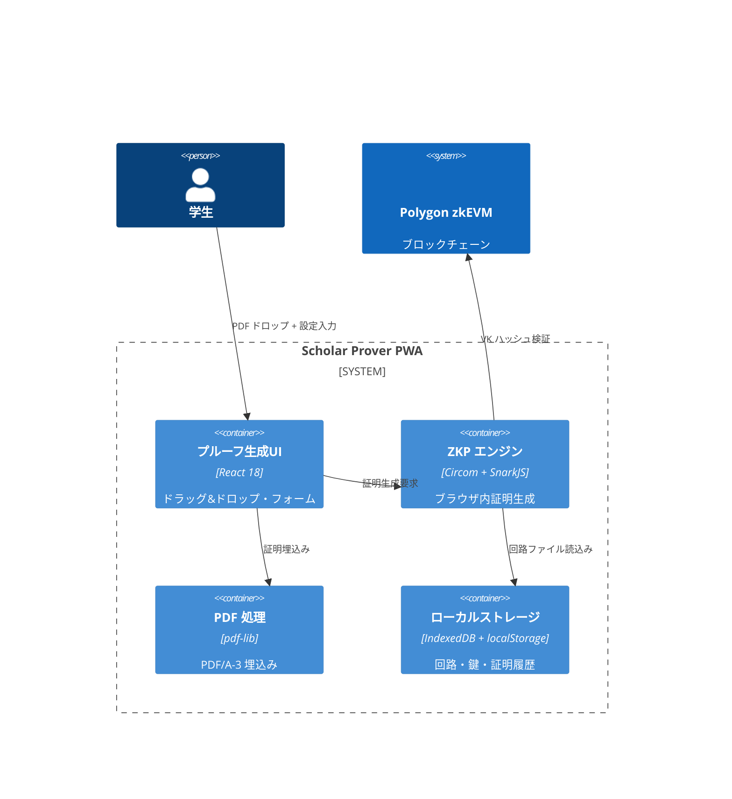
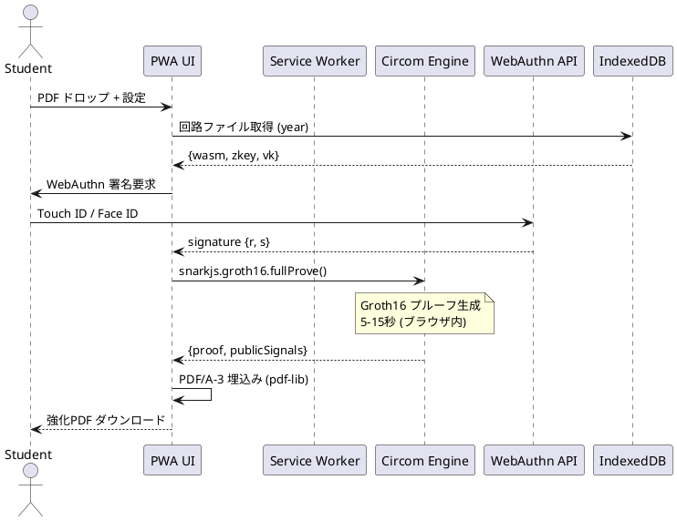

# 機能設計書 (FSD) — Scholar Prover  
最終更新: 2025-06-17 (Version 2.0)

## 1. システム構成 (C4 コンテキスト)  


## 2. UI フロー (完全ブラウザ内完結)
1. **初回セットアップ**: WebAuthn Passkey 登録 + 回路ファイルダウンロード
2. **証明生成**: PDF ドロップ → 設定入力 → 証明生成 → PDF/A-3 埋込み → ダウンロード
3. **履歴管理**: 過去の証明生成履歴をローカル表示

## 3. PWA イベント API  
| イベント | データ | 説明 |
|----------|--------|------|
| REGISTER_PASSKEY | {studentId, credentialOptions} | WebAuthn 登録 |
| LOAD_CIRCUIT | {year} | 年度別回路ファイル取得 |
| GENERATE_PROOF | {inputs, pdf, dest, expiry} | Circom/SnarkJS 証明生成 |
| EMBED_PDF | {pdf, proof, publicSignals} | PDF/A-3 添付 |
| VERIFY_LOCAL | {proof, publicSignals} | ローカル検証 |

## 4. ローカルストレージ構造
```typescript
// localStorage キー
interface LocalStorageKeys {
  'zk-cert.passkey': PasskeyInfo;
  'zk-cert.settings': UserSettings;
  'zk-cert.proof-history': ProofHistoryEntry[];
}

// IndexedDB オブジェクトストア
interface CircuitStore {
  storeName: 'circuits';
  keyPath: 'year';
  data: {
    year: number;
    wasmFile: Uint8Array;
    zkeyFile: Uint8Array;
    vkJson: VerifyingKey;
    circuitHash: string;
  };
}
```

## 5. JSON 形式 (証明データ)
```json
{
  "proof": {
    "pi_a": ["0x...", "0x...", "0x1"],
    "pi_b": [["0x...", "0x..."], ["0x...", "0x..."], ["0x1", "0x0"]],
    "pi_c": ["0x...", "0x...", "0x1"],
    "protocol": "groth16",
    "curve": "bn128"
  },
  "publicSignals": [
    "0x...", // vkHash
    "0x...", // schemaHash  
    "0x...", // merkleRoot
    "0x...", // pdfHash
    "0x...", // destHash
    "1704067200000" // expireTs
  ],
  "metadata": {
    "version": "2.0",
    "year": 2025,
    "generatedAt": 1688140800000,
    "proofId": "uuid-v4"
  }
}
```

## 6. シーケンス (正常フロー - Circom版)


## 7. 回路統合詳細
```typescript
// Circom/SnarkJS 統合実装
class CircomProofGenerator {
  async generateProof(inputs: ProofInputs): Promise<ProofResult> {
    // 1. 回路ファイルをIndexedDBから取得
    const { wasm, zkey } = await this.loadCircuitFiles(inputs.year);
    
    // 2. SnarkJS でGroth16証明生成
    const { proof, publicSignals } = await snarkjs.groth16.fullProve(
      {
        privateKey: inputs.privateKey,
        signature: inputs.signature,
        pdfHash: inputs.pdfHash,
        destHash: inputs.destHash,
        expireTs: inputs.expireTs,
        merkleProof: inputs.merkleProof,
        merkleIndex: inputs.merkleIndex
      },
      wasm,
      zkey
    );
    
    // 3. 形式変換してPDF埋込み用に返却
    return {
      proof: this.formatProof(proof),
      publicSignals: publicSignals.map(BigInt),
      metadata: {
        version: "2.0",
        year: inputs.year,
        generatedAt: Date.now(),
        proofId: crypto.randomUUID()
      }
    };
  }
}
```

## 8. PWA 機能
- **オフライン動作**: Service Worker で回路ファイルキャッシュ
- **プッシュ通知**: 証明生成完了・エラー通知
- **バックグラウンド同期**: ネットワーク復旧時のVK同期
- **インストール可能**: ホーム画面追加対応

## 9. エラーハンドリング
| コード | メッセージ | UI アクション |
|--------|------------|---------------|
| 3001 | PASSKEY_CANCELLED | 署名キャンセル案内 |
| 3002 | CIRCUIT_NOT_FOUND | 回路ダウンロード促す |
| 3003 | PROOF_GENERATION_FAILED | 入力値確認案内 |
| 3004 | PDF_EMBED_FAILED | PDFファイル再選択案内 |
| 3005 | NETWORK_ERROR | オフライン動作案内 |

## 10. パフォーマンス最適化
- **WASM Worker**: Web Worker で証明生成を別スレッド実行
- **回路キャッシュ**: 一度ダウンロードした回路ファイルを永続化
- **プログレッシブダウンロード**: 回路ファイルの分割ダウンロード
- **証明並列化**: 複数PDF処理時の並列実行

## 11. セキュリティ考慮
- **CSP ヘッダー**: Strict Content Security Policy 適用
- **Passkey 保護**: WebAuthn L2 準拠のローカル保存
- **回路検証**: ダウンロード時のハッシュ検証
- **プライベート入力**: メモリ上のみ保持、永続化しない