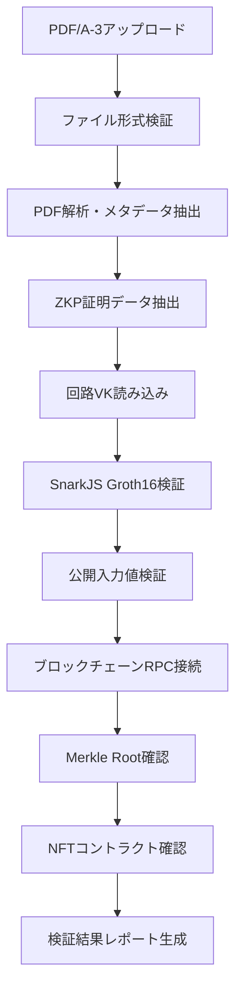

# 基本設計書 (Basic Design) — Verifier UI
**zk‑CertFramework / 証明書検証システム** 最終更新: 2025-06-16 Version 2.0

---

## 1. システム概要

### 1.1 目的
一般ユーザーが卒業証明書PDF/A-3ファイルの真正性をゼロ知識証明とブロックチェーンで検証するための完全静的Webアプリケーション。

### 1.2 主要機能
- PDF/A-3証明書ファイルのアップロード・解析
- 埋め込まれたZKP証明の検証（Circom + SnarkJS）
- ブロックチェーン上のMerkle Root確認
- 検証結果レポートの生成・表示
- オフライン検証対応（Service Worker）

### 1.3 非機能要件
- 同時ユーザー数: 無制限（静的サイト）
- 検証時間: ≤ 10秒（ZKP検証含む）
- 可用性: 99.99%（CDN配信）
- セキュリティ: クライアントサイド完結

---

## 2. システム構成

### 2.1 アーキテクチャ（完全静的サイト）
```
[Any User] → [CDN / GitHub Pages]
                    ↓
            [Static Web App (Next.js SSG)]
                    ↓
            [Browser Processing Only]
            • PDF/A-3 解析
            • ZKP検証 (WASM)
            • Blockchain確認 (RPC)
                    ↓
            [Verification Report]
```

### 2.2 技術スタック（Version 2.0）
| 層 | 技術 | 目的 |
|----|------|------|
| フロントエンド | Next.js 14 + React 18 + TypeScript | 静的サイト生成 |
| PDF解析 | pdf.js + pdf-lib | PDF/A-3データ抽出 |
| ZKP検証 | Circom 2.1.4 + SnarkJS 0.7 | Groth16証明検証 |
| UI | Tailwind CSS + shadcn/ui | レスポンシブUI |
| 状態管理 | Zustand + React Query | クライアント状態 |
| ワーカー | Web Workers | 並列処理 |
| ブロックチェーン | ethers.js v6 | Polygon zkEVM接続 |
| 配布 | GitHub Pages / Vercel | 静的ホスティング |

---

## 3. 検証フロー設計

### 3.1 証明書検証プロセス


### 3.2 データフロー
```json
// 1. PDF/A-3から抽出されるデータ
{
  "pdfHash": "0x123abc...",
  "zkpProof": {
    "proof": { "pi_a": [...], "pi_b": [...], "pi_c": [...] },
    "publicSignals": ["0x456def...", "0x789ghi..."]
  },
  "metadata": {
    "studentName": "田中太郎",
    "graduationYear": 2025,
    "university": "○○大学"
  }
}

// 2. ブロックチェーン検証データ
{
  "contractAddress": "0xabc123...",
  "merkleRoot": "0x789ghi...",
  "vkHash": "0xdef456...",
  "blockNumber": 12345678,
  "timestamp": 1640995200
}

// 3. 最終検証結果
{
  "isValid": true,
  "confidence": 95,
  "verificationSteps": {
    "pdfIntegrity": true,
    "zkpValid": true,
    "merkleRootMatch": true,
    "contractExists": true
  },
  "warnings": [],
  "verificationTime": 3250
}
```

---

## 4. PDF/A-3 解析設計

### 4.1 添付ファイル抽出
```typescript
interface PDFAttachment {
  filename: string;
  content: ArrayBuffer;
  mimeType: string;
  description: string;
}

interface ZKPAttachment {
  proof: SnarkJSProof;
  publicSignals: string[];
  circuitId: string;
  version: string;
  timestamp: string;
}
```

### 4.2 メタデータ抽出
- **学生情報**: 氏名、学籍番号、学部・学科
- **証明書情報**: 発行日、卒業年度、GPA
- **技術情報**: PDF作成日時、ソフトウェア情報
- **ハッシュ情報**: PDFコンテンツハッシュ、ZKPハッシュ

---

## 5. ZKP検証設計

### 5.1 Circom + SnarkJS統合
```typescript
interface VerificationConfig {
  circuitWasm: ArrayBuffer;
  verificationKey: VerificationKey;
  expectedVKHash: string;
  maxVerificationTime: number; // 10秒
}

interface VerificationResult {
  isValid: boolean;
  publicSignals: string[];
  verificationTime: number;
  circuitInfo: {
    name: string;
    version: string;
    constraints: number;
  };
}
```

### 5.2 公開入力検証
- **signals[0]**: 公開鍵ハッシュ（Poseidon256）
- **signals[1]**: Merkle Tree Root
- **signals[2]**: 卒業年度（スケーリング済み）
- **signals[3]**: 証明書PDFハッシュ
- **signals[4]**: タイムスタンプ（オプション）

---

## 6. ブロックチェーン検証設計

### 6.1 スマートコントラクト連携
```typescript
interface ContractVerification {
  contractAddress: string;
  abi: ContractABI;
  requiredMethods: [
    'merkleRoot()',
    'GRADUATION_YEAR()',
    'VK_HASH()'
  ];
}

interface BlockchainCheck {
  networkHealth: boolean;
  contractExists: boolean;
  merkleRootMatch: boolean;
  vkHashMatch: boolean;
  graduationYearMatch: boolean;
}
```

### 6.2 RPCプロバイダー設定
- **Primary**: Polygon zkEVM公式RPC
- **Fallback**: Alchemy / Infura RPC
- **Health Check**: ブロック生成状況確認
- **Error Handling**: タイムアウト・リトライ機能

---

## 7. UI/UX設計

### 7.1 画面構成
| 画面名 | 機能 | アクセス |
|--------|------|----------|
| メインページ | ファイルアップロード・検証開始 | 公開 |
| 検証進行中 | リアルタイム進捗表示 | 公開 |
| 検証結果 | 詳細レポート・ダウンロード | 公開 |
| ヘルプ | 使用方法・FAQ | 公開 |
| About | システム情報・技術詳細 | 公開 |

### 7.2 レスポンシブ対応
- **デスクトップ**: 1200px+ フル機能
- **タブレット**: 768px-1199px 最適化
- **モバイル**: ~767px 簡素化UI
- **アクセシビリティ**: WCAG 2.1 AA準拠

### 7.3 ユーザーエクスペリエンス
```typescript
interface UXFeatures {
  fileUpload: {
    dragAndDrop: true;
    progressBar: true;
    fileValidation: true;
    previewSupport: true;
  };
  verification: {
    realTimeProgress: true;
    estimatedTime: true;
    stepByStepView: true;
    cancellable: true;
  };
  results: {
    visualIndicators: true;
    downloadableReport: true;
    shareableLink: true;
    printFriendly: true;
  };
}
```

---

## 8. セキュリティ設計

### 8.1 クライアントサイドセキュリティ
- **XSS防止**: DOMPurify sanitization
- **ファイル検証**: MIME type・サイズ制限
- **コンテンツセキュリティ**: CSP headers
- **HTTPS強制**: HSTS設定

### 8.2 プライバシー保護
- **データ処理**: 完全クライアントサイド
- **一時ファイル**: メモリ内処理のみ
- **ログ収集**: 匿名化統計のみ
- **外部通信**: ブロックチェーンRPCのみ

### 8.3 検証セキュリティ
```typescript
interface SecurityMeasures {
  pdfValidation: {
    headerCheck: true;
    structureValidation: true;
    malwareScanning: false; // クライアントサイド制限
    sizeLimit: 50 * 1024 * 1024; // 50MB
  };
  zkpSecurity: {
    vkHashVerification: true;
    circuitAuthenticity: true;
    proofMalleability: false; // Groth16特性
    publicInputValidation: true;
  };
  blockchainSecurity: {
    rpcValidation: true;
    responseVerification: true;
    contractCodeCheck: true;
    replayAttackProtection: true;
  };
}
```

---

## 9. パフォーマンス設計

### 9.1 最適化戦略
- **コード分割**: Dynamic imports
- **遅延読み込み**: 回路WASM・VKファイル
- **キャッシュ戦略**: Service Worker活用
- **並列処理**: Web Workers

### 9.2 目標性能指標
| 指標 | 目標値 | 備考 |
|------|--------|------|
| First Contentful Paint | ≤ 1.5秒 | 初期表示 |
| Largest Contentful Paint | ≤ 2.5秒 | メインコンテンツ |
| PDF解析時間 | ≤ 2秒 | 10MB以下 |
| ZKP検証時間 | ≤ 5秒 | Web Worker |
| ブロックチェーン確認 | ≤ 3秒 | RPC応答 |
| 総検証時間 | ≤ 10秒 | エンドツーエンド |

### 9.3 Web Worker活用
```typescript
interface WorkerTasks {
  pdfParsing: {
    worker: 'pdf-parser-worker.js';
    input: ArrayBuffer;
    output: PDFAnalysisResult;
    estimatedTime: '1-2秒';
  };
  zkpVerification: {
    worker: 'zkp-verification-worker.js';
    input: VerificationInput;
    output: VerificationResult;
    estimatedTime: '3-5秒';
  };
  cryptoOperations: {
    worker: 'crypto-worker.js';
    input: CryptoInput;
    output: HashResult;
    estimatedTime: '100-500ms';
  };
}
```

---

## 10. 配布・運用設計

### 10.1 静的サイト配布
- **配布方法**: GitHub Pages / Vercel / Netlify
- **CDN**: Cloudflare / AWS CloudFront
- **ドメイン**: カスタムドメイン対応
- **SSL証明書**: Let's Encrypt自動更新

### 10.2 バージョン管理
```json
{
  "version": "2.0.0",
  "buildDate": "2025-06-16T10:00:00Z",
  "commitHash": "abc123def456",
  "circuitVersion": "2.1.4",
  "compatibleContracts": [
    "GraduationNFT2025",
    "GraduationNFT2026"
  ]
}
```

### 10.3 継続的デプロイ
```yaml
# GitHub Actions
name: Deploy Verifier UI
on:
  push:
    branches: [main]
    
jobs:
  build-and-deploy:
    runs-on: ubuntu-latest
    steps:
      - name: Checkout
        uses: actions/checkout@v4
      
      - name: Setup Node.js
        uses: actions/setup-node@v4
        with:
          node-version: '20'
          
      - name: Install dependencies
        run: npm ci
        
      - name: Run tests
        run: npm test
        
      - name: Build
        run: npm run build
        
      - name: Deploy to GitHub Pages
        uses: peaceiris/actions-gh-pages@v3
        with:
          github_token: ${{ secrets.GITHUB_TOKEN }}
          publish_dir: ./out
```

---

## 11. エラー処理・監視

### 11.1 エラーハンドリング
| エラータイプ | 対応 | ユーザー表示 |
|-------------|------|-------------|
| ファイル形式エラー | 形式チェック・ガイド表示 | "PDFファイルを選択してください" |
| PDF解析エラー | 詳細エラー情報・再試行 | "ファイルが破損している可能性があります" |
| ZKP検証エラー | 証明データ不正・ヘルプ | "証明書の検証に失敗しました" |
| ネットワークエラー | 自動リトライ・オフライン通知 | "ブロックチェーン接続を確認中..." |

### 11.2 分析・改善
```typescript
interface AnalyticsData {
  sessionId: string; // 匿名セッションID
  timestamp: number;
  userAgent: string;
  screenResolution: string;
  
  verification: {
    success: boolean;
    duration: number;
    fileSize: number;
    errorType?: string;
    stepsFailed?: string[];
  };
  
  performance: {
    loadTime: number;
    renderTime: number;
    workerPerformance: WorkerMetrics;
  };
}
```

---

## 12. 拡張性・将来性

### 12.1 対応予定機能
- **多言語対応**: i18n国際化
- **複数回路対応**: 異なる証明書タイプ
- **バッチ検証**: 複数ファイル同時処理
- **モバイルアプリ**: PWA対応

### 12.2 技術進化対応
- **新ZKPシステム**: Circom 3.x対応
- **ブロックチェーン拡張**: 他チェーン対応
- **標準化**: W3C DID統合
- **量子耐性**: ポスト量子暗号対応 