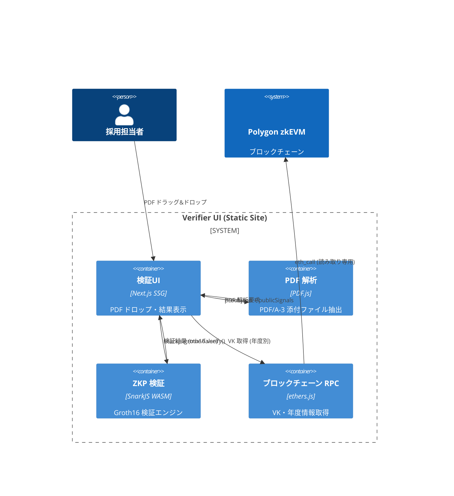

# 機能設計書 (FSD) — Verifier UI  
最終更新: 2025-06-17 (Version 2.0)

## 1. C4 コンテキスト (完全静的サイト・オフライン対応版)


## 2. 完全オフライン検証アーキテクチャ
### 2.1 静的サイト生成 (SSG)
- **Next.js 15**: Static Site Generation で完全静的化
- **GitHub Pages**: CDN配信、サーバーレス
- **Service Worker**: オフライン検証キャッシュ

### 2.2 Air-gapped 検証対応
- **ローカル実行**: ファイルシステムからの実行可能
- **ネットワーク分離**: インターネット不要の検証モード
- **VK 事前キャッシュ**: 年度別検証鍵の事前ダウンロード

## 3. UI ワークフロー (シンプル3ステップ)
```
Step 1: PDF Drop
┌─────────────────────────────────────────────────────┐
│                                                     │
│          🔽 PDF ファイルをドラッグ&ドロップ           │
│                                                     │
│     または [📁 ファイル選択] ボタンをクリック        │
│                                                     │
└─────────────────────────────────────────────────────┘

Step 2: 自動検証実行
┌─────────────────────────────────────────────────────┐
│ ⏳ 検証中...                                         │
│ 1. PDF添付ファイル抽出                              │  
│ 2. 年度情報取得 (2025年度)                          │
│ 3. VK ダウンロード                                  │
│ 4. SnarkJS 検証実行                                 │
│ 5. 有効期限チェック                                 │
└─────────────────────────────────────────────────────┘

Step 3: 結果表示
┌─────────────────────────────────────────────────────┐
│ ✅ 検証成功                                          │
│                                                     │
│ 🎓 2025年度卒業証明書                               │  
│ 📝 発行者: サンプル大学                             │
│ 👤 対象: [氏名は表示されません]                     │
│ ⏰ 有効期限: 2025-12-31 23:59:59                   │
│ 🔗 ブロックチェーン: Polygon zkEVM                 │
│                                                     │
│ [📄 詳細レポート] [🔄 再検証] [📋 結果コピー]       │
└─────────────────────────────────────────────────────┘
```

## 4. PDF/A-3 解析・抽出
### 4.1 対応形式
- **PDF/A-3**: ISO 19005-3 準拠
- **添付ファイル**: EmbeddedFiles 配列から抽出
- **ファイル名**: `zk-proof.json`, `proof-metadata.json`

### 4.2 抽出アルゴリズム
```typescript
// PDF.js + 添付ファイル抽出
import { getDocument } from 'pdfjs-dist';

class PDFProofExtractor {
  async extractProofFromPDF(pdfBuffer: ArrayBuffer): Promise<ProofData> {
    const pdf = await getDocument({ data: pdfBuffer }).promise;
    
    // 1. PDF/A-3 添付ファイル検索
    const attachments = await this.extractEmbeddedFiles(pdf);
    
    // 2. ZKP証明ファイル特定
    const proofFile = attachments.find(f => 
      f.filename === 'zk-proof.json' || 
      f.filename.endsWith('-proof.json')
    );
    
    if (!proofFile) {
      throw new Error('No ZKP proof found in PDF');
    }
    
    // 3. JSON パース・検証
    const proofData = JSON.parse(proofFile.content);
    this.validateProofStructure(proofData);
    
    return proofData;
  }
  
  private async extractEmbeddedFiles(pdf: PDFDocumentProxy): Promise<EmbeddedFile[]> {
    const files: EmbeddedFile[] = [];
    
    for (let i = 1; i <= pdf.numPages; i++) {
      const page = await pdf.getPage(i);
      const annotations = await page.getAnnotations();
      
      for (const annotation of annotations) {
        if (annotation.subtype === 'FileAttachment') {
          const fileData = await this.extractFileData(annotation);
          files.push(fileData);
        }
      }
    }
    
    return files;
  }
}
```

## 5. SnarkJS 検証エンジン
### 5.1 Groth16 検証実装
```typescript
import { groth16 } from "snarkjs";

class ZKPVerifier {
  async verifyProof(proof: GrothProof, publicSignals: string[], vk: VerifyingKey): Promise<boolean> {
    try {
      // 1. SnarkJS Groth16 検証
      const isValid = await groth16.verify(vk, publicSignals, proof);
      
      // 2. 追加検証 (有効期限等)
      if (isValid) {
        return this.validatePublicSignals(publicSignals);
      }
      
      return false;
    } catch (error) {
      console.error('ZKP verification failed:', error);
      return false;
    }
  }
  
  private validatePublicSignals(publicSignals: string[]): boolean {
    // Public signals 構造:
    // [0] vkHash
    // [1] schemaHash  
    // [2] merkleRoot
    // [3] pdfHash
    // [4] destHash
    // [5] expireTs
    
    const expireTs = parseInt(publicSignals[5]);
    const now = Math.floor(Date.now() / 1000);
    
    if (expireTs < now) {
      throw new Error('Certificate expired');
    }
    
    return true;
  }
}
```

### 5.2 年度別VK取得
```typescript
class BlockchainVKResolver {
  private rpcEndpoint = "https://zkevm-rpc.com";
  private deploymentManagerAddr = "0x..."; // 固定アドレス
  
  async getVerifyingKey(year: number): Promise<VerifyingKey> {
    const provider = new ethers.JsonRpcProvider(this.rpcEndpoint);
    const contract = new ethers.Contract(
      this.deploymentManagerAddr,
      ["function yearlySets(uint256) view returns (tuple(uint256,address,bytes32,bytes32,bytes32,uint256))"],
      provider
    );
    
    // 年度情報取得
    const yearlySet = await contract.yearlySets(year);
    const [yearNum, nftContract, vkHash, circuitHash, merkleRoot, deployedAt] = yearlySet;
    
    if (deployedAt === 0) {
      throw new Error(`Year ${year} not deployed`);
    }
    
    // VK取得 (IPFS or 固定URL)
    const vkUrl = `https://vk-cdn.zk-cert.framework/vk-${year}.json`;
    const response = await fetch(vkUrl);
    const vk = await response.json();
    
    // VKハッシュ検証
    const computedHash = this.computeVKHash(vk);
    if (computedHash !== vkHash) {
      throw new Error('VK hash mismatch');
    }
    
    return vk;
  }
}
```

## 6. オフライン検証モード
### 6.1 Service Worker キャッシュ
```typescript
// service-worker.js
const CACHE_NAME = 'zk-verifier-v2.0';
const VK_CACHE = 'vk-cache-v2.0';

self.addEventListener('install', (event) => {
  event.waitUntil(
    caches.open(CACHE_NAME).then((cache) => {
      return cache.addAll([
        '/',
        '/verification.html',
        '/js/snarkjs.min.js',
        '/js/pdf.worker.min.js'
      ]);
    })
  );
});

// VK キャッシュ戦略
self.addEventListener('fetch', (event) => {
  if (event.request.url.includes('/vk-')) {
    event.respondWith(
      caches.open(VK_CACHE).then((cache) => {
        return cache.match(event.request).then((response) => {
          return response || fetch(event.request).then((fetchResponse) => {
            cache.put(event.request, fetchResponse.clone());
            return fetchResponse;
          });
        });
      })
    );
  }
});
```

### 6.2 ローカルVKファイル対応
```typescript
// ローカルファイルシステム対応
class LocalVKResolver {
  async loadLocalVK(year: number, file?: File): Promise<VerifyingKey> {
    if (file) {
      // ユーザー提供VKファイル
      const content = await file.text();
      return JSON.parse(content);
    }
    
    // 事前配布VKファイル検索
    const localVKPath = `./assets/vk/vk-${year}.json`;
    try {
      const response = await fetch(localVKPath);
      return await response.json();
    } catch {
      throw new Error(`Local VK file not found for year ${year}`);
    }
  }
}
```

## 7. 検証結果出力
### 7.1 結果データ構造
```typescript
interface VerificationResult {
  status: 'VALID' | 'INVALID' | 'EXPIRED' | 'ERROR';
  details: {
    year: number;
    issuer: string;
    expiry: Date;
    blockchain: {
      network: 'Polygon zkEVM';
      nftContract: string;
      vkHash: string;
    };
    technical: {
      proofSize: number;
      verificationTime: number;
      pdfHash: string;
      merkleRoot: string;
    };
  };
  timestamp: Date;
  warnings?: string[];
  errors?: string[];
}
```

### 7.2 エクスポート機能
```typescript
// JSON・PDF レポート生成
class ResultExporter {
  exportAsJSON(result: VerificationResult): void {
    const jsonData = JSON.stringify(result, null, 2);
    this.downloadFile(`verification-result-${Date.now()}.json`, jsonData);
  }
  
  async exportAsPDF(result: VerificationResult): Promise<void> {
    const reportHTML = this.generateReportHTML(result);
    const pdf = await this.htmlToPDF(reportHTML);
    this.downloadFile(`verification-report-${Date.now()}.pdf`, pdf);
  }
  
  copyToClipboard(result: VerificationResult): void {
    const summary = `
Verification Status: ${result.status}
Year: ${result.details.year}
Expiry: ${result.details.expiry.toISOString()}
Blockchain: ${result.details.blockchain.network}
NFT Contract: ${result.details.blockchain.nftContract}
Verified at: ${result.timestamp.toISOString()}
    `.trim();
    
    navigator.clipboard.writeText(summary);
  }
}
```

## 8. エラーハンドリング・UX
### 8.1 エラー分類
| エラーコード | 原因 | ユーザー対応 |
|-------------|------|-------------|
| 4001 | INVALID_PDF_FORMAT | PDF再選択案内 |
| 4002 | NO_PROOF_FOUND | PDF/A-3形式確認案内 |
| 4003 | PROOF_VERIFICATION_FAILED | 証明書無効警告 |
| 4004 | CERTIFICATE_EXPIRED | 有効期限切れ表示 |
| 4005 | NETWORK_ERROR | オフラインモード案内 |
| 4006 | VK_NOT_FOUND | 年度未対応案内 |

### 8.2 プログレッシブ機能
```typescript
// 段階的機能向上
class ProgressiveVerifier {
  async verify(pdfFile: File): Promise<VerificationResult> {
    // 1. オフライン検証試行
    try {
      return await this.verifyOffline(pdfFile);
    } catch (offlineError) {
      console.warn('Offline verification failed, trying online:', offlineError);
    }
    
    // 2. オンライン検証フォールバック
    try {
      return await this.verifyOnline(pdfFile);
    } catch (onlineError) {
      throw new Error(`Both offline and online verification failed: ${onlineError.message}`);
    }
  }
}
```

## 9. パフォーマンス最適化
### 9.1 Web Workers
```typescript
// ZKP検証を別スレッドで実行
const verificationWorker = new Worker('/js/verification-worker.js');

verificationWorker.postMessage({
  type: 'VERIFY_PROOF',
  proof: proofData,
  publicSignals: publicSignals,
  vk: verifyingKey
});

verificationWorker.addEventListener('message', (event) => {
  const { type, result, error } = event.data;
  if (type === 'VERIFICATION_COMPLETE') {
    handleVerificationResult(result);
  } else if (type === 'VERIFICATION_ERROR') {
    handleVerificationError(error);
  }
});
```

### 9.2 最適化指標
| 指標 | 目標 | 実装 |
|------|------|------|
| 初回読み込み | <2秒 | Static generation + CDN |
| PDF解析 | <500ms | PDF.js + Web Workers |
| ZKP検証 | <100ms | SnarkJS WASM最適化 |
| オフライン起動 | <1秒 | Service Worker キャッシュ |

## 10. セキュリティ考慮
- **CSP**: Strict Content Security Policy
- **SRI**: Subresource Integrity for external libs
- **HTTPS**: 強制HTTPS (GitHub Pages)
- **入力検証**: PDF・JSON の厳格なバリデーション
- **XSS対策**: DOMPurify による sanitization
