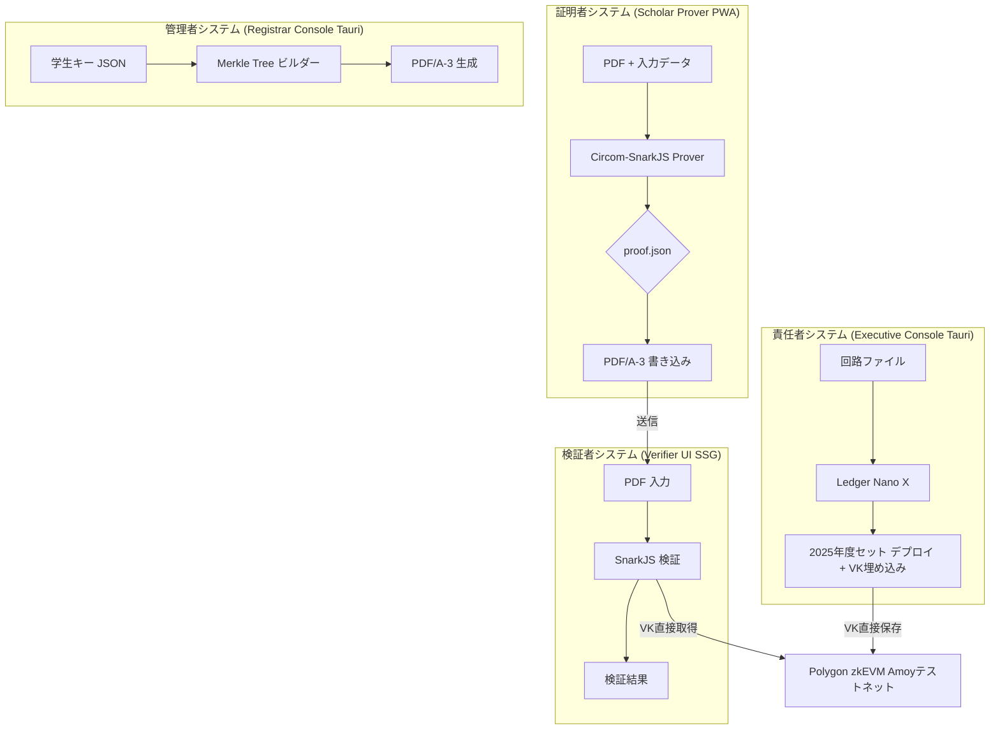
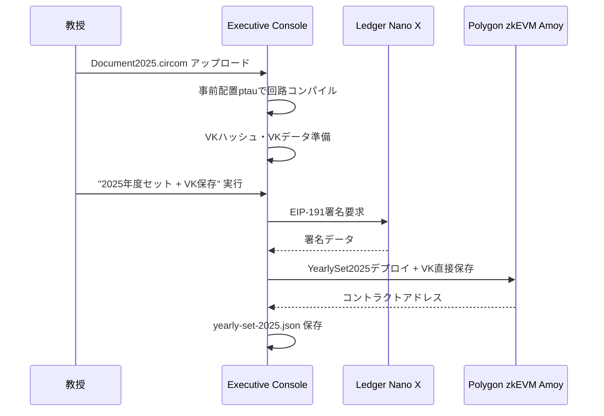
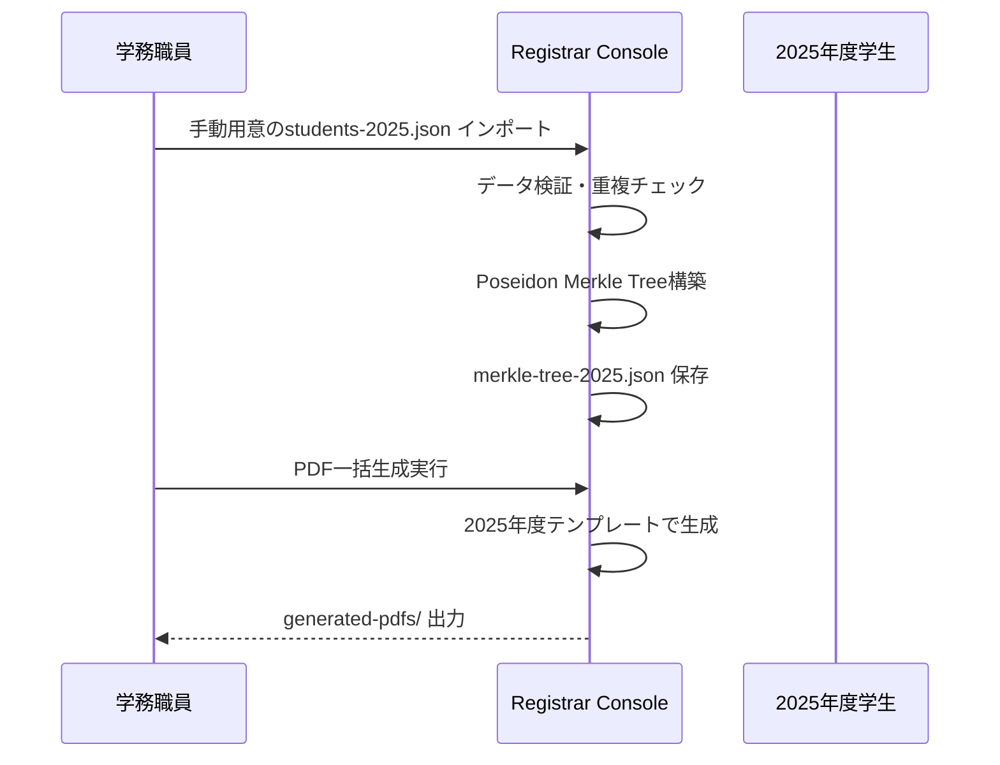
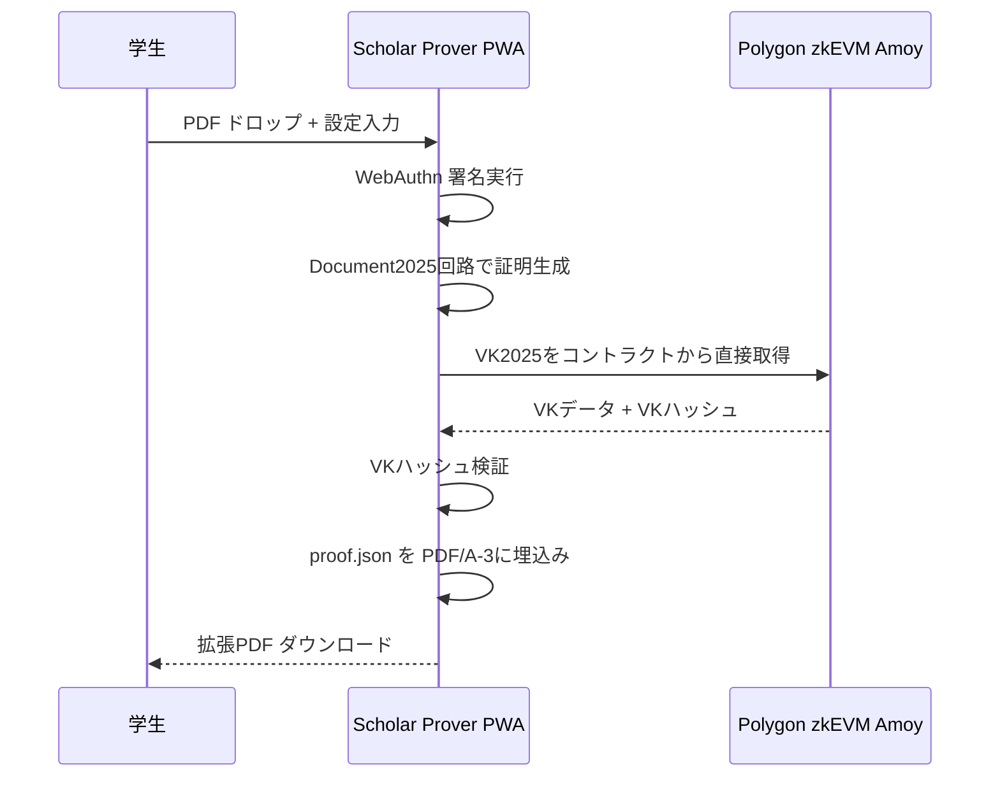
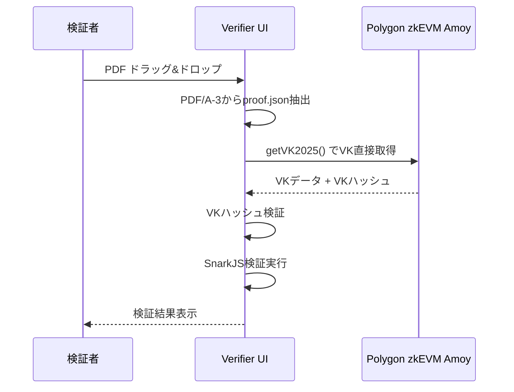

# 機能設計書 (FSD) — ZK-CertFramework プロトタイプ版
**バージョン 1.0 最終更新: 2025‑01‑20**

> **教授向けデモンストレーション用プロトタイプ** - 2025年度単一システムによる簡略化実装

---

## 1. システム構成 (C4) - プロトタイプ版


## 2. プロトタイプ版の主要変更点（PROTOTYPE.md準拠）

### 2.1 VK配布方法の根本的変更
| 項目 | プロダクション | プロトタイプ |
|------|--------------|------------|
| 検証鍵（VK） | 特定URL配布 | **Polygon zkEVM上に直接保存（NFTメタデータ埋め込み）** |
| 証明回路ファイル | IPFS配布 | **GitHub Releases経由配布** |
| VK取得方法 | HTTP API | **YearlyDeploymentManagerスマートコントラクトから直接取得** |
| VK検証 | URL整合性チェック | **VKハッシュ値とコントラクト保存値の照合** |

**詳細**:
- Executive ConsoleがYearlySetをデプロイする際、VKのJSONデータ自体を文字列またはバイト配列として、YearlyDeploymentManagerスマートコントラクトのストレージに直接保存
- VKのハッシュ値（vkHash）も別途コントラクトに保存し、UI側で取得したVKとハッシュ値の一致を検証
- Verifier UIは、Polygon zkEVMから直接、2025年度のYearNFTコントラクトに紐づくVKデータを取得

### 2.2 年度管理の完全簡素化
- **対象年度**: 2025年度のみ（"YearlySet"概念は維持するが単一年度運用）
- **複数年度切り替え**: 実装対象外
- **年度間依存**: 考慮不要
- **Passkey公開鍵**: 手動でファイルに用意したデータをJSON形式で保存

### 2.3 Ptauファイル管理の簡素化
- **事前配置**: 事前に生成されたPtauファイルをExecutive Consoleの実行環境に配置
- **コンパイル**: 配置済みPtauファイルを参照するだけ
- **複雑な管理**: 除外

### 2.4 非機能要件の優先度調整
- **厳密なパフォーマンス目標**: 除外（ZKP生成5秒以内 → 30秒以内等）
- **完全オフライン検証**: 除外（Service Worker実装手間回避）
- **網羅的エラーハンドリング**: 主要デモシナリオのスムーズ動作に焦点
- **多言語対応・アクセシビリティ**: 優先度下げ

### 2.5 テスト範囲の絞り込み
- **包括的テスト**: 除外
- **対象**: 教授が実際に確認する主要ユースケース（Scholar Proverでの証明生成、Verifier UIでの検証、Executive ConsoleでのYearlySetデプロイとLedger署名）
- **方式**: ハッピーパス（正常系）の手動テスト

### 2.6 Polygon zkEVM Amoyテストネット利用
- **経費節約**: zkEVMはメインネットではなくAmoyテストネットを利用
- **動作確認**: Amoyテストネット上でスマートコントラクトをデプロイ・動作確認

### 2.7 配布方法の変更
- **Verifier UI**: GitHub Pages配布
- **Tauriアプリケーション**: GitHub Releases署名付きバイナリ配布

## 3. UI 仕様 - プロトタイプ版

### 3.1 証明者システム（Scholar Prover PWA）
| 要素 | ID | 機能 | プロトタイプ簡素化 |
|------|----|------|--------------------|
| PDF ドロップ | dropPDF | PDF入力 | 基本的なMIME検証のみ |
| 提出先入力 | txtDest | SHA‑3‑512(dest) 計算 | 必須項目のみ |
| 期限入力 | dateExpire | 最大365日設定 | デフォルト30日 |
| 生成ボタン | btnGenerate | 証明生成実行 | エラー詳細は最小限 |
| VK取得 | getVK2025 | **ブロックチェーンから直接取得** | URL配布機能なし |

### 3.2 責任者システム（Executive Console）
| 要素 | ID | 機能 | プロトタイプ簡素化 |
|------|----|------|--------------------|
| 回路ファイル | fileCircuit | Document2025.circom アップロード | 固定年度2025 |
| Ptauファイル | filePtau | **事前配置済み** | 手動管理不要 |
| Ledger署名 | btnLedgerSign | EIP-191 署名実行 | 基本検証のみ |
| VK保存 | storeVK | **スマートコントラクトに直接保存** | URL配布なし |

### 3.3 管理者システム（Registrar Console）
| 要素 | ID | 機能 | プロトタイプ簡素化 |
|------|----|------|--------------------|
| 学生キーファイル | fileOwnerKeys | **手動用意のJSONインポート** | CSV機能除外 |
| Merkleビルド | btnBuildMerkle | 2025年度固定構築 | 複数年度対応なし |
| PDF生成 | btnGeneratePDFs | 一括生成 | 基本テンプレートのみ |

### 3.4 検証者システム（Verifier UI）
| 要素 | ID | 機能 | プロトタイプ簡素化 |
|------|----|------|--------------------|
| PDF入力 | dropPDF | ドラッグ&ドロップ | エラー詳細最小限 |
| 検証実行 | btnVerify | 自動実行 | 2025年度固定 |
| VK取得 | getVKFromChain | **ブロックチェーンから直接取得** | URL取得なし |
| 結果表示 | resultDisplay | 成功/失敗のみ | 詳細レポート除外 |

## 4. データ管理 - プロトタイプ版

### 4.1 ローカルストレージ（簡素化）
```
責任者システム:
config/
├── yearly-set-2025.json     # 2025年度のみ
├── circuits/Document2025.circom
├── build/Document2025.zkey
└── ptau/powersOfTau_16.ptau  # 事前配置（管理不要）

管理者システム:
data/
├── students-2025.json       # 手動用意・2025年度学生データのみ
├── merkle-tree-2025.json    # 2025年度Merkle tree
└── generated-pdfs/          # 一括生成PDF

証明者システム:
localStorage:
- passkey_info: {publicKey, credentialId}
- circuit_cache_2025: {wasm, zkey} # VKはブロックチェーンから取得
- proof_history: [{pdfHash, timestamp}]
```

### 4.2 スマートコントラクト構造（プロトタイプ版）
```solidity
// YearlyDeploymentManager2025.sol（2025年度固定版）
contract YearlyDeploymentManager2025 {
    struct YearlySet2025 {
        uint256 year; // 2025固定
        address nftContract;
        bytes32 vkHash;
        string vkData; // VK JSONデータ直接保存
        bytes32 circuitHash;
        bytes32 merkleRoot;
        uint256 deployedAt;
    }
    
    YearlySet2025 public yearlySet2025;
    
    function deployYearlySet2025(
        bytes32 vkHash,
        string calldata vkData, // VKデータ直接保存
        bytes32 circuitHash,
        bytes32 merkleRoot
    ) external onlyOwner {
        // 2025年度セット作成・VK直接保存
    }
    
    function getVK2025() external view returns (string memory) {
        return yearlySet2025.vkData; // VKを直接返却
    }
    
    function getVKHash2025() external view returns (bytes32) {
        return yearlySet2025.vkHash; // ハッシュ検証用
    }
}
```

## 5. プロトタイプ版ワークフロー

### 5.1 初期セットアップ（責任者）


### 5.2 学生データ管理（管理者）


### 5.3 証明生成（学生）


### 5.4 証明検証（検証者）


## 6. プロトタイプ版技術スタック

### 6.1 簡素化技術選択
| システム | 技術 | プロトタイプ調整 |
|----------|------|------------------|
| 証明者システム | React 18 + Vite PWA | Service Worker最小実装 |
| 責任者システム | Tauri v2 + React | 基本機能のみ |
| 管理者システム | Tauri v2 + React | CSV機能除外 |
| 検証者システム | Next.js 15 SSG | GitHub Pages配布 |

### 6.2 プロトタイプ向け最適化
```typescript
// 年度固定設定
const PROTOTYPE_CONFIG = {
  TARGET_YEAR: 2025,
  NETWORK: 'amoy', // Polygon zkEVMテストネット（経費節約）
  VK_SOURCE: 'blockchain-direct', // VKをブロックチェーンから直接取得
  CIRCUIT_SOURCE: 'github-releases', // GitHub Releases経由配布
  MAX_STUDENTS: 100, // デモ用制限
  PROOF_EXPIRY_DAYS: 30, // デフォルト30日
  PTAU_PRELOCATED: true, // Ptauファイル事前配置
  VK_EMBEDDED_IN_CONTRACT: true // VK直接保存
};

// VK取得の簡素化（ブロックチェーン直接）
async function getVK2025(): Promise<VerifyingKey> {
  const contract = new ethers.Contract(
    YEARLY_DEPLOYMENT_MANAGER_2025,
    [
      "function getVK2025() view returns (string)",
      "function getVKHash2025() view returns (bytes32)"
    ],
    provider
  );
  
  const [vkData, vkHash] = await Promise.all([
    contract.getVK2025(),
    contract.getVKHash2025()
  ]);
  
  const vk = JSON.parse(vkData);
  
  // VKハッシュ検証
  const computedHash = sha3_512(JSON.stringify(vk));
  if (computedHash !== vkHash) {
    throw new Error('VK hash mismatch - data integrity compromised');
  }
  
  return vk;
}

// GitHub Releasesからの回路ファイル取得
async function loadCircuitFiles2025(): Promise<CircuitFiles> {
  const baseUrl = 'https://github.com/your-org/zk-cert-circuits/releases/download/v1.0-2025';
  
  const [wasmResponse, zkeyResponse] = await Promise.all([
    fetch(`${baseUrl}/Document2025.wasm`),
    fetch(`${baseUrl}/Document2025.zkey`)
  ]);
  
  return {
    wasm: await wasmResponse.arrayBuffer(),
    zkey: await zkeyResponse.arrayBuffer()
  };
}
```

## 7. エラーハンドリング - プロトタイプ版

| エラーコード | メッセージ | 対応 |
|-------------|------------|------|
| P1001 | VK_NOT_FOUND_2025 | "2025年度がまだデプロイされていません" |
| P1002 | CIRCUIT_COMPILE_FAILED | "回路コンパイル失敗" |
| P1003 | PROOF_GENERATION_FAILED | "証明生成失敗" |
| P1004 | PDF_VERIFICATION_FAILED | "PDF検証失敗" |

## 8. テストケース - プロトタイプ版

### 8.1 主要テストパス
- **TC‑P01**: 2025年度セットデプロイ成功
- **TC‑P02**: 学生データインポート・Merkle構築成功
- **TC‑P03**: 証明生成・PDF埋込み成功
- **TC‑P04**: 検証者による証明検証成功
- **TC‑P05**: Ledger署名フロー成功

### 8.2 手動テスト重視
- E2Eテスト自動化は除外
- 教授による実際の操作確認
- 主要ユースケースのハッピーパス検証

## 9. デプロイメント - プロトタイプ版

### 9.1 配布方法
- **Verifier UI**: GitHub Pages静的配布
- **Tauriアプリ**: GitHub Releases署名付きバイナリ
- **回路ファイル**: GitHub Releasesアセット

### 9.2 環境設定
```bash
# プロトタイプ用環境変数
REACT_APP_TARGET_YEAR=2025
REACT_APP_NETWORK=amoy
REACT_APP_DEPLOYMENT_MANAGER=0x...
REACT_APP_RPC_URL=https://rpc-amoy.polygon.technology/

# Tauriビルド
npm run build:prototype
tauri build --config prototype.tauri.conf.json
```

## 10. プロトタイプの制約

### 10.1 機能制約
- **年度**: 2025年度固定（YearlySet概念は維持するが単一年度運用）
- **学生数**: 最大100名
- **テンプレート**: 基本PDFのみ
- **言語**: 日本語のみ
- **VK配布**: ブロックチェーン直接保存のみ
- **回路配布**: GitHub Releasesのみ

### 10.2 性能制約
- **証明生成**: 30秒以内（目安、厳密な最適化なし）
- **PDF処理**: 10MB以下
- **ネットワーク**: Amoyテストネット依存（経費節約）

### 10.3 運用制約
- **Ptauファイル**: 事前配置（手動管理なし）
- **Passkey管理**: 手動でJSONファイル用意
- **エラーハンドリング**: 主要パスのみ
- **テスト**: 手動テスト中心、包括的テストなし

---

**プロトタイプ目標**: 教授が実際に動作を確認できる最小限の機能実装により、コンセプトの有効性を検証する。 