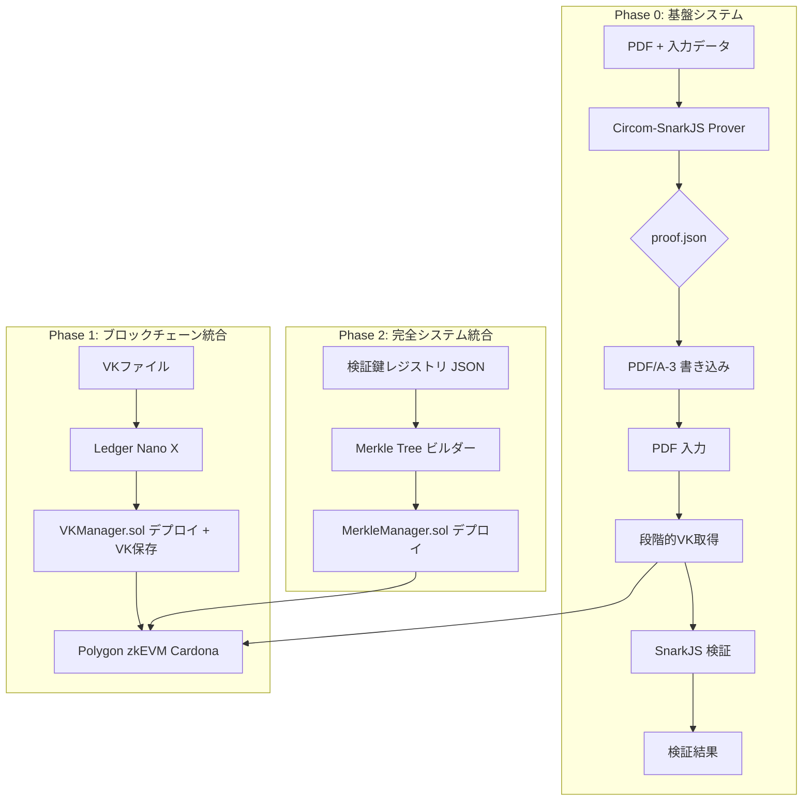

# 機能設計書 (FSD) — Tri-CertFramework プロトタイプ版
**バージョン 2.3 最終更新: 2025-07-23**

> **段階的移行対応プロトタイプ** - Phase 0→1→2の段階的開発による完全システム構築

---

## 1. システム構成 (C4) - 段階的移行版


## 2. 段階的移行版の設計方針（dev-plan準拠）

### 2.1 段階的VK取得システムの設計変更
| 項目 | Phase 0 | Phase 1 | Phase 2 |
|------|---------|---------|---------|
| VK取得方法 | **ローカルファイル選択** | **+ ブロックチェーン取得** | **+ ハイブリッド（フォールバック）** |
| UI選択肢 | ローカル | ローカル・ブロックチェーン | ローカル・ブロックチェーン・ハイブリッド |
| システム数 | 2システム | 3システム | 4システム |
| Trust Minimized度 | 基本 | 中程度 | 完全 |

**詳細**:
- **段階的設定管理**: PhaseManagerクラスでフェーズごとの設定を管理
- **VKSourceSelector**: UI上でローカル・ブロックチェーン・ハイブリッドを選択可能
- **段階的移行**: 各フェーズで価値を実感しながら次の段階へ進行

### 2.2 システム構築の段階的アプローチ
- **Phase 0**: Scholar Prover + Verifier UI（基本概念の実証）
- **Phase 1**: + Executive Console（Trust Minimized設計の実感）
- **Phase 2**: + Registrar Console（完全システムの威力）

### 2.3 段階的価値提供
- **早期成功体験**: Phase 0で基本機能動作確認
- **Trust Minimized実感**: Phase 1でブロックチェーン統合の価値
- **完全システム**: Phase 2で教授向け最終デモンストレーション

### 2.4 技術的段階性
- **学習曲線**: 複雑性を段階的に導入
- **リスク軽減**: 各段階で問題を早期発見
- **柔軟性**: 各段階で方向性調整可能

### 2.5 Polygon zkEVM Cardonaテストネット利用（変更なし）
- **経費節約**: zkEVMはメインネットではなくCardonaテストネットを利用
- **動作確認**: Cardonaテストネット上でスマートコントラクトをデプロイ・動作確認

### 2.6 配布方法（変更なし）
- **Verifier UI**: GitHub Pages配布
- **Tauriアプリケーション**: GitHub Releases署名付きバイナリ配布

## 3. UI 仕様 - 段階的移行版

### 3.1 証明者システム（Scholar Prover PWA）- Phase 0～2対応
| 要素 | ID | 機能 | 段階的対応 |
|------|----|------|-----------|
| VK取得方法選択 | vkSourceSelector | ローカル・ブロックチェーン・ハイブリッド選択 | Phase 0で実装、Phase 1で拡張 |
| ブロックチェーン状態 | blockchainStatus | 接続状態・ネットワーク情報表示 | Phase 1で追加 |
| PDF ドロップ | dropPDF | PDF入力 | Phase 0で実装 |
| 提出先入力 | txtDest | SHA-3-512(dest) 計算 | Phase 0で実装 |
| 期限入力 | dateExpire | 最大365日設定 | Phase 0で実装 |
| 生成ボタン | btnGenerate | 段階的証明生成実行 | 全Phase対応 |

### 3.2 責任者システム（Executive Console）- Phase 1～2
| 要素 | ID | 機能 | 段階的対応 |
|------|----|------|-----------|
| Ledger認証 | ledgerAuth | Ledger Nano X接続・認証 | Phase 1で実装 |
| VKManagerデプロイ | deployVKManager | VKManager.solデプロイ | Phase 1で実装 |
| VKアップロード | vkUploader | VKブロックチェーン保存 | Phase 1で実装 |
| MerkleManagerデプロイ | deployMerkleManager | MerkleManager.solデプロイ | Phase 2で追加 |
| システム統合状態 | systemStatus | 4システム連携状態表示 | Phase 2で追加 |

### 3.3 管理者システム（Registrar Console）- Phase 2
| 要素 | ID | 機能 | 段階的対応 |
|------|----|------|-----------|
| 検証鍵レジストリ管理 | verificationKeyManager | VerificationKeyManager | Phase 2で実装 |
| 公開リポジトリ管理 | repositoryManager | IPFS/GitHub公開管理 | Phase 2で実装 |
| Merkle Tree構築 | merkleTreeBuilder | 検証鍵用MerkleTreeBuilder | Phase 2で実装 |
| システム統合 | systemIntegrator | 4システム統合実行 | Phase 2で実装 |

### 3.4 検証者システム（Verifier UI SSG）- Phase 0～2対応
| 要素 | ID | 機能 | 段階的対応 |
|------|----|------|-----------|
| VK取得方法選択 | vkSourceSelector | ローカル・ブロックチェーン・ハイブリッド選択 | Phase 0で実装、Phase 1で拡張 |
| ブロックチェーン状態 | blockchainStatus | 接続状態・VK取得履歴表示 | Phase 1で追加 |
| PDF ドロップゾーン | pdfDropZone | PDF検証ファイル入力 | Phase 0で実装 |
| 検証結果表示 | resultDisplay | 段階的検証結果表示 | 全Phase対応 |

## 4. 段階的データフロー設計

### 4.1 Phase 0: 基盤データフロー
```typescript
// 基本的なローカルVK選択フロー
Scholar Prover: PDF + Destination → ZKP Generation → PDF Embedding
Verifier UI: PDF with Proof → Local VK Selection → Verification → Result
```

### 4.2 Phase 1: ブロックチェーン統合データフロー
```typescript
// ブロックチェーンVK取得フロー追加
Executive Console: VK Upload → VKManager.sol → Blockchain Storage
Scholar Prover: PDF + Destination → Blockchain VK Fetch → ZKP Generation
Verifier UI: PDF with Proof → Blockchain VK Fetch → Verification → Result
```

### 4.3 Phase 2: 完全統合データフロー
```typescript
// 4システム完全統合フロー
Registrar Console: Verification Key Registry → Merkle Tree → IPFS/GitHub Publication
Executive Console: VK + Merkle Root → Blockchain Storage
Scholar Prover: Student Digital Signature → Merkle Proof + ZKP → PDF Embedding
Verifier UI: PDF → Blockchain VK + Public Repository + Digital Signature Verification
```

## 5. 段階的コンポーネント設計

### 5.1 共通コンポーネント（全Phase）
```typescript
// 段階的設定管理
class PhaseManager {
  private currentConfig: PhaseConfig;
  
  constructor(initialPhase: string = 'local') {
    this.currentConfig = PHASE_CONFIGS[initialPhase];
  }
  
  setPhase(phase: string): void {
    this.currentConfig = PHASE_CONFIGS[phase];
  }
  
  getVKSource(): VKSource {
    return this.currentConfig.vkSource;
  }
  
  isBlockchainEnabled(): boolean {
    return this.currentConfig.features.blockchain;
  }
}

// VK取得の段階的実装
class VKManager {
  constructor(private phaseManager: PhaseManager) {}
  
  async getVK(): Promise<VerifyingKey> {
    const vkSource = this.phaseManager.getVKSource();
    
    switch (vkSource) {
      case 'local':
        return this.getVKFromLocal();
      case 'blockchain':
        return this.getVKFromBlockchain();
      case 'hybrid':
        return this.getVKFromHybrid();
    }
  }
}
```

### 5.2 段階的UIコンポーネント
```typescript
// VK取得方法選択UI
const VKSourceSelector: React.FC = ({ phaseManager, onVKSourceChange }) => {
  const currentSource = phaseManager.getVKSource();
  
  return (
    <div className="vk-source-selector">
      <h3>VK取得方法</h3>
      <div className="radio-group">
        <label>
          <input 
            type="radio" 
            value="local" 
            checked={currentSource === 'local'}
            onChange={(e) => onVKSourceChange(e.target.value)}
          />
          ローカルファイル
        </label>
        <label>
          <input 
            type="radio" 
            value="blockchain" 
            checked={currentSource === 'blockchain'}
            onChange={(e) => onVKSourceChange(e.target.value)}
          />
          ブロックチェーン
        </label>
        <label>
          <input 
            type="radio" 
            value="hybrid" 
            checked={currentSource === 'hybrid'}
            onChange={(e) => onVKSourceChange(e.target.value)}
          />
          ハイブリッド（フォールバック付き）
        </label>
      </div>
    </div>
  );
};

// ブロックチェーン状態表示
const BlockchainStatus: React.FC = ({ phaseManager }) => {
  const [status, setStatus] = useState<'connecting' | 'connected' | 'error'>('connecting');
  
  if (!phaseManager.isBlockchainEnabled()) {
    return null;
  }
  
  return (
    <div className="blockchain-status">
      <h3>ブロックチェーン状態</h3>
      <div className={`status-indicator ${status}`}>
        <div className="status-dot" />
        <span>{getStatusText(status)}</span>
      </div>
    </div>
  );
};
```

## 6. 段階的スマートコントラクト設計

### 6.1 Phase 1: VKManager.sol
```solidity
// VK管理専用コントラクト
contract VKManager is Ownable, ReentrancyGuard {
    struct VKData {
        string vkJson;
        uint256 timestamp;
        address deployer;
        bool isValid;
        string version;
    }
    
    mapping(uint256 => VKData) public vkRegistry;
    uint256 public currentVKId;
    
    function deployVK(string memory vkJson, string memory version) 
        external onlyAuthorized returns (uint256) {
        // VK保存ロジック
    }
    
    function getLatestVK() external view returns (VKData memory) {
        // 最新VK取得ロジック
    }
}
```

### 6.2 Phase 2: MerkleManager.sol
```solidity
// Merkle Tree管理コントラクト（Phase 2で追加）
contract MerkleManager is Ownable, ReentrancyGuard {
    struct MerkleRoot {
        bytes32 root;
        uint256 timestamp;
        address deployer;
        bool isValid;
        string version;
        uint256 studentCount;
    }
    
    mapping(uint256 => MerkleRoot) public merkleRoots;
    uint256 public currentRootId;
    
    function deployMerkleRoot(bytes32 root, string memory version, uint256 studentCount) 
        external onlyAuthorized returns (uint256) {
        // Merkle Root保存ロジック
    }
    
    function verifyMerkleProof(bytes32 root, bytes32 leaf, bytes32[] memory proof) 
        external pure returns (bool) {
        // Merkle Proof検証ロジック
    }
}
```

## 7. 段階的システム統合設計

### 7.1 Phase 0統合ポイント
- Scholar Prover ↔ Verifier UI: PDF with Proof
- VK取得方法: ローカルファイル選択のみ

### 7.2 Phase 1統合ポイント
- Executive Console → Blockchain: VK Storage
- Scholar Prover ← Blockchain: VK Retrieval
- Verifier UI ← Blockchain: VK Retrieval
- Hybrid Fallback: Blockchain → Local

### 7.3 Phase 2統合ポイント
- Registrar Console → Executive Console: Student Data + Merkle Root
- Executive Console → Blockchain: VK + Merkle Root Storage
- Scholar Prover ← Blockchain: VK + Merkle Root Retrieval
- Verifier UI ← Blockchain: Complete Verification

## 8. 段階的テスト戦略

### 8.1 Phase 0テスト
```typescript
const phase0Tests = {
  local: [
    "ローカルVK選択・ZKP生成テスト",
    "ローカルVK選択・PDF検証テスト",
    "VK取得方法選択UIテスト"
  ]
};
```

### 8.2 Phase 1テスト
```typescript
const phase1Tests = {
  blockchain: [
    "Ledger認証テスト",
    "VKManagerデプロイテスト", 
    "ブロックチェーンVK取得テスト",
    "ハイブリッドフォールバックテスト"
  ]
};
```

### 8.3 Phase 2テスト
```typescript
const phase2Tests = {
  integration: [
    "4システム完全統合テスト",
    "Merkle Tree統合テスト",
    "教授デモンストレーションテスト"
  ]
};
```

## 9. 段階的パフォーマンス設計

### 9.1 Phase 0パフォーマンス
| 指標 | 目標 | 理由 |
|------|------|------|
| ZKP生成時間 | 30秒以内 | 基本機能重視 |
| PDF検証時間 | 5秒以内 | ユーザビリティ |
| VK読み込み時間 | 1秒以内 | ローカルファイル |

### 9.2 Phase 1パフォーマンス
| 指標 | 目標 | 理由 |
|------|------|------|
| ブロックチェーンVK取得 | 10秒以内 | ネットワーク考慮 |
| Ledger認証時間 | 30秒以内 | ハードウェア制約 |
| ハイブリッドフォールバック | 15秒以内 | 堅牢性重視 |

### 9.3 Phase 2パフォーマンス
| 指標 | 目標 | 理由 |
|------|------|------|
| Merkle Tree構築 | 60秒以内 | 学生数考慮 |
| 4システム統合 | 120秒以内 | 完全システム |
| 教授デモ実行 | 300秒以内 | デモ時間制約 |

## 10. 段階的成功基準

### 10.1 Phase 0成功基準
- [ ] VK取得方法選択UI動作
- [ ] ローカルVK選択・ZKP生成成功
- [ ] PDF検証・結果表示成功
- [ ] 基本概念の理解・早期成功体験

### 10.2 Phase 1成功基準
- [ ] Ledger Nano X認証成功
- [ ] VKブロックチェーン保存・取得成功
- [ ] ハイブリッドフォールバック動作
- [ ] Trust Minimized設計の実感

### 10.3 Phase 2成功基準
- [ ] 4システム完全統合成功
- [ ] Merkle Tree統合動作
- [ ] 教授向けデモンストレーション成功
- [ ] 実用可能なプロトタイプ完成

---

**段階的移行設計目標**: Phase 0で基本概念を実装し、Phase 1でTrust Minimized設計を実現し、Phase 2で完全なシステムの威力を教授にデモンストレーションする。各段階で確実に価値を実感できる設計とする。 